# Módulo 01 — Auth & Acesso

> Fluxo de entrada no app: descoberta da marca (welcome) → criar conta / entrar → recuperação de senha → termos.
> **Fonte de verdade:** telas em `src/legacy/screens-auth.jsx` (UI/UX) + MVP1 Épico 1 e SPEC Onboarding Slides (funcionalidade).
> **Épicos/US:** US-001 (cadastro email), US-002 (Google SSO), US-003 (login), US-004 (termo), US-005 (confirmação email), BUG-02-A (slides pré-auth).

## Mapa do fluxo
```
[onboarding slides] → welcome ─┬─ "Criar conta" → cadastro (3 passos) → quiz-nivel (onboarding educacional, Módulo 02)
                               ├─ "Continuar com Google" → login-social → quiz-nivel
                               └─ "Entrar" → login ─┬─ sucesso → home
                                                    └─ "Esqueceu a senha?" → recuperar-email → recuperar-enviado → (link) → recuperar-redefinir → recuperar-sucesso → login
```

---

## 01.1 `onboarding` — Slides pré-auth ⚠️

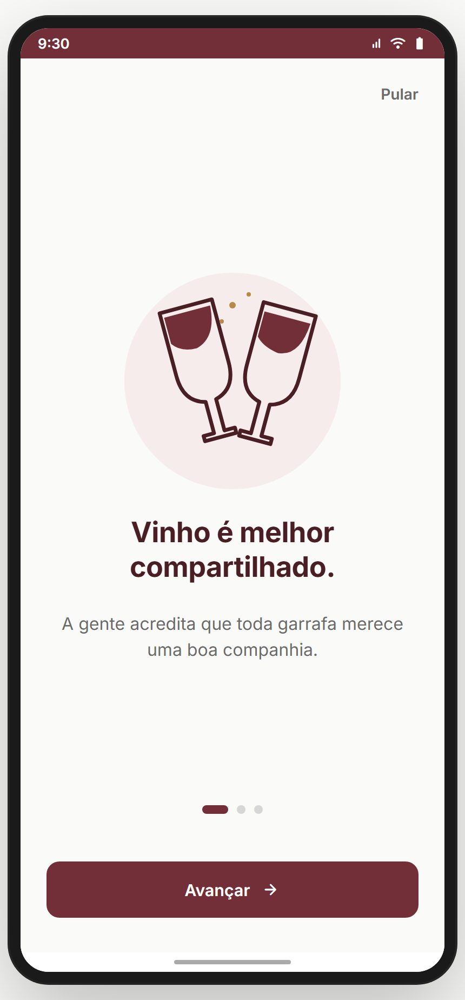

**Propósito:** 3 slides editoriais antes do welcome, comunicando a tese do produto (reduzir drop pré-auth). Spec dedicada: **BUG-02-A**.
**Entradas:** 1ª abertura do app (cold start, antes de logar). **Saídas:** → `welcome` (ao concluir/pular).
**Layout & componentes:** carrossel horizontal de 3 slides; ilustração + título + subtítulo; indicador de progresso (3 dots); botão "Pular" (some no último); CTA "Avançar"/"Vamos começar".
**Conteúdo (SPEC §3):** Slide 1 = tese · Slide 2 = valor · Slide 3 = convite. *(copy canônica no doc SPEC.)*
**Interações:** swipe lateral + dots tocáveis; "Pular" a qualquer momento.
**Estado/persistência:** mostrar **uma vez** (flag local); logout não deve re-exibir (SPEC §4.3).
**Analytics (SPEC §5.3, não-negociável):** `onboarding_slide_view {index}`, `onboarding_skip {index}`, `onboarding_complete`.
**Critérios de aceite (SPEC §5):** funcional (swipe, skip, persistência), visual (vs Figma a criar), telemetria, smoke test.
> **⚠️ DIVERGÊNCIA / DECISÃO** — No protótipo, `OnboardingScreen` (3 slides com `ONBOARDING_SLIDES`, swipe, dots, "Pular"→welcome) **existe e bate** com o conceito, **mas** a telemetria (`onboarding_slide_view` etc.) e a regra "mostrar só 1 vez / não reexibir no logout" **não estão implementadas** (protótipo sem backend/analytics). **Recomendação:** manter UI como está; dev implementa persistência + os 3 eventos no build real (gate GATE-01 do SPEC depende deles).
**Status:** ⚠️ (UI ok; telemetria/persistência pendentes no build real)

---

## 01.2 `welcome` — Boas-vindas / porta de entrada ✅

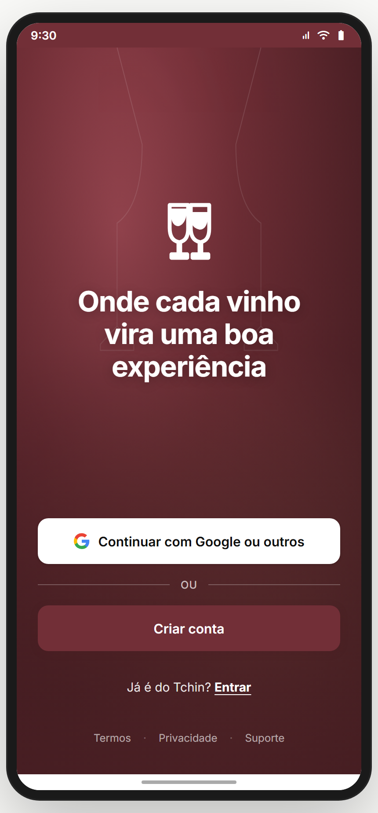

**Propósito:** hub de entrada — criar conta, Google/social, ou login.
**Entradas:** fim dos slides; logout; deep link. **Saídas:** `login-social` (Google), `cadastro`, `login`, `termos`/`politica-privacidade` (rodapé).
**Layout & componentes (`WelcomeScreen`):**
- Fundo vinoso (gradiente burgundy + silhuetas de taças brindando), `TchinLogo` 80px.
- Headline (UI atual): **"Onde cada vinho vira uma boa experiência"** *(copy de marca — 🆕 vs doc; ver divergência)*.
- CTA branco **"Continuar com Google ou outros"** (ícone Google) → `login-social {mode:'cadastro'}`; estado `gLoading` ("Conectando…").
- Divisor "OU".
- CTA primário burgundy **"Criar conta"** → `cadastro`.
- Link **"Já é do Tchin? Entrar"** → `login`.
- Rodapé: Termos · Privacidade · Suporte (44px touch).
**Estados:** normal; `gLoading` (spinner no botão Google); `err` (toast "Não foi possível continuar. Tente novamente.").
**US:** US-002 (Google SSO — ponto de entrada), US-003 (login — link), US-001 (criar conta — CTA).
> **⚠️ DIVERGÊNCIA / DECISÃO** — A **headline** e a copy dos CTAs foram atualizadas para o tom de marca (Fase 3 de copy). Os docs antigos traziam outra copy. **Recomendação:** a tela é a referência (copy de marca aprovada); atualizar o doc.
**Status:** ✅ (copy = 🆕 atualizada)

---

## 01.3 `cadastro` — Criar conta (wizard 3 passos) ⚠️

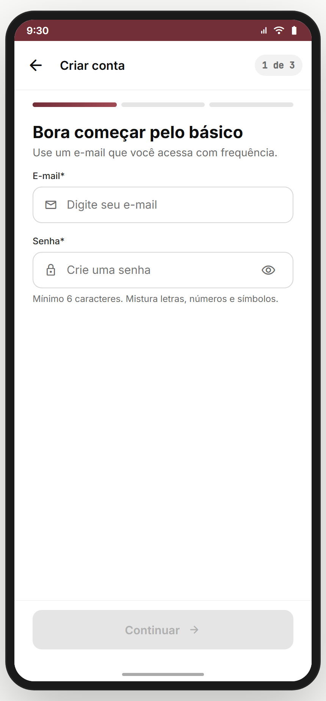

**Propósito:** criar conta por e-mail. **US-001** (+ US-004 termo embutido).
**Entradas:** `welcome` → "Criar conta". **Saídas:** sucesso → `quiz-nivel` (Módulo 02); back → `welcome`; "já existe" → `login`.
**Layout & componentes (`CadastroScreen`):** header (back + "Criar conta" + "passo N de 3") + barra de progresso de 3 segmentos. **3 passos:**
1. **E-mail + Senha** — `Input` e-mail (valida RFC simplificado) + `Input` senha com olho (mostrar/ocultar) + **medidor de força** (`PwdMeter`/`scorePwd`: Muito fraca→Excelente) + helper "Mínimo 6 caracteres…".
2. **Nome completo + Data de nascimento** — nome (exige nome+sobrenome) + data (`type=date`) com **gate de idade ≥18** (erro inline se menor).
3. **Termos** — 3 `TermsToggle`: aceitar Termos (obrigatório), aceitar Privacidade (obrigatório), receber novidades (opcional) + box "maiores de 18 / beba com moderação".
**Validações:** botão "Continuar"/"Criar conta" desabilitado até o passo válido; senha válida = `scorePwd ≥ 2`; e-mail formato; nome ≥ 2 palavras; idade ≥ 18.
**Estados/sad paths:** `modal 'exists'` ("Esse e-mail já está cadastrado" → Ir para Login / Usar outro e-mail); `modal 'underage'` ("Você precisa ter 18 anos ou mais"); `loading` ("Criando conta…").
**Comportamento ao concluir:** reseta o estado do "Treine seu Paladar" (conta nova = onboarding da feature reaparece) e vai para `quiz-nivel`.
**Dados a armazenar (US-001):** nome, e-mail (único), senha (criptografada), data de nascimento, data de criação, e-mail verificado (s/n), onboarding completo (s/n), timestamp de aceite do termo.
**Analytics (doc):** `signup_start`, `signup_step {n}`, `signup_complete`, `signup_email_exists`, `signup_underage_block`.
> **⚠️ DIVERGÊNCIA / DECISÃO (3 pontos):**
> 1. **Formato:** doc US-001 descreve **um único formulário** (Nome, E-mail, Senha, Nascimento); a tela faz **wizard de 3 passos**. → **Recomendação: manter o wizard** (menor carga cognitiva, melhor para iniciante — alinhado ao relatório). Atualizar o doc.
> 2. **Regra de senha:** doc exige **mín. 8, 1 maiúscula, 1 número**; a tela usa medidor com **mín. 6**. → **Recomendação:** alinhar ao doc (8/1 maiúscula/1 número) no build real — **decisão do PO**.
> 3. **Confirmação de e-mail (US-005):** doc pede link real 24h; protótipo **simula** (sem envio). → backend pendente (ver 01.7).
**Status:** ⚠️

---

## 01.4 `login` — Entrar ✅

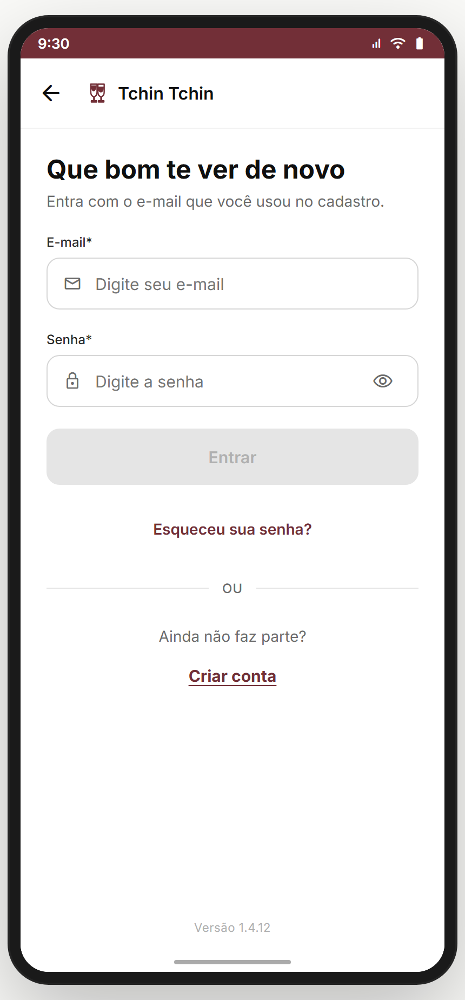

**Propósito:** autenticar usuário existente. **US-003.**
**Entradas:** `welcome` → "Entrar"; link de "criar conta" cruzado. **Saídas:** sucesso → `home`; "Esqueceu a senha?" → `recuperar-email`; "Criar conta" → `cadastro`.
**Layout (`LoginScreen`):** header back + logo+nome; título **"Que bom te ver de novo"** + sub "Entra com o e-mail que você usou no cadastro."; `Input` e-mail (erro inline "E-mail inválido…") + `Input` senha (olho); CTA "Entrar" (loading "Entrando…"); link "Esqueceu sua senha?"; divisor OU; bloco "Ainda não faz parte? Criar conta"; versão no rodapé.
**Validações:** e-mail válido + senha ≥ 6 habilita o botão.
**Estados/sad paths:** `authErr` (toast "E-mail ou senha incorretos."); **rate limit** após 3 tentativas (toast "Muitas tentativas. Aguarde…", 4s). *(Simulação: e-mail contendo "ana" loga; demais falham — comportamento de protótipo.)*
**Analytics:** `login_start`, `login_success`, `login_fail {reason}`, `login_ratelimit`.
> **⚠️ DIVERGÊNCIA:** copy do título/sub atualizada para tom de marca (🆕). Lógica de auth é simulada (sem backend). **Recomendação:** UI é referência; dev pluga auth real + rate limit server-side.
**Status:** ✅ (copy 🆕; auth simulada)

---

## 01.5 `login-social` · `magic-link-enviado` · `verif-telefone-otp` · `verif-concluida` ✅

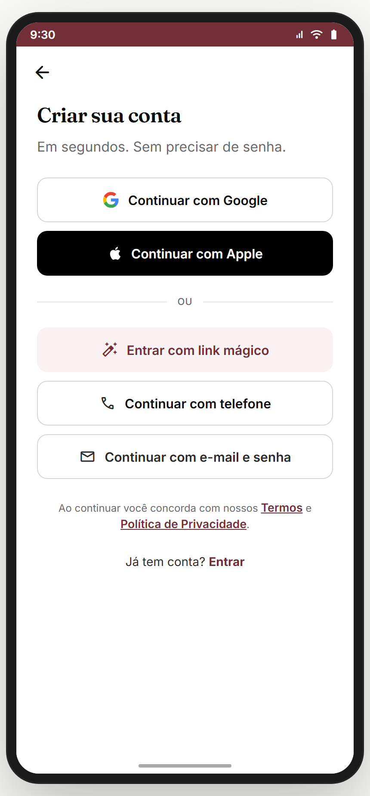 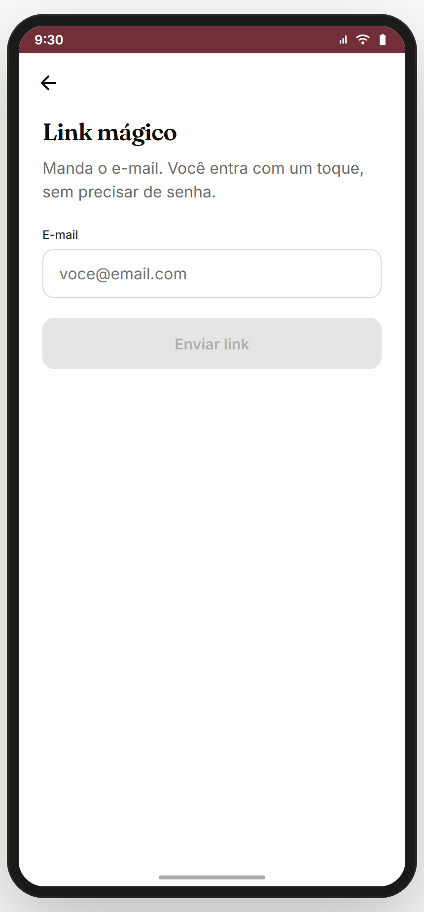 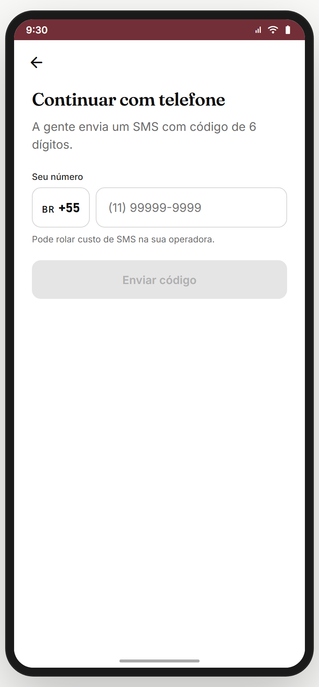 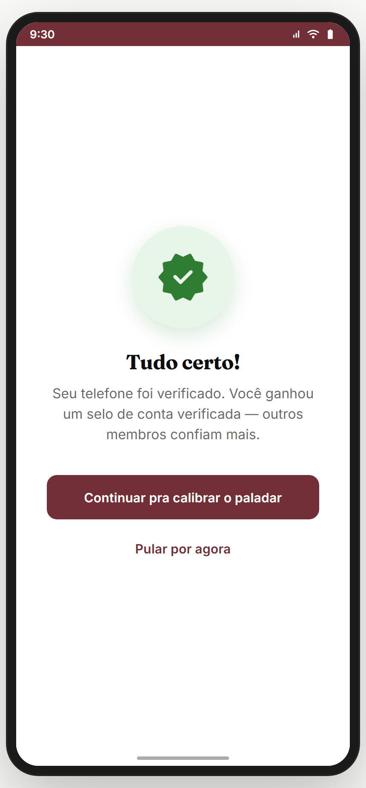

**Propósito:** entrada por SSO/OAuth, magic link e verificação de telefone (OTP). **US-002.**
- `login-social` — picker social (Google e outros); `mode` = 'cadastro'|'login'. Sucesso → `quiz-nivel` (novo) ou `home` (existente).
- `magic-link-enviado` — confirmação de envio do link mágico ("confere seu e-mail").
- `verif-telefone-otp` — entrada de código OTP de telefone.
- `verif-concluida` — sucesso da verificação.
**Estados:** loading/enviado/erro/reenviar.
**US-002 dados:** ID do provedor, foto de perfil (URL), `origem='google'`; SSO **pula** confirmação de e-mail.
> **⚠️ DIVERGÊNCIA:** todos **simulados** no protótipo (sem OAuth/SMS reais). **Recomendação:** UI/fluxo são referência; backend implementa OAuth (Google Cloud Console — callbacks, Client ID/Secret) e provedor de SMS.
**Status:** ✅ (UI) / backend pendente

---

## 01.6 Recuperação de senha — `recuperar-email` → `recuperar-enviado` → `recuperar-otp` → `recuperar-redefinir` → `recuperar-sucesso` ✅

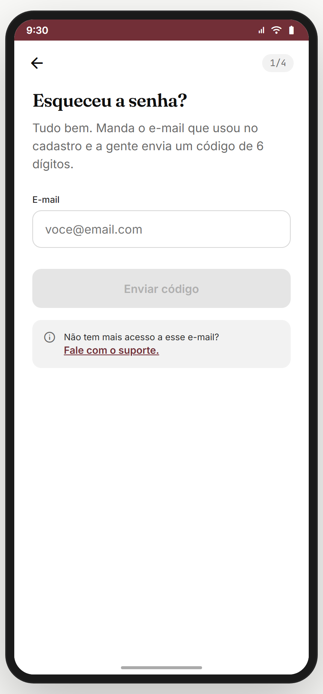 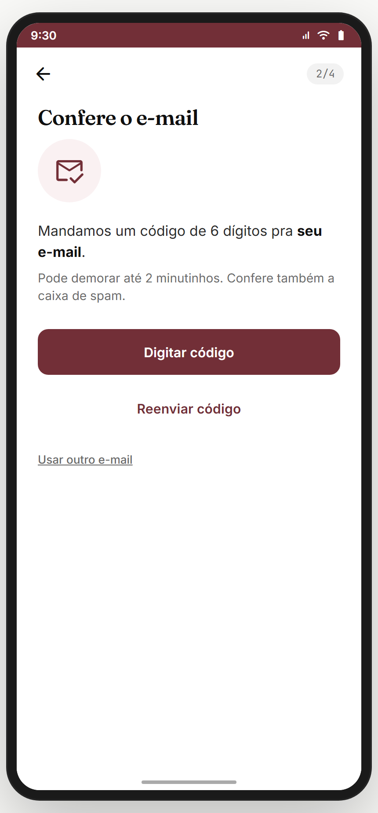 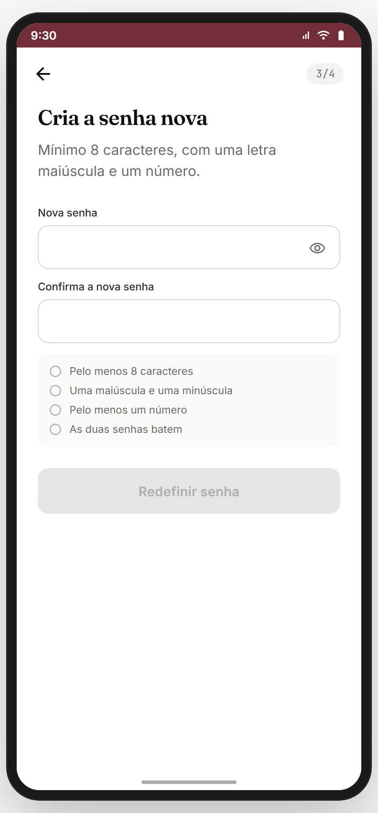 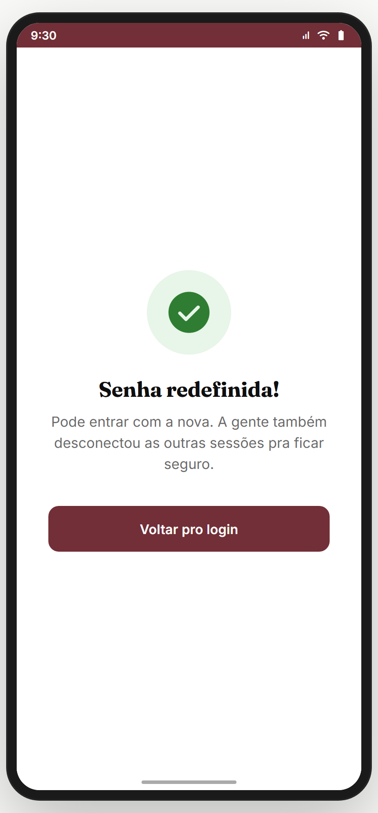

**Propósito:** redefinir senha esquecida.
**Fluxo:** `login` → "Esqueceu a senha?" → **recuperar-email** (informa e-mail) → **recuperar-enviado** ("confere a caixa de entrada"; link expira 30 min; "não chegou? spam/tentar em 60s") → [`recuperar-otp` se fluxo por código] → **recuperar-redefinir** (nova senha + confirmação, mesma regra de força) → **recuperar-sucesso** → "Voltar para login".
> Há duas variantes no protótipo: `recuperar` (`RecuperarSenhaScreen`, 2 etapas resumidas) e o fluxo granular `recuperar-*`. **Recomendação:** padronizar no fluxo granular `recuperar-*`; aposentar o `recuperar` duplicado — **decisão**.
**Estados:** e-mail inválido; enviado; link expirado ("Reenviar"); OTP incorreto; senha redefinida.
**Analytics:** `pwreset_request`, `pwreset_email_sent`, `pwreset_success`, `pwreset_expired`.
**Status:** ✅ (simulado)

---

## 01.7 `termos` · `politica-privacidade` ✅

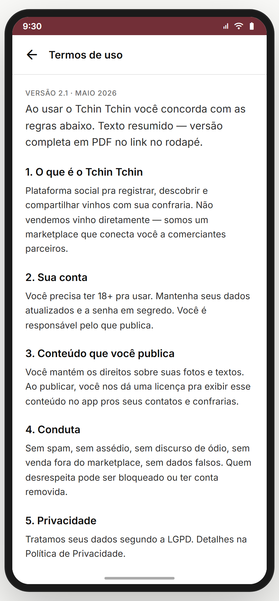 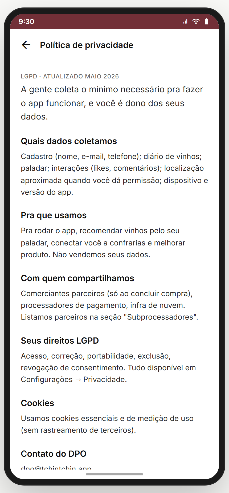

**Propósito:** texto legal completo. **US-004** (consumo responsável).
**Entradas:** rodapé do `welcome`, passo 3 do `cadastro`, config/conta. **Saídas:** back.
**Layout:** título + corpo rolável (scroll dentro do frame) + back.
**Regra (US-004):** maiores de 18; consumo responsável; aceite registra timestamp (no cadastro).
**Status:** ✅

---

## Pendências de backend deste módulo (para o build real)
- Confirmação de e-mail real (US-005) + serviço de e-mail (SendGrid/SES).
- OAuth Google + provedor SMS (OTP).
- Hash de senha + token de sessão; rate limit server-side no login.
- Telemetria dos slides (GATE-01) e dos funis de auth.
- Decisões do PO: regra de senha (6 vs 8), `recuperar` duplicado, copy oficial dos slides.
