# Módulo 02 — Onboarding educacional & Roteamento

> Fluxo educacional pós-cadastro: descobrir **quem é o usuário** (nível, interesses, intenção) e **levá-lo direto** para o melhor primeiro uso. Gate de personalização do feed nos primeiros 14 dias.
> **Fonte de verdade:** telas em `src/legacy/screens-quiz-nivel.jsx` (Nível + Interesses), `src/legacy/screens-quiz.jsx` (Intenção, GPS), `src/legacy/screens-onboarding-final.jsx` (Welcome final + Tour) e `src/legacy/screens-tutor.jsx` (Tutoriais hub) — UI/UX. Doc funcional: MVP2 Épico Onboarding + Relatório HP3.
> **Épicos/US:** US-006 (Nível), US-007 (Interesses), US-008 (Tutorial/Tour), US-009 (Personalização do feed), US-010 (Intenção/Roteamento), US-011 (GPS contextual).

**Regra de negócio canônica:** o **Quiz de Paladar** (5 perguntas sensoriais) **não** está no onboarding — vira contextual no Descobrir (Módulo 03). O onboarding educacional tem **3 passos curtos** (Nível → Interesses → Intenção). **🆕 GPS aparece em TODAS as rotas** (Gabriel) — depois da Intenção, **qualquer** intent passa pelo `gps-primer`, com uma **narrativa adaptada ao intent** (cada clique "monta sua história"). Continua **skippável** ("Agora não"). Depois: **Welcome Final** + tour opcional de 4 abas (exceto `learn`/`treino_paladar`, que têm onboarding próprio). Nenhum tour bloqueia — todos têm "pular".

## Mapa do fluxo
```
[cadastro ok] → quiz-nivel → quiz-interesses → tela-intencao ──(qualquer intent)──→ gps-primer (narrativa por intent)
                                                                                       ├─ granted/soft ─┬─ discover_home / diary_empty / skip → welcome-final → tour? → home/<tab>
                                                                                       │                 ├─ learn          → aprender (direto)
                                                                                       │                 ├─ treino_paladar → treino-paladar (Módulo 08)
                                                                                       │                 ├─ confrarias     → welcome-final → tour? → home/confrarias
                                                                                       │                 └─ wizard         → wizard-confraria-1
                                                                                       └─ deny (sistema) → gps-negado → manual → mesmo destino do intent
```

---

## 02.1 `quiz-nivel` — Quiz de Nível (1 de 3) ✅

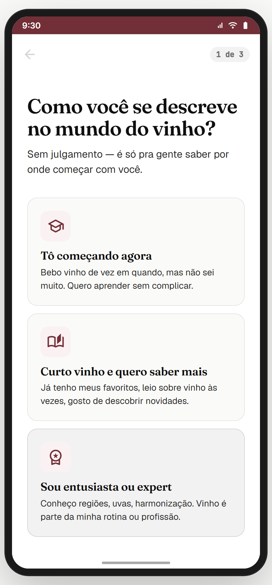

**Propósito:** descobrir como o usuário se vê no mundo do vinho. Alimenta personalização do feed (% iniciante vs avançado), tom da microcopy ("iniciante" vs "sommelier") e sort default do Descobrir (populares vs raros). **US-006.**
**Entradas:** `cadastro` (passo 3 ok) → `quiz-nivel`. Login de conta existente **não** passa por aqui. **Saídas:** card tocado → `quiz-interesses { level }`.
**Layout (`QuizNivelScreen`):** top bar com back **desabilitado** (`aria-disabled`, cor n300 — primeira tela do onboarding) + chip "1 de 3"; H1 Fraunces 32 **"Como você se descreve no mundo do vinho?"**; sub Geist 16 **"Sem julgamento — é só pra gente saber por onde começar com você."**; 3 `NivelCard` (min-height 84dp, gap 12):
- **`iniciante`** · `school` · "Tô começando agora" · "Bebo vinho de vez em quando, mas não sei muito. Quero aprender sem complicar."
- **`intermediario`** · `auto_stories` · "Curto vinho e quero saber mais" · "Já tenho meus favoritos, leio sobre vinho às vezes, gosto de descobrir novidades."
- **`avancado`** · `workspace_premium` · "Sou entusiasta ou expert" · "Conheço regiões, uvas, harmonização. Vinho é parte da minha rotina ou profissão."

**Interação:** tap único; feedback `pressed` 200ms (scale 0.98 + bg p50) antes da navegação; `routing` lock impede double-tap (outros cards opacity 0.55).
**Estado/persistência:** stash em `window.__tcUserLevel` (lido depois por Aprender, Descobrir, Treino).
**Analytics (não-negociável):** `level_selected { level }`.
> **⚠️ DIVERGÊNCIA / DECISÃO** — Doc antigo previa quiz unificado (nível + paladar 5 perguntas) e **5 níveis**. Tela separa em Nível (aqui) + Paladar (contextual), com **3 níveis**. **Recomendação:** manter como está (alinha com HP3, menor fricção); atualizar o doc. Gabriel decide.
**Backlog:** botão "Refazer onboarding" em `config-conta`.
**Status:** ✅

---

## 02.2 `quiz-interesses` — Interesses (2 de 3) ✅

_Default · 3 selecionados (mínimo) · 8 (máximo) · tentativa de 9º (shake + toast):_

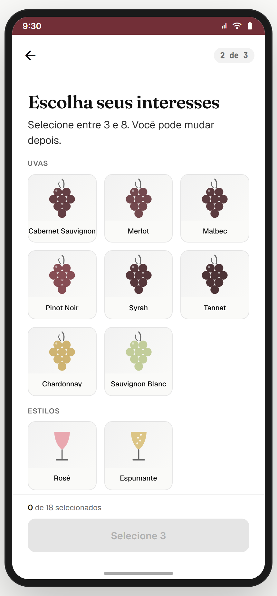  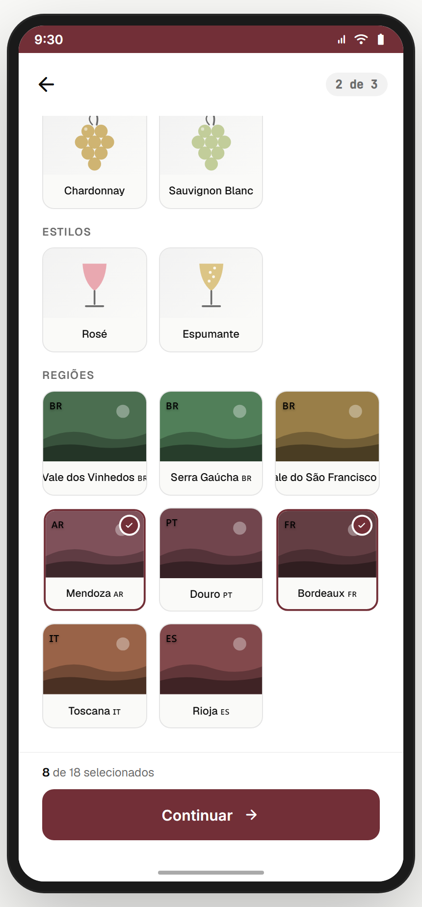 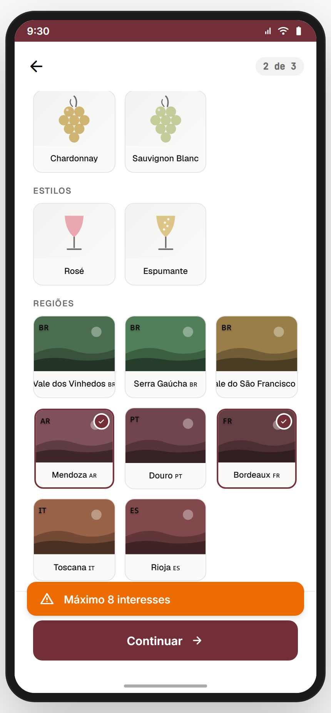

**Propósito:** descobrir o que o usuário já gosta ou quer explorar. Alimenta o early-feed: nos primeiros 14 dias, **30%** do conteúdo é taggeado com os interesses + **70%** geral (anti-eco-câmara). **US-007 / US-009.**
**Entradas:** `quiz-nivel` → `quiz-interesses { level }`. **Saídas:** `tela-intencao { level, interests }` (mínimo 3); back → `quiz-nivel`.
**Layout (`InteressesScreen`):** top bar back + chip "2 de 3"; H2 Fraunces 28 **"Escolha seus interesses"**; sub Geist 16 **"Selecione entre 3 e 8. Você pode mudar depois."**. Três seções em grid 3-colunas:
- **UVAS (8):** Cabernet Sauvignon · Merlot · Malbec · Pinot Noir · Syrah · Tannat · Chardonnay · Sauvignon Blanc *(`GrapeArt` SVG)*.
- **ESTILOS (2):** Rosé · Espumante *(`StyleArt` SVG — espumante tem bolhinhas)*.
- **REGIÕES (8, Brasil-first):** Vale dos Vinhedos 🇧🇷 · Serra Gaúcha 🇧🇷 · Vale do São Francisco 🇧🇷 · Mendoza 🇦🇷 · Douro 🇵🇹 · Bordeaux 🇫🇷 · Toscana 🇮🇹 · Rioja 🇪🇸.

Bottom bar **sticky**: contagem `aria-live` "X de 18 selecionados" (com "faltam Y" em w700 quando <3) + CTA primário burgundy.
**Estados do CTA:** `count<3` desabilitado, label "Selecione 3"; `count∈[3,8]` habilitado, label "Continuar"; `count=8` o 9º interagido dispara **shake 380ms** + toast warning **"Máximo 8 interesses"** (não seleciona).
**Estado selecionado:** border p700 2px + scale 0.97 + badge check 18×18 p700 no canto superior direito.
**Estado/persistência:** `window.__tcUserInterests` + payload `interests_completed { count, interests }`.
**Analytics:** `interests_completed { count, interests:[ids] }` no tap "Continuar".
> **⚠️ DIVERGÊNCIA — scroll:** ao tocar um item fora do viewport (ex.: Mendoza nas Regiões), os cards selecionados acima saem da tela. Não é bug — a contagem persiste. **Recomendação:** **mini-resumo sticky** com chips (X) acima da CTA. Backlog.
> **✅ GABRIEL DECIDIU — mínimo = 3:** doc antigo pedia ≥5; **fica ≥3** (HP3, menor barreira). Resolvido.
**Backlog:** "Meus interesses" editável em `editar-perfil-paladar`.
**Status:** ✅

---

## 02.3 `tela-intencao` — Tela de Intenção (3 de 3) ✅

_Default · modal de confirmação de skip:_

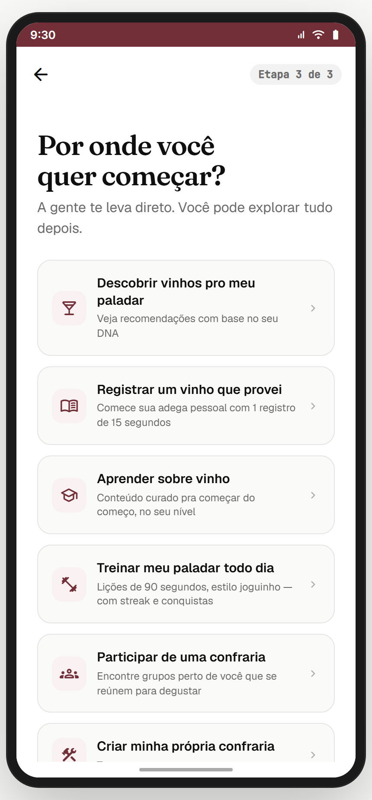 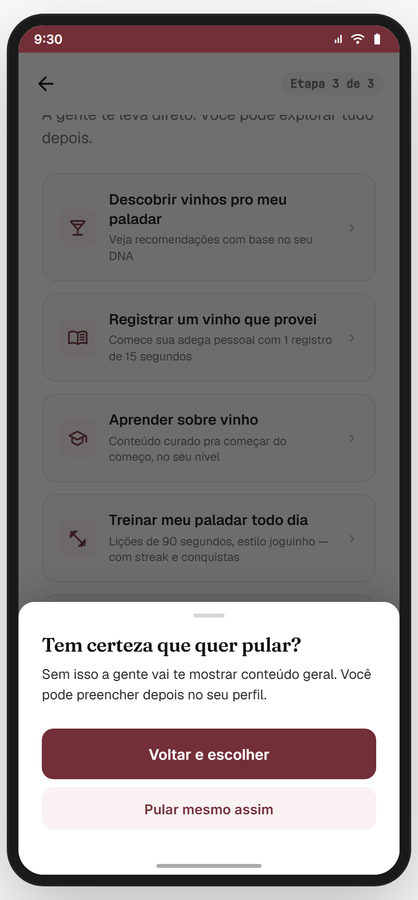

**Propósito:** a tela mais importante deste módulo — descobrir **por onde o usuário quer começar** e roteá-lo direto. Reduz drop pós-onboarding ao eliminar o "e agora, o que faço?". **US-010.**
**Entradas:** `quiz-interesses` → `tela-intencao { level, interests }`. **Saída (single-tap commit):** 🆕 **TODOS os intents agora vão para `gps-primer { intent }`** (Gabriel: GPS em todas as rotas). O destino final pós-GPS é resolvido pelo `gps-primer` conforme o intent (ver 02.4). O `skip_to_feed` (link "Ainda não sei…") passa antes pelo `SkipConfirmModal`; confirmando, também vai pro `gps-primer`.

**Layout (`TelaIntencaoScreen`):** top bar back + chip "3 de 3"; H1 Fraunces 32 **"Por onde você quer começar?"**; sub Geist 16 **"A gente te leva direto. Você pode explorar tudo depois."**. 6 `IntentCard` (vertical, gap 12, min-height 72dp):
- **`discover_home`** (`local_bar`) — "Descobrir vinhos pro meu paladar · Veja recomendações com base no seu DNA".
- **`diary_empty`** (`menu_book`) — "Registrar um vinho que provei · Comece sua adega pessoal com 1 registro de 15 segundos".
- **`learn`** (`school`) — "Aprender sobre vinho · Conteúdo curado pra começar do começo, no seu nível".
- **`treino_paladar`** (`fitness_center`) — "Treinar meu paladar todo dia · Lições de 90 segundos, estilo joguinho — com streak e conquistas".
- **`gps_primer_then_confrarias`** (`groups`) — "Participar de uma confraria · Encontre grupos perto de você que se reúnem para degustar".
- **`gps_primer_then_wizard`** (`construction`) — "Criar minha própria confraria · Trazer meu grupo pro app".

Abaixo, link ghost centralizado **"Ainda não sei, me leva pro app"** → abre `SkipConfirmModal`.
**Interação:** single-tap commit (200ms pressed feedback) + lock contra double-tap; stash `window.__tcLastIntent` (lido depois pelo `welcome-final`).
**SkipConfirmModal** (bottom sheet, Nielsen #5 — prevenção de erro): drag handle + H3 Fraunces 20 **"Tem certeza que quer pular?"** + body Geist 14 **"Sem isso a gente vai te mostrar conteúdo geral. Você pode preencher depois no seu perfil."** + CTA **primária** burgundy **"Voltar e escolher"** (hierarquia invertida — caminho seguro destacado) + ghost **"Pular mesmo assim"**. Dismiss: tap fora, Esc, drag handle. `role="dialog"` + `aria-modal`.
**Analytics (recomendado):** `intent_selected { intent }`; skip: `intent_skip_shown` / `intent_skip_confirmed` / `intent_skip_canceled`.
> **✅ GABRIEL DECIDIU — todos os intents passam pelo GPS** (com narrativa adaptada — ver 02.4). `learn` e `treino_paladar` ainda pulam o `welcome-final` (têm onboarding próprio), mas **passam pelo GPS antes**.
**Status:** ✅

---

## 02.4 `gps-primer` — Permission Primer (06.01, rotas D e E) ✅

**🆕 GPS em TODAS as rotas, com narrativa por intent** (Gabriel). Default (discover_home) · diálogo nativo · narrativas de outros intents:

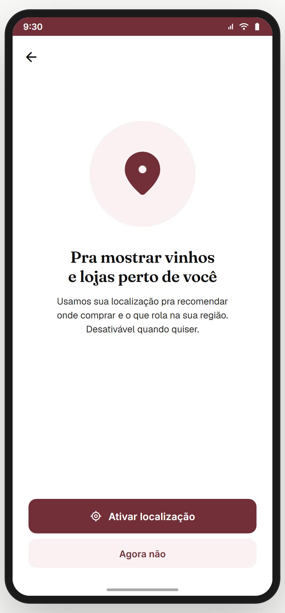 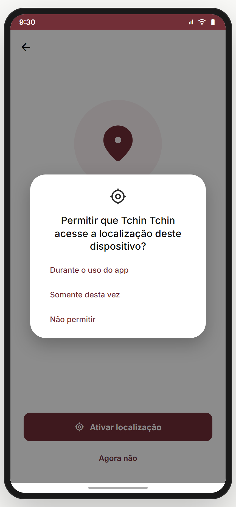 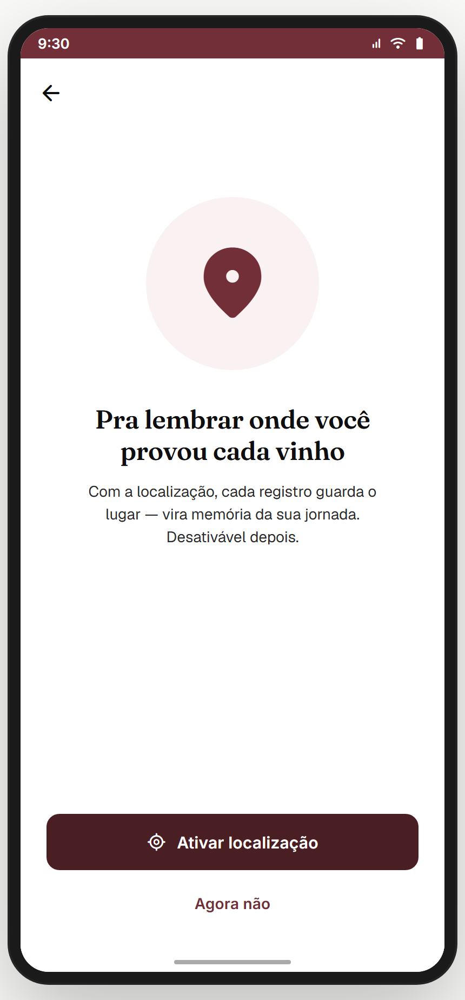 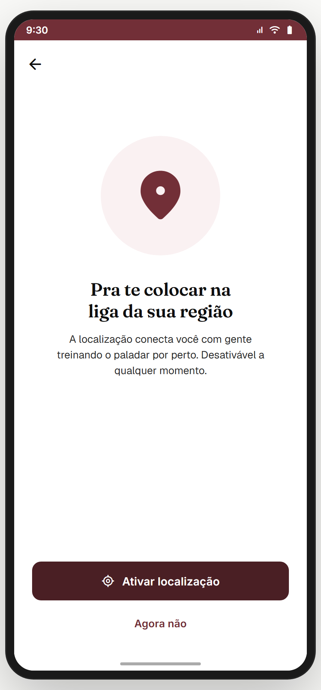 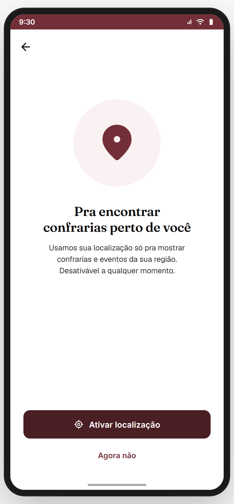 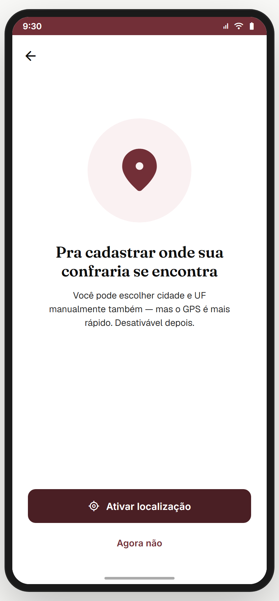 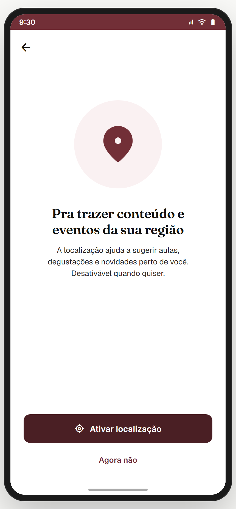 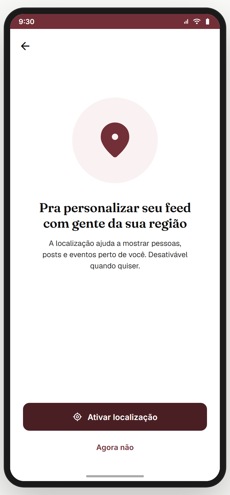

**Propósito:** explicar **por que** o GPS importa **antes** de disparar o prompt do SO (Material 3 / HIG — nunca chamar o prompt frio). **US-011.**
**Entradas:** `tela-intencao` → **qualquer intent** → `gps-primer { intent }`. **Saídas:**
- **Ativar localização** → diálogo simulado → "Durante o uso"/"Somente desta vez" = **granted** → destino do intent (ver tabela).
- **Não permitir** no diálogo → `gps-negado` (mantém o intent).
- **Agora não** (soft deny) → mesmo destino do granted, com `location_status: 'denied_soft'`.

**Layout (`GpsPrimerScreen`):** top bar **só back (sem chip de etapa)**; ilustração círculo 160×160 burgundy/50 + ícone `location_on` 80 p700; H2 Fraunces 24 + body Geist 14. **Narrativa + destino por intent (`GPS_INTENT`):**

| Intent | Título (narrativa) | Destino pós-permissão |
|---|---|---|
| `discover_home` | "Pra mostrar vinhos e lojas perto de você" | `welcome-final` |
| `diary_empty` | "Pra lembrar onde você provou cada vinho" | `welcome-final` |
| `learn` | "Pra trazer conteúdo e eventos da sua região" | `aprender` (direto) |
| `treino_paladar` | "Pra te colocar na liga da sua região" | `treino-paladar` (direto) |
| `gps_primer_then_confrarias` | "Pra encontrar confrarias perto de você" | `welcome-final` → confrarias |
| `gps_primer_then_wizard` | "Pra cadastrar onde sua confraria se encontra" | `wizard-confraria-1` |
| `skip_to_feed` | "Pra personalizar seu feed com gente da sua região" | `welcome-final` → comunidade |

CTAs: **primária** "Ativar localização" + ícone `my_location` (loading 350ms antes do diálogo); **ghost** "Agora não" (nunca destrutivo).
**Diálogo nativo simulado** (overlay 45% + card branco 28dp, estilo Android): título **"Permitir que Tchin Tchin acesse a localização deste dispositivo?"** + 3 botões — **"Durante o uso do app"** · **"Somente desta vez"** · **"Não permitir"**. Granted: toast success (texto adaptado ao intent) + navega. Deny: `gps-negado`.
**Analytics:** `gps_primer_shown { intent }`; `gps_primer_response { intent, response }`.
> **✅ GABRIEL DECIDIU:** GPS em todas as rotas com narrativa por intent; **chip "Etapa 7 de 7" removido**.
> **⚠️ DIVERGÊNCIA — diálogo:** em produção é o prompt **real** do SO. Implementação: `Geolocation.getCurrentPosition` **só após** o tap da CTA; `PERMISSION_DENIED` → `gps-negado`.
**Status:** ✅ (UI/UX completos; integração com SO pendente no build)

---

## 02.5 `gps-negado` — Hard deny / fallback (06.03) ✅

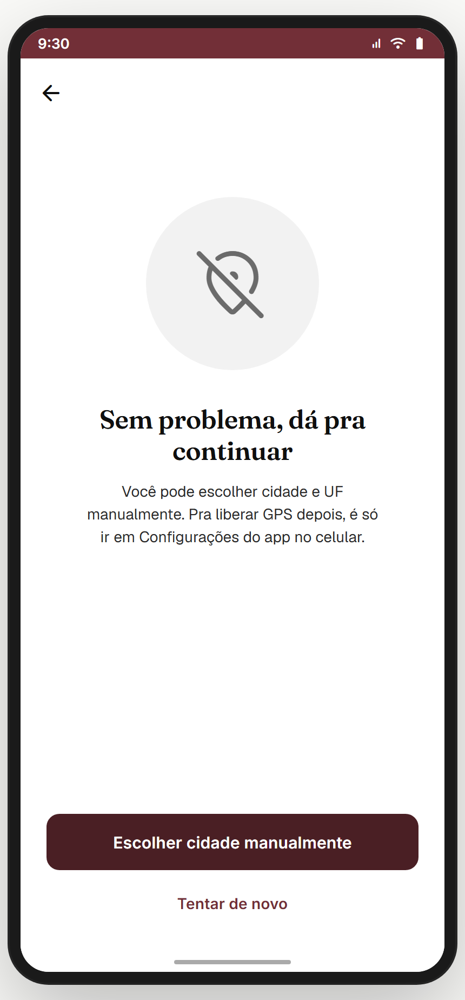

**Propósito:** o usuário **negou** no prompt do SO. Oferece caminho alternativo (escolher cidade/UF manualmente) + instrução para reativar via Configurações.
**Entradas:** `gps-primer { intent }` → diálogo → "Não permitir". **Saídas:** "Escolher cidade manualmente" → **destino do intent** (`location_status: 'denied'`, via `GPS_INTENT[intent].dest`); "Tentar de novo" → `gps-primer { intent }`; back → `tela-intencao` (via `BACK_SKIP`, evita loop). Sem chip de etapa.
**Layout (`GpsNegadoScreen`):** ilustração círculo 160×160 n100 + ícone `location_off` 72 n600; H2 Fraunces 24 **"Sem problema, dá pra continuar"**; body Geist 14 **"Você pode escolher cidade e UF manualmente. Pra liberar GPS depois, é só ir em Configurações do app no celular."**. CTAs: primária "Escolher cidade manualmente"; ghost "Tentar de novo".
> **⚠️ DIVERGÊNCIA — picker de cidade:** doc previa picker explícito UF→Cidade; tela hoje leva pra próxima rota contando com filtro lá dentro. **Recomendação:** implementar `picker-cidade-uf` como Bottom Sheet reutilizável (config, perfil, wizard). Backlog.
**Status:** ✅

---

## 02.6 `welcome-final` — Congrats + tour (fluxo completo) ✅

_Welcome (copy por intent) → tour 4 passos (Comunidade → Confrarias → Descobrir → Adega) → celebração:_

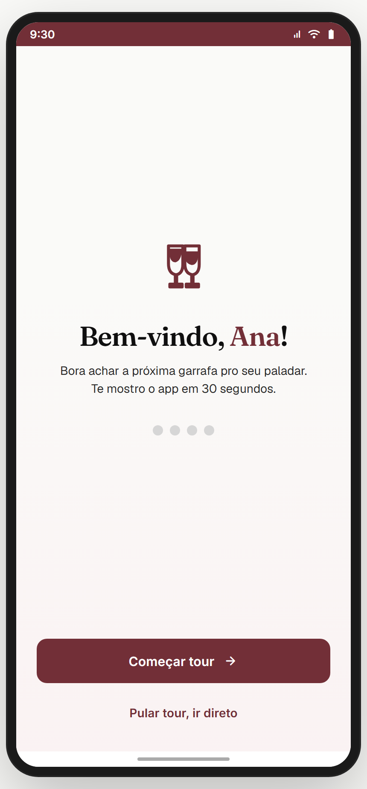 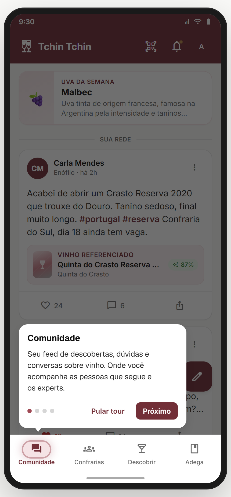 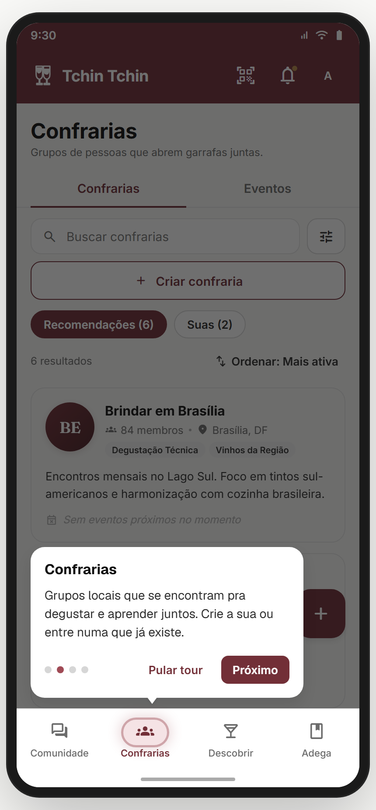 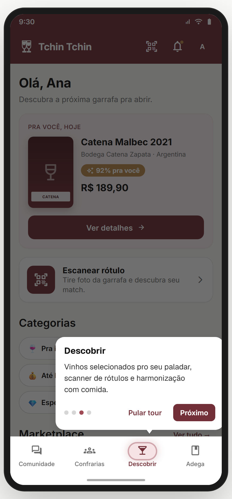 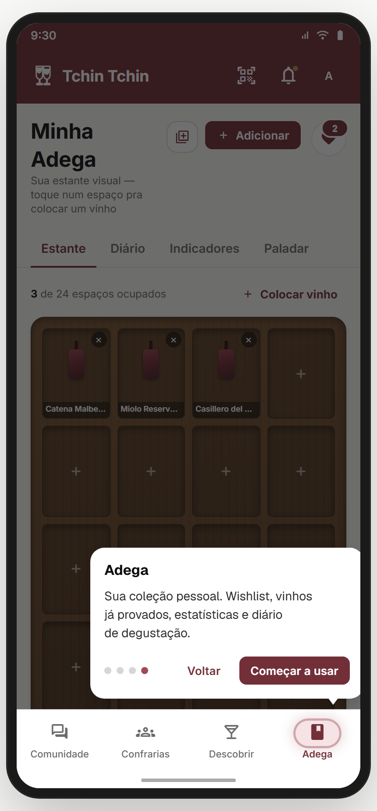 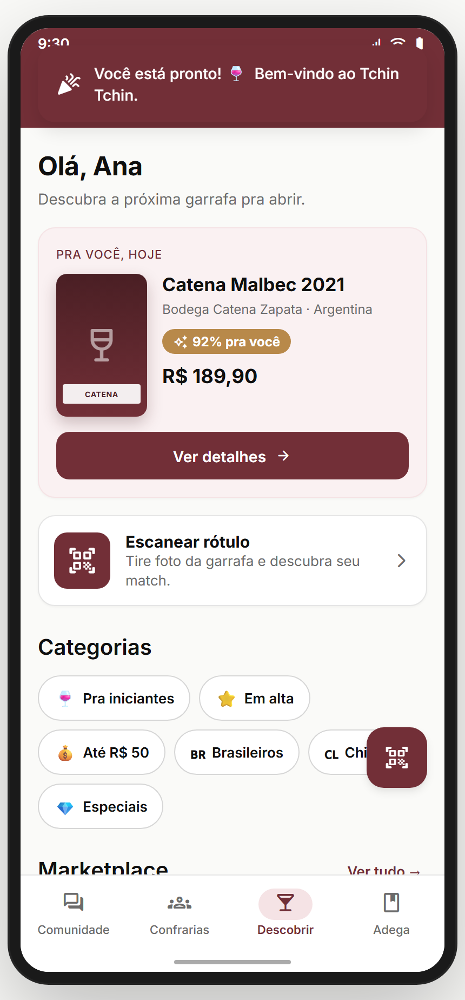

_Variante de copy por intent (ex.: confraria):_


**Propósito:** parabenizar (reforço positivo, sunk-cost) e oferecer **tour opcional de 4 passos** das abas principais. **US-008.**
**Entradas:** intents que passam por aqui após o GPS (`discover_home`, `diary_empty`, `gps_primer_then_confrarias`, `skip_to_feed`; **não** `learn`/`treino_paladar`). Lê `window.__tcLastIntent` para a **tab destino**: `discover_home`→descobrir · `diary_empty`→adega · `gps_primer_then_confrarias`→confrarias · `skip_to_feed`→comunidade.
**Side-effects (`useEffect`):** `discover_home` zera paladar (força FirstTime sem radar); `diary_empty` zera diary (Estante FirstTime vazia).
**🆕 Copy personalizada por intent (`WELCOME_SUBTITLE_BY_INTENT`)** — Gabriel:
- `discover_home`: "Bora achar a próxima garrafa pro seu paladar. Te mostro o app em 30 segundos."
- `diary_empty`: "Sua adega começa agora. Te mostro o app em 30 segundos."
- `gps_primer_then_confrarias`: "Confrarias perto de você te esperam. Te mostro o app em 30 segundos."
- `gps_primer_then_wizard`: "Sua confraria vai sair do papel. Antes, te mostro o app em 30 segundos."
- `skip_to_feed`: "Sem pressa pra escolher — te mostro o app em 30 segundos e você explora."

**Layout:** gradiente n50→p50 8%; `TchinLogo` 64 p700 + H1 **"Bem-vindo, {primeiroNome}!"** + subtítulo (por intent) + 4 dots de preview. Bottom: **"Começar tour"** (escreve `tc.tour`, nav com `fromTour: true`) + ghost **"Pular tour, ir direto"**.

**Tour overlay (07.02–05) — `TutorialTooltip`** por cima da home: 4 passos fixos **Comunidade → Confrarias → Descobrir → Adega**. Overlay 60% (exceto bottom nav, iluminada) + card 312dp com triângulo apontando a tab + dots (atual em p500) + botões (0–2: "Pular tour" + "Próximo"; passo 3: "Voltar" + "Começar a usar"). Clique fora **não** fecha.
**Copy do tour:** Comunidade ("Seu feed de descobertas…") · Confrarias ("Grupos locais que se encontram…") · Descobrir ("Vinhos pro seu paladar, scanner, harmonização") · Adega ("Sua coleção: wishlist, provados, stats, diário").

**07.06 CelebrationToast** — toast top burgundy, 3s auto-dismiss: **"Você está pronto! 🍷 Bem-vindo ao Tchin Tchin."** ✅ **Dispara SEMPRE no fim do tour** (tanto em "Começar a usar" quanto em "Pular tour") — Gabriel.
**Analytics:** `tour_started`, `tour_step { i }`, `tour_skipped { atStep }`, `tour_completed`.
> **✅ GABRIEL DECIDIU:** copy do welcome personalizada por intent + CelebrationToast sempre no fim do tour. Ambos implementados.
> **⚠️ Nota — captura sem nome:** no shot aparece "Bem-vindo, você!" porque `ctx.user.name` está vazio em dev-mode; em produção virá o primeiro nome. ✅ esperado.
**Status:** ✅

---

## 02.7 `tutoriais` — Hub manual de tutoriais (35.x) ✅

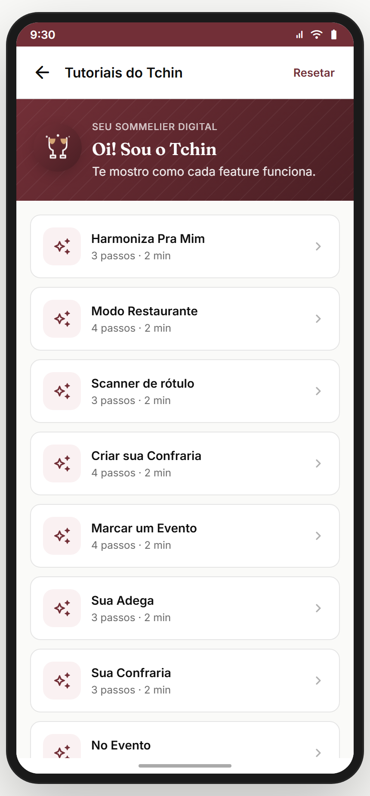

**Propósito:** ponto **único** para o usuário (re)assistir a qualquer tutorial de feature **sob demanda**. Não é parte do fluxo automático — é rede de segurança / referência.
**Entradas:** `editar-perfil` ou `config-conta` → "Tutoriais"; também deep link direto. **Saídas:** card tocado → `onLaunch(t.id)` (TchinApp retira `tutoriais` da pilha e seta o tutorial ativo, que vira coachmark sobre a feature); back → tela anterior.
**Layout (`TutoriaisHubScreen`):** header back + título "Tutoriais do Tchin" + botão **"Resetar"** (p700 text — `resetAllTutorials()` + toast success "Tutoriais resetados."); hero burgundy (gradiente p700→p900 + textura de listras) com `TchinMascot` 56 com `tcMascotBob` + overline "SEU SOMMELIER DIGITAL" + H2 "Oi! Sou o Tchin" + body "Te mostro como cada feature funciona."; lista de tutoriais (`TUTORIAL_REGISTRY`) — cada card: ícone 44×44 (filled `check_circle` s700+s100 se done; outline `auto_awesome` p700+p50 se pendente) + nome + subtítulo **"X passos · Y min"** (Y = ceil(steps/2)) + chevron.
**Estado/persistência:** `tc.tutor.done` (mapa `{ [id]: boolean }`) em localStorage; reset zera tudo. Tutorials registrados são detalhados nos módulos das suas features (wizard de confraria, scanner v2, carta-matches, harmoniza, radar, ata pós-evento etc.).
**Analytics:** `tutorial_launched { id }`, `tutorial_completed { id }`, `tutorials_reset_all`.
> **⚠️ DIVERGÊNCIA — descoberta:** o hub depende do usuário **achar o link** em config/perfil. **Recomendação:** adicionar entry point no botão "?" do header das features complexas. Backlog: **ENT-TUTOR-01**.
**Status:** ✅

---

## 02.8 Destinos first-time (variações de `home/*` e `aprender`) ✅

O onboarding **não termina** em `welcome-final`. Cada destino tem uma variação **FirstTime** ativada por `firstTime: true` (param) ou pela ausência de dados.
- **`home/descobrir`** → `DescobrirHomeFirstTime` quando `firstTime: true` e/ou `!user.paladar` (semeado pelo `welcome-final` para `discover_home`). Mostra card "Faça o quiz de paladar pra recomendações precisas" + lista geral.
- **`home/adega`** → `AdegaScreen` na aba **Estante** vazia quando `firstTime: true` e/ou `diary === []`. Rack de madeira interativo com tiles vazios + CTAs "Registrar primeiro vinho" e "Wishlist". *(Antes existia `AdegaVazia`; aposentada.)*
- **`home/confrarias`** → `firstTime: true` mostra confrarias próximas (D) ou abre `wizard-confraria-1` (E).
- **`home/comunidade`** → `firstTime: true` cai no feed geral *(sem variação dedicada hoje — ver divergência)*.
- **`aprender`** → renderizado direto do intent `learn` com `level: __tcUserLevel`. Conteúdo curado por nível (iniciante = "Tour básico do vinho", avançado = "Aprofundamento por região").
- **`treino-paladar`** → renderizado direto do intent `treino_paladar`. **Onboarding conversacional do mascote TchinDuo** (Módulo 08) — feature tem o próprio onboarding.

> **⚠️ DIVERGÊNCIA — discoverability cruzada:** quem entra via `learn` ou `treino_paladar` **não vê o tour de 4 abas**. **Recomendação:** no primeiro retorno à home, exibir nudge sutil "Quer ver as outras features? Tour rápido →". Backlog: **NUDGE-TOUR-01**.
> **⚠️ DIVERGÊNCIA — Comunidade FirstTime:** hoje não há estado vazio dedicado. Quem vem via `skip_to_feed` cai no feed normal sem feedback de "por que estou aqui". **Recomendação:** variante com card educativo "Você pulou os interesses — toque aqui pra personalizar agora". Backlog: **HOME-COM-FT-01**.
**Status:** ✅ (variações primárias) / ⚠️ (Comunidade FirstTime + nudge cruzado pendentes)

---

## Edge cases & navegação reversa
- **`BACK_SKIP`** (em `prototype.jsx`) inclui: `welcome, onboarding, quiz, quiz-nivel, quiz-interesses, tela-intencao, gps-primer, gps-negado, welcome-final, nudge-d1/d3/d7/d14, confraria-welcome/apresentar/tour-rapido`. Significa: ao tocar "Voltar" **vindo de uma tela do app**, a navegação **pula** essas telas transientes — evita cair de volta na Intenção depois que já está no app, ou no tour da confraria de novo após sair de um grupo.
- **Refresh no meio:** `tc.tour` persiste o passo do tour. Já `__tcUserLevel/Interests/LastIntent` são in-memory only → refresh perde. **Backlog:** persistir essas três em `tc.onboard.v1 = { level, interests, lastIntent }` antes do GA.
- **Login subsequente:** conta existente **não** passa pelo onboarding educacional (vai direto a `home`). Premissa: backend marca `onboarding_complete: true` ao fim da Intenção.
- **Deep link** entrando direto numa tela do onboarding: em dev (`?screen=`) qualquer rota renderiza sem estado anterior; em produção, deep link para `quiz-nivel` exige sessão autenticada **e** onboarding incompleto — senão redireciona a `home`. **Backlog:** middleware no router.

## Pendências de backend / decisões do Gabriel
- **Analytics:** ligar `level_selected`, `interests_completed`, `intent_selected`, `intent_skip_*`, `gps_primer_*`, `tour_*` na infra real.
- **Persistência:** mover `__tcUserLevel/Interests/LastIntent` de `window.*` para localStorage + backend (perfil).
- **GPS:** integrar API nativa (Geolocation) substituindo o diálogo simulado.
- **First-time:** completar Comunidade FirstTime + nudge cruzado para `learn`/`treino_paladar`.
- **Reset:** botão "Refazer onboarding" em `config-conta`.

> **✅ GABRIEL DECIDIU (fechado, sem pendência):**
> - **Mínimo de interesses = 3** (não sobe pra 5).
> - **GPS sem chip "Etapa /7"** — o primer entra em todas as rotas com narrativa por intent, sem numeração de etapa.
> - **`welcome-final` com copy adaptada por intent** (ver 02.6).
> - **`CelebrationToast` sempre no fim do tour** (e ao pular o tour).
