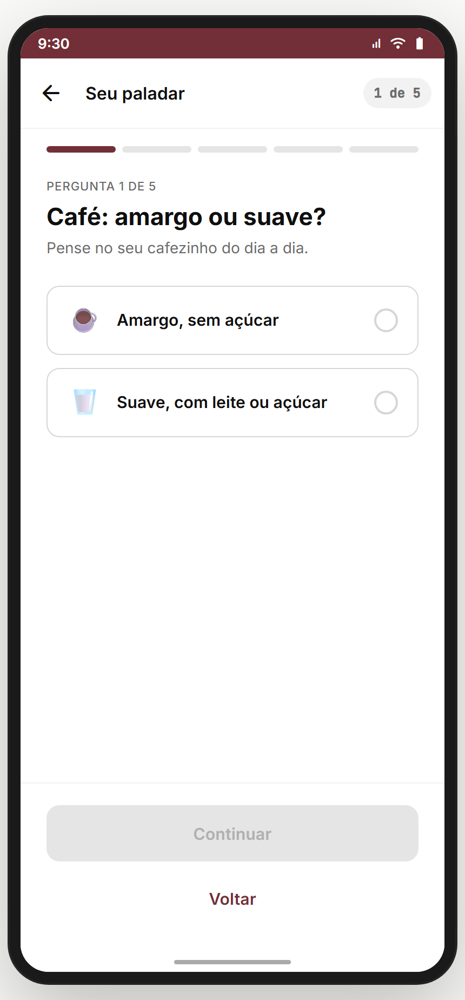
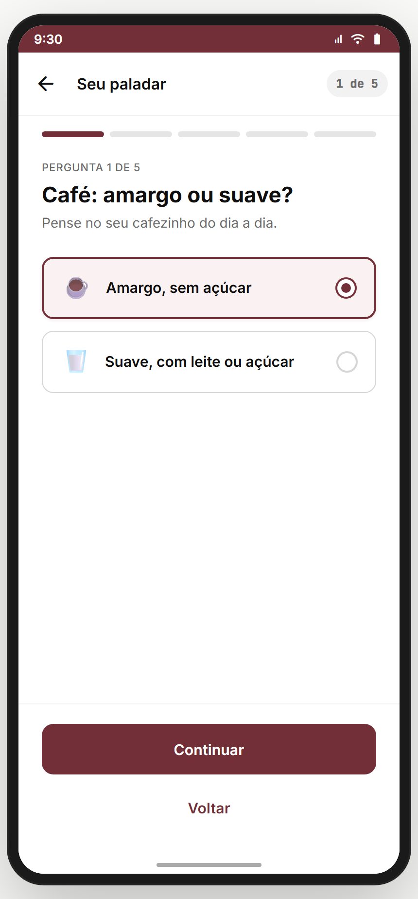
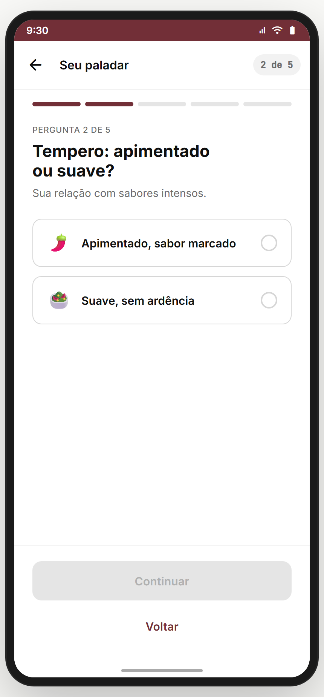
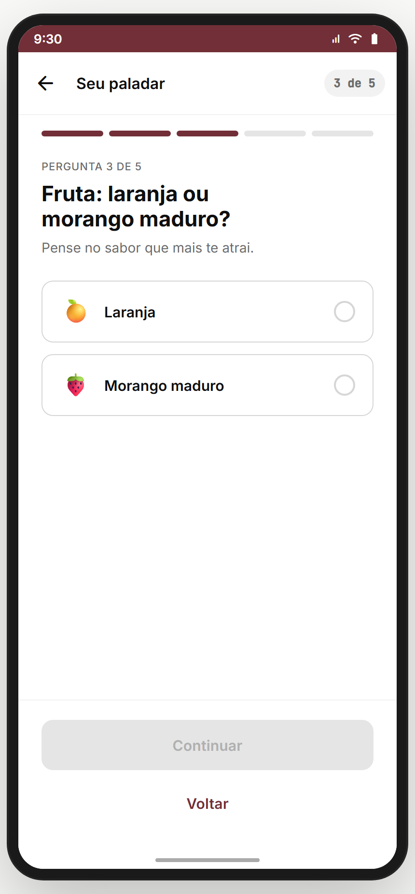
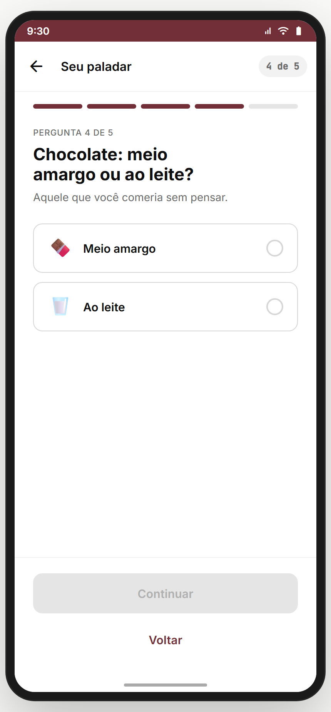
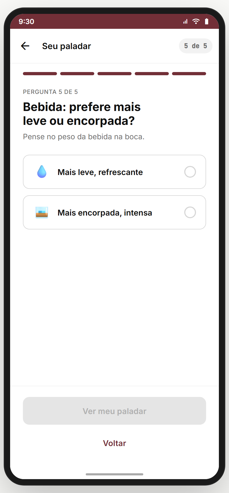
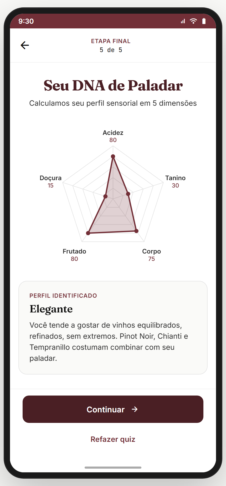

# Módulo 03 — Meu Paladar (Quiz sensorial)

> Quiz **contextual** de 5 perguntas que calcula o **DNA de paladar 5D** do usuário (Doçura, Acidez, Tanino, Corpo, Frutado/Álcool) e o classifica em 1 de 6 perfis. Alimenta o Descobrir, a busca, o Harmoniza, o radar do Perfil e a comparação de paladar.
> **Fonte de verdade:** telas em `src/legacy/screens-quiz.jsx` (`QuizScreen`, `QuizResultScreen`, `PaladarRadar`, `classifyPaladar`) + perguntas em `src/legacy/data.jsx` (`QUIZ_QUESTIONS`). Doc funcional: **Sprint 11-13 Épico T1**.
> **Épicos/US:** US-PALADAR-01 (quiz 5 perguntas), US-PALADAR-02 (radar 5D), US-PALADAR-03 (classificação em perfil), US-PALADAR-04 (reuso contextual em Descobrir/Harmoniza/Compare).

**Regra de negócio canônica:** o paladar **não** entra no onboarding (decisão de produto: menor fricção pós-cadastro, alinha com HP3). É **oferecido contextualmente** quando o usuário pede recomendação no Descobrir, abre Harmoniza, vai comparar paladar com outro usuário, ou acessa o card "Paladar" na Adega. Pode ser **refeito** a qualquer momento.

## Mapa do fluxo
```
[Descobrir / Adega aba Paladar / Harmoniza / Perfil>Editar paladar / Compare] → quiz (P1 → P2 → P3 → P4 → P5) → quiz-result → (Continuar | Refazer)
        params.returnTo = rota de origem  ──────────────────────────────────────────→ ao concluir, volta para a tela de origem com paladar atualizado
        sem returnTo (vindo do onboarding antigo) ──────────────────────────────────→ tela-intencao { paladar }
```

---

## 03.1 `quiz` — 5 perguntas sensoriais ✅

_P1 default · P1 selecionado · P2 · P3 · P4 · P5:_

     

**Propósito:** descobrir o DNA sensorial em 5 dimensões usando proxies do **mundo real** (café, tempero, fruta, chocolate, bebida) — evita jargão vinícola que travaria iniciantes. **US-PALADAR-01.**
**Entradas:** botão "Descobrir meu paladar" em qualquer ponto contextual; `params.returnTo` opcional (rota de retorno). **Saídas:** ao concluir → `quiz-result { paladar, returnTo }`; back na P1 → `cadastro` *(legado — manter ou trocar para `params.returnTo`, ver divergência)*; back nas demais → pergunta anterior preservando resposta.

**Layout (`QuizScreen`):**
- Top bar: back + título **"Seu paladar"** + chip mono **"{N} de 5"**.
- Barra de progresso de 5 segmentos (segmento atual e anteriores em p700, próximos em n200, transição 240ms).
- Pergunta: overline uppercase tracked **"PERGUNTA N DE 5"** + H2 22px bold n950 **"{question}"** + sub Geist 14 n600 **"{hint}"**.
- 2 opções (vertical, gap 12, min-height 64): emoji 24px + label 15 bold n950 + radio circular 22dp à direita. Selecionado: bg p50, border p700 2px, shadow sutil, scale (transition 160ms).
- Bottom (sticky com border-top n100): primária **"Continuar"** (disabled enquanto sem seleção; na P5 vira **"Ver meu paladar"**) + ghost **"Voltar"**.

**As 5 perguntas (canônicas, em `QUIZ_QUESTIONS`):**

| # | Eixo | Pergunta | Hint | Opção A · valor | Opção B · valor |
|---|---|---|---|---|---|
| 1 | **Doçura** | "Café: amargo ou suave?" | "Pense no seu cafezinho do dia a dia." | ☕ Amargo, sem açúcar · **15** | 🥛 Suave, com leite ou açúcar · **75** |
| 2 | **Acidez** | "Tempero: apimentado ou suave?" | "Sua relação com sabores intensos." | 🌶️ Apimentado, sabor marcado · **80** | 🥗 Suave, sem ardência · **25** |
| 3 | **Tanino** | "Fruta: laranja ou morango maduro?" | "Pense no sabor que mais te atrai." | 🍊 Laranja · **70** | 🍓 Morango maduro · **30** |
| 4 | **Corpo** | "Chocolate: meio amargo ou ao leite?" | "Aquele que você comeria sem pensar." | 🍫 Meio amargo · **75** | 🥛 Ao leite · **35** |
| 5 | **Álcool/Frutado** | "Bebida: prefere mais leve ou encorpada?" | "Pense no peso da bebida na boca." | 💧 Mais leve, refrescante · **30** | 🥃 Mais encorpada, intensa · **80** |

**Interação:** estado `pending` evita que o tap rebote — só consolida em `answers` ao clicar "Continuar"; voltar para uma pergunta já respondida re-popula a opção; barra de progresso anima a transição.
**Estado/persistência:** `answers: { docura, acidez, tanino, corpo, alcool }` em state local; ao concluir, stash em `window.__tcUserPaladar` e passa pra `quiz-result`.
**Analytics (recomendado):** `paladar_quiz_start { from }`, `paladar_quiz_step { n, value }`, `paladar_quiz_complete { paladar }`, `paladar_quiz_abandon { atStep }`.
> **⚠️ DIVERGÊNCIA — back na P1 vai a `cadastro`:** legado de quando o quiz vinha no onboarding. Agora o quiz é contextual → back deveria honrar `params.returnTo` (ou `home` como fallback). **Recomendação:** ajustar a rota de back; **decisão do Gabriel**.
> **⚠️ DIVERGÊNCIA — só 2 opções por pergunta:** o doc original previa escala Likert (3 ou 5 pontos). A tela usa **binário** (15/75, 80/25, etc.) por simplicidade HP3. **Recomendação:** manter binário no MVP; futuro: oferecer "meio termo" via Likert para usuários que pedirem refinar (Backlog **PALADAR-LIKERT-01**).
**Status:** ✅

---

## 03.2 `quiz-result` — Radar 5D + Perfil identificado ✅



**Propósito:** apresentar o resultado do quiz como **arte/identidade** (não como questionário). O **radar 5D** vira o centro da experiência — vai ser referenciado no Perfil, no Descobrir (overlay com vinho), em Compare, etc. **US-PALADAR-02 / US-PALADAR-03.**
**Entradas:** `quiz` ao terminar P5; pode ser visitada direto com `params.paladar` (do `window.__tcUserPaladar` ou `MOCK_USER.paladar`). **Saídas:** "Continuar" → `params.returnTo` se houver, senão `tela-intencao { paladar }` *(legado do onboarding)*; "Refazer quiz" → `quiz { returnTo }`; back → `quiz` (P5).

**Layout (`QuizResultScreen`):**
- Top bar: back + bloco central "ETAPA FINAL · 5 de 5" (overline p700 + label mono n800).
- H1 Fraunces 28 **"Seu DNA de Paladar"** + sub Geist 14 **"Calculamos seu perfil sensorial em 5 dimensões"**.
- **Radar 5D** (`PaladarRadar`, 280×280) com:
  - Eixos (sentido horário a partir do topo): **Acidez** (top), **Tanino** (top-right), **Corpo** (bottom-right), **Frutado** (bottom-left, mapeia para a chave `alcool`), **Doçura** (top-left).
  - Grid de pentágonos a 20/40/60/80/100 (n200 stroke 1px) + 5 raios (n200).
  - Polígono do usuário: fill p700 @ 22% + stroke p700 2.5px + dots p700 nos vértices; animação `tcDrawIn` 700ms ao entrar.
  - Labels: nome do eixo (Inter 12 bold n800) + valor numérico abaixo (Inter 11 p700).
  - Quando renderizado com `wine` prop (em outras telas), sobrepõe um polígono tracejado p700 @ 15% representando o paladar do vinho.
- Card **"Perfil identificado"** (bg n50, border n200, radius lg, padding 20):
  - Overline p700 uppercase tracked **"PERFIL IDENTIFICADO"**.
  - H3 Fraunces 20 com o nome do perfil.
  - Body Geist 14 n800 com descrição + sugestões de uvas (1-2 linhas).
- Bottom (sticky): **Continuar** (primária) + **Refazer quiz** (ghost).

**Os 6 perfis (`classifyPaladar`)** — ordem de teste é importante (primeiro match vence; cai pro default "Elegante"):
- **`Doce`** — `docura ≥ 60 && acidez ≤ 45`. *"Você tende a gostar de vinhos macios e aveludados, com baixa acidez. Moscatel, Lambrusco Amabile e Sauternes costumam combinar com seu paladar."*
- **`Intenso`** — `tanino ≥ 60 && corpo ≥ 60`. *"Você tende a gostar de vinhos estruturados, com taninos marcantes e final longo. Cabernet, Malbec e Tannat costumam combinar com seu paladar."*
- **`Clássico`** — `acidez ≥ 55 && tanino ≥ 50`. *"Você tende a gostar de vinhos com acidez vibrante e estrutura clássica. Sangiovese, Nebbiolo e Barbera costumam combinar com seu paladar."*
- **`Vibrante`** — `acidez ≥ 55 && corpo ≤ 45`. *"Você tende a gostar de brancos refrescantes e tintos leves, com acidez marcante. Sauvignon Blanc, Pinot Grigio e Beaujolais costumam combinar."*
- **`Suave`** — `acidez ≤ 45 && tanino ≤ 45`. *"Você tende a gostar de vinhos macios, fáceis de beber, sem aspereza. Lambrusco, Moscato e Merlot leves costumam combinar com seu paladar."*
- **`Elegante`** — default (equilíbrio em tudo). *"Você tende a gostar de vinhos equilibrados, refinados, sem extremos. Pinot Noir, Chianti e Tempranillo costumam combinar com seu paladar."*

**Estado/persistência:** `window.__tcUserPaladar` setado no clique de "Continuar"; pluga no `ctx.user.paladar` quando integrar com backend.
**Analytics:** `paladar_profile_shown { profile, paladar }`; `paladar_quiz_redo { from_profile }` no "Refazer quiz".

> **⚠️ DIVERGÊNCIA — fluxo legado em `Continuar`:** sem `returnTo`, a CTA manda para `tela-intencao` (etapa 3 do onboarding antigo). Hoje o quiz é contextual → deveria voltar para o origem (Descobrir/Harmoniza/Adega-Paladar/Compare) ou home. **Recomendação:** corrigir o fallback para `home` (não `tela-intencao`); honrar `returnTo` quando vier do contexto. **Gabriel decide.**

> **⚠️ DIVERGÊNCIA — eixo "Frutado" mapeia para `alcool`:** o campo no objeto paladar é `alcool` mas o label exibido é **"Frutado"**. Isso confunde dev/QA. **Recomendação:** renomear o campo para `frutado` (mais alinhado com a marca; "Álcool" como label causa estigma). Migration de dados quando ligar o backend. Backlog: **PALADAR-RENAME-01**.

> **⚠️ DIVERGÊNCIA — 6 perfis com regras encadeadas:** a ordem de teste cria zonas estranhas (ex.: doçura 60 + acidez 50 cai em Elegante, não em Doce, porque acidez > 45). **Recomendação:** validar com QA/UX um conjunto de paladares-limite; eventualmente fazer um teste de **distância vetorial** ao centro de cada perfil (mais robusto que cadeia de `if`). Backlog: **PALADAR-CLASSIFY-V2**.

**Status:** ✅

---

## 03.3 Reuso contextual do paladar (entry points + overlays)

O paladar não é só uma tela — é um **componente transversal** lido por:
- **Descobrir / `home/descobrir`** — usa `paladar` no scoring de recomendação; sem paladar, renderiza `DescobrirHomeFirstTime` com card "Faça o quiz pra recomendações precisas" → `quiz { returnTo: 'descobrir' }`.
- **Wine detail / `wine`** — overlay no `PaladarRadar` mostra o **paladar do usuário** (sólido p700) vs o **paladar do vinho** (tracejado p700 @ 15%) — `<PaladarRadar paladar={user} wine={wine}/>`. Resultado: o usuário entende visualmente se o vinho casa.
- **Harmoniza / `harmoniza-resultados`** — calcula a partida com base no paladar atual + prato selecionado.
- **Adega aba Paladar / `home/adega&tab=paladar`** — card grande com o radar + perfil + CTA "Refazer quiz".
- **Editar perfil / `editar-perfil-paladar`** — atalho direto para refazer ou ver o resultado atual.
- **Compare / `perfil-comparar-paladar`** — sobrepõe 2 radares (eu + outro usuário) com legenda colorida.
- **Treine seu Paladar / Módulo 08** — usa o paladar como baseline + atualiza progressivamente (Backlog **PALADAR-DRIFT-01**: deriva do paladar com base nas lições).

> **⚠️ DIVERGÊNCIA — paladar único vs múltiplos contextos:** alguns vinhos pedem perfil "do dia" (ex.: harmonizar com sobremesa pede mais doçura). **Recomendação:** manter um único paladar canônico no perfil, mas oferecer **filtros contextuais** ("mostrar como se eu estivesse com fome de sobremesa") só no Descobrir. Backlog **PALADAR-CONTEXT-01**.

---

## Edge cases & navegação reversa
- **Refresh no meio do quiz:** state in-memory → respostas perdidas. **Recomendação:** persistir em `tc.paladar.draft` no localStorage (limpa ao concluir). Backlog **PALADAR-DRAFT-01**.
- **Abandono no meio:** sem telemetria nem retomada. **Recomendação:** ao reabrir o quiz, oferecer "Continuar de onde parou?" se houver draft. Backlog.
- **`BACK_SKIP`:** `quiz` está em BACK_SKIP no `prototype.jsx` — voltar do app **não** cai de novo nas perguntas (essencial para o reuso contextual).
- **Sem paladar pré-existente em `quiz-result?paladar=...`:** se chamado sem param e sem `MOCK_USER.paladar`, mostraria zerado. *Hoje sempre cai em fallback (MOCK ou onboarding). Ok pra protótipo; no build real, redirecionar para `quiz`.*
- **Deep link para `quiz-result`:** OK para compartilhamento ("vê meu paladar!"); precisará de id de usuário no payload no build real (não passar `paladar` na URL — é PII sensorial).

## Pendências de backend / decisões do Gabriel
- **Persistir paladar** no perfil do usuário (backend) + sincronizar com `window.__tcUserPaladar`.
- **Analytics:** ligar `paladar_quiz_*` na infra real.
- **Migration:** renomear `alcool` → `frutado` (atual desalinhamento label vs key).
- **Classificação v2:** trocar cadeia de `if` por distância vetorial ao centro do perfil (mais robusto).
- **Draft + retomada:** salvar e recuperar quiz interrompido.
- **Decisões do Gabriel:** binário vs Likert 5 pontos; back da P1 (cadastro vs home); reuso de paladar contextual ("paladar do dia").
