# Módulo 04 — Descobrir & Marketplace

> Hub principal de **discovery + comércio**: feed personalizado por paladar, busca global, marketplace com filtros (simples e avançados), detalhe de vinho com radar 5D sobreposto, lista de desejos com **price-watch** e comparação **lado a lado** de 2 vinhos.
> **Fonte de verdade:** `screens-descobrir.jsx` (DescobrirHome, Marketplace, WineDetail), `screens-descobrir-first.jsx` (DescobrirHomeFirstTime), `screens-marketplace-pro.jsx` (FiltrosAvancados, ListaDesejos, CompararVinhos), `screens-app.jsx` (BuscaScreen), `multi-select-wines.jsx`. Doc funcional: **MVP1 Épico 5/6 + Sprint 11-13**.
> **Épicos/US:** US-DESC-01 (feed por paladar), US-MKT-01 (catálogo + filtros), US-WINE-01 (detalhe + radar), US-WISH-01 (price-watch), US-COMP-01 (comparar 2), US-BUSCA-01 (busca global multi-entidade).

**Regra de negócio canônica:** o **paladar é opcional** (banner contextual oferece o quiz a quem ainda não fez). Marketplace prioriza ordenação por `match` decrescente. Wishlist mostra **−15%** badge quando há queda real de preço (mock por enquanto). Comparação é **sempre 2 vinhos** (não 3+), lado a lado, com **destaque visual** no melhor valor por linha.

## Mapa do fluxo
```
home/descobrir ─┬─ hero "Pra você, hoje" (se quizDone) ──→ wine
                ├─ card "Quer recomendações?" (se sem paladar) ──→ quiz
                ├─ card scanner ──→ scanner
                ├─ chips de categoria ──→ marketplace { filter }
                ├─ grid preview Marketplace ──→ marketplace / wine
                └─ avatar/notif/busca (header) ──→ perfil/notif/busca

marketplace ─┬─ Filtrar (bottom sheet inline) ──→ ajusta filtersActive
             ├─ ícone tune (long press) ──→ filtros-avancados (full-screen)
             ├─ ícone ♡ ──→ lista-desejos
             ├─ ícone 🛒 ──→ carrinho
             ├─ "Escanear rótulo" ──→ scanner
             ├─ "Adicionar vários" ──→ MultiSelectWinesModal → toast
             └─ tap em vinho ──→ wine
```

---

## 04.1 `home/descobrir` — Feed personalizado ✅

_Variantes documentadas no Módulo 02 (FirstTime sem paladar) e aqui (DescobrirHome com quiz feito):_

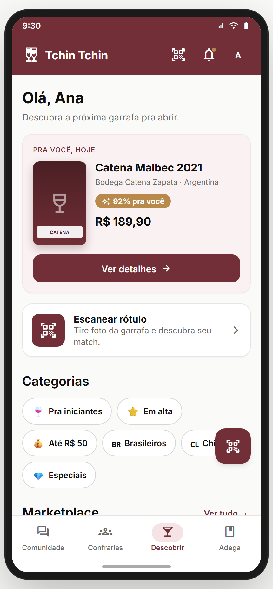

**Propósito:** porta de entrada do app pós-onboarding. Ofereçe um **hero único** ("Pra você, hoje") com o vinho de maior match, + scanner + categorias + preview do Marketplace + Curiosity card editorial. **US-DESC-01.**
**Entradas:** bottom nav "Descobrir"; deep link. **Saídas:** `wine`, `quiz`, `scanner`, `marketplace`, `marketplace { filter }`.

**Layout (`DescobrirHome`):**
- Header com saudação Fraunces — **"Olá, {primeiroNome}"** + sub Geist **"Descubra a próxima garrafa pra abrir."**
- **Hero "Pra você, hoje"** (bg p50, border p100, padding 16):
  - Se `ctx.user.paladar` existe: garrafa placeholder 84×132 com gradiente p900→p700 + rótulo simulado + título do vinho (17/700) + producer/country + **MatchBadge** ("87% pra você", p700 → ambar a700) + preço (R$ 18/700) + CTA primária "Ver detalhes" (full width).
  - Se **sem paladar**: card centralizado com ícone `quiz` 26 sobre círculo p700, H3 **"Quer recomendações pra você?"**, body Geist 13 **"Faça o quiz de paladar — 5 perguntas, 2 minutos. Aí a gente sabe o que combina contigo."**, CTA primária **"Fazer quiz"** → `quiz`.
- **Card scanner** (n0 + border n200): ícone `qr_code_scanner` sobre quadrado p700 + body "Escanear rótulo · Tire foto da garrafa e descubra seu match." → `scanner`.
- **Categorias** (chips com emoji, flex-wrap): "Pra iniciantes 🍷", "Em alta ⭐", "Até R$ 50 💰", "Brasileiros 🇧🇷", "Chilenos 🇨🇱", "Especiais 💎". Cada um → `marketplace { filter: id }`.
- **Marketplace preview**: H2 "Marketplace" + link "Ver tudo →" → grid 2 colunas com `WineCard compact` (4 vinhos sorted by match) + CTA secundária "Ver mais vinhos".
- **CuriosityCard** editorial — bloco "Uva da semana" (Tannat) com texto curto e autoria ("Sommelier Convidado · Diego Reis").

**Estados/dados:**
- `quizDone = !!ctx.user.paladar`.
- `sorted = [...MOCK_WINES].sort(b.match - a.match)`; `hero = sorted[0]`; grid = `sorted.slice(1,5)`.

**Variante `DescobrirHomeFirstTime`** (Módulo 02): banner sticky de paladar + grade de uvas/regiões filtrada pelos `userInterests` do onboarding + banner condicional `SkipBanner` se veio via `skip_to_feed` em ≤7 dias.

> **⚠️ DIVERGÊNCIA — Categorias:** 6 chips fixos hoje. Doc previa categorias dinâmicas baseadas em estoque + sazonalidade. **Recomendação:** manter as 6 no MVP; servidor fornece a lista no GA. Backlog **DESC-CAT-DYN**.
> **⚠️ DIVERGÊNCIA — Curiosity Card** é estática (sempre Tannat). **Recomendação:** plugar em CMS interno + rotação semanal. Backlog **DESC-CURIOSITY**.

**Status:** ✅

---

## 04.2 `marketplace` — Catálogo + filtros + multi-add ✅

_Default · sheet de Filtros aberto · busca por "Malbec" · modal "Adicionar vários":_

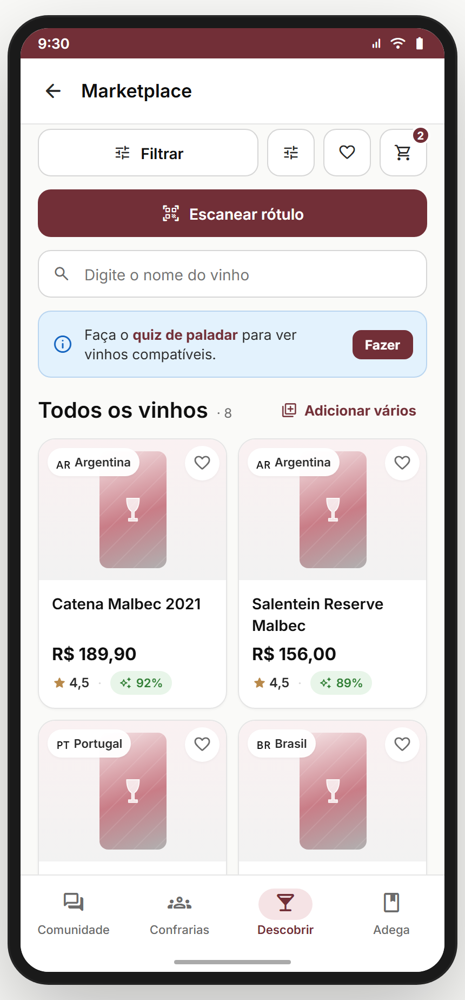 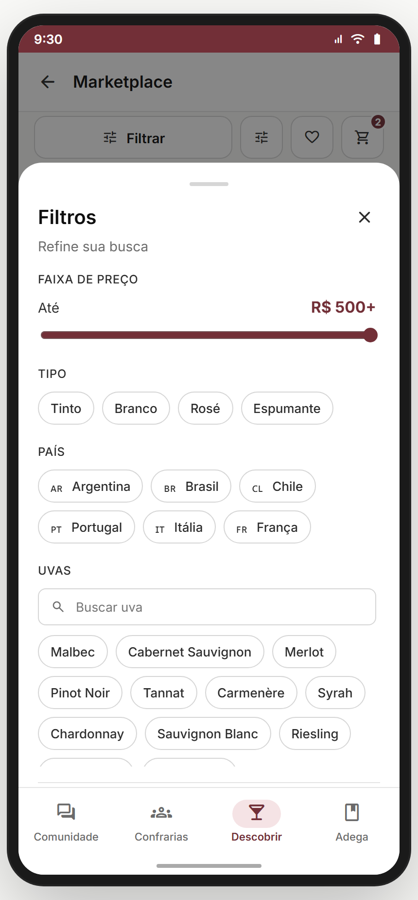 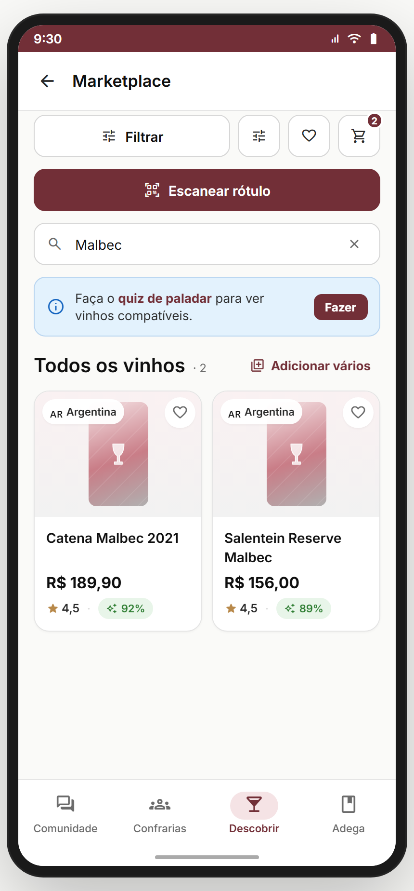 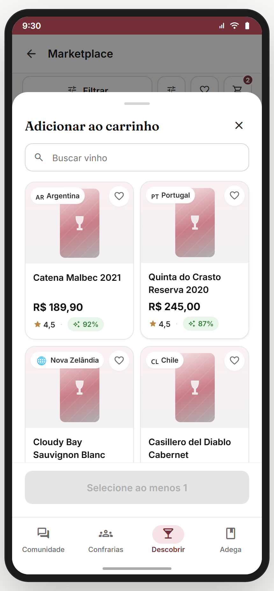

**Propósito:** catálogo completo de vinhos com filtros, busca, atalhos pra wishlist/carrinho/scanner e **multi-add ao carrinho** (#9 da Fase 3). **US-MKT-01.**
**Entradas:** "Ver tudo" do Descobrir; chips de categoria; deep link `?filter=`; ícone tune do header. **Saídas:** `wine`, `filtros-avancados`, `lista-desejos`, `carrinho`, `scanner`, `toast`.

**Layout (`MarketplaceScreen`):**
- `SubHeader` "Marketplace" + back.
- **Action row** (linha de 4 botões):
  - **Filtrar** (full width esquerda; chip com contador ativo em p700 caso `activeCount > 0`).
  - Ícone tune (filled) → `filtros-avancados`.
  - Ícone ♡ → `lista-desejos`.
  - Ícone 🛒 com **badge "2"** (mock) → `carrinho`.
- CTA primária **"Escanear rótulo"** (burgundy, full width) → `scanner`.
- **Search box** (Input com lupa, placeholder **"Digite o nome do vinho"**) + botão limpar (×) quando há query. Filtra por nome ou producer.
- **Banner azul** "Faça o **quiz de paladar** para ver vinhos compatíveis" + CTA "Fazer" → mostrado **só se** `!quizDone`.
- Header da lista: H2 **"Vinhos pra você"** (se quizDone) ou **"Todos os vinhos"** + contagem · X · + link **"Adicionar vários"** (`library_add` p700) → abre `MultiSelectWinesModal`.
- **Loading**: 4 skeletons (grid 2×2, 600ms).
- **Empty (após filtros)**: `EmptyState` "Nenhum vinho com esses filtros · Tenta ajustar os filtros ou explorar outras categorias · Limpar filtros".
- **Grid 2-colunas** de `WineCard layout="grid"` → tap → `wine { wine }`.

**Bottom sheet de Filtros simples** (`MarketplaceFilterSheet`):
- H2 "Filtros" + contador de ativos + body "Refine sua busca".
- Seções (scrollable, max-height 55vh):
  - **Faixa de preço** — slider 20–500, label "Até R$ X" (500+ se max).
  - **Tipo** — chips Tinto · Branco · Rosé · Espumante.
  - **País** — chips com bandeira: AR · BR · CL · PT · IT · FR.
  - **Uvas** — search inline + chips: Malbec, Cab Sauvignon, Merlot, Pinot Noir, Tannat, Carmenère, Syrah, Chardonnay, Sauvignon Blanc, Riesling, Tempranillo, Sangiovese.
  - **Match Score mínimo** — slider 0–90 step 10, label "{N}% pra mim".
- Footer: ghost "Limpar" (disabled se 0 ativos) + primária "Ver resultados".

**MultiSelectWinesModal** (vem de `multi-select-wines.jsx`, reusada também na Adega):
- Título "Adicionar ao carrinho" + ícone close.
- Search box "Buscar vinho".
- Grid 2-col de cards selecionáveis (border p700 + check quando selecionado).
- CTA primária **"Selecione ao menos 1"** (disabled) ou **"Adicionar N ao carrinho"** (habilitada).
- Confirmação: fecha modal + toast success "N vinho(s) adicionado(s) ao carrinho".

**Estado/persistência:** `filtersActive {tipos, paises, uvas, minMatch, maxPrice}` em state local; `query` separado. **Atalho oculto:** *long-press* (`onContextMenu`) no botão "Filtrar" pula direto pra `filtros-avancados` com os filtros já aplicados.
**Analytics:** `marketplace_view`, `marketplace_filter_applied { filters }`, `marketplace_search { q }`, `marketplace_multi_add { count }`, `wine_card_tap { id }`.

> **⚠️ DIVERGÊNCIA — Badge "2" no 🛒 é hard-coded.** Backlog: ler `ctx.cart.items.length`.
> **⚠️ DIVERGÊNCIA — long-press → filtros-avancados é UX escondida.** Risk: usuários nunca descobrem. **Recomendação:** trocar o segundo ícone tune (filled) por label visível **"Mais filtros"** ou usar um chip "Avançado" no fim do sheet inline. PO decide.
> **⚠️ DIVERGÊNCIA — banner de quiz é dismissível?** Hoje não. **Recomendação:** adicionar X de dismiss + lembrar D+7 (não voltar). Backlog **MKT-QUIZBANNER-DISMISS**.

**Status:** ✅

---

## 04.3 `wine` — Detalhe de vinho ✅

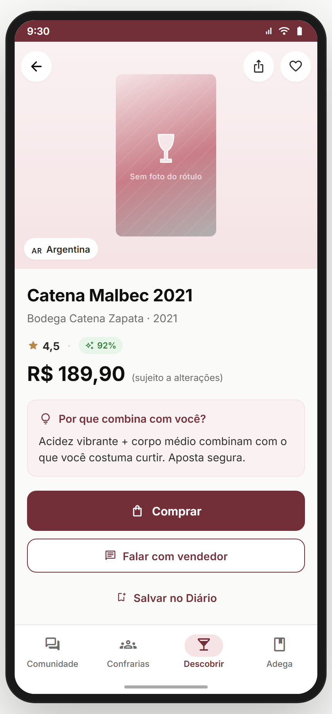

**Propósito:** página completa do vinho — hero, preço, **por que combina** (microcopy por tier de match), CTAs hierarquizados (Comprar/Falar/Salvar), ficha técnica, **radar 5D sobreposto** (paladar do usuário × paladar do vinho), harmonização, e bloco de avaliações com form. **US-WINE-01.**
**Entradas:** `descobrir` / `marketplace` / `lista-desejos` / `scanner-result` / `carta-matches` → `wine { wine }`. Fallback sem param: `MOCK_WINES[0]`. **Saídas:** back, `carrinho`, `toast` (WhatsApp), `AddToDiaryModal` (modal interno).

**Layout (`WineDetailScreen`):**
- **Overlay header** (absolute, top): back + share (`ios_share`) + ♡ favoritar (toggle local; ícone vermelho `e700` quando true).
- **Hero foto 4:3** (gradiente p50→p100) + `BottlePlaceholder` 130×210 + chip de bandeira+país no canto.
- Título Fraunces 22, producer · vintage, **estrelas + MatchBadge** (se ≥40), **preço grande** R$ + "(sujeito a alterações)".
- **Banner azul** **"Vinho não disponível no Marketplace — mas você pode registrá-lo no seu Diário."** se `wine.shoppable === false`.
- **Card "Por que combina com você?"** (bg p50, ícone `lightbulb` p700) — microcopy adaptativa por tier:
  - `match ≥ 80`: "Acidez vibrante + corpo médio combinam com o que você costuma curtir. **Aposta segura.**"
  - `match ≥ 60`: "Bom encaixe com seu paladar — o corpo está alinhado, a intensidade vai te agradar."
  - `match < 60`: "Tem características diferentes do seu padrão, mas pode te surpreender."
- **CTAs hierarquizados** (vertical, gap 10):
  - Se `shoppable`: primária **"Comprar"** → `carrinho` + secundária **"Falar com vendedor"** (toast "Abrindo WhatsApp…") + ghost **"Salvar no Diário"** → abre `AddToDiaryModal`.
  - Se não: primária única **"Salvar no Diário"**.
- **Ficha técnica** (`DetailRow` em pares label/valor): Tipo · Uvas · Região · Volume (750ml) · Teor alcoólico · Maturação · Servir a.
- **Perfil sensorial** — `PaladarRadar paladar={MOCK_USER.paladar} wine={wine.perfil} size={240}` + legenda (sólido **"Seu paladar"** p700 + tracejado **"{Vinho}"** ambar a700).
- **Harmonização** — texto livre (mock: "Ostras frescas, canapés de salmão, bolinho de bacalhau e queijos suaves.").
- **Avaliações** (`Card` interno):
  - Form: H3 "Dê uma nota e avalie" + 5 estrelas tocáveis + textarea (placeholder "Digite sua avaliação (opcional)") + botão "Publicar" (disabled sem rating). Submit → adiciona ao topo, reseta form, toast "Avaliação publicada ✓".
  - Box de média: nota grande p900 + estrelas + contagem.
  - Lista de reviews (Card) com Avatar(level) + autor + estrelas + tempo + texto.

**Estado/persistência:** `fav`, `showAdd`, `userRating`, `userReview`, `reviews[]` em state local. Hoje não persiste fora da sessão.
**Analytics:** `wine_view { id, match }`, `wine_favorite_toggle`, `wine_buy_tap`, `wine_save_diary`, `wine_review_submit { rating }`, `wine_whatsapp_tap`.

> **⚠️ DIVERGÊNCIA — radar usa `MOCK_USER.paladar`, não `ctx.user.paladar`.** Se o usuário não fez quiz, o radar mostra um perfil falso. **Recomendação:** quando `!ctx.user.paladar`, esconder a seção sensorial e renderizar um CTA "Faça o quiz pra ver se combina com você". Backlog **WINE-PALADAR-GATE**.
> **⚠️ DIVERGÊNCIA — favoritar é local.** Não escreve em `lista-desejos`. **Recomendação:** ao favoritar, persistir em `tc.wishlist` + sincronizar com a `ListaDesejosScreen`. **Crítico** pra GA.
> **⚠️ DIVERGÊNCIA — "Falar com vendedor"** abre só um toast (placeholder). Implementar deep link WhatsApp real com mensagem template "Oi, tenho interesse no {wine.name}".

**Status:** ⚠️ (UI completa; favoritar e radar gating precisam alinhar)

---

## 04.4 `busca` — Busca global multi-entidade ✅

_Empty (sugestões) · resultados de "Malbec":_

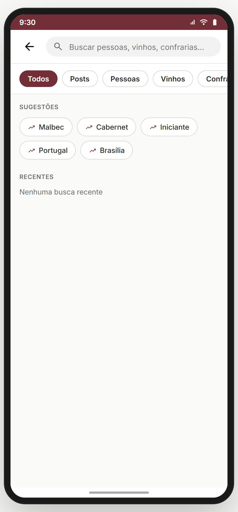 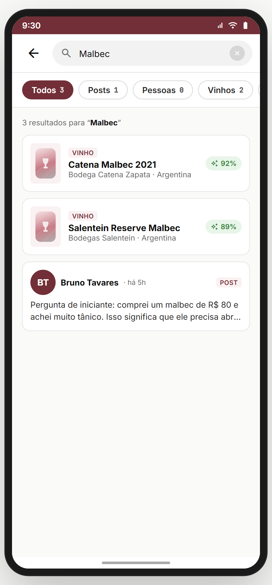

**Propósito:** ponto único de busca que cobre Posts, Pessoas, Vinhos e Confrarias (multi-entidade), com filtros por tipo via chips. **US-BUSCA-01.**
**Entradas:** ícone busca no header de várias telas; deep link. **Saídas:** abrir entidade específica (`wine`, `perfil-outro`, `confraria-detalhe`, `post-detail`).

**Layout (`BuscaScreen`):**
- Header com back + **search box prominente** (placeholder **"Buscar pessoas, vinhos, confrarias…"**, autofocus, botão limpar quando há texto).
- **Chips de filtro** (horizontal scroll): Todos · Posts · Pessoas · Vinhos · Confrarias (sel = p700 bg branco). Cada chip mostra **contador** ao lado do label quando há query.
- **Sem query**:
  - Bloco "SUGESTÕES" com chips das tendências (Malbec, Cabernet, Iniciante, Portugal, Brasília) com ícone `trending_up` p700 → toca = preenche query.
  - Bloco "BUSCAS RECENTES" (mock estático).
- **Com query**:
  - Seções por entidade (renderizadas só se filter = 'todos' ou específico):
    - **Posts** — lista vertical com Avatar(level) + autor + level pill + content snippet + tempo.
    - **Pessoas** — Avatar grande + nome + bio + botão "Seguir" (mock).
    - **Vinhos** — Card horizontal com bottle + name + producer + match + preço.
    - **Confrarias** — Card com banner + nome + cidade + N membros.
  - Se `totalShown === 0`: empty state "Nenhum resultado pra '{q}'" + sugestão para tentar outra busca.

**Sources (mock):** `MOCK_POSTS`, `MOCK_WINES`, `MOCK_CONFRARIAS` + array hard-coded de pessoas (Carla Mendes, Bruno Tavares, Diego Reis).
**Analytics:** `search_open`, `search_query { q, filter }`, `search_result_tap { entity, id }`, `search_suggestion_tap { suggestion }`.

> **⚠️ DIVERGÊNCIA — pessoas hard-coded** (3 fixos). Backlog: integrar com índice de usuários do backend (`users` collection).
> **⚠️ DIVERGÊNCIA — "Buscas recentes"** está estático no protótipo. Persistir em `tc.search.recent[]` (até 10 itens, LRU).

**Status:** ✅

---

## 04.5 `filtros-avancados` — Filtros full-screen (36.01) ✅

_Default · com Tinto + Argentina + Malbec aplicados:_

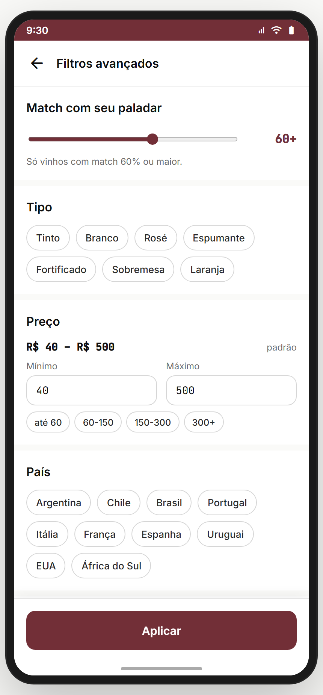 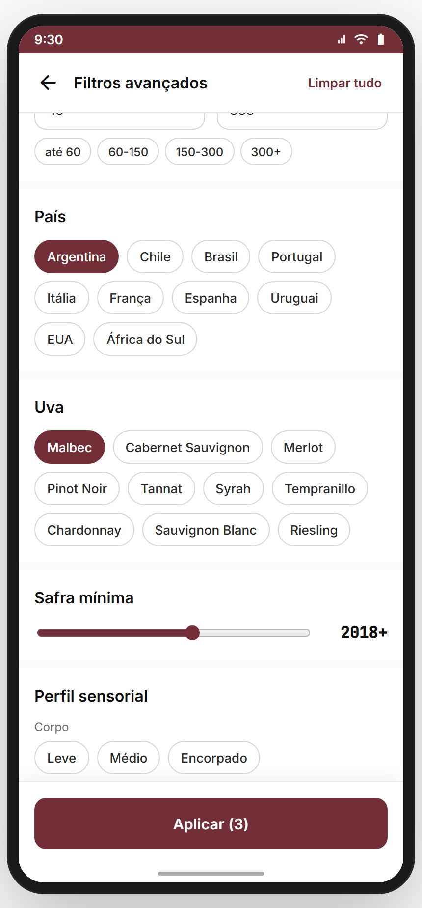

**Propósito:** versão **completa** dos filtros (vs. o bottom sheet simples) — perfil sensorial granular, premiados, orgânicos, foto, esgotados. **US-MKT-01 (avançado).**
**Entradas:** ícone tune (filled) no header do marketplace; long-press no botão "Filtrar"; deep link com `params.filters`. **Saídas:** "Aplicar" → toast "N filtro(s) aplicado(s)" + `go('back')` (volta pro marketplace) — *hoje não devolve os filtros pro state do marketplace; ver divergência.*

**Layout (`FiltrosAvancadosScreen` / `MpShell`):**
- Header back + título "Filtros avançados" + (se `count > 0`) link **"Limpar tudo"** p700.
- **Match com seu paladar** — slider 0–100, label **"{N}+"** + helper "Só vinhos com match {N}% ou maior".
- **Tipo** — chips: Tinto · Branco · Rosé · Espumante · Fortificado · Sobremesa · Laranja (7 opções).
- **Preço** — labels "R$ {min} – R$ {max}" (1000 = "1k+"); 2 inputs numéricos (min/max); + chips de presets ("até 60", "60-150", "150-300", "300+").
- **País** — 10 opções incluindo Espanha, Uruguai, EUA, África do Sul.
- **Uva** — 10 chips: Malbec · Cab Sauvignon · Merlot · Pinot Noir · Tannat · Syrah · Tempranillo · Chardonnay · Sauvignon Blanc · Riesling.
- **Safra mínima** — slider 2010–2024, label **"{ano}+"**.
- **Perfil sensorial** — 4 sub-seções:
  - Corpo: Leve · Médio · Encorpado.
  - Doçura: Seco · Meio-seco · Doce.
  - Acidez: Baixa · Média · Alta.
  - Tanino: Suave · Médio · Firme.
- **Mais (toggles `FaToggle`)** com ícone + label + sub:
  - Premiado — "Medalhas em concursos internacionais".
  - Orgânico / biodinâmico — "Selos verificados".
  - Com foto do rótulo — "Esconde os vinhos com placeholder".
  - Incluir esgotados — "Por padrão escondemos" *(invertido: `!emEstoque`)*.
- **Sticky bottom**: CTA primária **"Aplicar (N)"** → toast "N filtro(s) aplicado(s)" + back.

**Estado:** todos os filtros em state local; `count` agrega tudo.
**Analytics:** `filters_advanced_open`, `filters_advanced_apply { count, filters }`, `filters_advanced_clear_all`.

> **⚠️ DIVERGÊNCIA — não devolve filtros ao marketplace:** o "Aplicar" só faz `go('back')` (sem callback ou state lift). **Recomendação:** persistir os filtros em `ctx.marketplace.filters` (state lift), ou usar `go('marketplace', { filters })` ao aplicar. **Crítico para a feature funcionar de verdade.**
> **⚠️ DIVERGÊNCIA — duplicação de filtros simples vs avançado:** Tipo, País, Uva, Preço, Match aparecem nos dois. **Recomendação:** unificar — bottom sheet simples leva a "Mais filtros" → abre full-screen com tudo. Decisão de PO.

**Status:** ⚠️ (UI completa; integração com marketplace pendente)

---

## 04.6 `lista-desejos` — Wishlist + price-watch (36.02) ✅

_Default (6 itens com −15% em alguns) · modo "Comparar" (selecionando 2):_

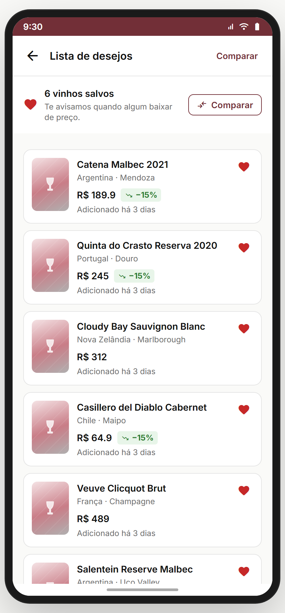 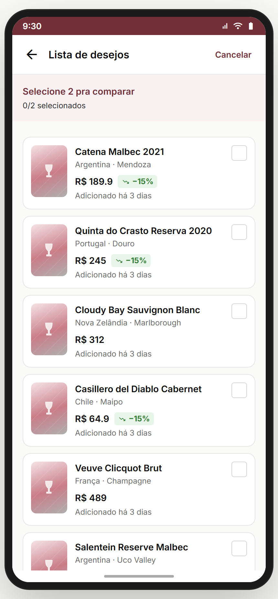

**Propósito:** vinhos salvos com **price-watch** ("te avisamos quando algum baixar de preço") + entrada para `comparar-vinhos`. **US-WISH-01.**
**Entradas:** ícone ♡ do header do marketplace; deep link. **Saídas:** tap em vinho → `wine`; "Comparar" + 2 selecionados → `comparar-vinhos { a, b }`; "Explorar Marketplace" (empty) → `marketplace`.

**Layout (`ListaDesejosScreen` / `MpShell`):**
- Header back + título "Lista de desejos" + (se items > 0) link **"Comparar" / "Cancelar"** p700 (toggle do modo seleção).
- **Header info row** (n0 bg): ícone ♡ filled e700 + "{N} vinhos salvos · Te avisamos quando algum baixar de preço." + botão secundário **"Comparar"** (se items ≥ 2).
- **Modo selecionando** (banner p50): "Selecione 2 pra comparar · {n}/2 selecionados".
- **Vazia** (`items.length === 0`): ícone `favorite_border` 56 n400 + H2 "Sua lista está vazia" + body "Toque ♡ em qualquer vinho pra guardar aqui." + CTA primária "Explorar Marketplace".
- **Lista** (vertical, gap 10): cada item card horizontal com:
  - `BottlePlaceholder` 56×80.
  - Nome + país · região + **preço grande** + (se `priceWatch`) badge **"−15%"** (s100 bg, s700 text, ícone `trending_down`) + "Adicionado há X dias".
  - Modo normal: ícone ♡ filled e700 à direita (remove ao clicar).
  - Modo seleção: checkbox 24×24 (p700 quando selected, n300 outline); itens não-selecionáveis ficam opacity 0.5 quando já há 2 selecionados.
- **Sticky bottom** (só no modo selecionando + 2 selecionados): CTA primária **"Comparar lado a lado"** + ícone `compare_arrows` → `comparar-vinhos { a, b }`.

**Estado/persistência:** `items[]` em state local com mock (6 wines + `priceWatch` aleatório 40% chance). `selecting`, `selected[]` para modo compare.
**Analytics:** `wishlist_view`, `wishlist_remove { id }`, `wishlist_compare_start`, `wishlist_compare_confirm { ids }`, `wishlist_price_drop_view { id, dropPct }`.

> **⚠️ DIVERGÊNCIA — price-watch é mock random (40%).** Backlog: serviço de jobs que compara preço atual vs salvo + push "Vinho X caiu N%". US-WISH-02.
> **⚠️ DIVERGÊNCIA — wishlist persistência:** state local apaga ao sair. Backlog **WISH-PERSIST**: gravar em `tc.wishlist` no localStorage + sincronizar com backend.
> **⚠️ DIVERGÊNCIA — não há ordenação/filtro** na wishlist. Para listas grandes (50+), fica ruim. **Backlog:** ordenar por (price-drop primeiro, depois mais recente, depois match).

**Status:** ⚠️ (UI ok; price-watch e persistência pendentes)

---

## 04.7 `comparar-vinhos` — Comparação lado a lado (36.03) ✅

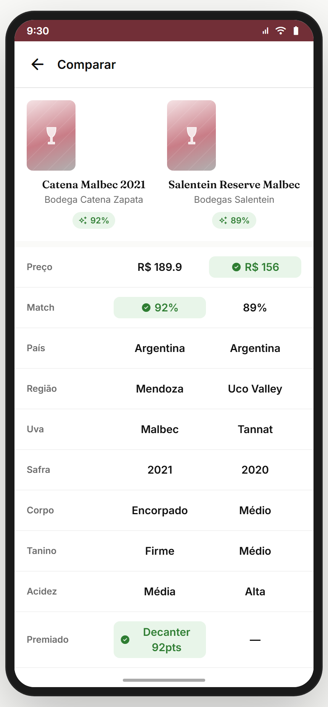

**Propósito:** comparar **exatamente 2 vinhos** lado a lado em 11 dimensões + radar sobreposto + CTA "Perguntar pra um expert". **US-COMP-01.**
**Entradas:** `lista-desejos` → "Comparar lado a lado" com `{a, b}`; deep link. **Saídas:** "Ver {nome}" → `wine`; "Perguntar pra um expert" → `perguntar-expert`.

**Layout (`CompararVinhosScreen` / `MpShell`):**
- Header back + título "Comparar".
- **Header de 2 vinhos** (grid 2-col): cada um com `BottlePlaceholder` 64×92 + nome (Fraunces serif) + producer + MatchBadge.
- **11 linhas de comparação** (grid 110px label / 1fr A / 1fr B):
  Preço · Match · País · Região · Uva · Safra · Corpo · Tanino · Acidez · Premiado · Avaliações.
  - Célula vencedora (`best`) destacada em **`s100` bg + `s700` text + ícone `check_circle`**.
  - Regra para preço: menor é melhor (`lowerBetter: true`); para match/premiado/avaliações: maior é melhor.
  - Linhas neutras (sem `best`): País, Região, Uva, Safra, Corpo, Tanino, Acidez.
- **Radar 5D lado a lado** (placeholder hoje — TODO render real): caixa com gradiente radial duplo + legenda colorida (p700 = A, a700 = B).
- **CTAs**: 2 primárias side-by-side **"Ver {nomeA}"** e **"Ver {nomeB}"** + ghost full "Perguntar pra um expert: 'qual vale mais?'" → `perguntar-expert`.

**Defaults (sem params):** `a = MOCK_WINES[0]`, `b = MOCK_WINES[5]`.
**Analytics:** `compare_view { ids }`, `compare_winner_per_row { rows }`, `compare_to_wine { id }`, `compare_to_expert`.

> **⚠️ DIVERGÊNCIA — radar é placeholder** (gradiente decorativo, sem dados reais). **Crítico:** renderizar `PaladarRadar` real com 2 polígonos sobrepostos (paladar de A + paladar de B), cores p700 e a700. Backlog **COMP-RADAR-REAL**.
> **⚠️ DIVERGÊNCIA — só 2 vinhos:** doc previa "até 3". **Recomendação:** manter 2 (3 colunas ficam apertadas em 412dp). Decisão do PO.
> **⚠️ DIVERGÊNCIA — Algumas linhas são hard-coded** (Corpo, Tanino, Acidez sempre "Encorpado/Firme/Média" vs "Médio/Médio/Alta"). Precisa pluggar nos dados reais do vinho (`wine.body`, `wine.tanino`, `wine.acidez`).

**Status:** ⚠️ (UI ok; radar real + dados pluggados pendentes)

---

## Componentes transversais
- **`WineCard`** (`cards.jsx`) — usado em Descobrir grid, Marketplace grid, Busca. Variantes `compact` e `layout="grid"`. Mostra bottle, nome, country, match, preço, estrelas.
- **`MatchBadge`** — pill com cor variando por tier (≥80 verde, ≥60 ambar, <60 cinza); tamanhos `sm` (12px) e default.
- **`BottlePlaceholder`** (`tokens.jsx`) — SVG genérico de garrafa quando não há foto real.
- **`MultiSelectWinesModal`** — reusável (Marketplace + Adega). Suporta `confirmLabel(n)` dinâmico.
- **`PaladarRadar`** — usado em `wine` (overlay user×wine) e em `comparar-vinhos` (placeholder).

## Edge cases & navegação reversa
- **`BACK_SKIP`** não inclui as telas desse módulo — voltar funciona normalmente entre wine → marketplace → descobrir.
- **Long-press no botão "Filtrar"** abre `filtros-avancados` — UX escondida, ver divergência em 04.2.
- **Wishlist e favoritar** não estão integrados: ♡ no `wine` é state local, não escreve em `lista-desejos`. **Backlog crítico.**
- **Multi-add + carrinho** confirma com toast mas não passa pelo carrinho de verdade (mock). Backlog: integrar com `ctx.cart`.
- **Skeleton 600ms** no marketplace — bom para sensação de loading, mas se o usuário tocar antes pode falhar (já corrigido com try/catch nas captures).

## Pendências de backend / decisões do PO
- **Persistência:** wishlist, favoritos, carrinho, filtros aplicados — tudo em `localStorage` + backend.
- **Price-watch real:** job server-side + push diário.
- **Busca:** índice multi-entidade com FTS (PostgreSQL `tsvector` ou Algolia/Meilisearch).
- **Comparação:** radar real + plug nos dados sensoriais do vinho.
- **Categorias dinâmicas:** servidor fornece a lista do Descobrir.
- **Banner do quiz:** dismissível com TTL.
- **Decisões PO:** unificar filtros simples vs avançado; comparação 2 vs 3; long-press visível como "Avançado".
