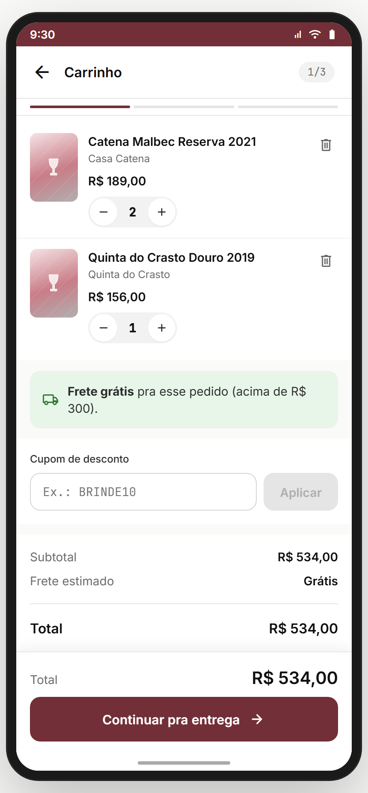
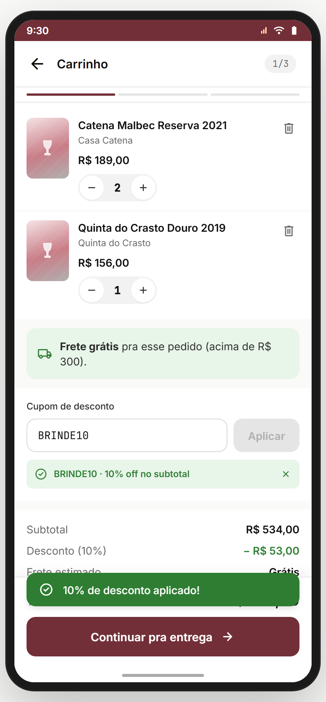
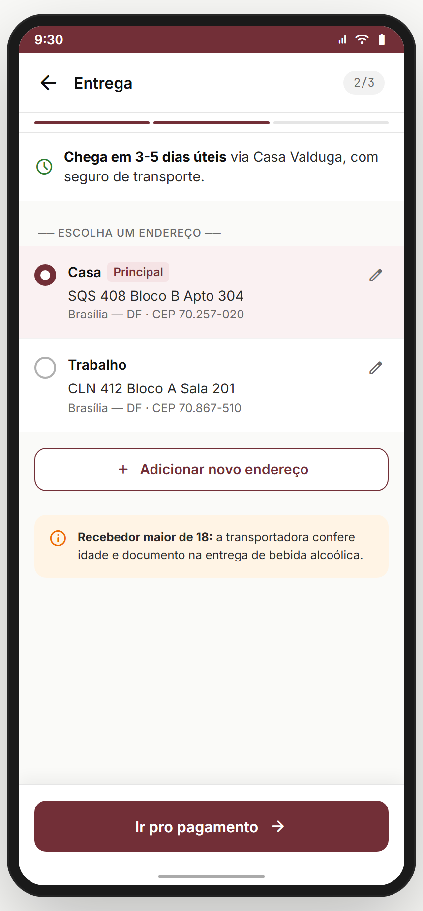
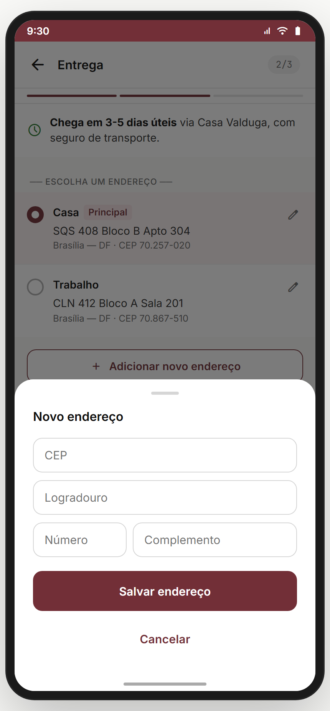
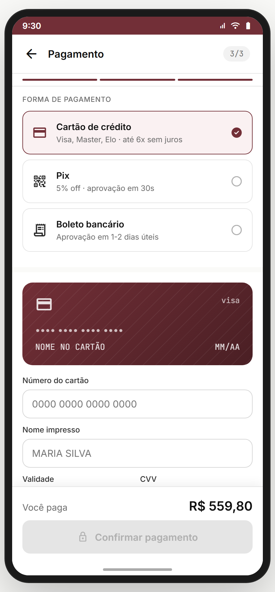
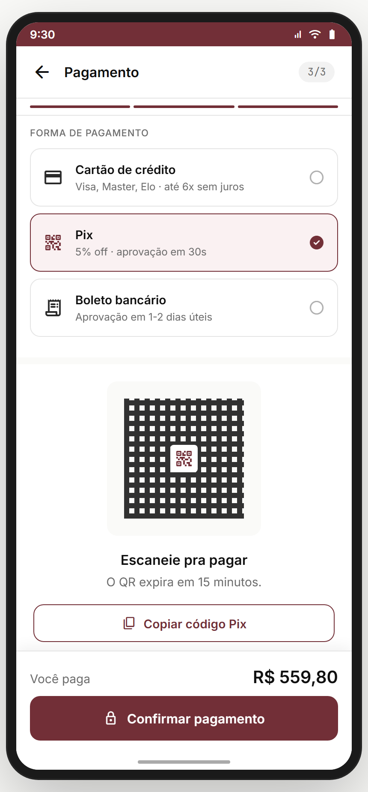
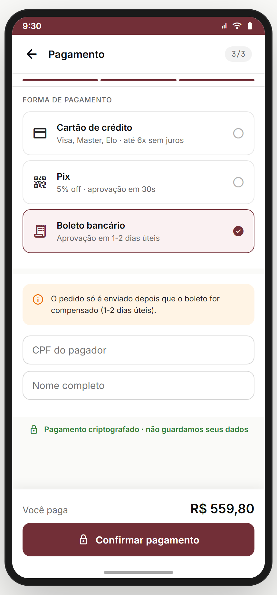
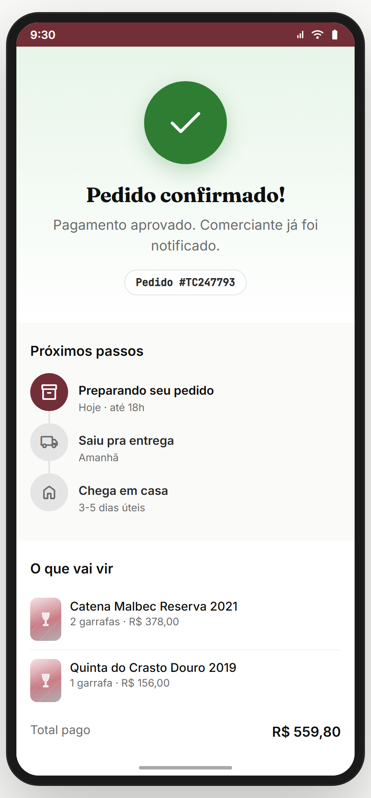

# Módulo 05 — Carrinho & Checkout

> Fluxo de compra do Marketplace: do **carrinho** (com cupom + estimativa de frete) até o **pedido confirmado** com tracking. 3 passos no wizard + tela de sucesso. Toda a parte financeira ainda é **mock no protótipo** — passar pra **Celcoin/LACI/Pix real** é trabalho do build.
> **Fonte de verdade:** `src/legacy/screens-checkout.jsx` (4 telas no mesmo arquivo). Doc funcional: **MVP1 Épico 6 (compra)** + **Sprint 11-13** (frete/NF/recompra).
> **Épicos/US:** US-MKT-02 (carrinho com qty + cupom), US-MKT-03 (endereço múltiplo + verificação ≥18), US-MKT-04 (pagamento PIX/cartão/boleto), US-MKT-05 (pedido confirmado + tracking), US-MKT-06 (NFe), US-MKT-07 (recompra rápida).

**Regra de negócio canônica:** o checkout tem **3 passos lineares** (Carrinho → Entrega → Pagamento → Pedido Confirmado). **Cupom é validado no carrinho**, **frete é estimado** (acima de R$ 300 = grátis). **Verificação de idade ≥18 na entrega** é responsabilidade da transportadora (não do app). PIX dá 5% off.

## Mapa do fluxo
```
[wine] → "Comprar" → carrinho (1/3) ─→ endereco (2/3) ─→ pagamento (3/3) ─→ pedido-confirmado
                       ↑     ↓
                    cupom · qty · remover                   método: cartao | pix | boleto
                       ↓
                   vazio? → empty state → "Explorar Marketplace" → descobrir
```

---

## 05.1 `carrinho` — Cart com cupom + estimativa de frete (33.01) ✅

_Default (2 items, frete grátis acima R$ 300) · cupom BRINDE10 aplicado (10% off):_

 

**Propósito:** ponto de revisão antes do checkout. Permite ajustar quantidade, remover, aplicar cupom, ver frete estimado. **US-MKT-02.**
**Entradas:** ícone 🛒 do header do `marketplace`; CTA "Comprar" do `wine`. **Saídas:** "Continuar pra entrega" → `endereco { items, subtotal, discount, frete, total }`; "Explorar vinhos" (vazio) → `descobrir`; back → tela anterior.

**Layout (`CarrinhoScreen` / `CkShell`):**
- Header back + título "Carrinho" + chip mono "1/3" (passo do wizard) + barra de progresso de 3 segmentos (1º em p700).
- **Lista de itens** (n0 bg): cada item card horizontal:
  - `BottlePlaceholder` 56×80 + nome + producer + preço.
  - **Stepper de qty** (pill n100 com 2 botões redondos + número mono no meio).
  - Botão **+** disabled se `qty >= stock`; aviso amber "Restam só X no estoque" quando `qty >= stock-1`.
  - Ícone `delete_outline` à direita → remove item (sem confirmação).
- **Banner verde de frete** (`s100` bg): se `subtotal > 300` mostra **"Frete grátis pra esse pedido (acima de R$ 300)"**; senão **"Faltam R$ X pra ganhar frete grátis"** (estímulo a upsell).
- **Cupom de desconto** (input mono auto-uppercase + botão "Aplicar"):
  - Hard-coded: só **BRINDE10** funciona (10% off no subtotal).
  - Sucesso: pill verde "BRINDE10 · 10% off no subtotal" + ícone check + X pra remover.
  - Erro: toast "Cupom inválido".
- **Sumário** (n0 bg): `SumRow` linhas — Subtotal · Desconto (se aplicado, em s700) · Frete estimado (ou "Grátis") · separador · **Total** (h3).
- **Sticky bottom**: total grande + CTA "Continuar pra entrega" → `endereco`.

**Empty state:**
- Ícone `shopping_cart` 64 n400 + H2 **"Seu carrinho está vazio"** + body **"Volta pro Descobrir pra achar vinhos pelo seu paladar."** + CTA primária "Explorar vinhos" → `descobrir`.

**Estado/persistência:** `items[]` (state local, baseado em `MOCK_CART` de 2 wines); `coupon`, `couponApplied`. **Tudo perde no refresh.**
**Cálculo (canônico):** `subtotal = sum(price × qty)` · `discount = couponApplied ? round(subtotal × 0.1) : 0` · `frete = subtotal > 300 ? 0 : 24.90` · `total = subtotal - discount + frete`.
**Analytics:** `cart_view { items, subtotal }`, `cart_qty_change { id, delta }`, `cart_remove { id }`, `cart_coupon_apply { code, success }`, `cart_proceed_to_address`.

> **⚠️ DIVERGÊNCIA — items vêm do MOCK_CART**, não do `ctx.cart`. Quem chega via "Comprar" do `wine` ou "Adicionar ao carrinho" (Marketplace multi-add) **não vê seu item ali**. **Crítico para GA:** state lift do carrinho pra `ctx.cart` + persistência em `tc.cart`.
> **⚠️ DIVERGÊNCIA — Cupom hard-coded BRINDE10.** Backlog: serviço de cupons (validade, limites de uso, % vs valor fixo, restrição por categoria/produto). Tabela `coupons` no backend.
> **⛔ FALTA NO APP (épico pede):** **frete real via Correios/transportadora** (CEP → cálculo dinâmico). Hoje é flat `R$ 24,90 ou grátis`. Backlog **MKT-FRETE-REAL**.
> **⛔ FALTA NO APP (épico pede):** **mover Wishlist → Carrinho**. Hoje a wishlist (`lista-desejos`) não tem CTA "Mover pro carrinho". Backlog **MKT-WISH-TO-CART**.
> **⛔ FALTA NO APP (épico pede):** **estoque em tempo real** — hoje `stock` está hard-coded no MOCK_CART. Backlog: WebSocket/polling do estoque.
> **⛔ FALTA NO APP (épico pede):** **prazo de validade do carrinho** (item reservado por N min depois de adicionar). Backlog **MKT-CART-HOLD**.

**Status:** ⚠️ (UI completa; integração com state real + cupom real + frete real pendentes)

---

## 05.2 `endereco` — Entrega (33.02) ✅

_Default (2 endereços salvos, "Casa" Principal selecionado) · modal "Novo endereço" aberto:_

 

**Propósito:** escolher endereço de entrega (entre os salvos) ou adicionar um novo via bottom sheet. **US-MKT-03.**
**Entradas:** `carrinho` → "Continuar pra entrega" com `{items, subtotal, discount, frete, total}`. **Saídas:** "Ir pro pagamento" → `pagamento { ...params, endereco }`; back → `carrinho`; "Adicionar novo endereço" → abre bottom sheet inline.

**Layout (`EnderecoScreen` / `CkShell`):**
- Header back + título "Entrega" + chip "2/3" + barra de progresso (1º e 2º em p700).
- **Banner verde de prazo** (s100 bg): ícone `schedule` + **"Chega em 3-5 dias úteis via Casa Valduga, com seguro de transporte."** *(Hoje texto fixo — ver divergência)*.
- Seção `── ESCOLHA UM ENDEREÇO ──` (overline n600) + lista de cards (n0 bg):
  - Radio circular (22dp, n400 outline → p700 fill quando selecionado).
  - Label (Casa/Trabalho) + pill **"Principal"** se main.
  - Endereço completo: rua + cidade-UF + CEP.
  - Ícone `edit` à direita → toast "Em breve: editar endereço" *(placeholder)*.
- CTA secundária **"Adicionar novo endereço"** (full width, leading `add`) → abre modal bottom sheet.
- **Aviso amber** (w100 bg) com ícone `info`: **"Recebedor maior de 18: a transportadora confere idade e documento na entrega de bebida alcoólica."**
- **Sticky bottom**: CTA primária "Ir pro pagamento" (disabled se `!selected`).

**Bottom sheet "Novo endereço"** (overlay 55% + card branco + drag handle 36×4):
- H3 "Novo endereço".
- 4 inputs: **CEP · Logradouro · Número · Complemento** (Número/Complemento em row 1fr/2fr).
- CTAs: primária "Salvar endereço" (toast success "Endereço salvo" + fecha) + ghost "Cancelar".

**Estado/persistência:** lista hard-coded de 2 endereços (Casa SQS 408, Trabalho CLN 412 — ambos Brasília-DF). `selected`, `showNew` em state local.
**Analytics:** `address_select { id }`, `address_add_open`, `address_add_save { cep }`, `address_proceed_to_payment`.

> **⚠️ DIVERGÊNCIA — endereços hard-coded (Brasília-DF).** Não tem CRUD real. Backlog: tabela `addresses` no backend + tela `editar-endereco`.
> **⚠️ DIVERGÊNCIA — CEP autocomplete não existe.** Doc pedia integração com **ViaCEP** ou similar (preenche logradouro/bairro/cidade automaticamente quando o usuário digita o CEP). Backlog **ADDR-VIACEP**.
> **⚠️ DIVERGÊNCIA — "Editar endereço"** é só toast placeholder. Implementar tela `editar-endereco` (mesmos campos + delete + marcar como principal).
> **⚠️ DIVERGÊNCIA — prazo fixo "3-5 dias"** vem hard-coded com "via Casa Valduga". Deveria vir do serviço de frete real, por transportadora escolhida + CEP de destino.
> **⛔ FALTA NO APP (épico pede):** **verificação de idade real do recebedor no app** (foto do RG no recebimento, OTP por SMS, etc.). Hoje só aviso. Backlog **AGE-VERIFY-DELIVERY**.
> **⛔ FALTA NO APP (épico pede):** **escolher entre múltiplas transportadoras** com preços/prazos diferentes. Hoje só "Casa Valduga" fixo. Backlog **MKT-CARRIER-CHOICE**.

**Status:** ⚠️ (UI completa; CRUD/CEP/transportadora reais pendentes)

---

## 05.3 `pagamento` — Métodos de pagamento (33.03) ✅

_Cartão (default, com card mock animado) · PIX (QR + 5% off) · Boleto (form CPF):_

  

**Propósito:** terceira (e última) etapa do checkout — escolher método e confirmar. **US-MKT-04.**
**Entradas:** `endereco` → "Ir pro pagamento" com `{...params, endereco}`. **Saídas:** "Confirmar pagamento" (com `method`) → `pedido-confirmado { ...params, method }`; back → `endereco`.

**Layout (`PagamentoScreen` / `CkShell`):**
- Header back + título "Pagamento" + chip "3/3" + barra 100% verde (todos os 3 segmentos em p700).
- **3 método cards** (radio buttons custom):
  - **Cartão de crédito** (`credit_card`) · "Visa, Master, Elo · até 6x sem juros".
  - **Pix** (`qr_code_2`) · "5% off · aprovação em 30s".
  - **Boleto bancário** (`receipt_long`) · "Aprovação em 1-2 dias úteis".
  - Selecionado: bg p50, border p700 2px, ícone `check_circle` verde no canto.
- **Painel dinâmico por método:**

**Cartão (default):**
- **Card mock animado** (gradiente p700→p900 + textura de listras + ícone visa) — espelha os campos digitados em tempo real (número, nome maiúsculo, validade).
- 4 inputs (com mask):
  - **Número** (auto-mask `0000 0000 0000 0000`, inputMode numeric, max 19 char).
  - **Nome impresso** (auto-uppercase).
  - **Validade** (auto-mask `MM/AA`, max 5 char).
  - **CVV** (numeric, max 4 char).
- **Parcelas** (`<select>`): 1x até 6x sem juros (mostra valor da parcela calculado).
- Validação: `card.num.length >= 12 && card.name && card.exp && card.cvv` → CTA habilitada.

**Pix:**
- **QR Code mock** (180×180, gradient repetido + ícone `qr_code_2` central).
- H3 "Escaneie pra pagar" + body "O QR expira em 15 minutos."
- CTA secundária "Copiar código Pix" → toast "Código Pix copiado".
- Banner verde de **"5% off · você economiza R$ X"**.
- Validação: sempre habilitada (não precisa digitar nada).

**Boleto:**
- Banner amber **"O pedido só é enviado depois que o boleto for compensado (1-2 dias úteis)."**
- 2 inputs: **CPF do pagador** + **Nome completo**.
- Validação: sempre habilitada (campos vão pro CTA mas não validados).

- **Sticky bottom**: "Você paga R$ X" + CTA primária **"Confirmar pagamento"** (leading `lock`).
- **Rodapé de confiança**: ícone `lock` verde + "Pagamento criptografado · não guardamos seus dados".

**Estado/persistência:** `method`, `card{num,name,exp,cvv}`, `parcelas` em state local. **Total** vem dos params (fallback R$ 559,80).
**Analytics:** `payment_view`, `payment_method_select { method }`, `payment_confirm { method, total, parcelas? }`, `payment_pix_copy`, `payment_card_invalid { field }`.

> **⚠️ DIVERGÊNCIA — pagamento totalmente mock.** Não há gateway real. **Crítico GA:** integrar **Celcoin/Pagar.me/Stripe** etc. Mesma plataforma que vai cuidar do rachão dos Eventos (Módulo 12), pra unificar relatórios.
> **⚠️ DIVERGÊNCIA — Pix mock-QR**: gradiente decorativo. Em produção: gerar QR de verdade com **EMV/BR Code**, expirar em 15min, polling de status pra atualizar UI quando compensar.
> **⚠️ DIVERGÊNCIA — boleto não gera nada.** Em produção: PDF do boleto + envio por e-mail + código de barras + linha digitável.
> **⛔ FALTA NO APP (épico pede):** **Apple Pay / Google Pay** (1-tap checkout pra retornantes). Backlog **PAY-WALLET**.
> **⛔ FALTA NO APP (épico pede):** **Cartão salvo** (tokenização + "usar cartão de R$ X final 4231"). Backlog **PAY-CARD-SAVED**.
> **⛔ FALTA NO APP (épico pede):** **PIX por chave** (CPF/email salvo, não só QR). Backlog **PAY-PIX-KEY**.
> **⛔ FALTA NO APP (épico pede):** **Parcelamento com juros após 6x** (hoje só 1-6 sem juros). Backlog **PAY-PARCELAS-JUROS**.
> **⛔ FALTA NO APP (épico pede):** **CPF/CNPJ para nota fiscal** (NFe) — campo separado, não só "nome do pagador" do boleto. Backlog **PAY-CPF-NF**.

**Status:** ⚠️ (UI completa; gateway real é a maior dívida técnica do módulo)

---

## 05.4 `pedido-confirmado` — Sucesso + tracking (33.04) ✅



**Propósito:** confirmar a compra, dar **reforço positivo** (animação check), mostrar próximos passos (timeline) e oferecer **CTAs de retenção** (compartilhar com confraria → pontos). **US-MKT-05.**
**Entradas:** `pagamento` → "Confirmar pagamento" com `{...params, method}`. **Saídas:** "Acompanhar entrega" → toast "Em breve: rastreamento" *(placeholder)*; "Compartilhar achado com a confraria" → toast "Você ganhou 50 pontos por compartilhar"; "Voltar pra Descobrir" → `descobrir`.

**Layout (`PedidoConfirmadoScreen` — sem CkShell, layout próprio):**
- **Hero de sucesso** (gradient s100→n0):
  - **Círculo verde s700 96×96** com check 52 branco — animação `tcDrawIn` 320ms.
  - H1 Fraunces **"Pedido confirmado!"**
  - Body — texto **adaptativo por método**:
    - PIX: *"Assim que compensar o Pix você recebe um aviso por push e e-mail."*
    - Boleto: *"Mandamos o boleto pro seu e-mail."*
    - Cartão: *"Pagamento aprovado. Comerciante já foi notificado."*
  - Pill com **ID do pedido** (mono, formato `#TCxxxxxx` — gerado random no render — ver divergência).
- **Timeline "Próximos passos"** (3 cards conectados por linha vertical n200):
  - 📦 **"Preparando seu pedido"** · Hoje · até 18h (**active** — p700 + ícone branco).
  - 🚚 **"Saiu pra entrega"** · Amanhã (inactive).
  - 🏠 **"Chega em casa"** · 3-5 dias úteis (inactive).
- **"O que vai vir"** (resumo de items):
  - `BottlePlaceholder` 36×50 + nome + qty + subtotal por linha.
  - **"Total pago R$ X"** no fim.
- **3 CTAs** (vertical, gap 10):
  - Primária burgundy: **"Acompanhar entrega"** (leading `local_shipping`).
  - Secundária: **"Compartilhar achado com a confraria"** (leading `share`) — gancho de viralização social.
  - Ghost: **"Voltar pra Descobrir"**.

**Estado/persistência:** `total`, `items`, `method` vêm dos params; `orderId` gerado **random no render** *(ver divergência)*.
**Analytics:** `order_confirmed { id, method, total }`, `order_share_click`, `order_track_click`, `order_back_to_discover`.

> **⚠️ DIVERGÊNCIA — `orderId` é gerado random no client.** Em produção precisa vir do backend (transacional, único, immutable).
> **⚠️ DIVERGÊNCIA — timeline é estática** (textos hard-coded). Em produção: estado real do pedido (preparando → enviado → em trânsito → entregue) via status real.
> **⚠️ DIVERGÊNCIA — "Acompanhar entrega" é toast placeholder.** Backlog crítico **MKT-TRACKING-REAL**: tela `pedido-tracking` com mapa, código de rastreio, eventos da transportadora.
> **⛔ FALTA NO APP (épico pede):** **histórico de pedidos** (`pedidos` na config/perfil) com filtro por status, recompra rápida. Backlog **MKT-ORDERS-HISTORY**.
> **⛔ FALTA NO APP (épico pede):** **NFe emitida automaticamente** após aprovação do pagamento + e-mail com PDF. Backlog **MKT-NFE**.
> **⛔ FALTA NO APP (épico pede):** **avaliar a entrega** (CSAT da transportadora) na conclusão. Backlog **MKT-DELIVERY-RATE**.
> **⛔ FALTA NO APP (épico pede):** **recompra rápida em 1 tap** ("Comprar de novo" reutilizando endereço + método). Backlog **MKT-REORDER**.

**Status:** ⚠️ (UI completa; backend transacional e tracking real são bloqueadores)

---

## Componentes transversais
- **`CkShell`** — wrapper de header + step indicator + scroll body + sticky bottom. Reusado nas 3 telas do wizard (`carrinho`, `endereco`, `pagamento`).
- **`SumRow`** — linha label/valor com variantes `big` (Total) e `positive` (Desconto verde).
- **`ckInput`** — style object compartilhado pros campos do form de endereço/cartão/boleto.
- **`BottlePlaceholder`** — vem do `tokens.jsx`; reusado de Módulo 04.

## Edge cases & navegação reversa
- **`BACK_SKIP`** não inclui telas desse módulo — back funciona normal entre carrinho ↔ endereco ↔ pagamento.
- **Refresh em qualquer etapa = perde TUDO** (cart, cupom, endereço selecionado, dados do cartão). **Crítico:** persistir `tc.checkout` em localStorage com TTL de 30 min.
- **Confirmação dupla?** Hoje não há check anti-double-tap nos CTAs. Risco de criar 2 pedidos com duplo tap rápido. **Backlog MKT-DUPCLICK** (loading state + debounce).
- **Voltar do `pedido-confirmado`** vai pra `pagamento` (back natural) — provavelmente errado. Deveria ir pra `home/descobrir` ou bloquear back. **Backlog MKT-CONFIRM-BACK-LOCK**.
- **Sair do app no meio do PIX** (com QR aberto) — quando volta, precisa repoll o status pra ver se compensou. Hoje só toast genérico. Backlog **PAY-PIX-RECOVER**.

## Pendências de backend / decisões do PO

### Críticas (bloqueadores GA)
- **State lift do carrinho** (`ctx.cart` + `tc.cart` persistente).
- **Gateway de pagamento real** (Celcoin/Pagar.me) — bloqueia tudo.
- **Frete real via Correios/transportadoras** com cálculo por CEP.
- **NFe** automática após aprovação.
- **Tracking real** com código de rastreio (substituir `MKT-TRACKING-REAL`).
- **Sistema de cupons real** (backend + admin).

### Importantes (próximas sprints)
- ViaCEP no endereço.
- Apple Pay / Google Pay / cartão salvo.
- Histórico de pedidos + recompra rápida.
- Verificação de idade no recebimento (foto RG, OTP).
- Múltiplas transportadoras escolha do usuário.

### Decisões do PO
- Manter cupom **único hard-coded** (BRINDE10) no MVP ou já criar tabela?
- Bloqueio de back em `pedido-confirmado`?
- Avaliar entrega obrigatório ou opcional?
- Permitir cancelamento do pedido (até quando)?
- Modo "presente" — endereço diferente + cartão personalizado?
