# Módulo 06 — Scanner & Aprenda Bebendo (contextual)

> **Dor 6 do relatório:** "rótulos difíceis". Solução: aponta a câmera, o app identifica o vinho, mostra **match com seu paladar** + ações (registrar, comprar, perguntar pra confraria). Versão **carta de restaurante** identifica vários vinhos de uma foto só. **Aprenda Bebendo** = a explicação **"Por que combina"** que ensina enquanto você toma decisão (rótulo ou prato).
> **Fonte de verdade:** `f20_01_Scanner.jsx` (v2 canônico), `f20_02_ResultadoScan.jsx` (result v2), `f20_03_FallbackScanner.jsx` (fallback), `f23_01_ModoRestaurante.jsx` (carta), `f23_02_CartaMatches.jsx` (matches da carta), `f23_03_PorQueCombina.jsx` (explicação). Versão **v1 legada** ainda viva em `screens-descobrir.jsx` (ScannerScreen + ScannerResultScreen). Doc funcional: **MVP1 Épico 4** + **Sprint 11-13 Épico T3**.
> **Épicos/US:** US-12-2-04 (scanner rótulo), US-13-1-01 (carta restaurante), US-12-2-03 (fallback), US-T3-01 (Aprenda Bebendo / "Por que combina").

**Regra de negócio canônica:** o app **NUNCA** chama a câmera fria. Sempre tem um **viewfinder com guia de enquadramento** + dicas + botão claro de captura. **OCR roda no servidor**, retorna match contra a base de vinhos. Se não bate, **fallback gentil** com 3 caminhos. PIX/compra/registro são **acionados depois** do match.

---

## 🆕 § 6.0 Decisões fechadas (Gabriel, junho/2026)
- **6.1 Scanner v1 — APOSENTAR formalmente.** Só v2 fica no app. Remove código/rotas/docs do v1.
- **6.2 Pontos por contribuir vinho à base — +15 pts** (vinho desconhecido escaneado vira contribuição). **Validação automática** (libera direto na base — sem moderação humana no MVP; reportar abre revisão). Limite: 5 contribuições/dia por user pra evitar farming.
- **6.3 Compartilhar carta de restaurante — PÚBLICO** (qualquer membro vê; quem subiu a carta ganha crédito visual "Subida por @user").
- **6.4 Limite de páginas por carta — sem limite** (substituiu o limite de 3; nota: "subir páginas demais pode atrasar a leitura").

## Mapa do fluxo
```
                                  ┌── ✅ identifica → scanner-result(-v2) ─┐
                                  │      └─ "Registrar" → registro-rapido  │
[Descobrir hero / Marketplace] →  │      └─ "Encontrar onde comprar"       │
 "Escanear rótulo" → scanner-v2 ──┤        → marketplace                   │
                                  │      └─ "Salvar/Ver detalhes" → wine   │
                                  │                                        │
                                  └── ❌ falhou → scanner-fallback ────────┤
                                          ├─ "Tentar de novo" → scanner-v2 │
                                          ├─ "Buscar manualmente" → busca  │
                                          └─ "Adicionar à base"            │
                                              → registro-completo          │

[Scanner toggle "Carta"] → modo-restaurante (até 3 fotos) → carta-matches ─┤
                                          ├─ tap vinho → porque-combina    │
                                          │      └─ "Escolhi esse" → registro-rapido
                                          └─ "Nova foto" → modo-restaurante │
```

---

## 06.0 Versões: v1 (legado) vs v2 (canônico)

O app tem **duas implementações** do scanner. **Use v2** como referência canônica — é a versão que o Marketplace/Descobrir abrem hoje (`'scanner-v2'`).

| | v1 (`scanner` + `scanner-result`) | **v2 canônico** (`scanner-v2` + `scanner-result-v2` + `scanner-fallback`) |
|---|---|---|
| Arquivo | `screens-descobrir.jsx` | `f20_01_Scanner.jsx` + `f20_02_ResultadoScan.jsx` + `f20_03_FallbackScanner.jsx` |
| Toggle Rótulo/Carta | ❌ | ✅ (toggle no topo) |
| Estados | aim/capturing/analyzing | idle/processing/denied |
| Permissão real (`getUserMedia`) | ❌ simulada | ✅ opcional via prop `useCamera` |
| Empty state "permissão negada" | ❌ | ✅ tela dedicada |
| Resultado: radar 5D | ❌ | ✅ overlay user×wine |
| Fallback: tela dedicada | ⚠️ inline na result | ✅ FallbackScanner separado, 3 cards |
| "Por que combina" | ❌ texto inline | ✅ Aprenda Bebendo dedicada |

> **⚠️ DIVERGÊNCIA / DECISÃO** — manter v1 ou aposentar?
> **Recomendação:** aposentar v1 (rotas `scanner` + `scanner-result` apontam para v2 no BACK_SKIP). Manter os arquivos por enquanto pra eventual referência, mas **roteamento canônico = v2 em todos os entry points**.

---

## 06.0b Scanner v1 (legado) — telas adicionais ⚠️

_Tooltip "Como funciona" (first-use) · viewfinder default · help sheet "Dicas pra capturar bem":_

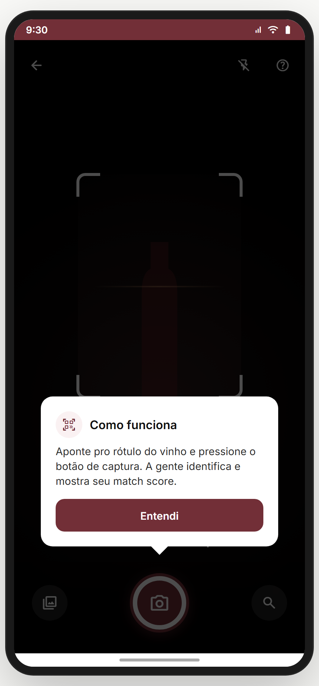 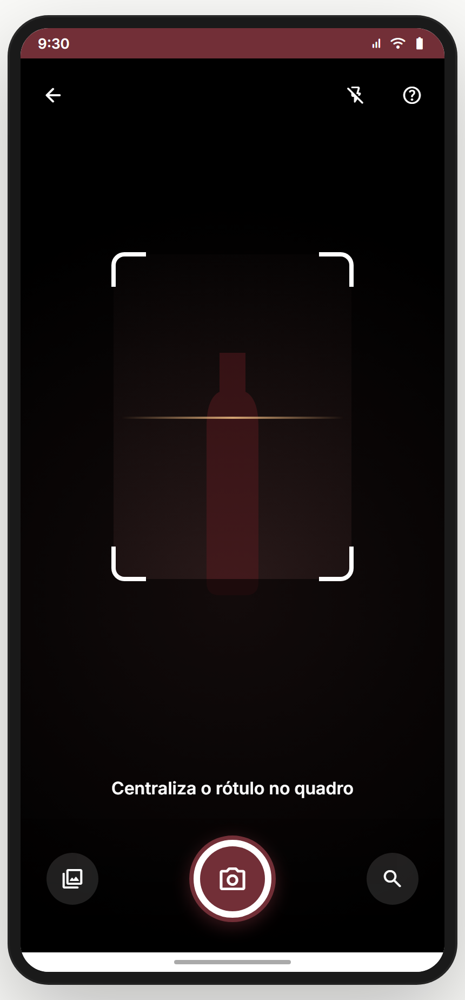 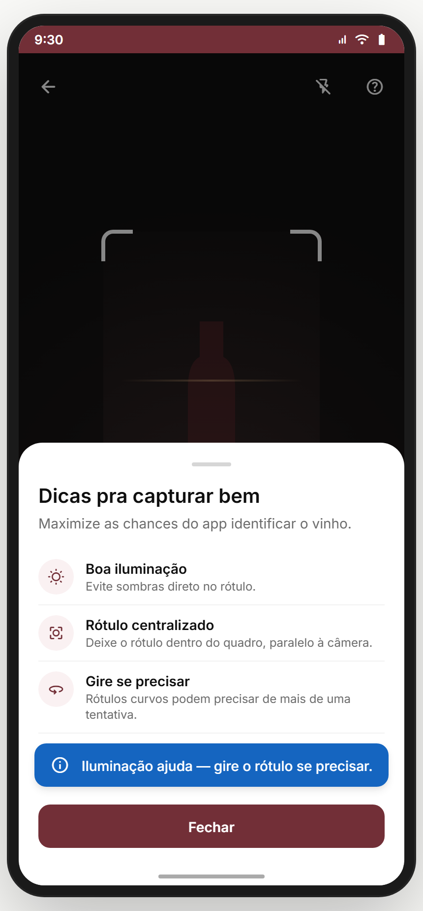

**Propósito:** versão legada do scanner. Documentado por completude — **a recomendação ainda é aposentar** (ver 06.0).

**Tooltip first-use** (`showTip`, persistido em `tc:scanner:firstUse`):
- Aparece **uma única vez** no primeiro acesso ao scanner.
- Card branco ancorado ao botão de captura com triângulo apontando pra ele.
- H3 "Como funciona" + body "Aponte pro rótulo do vinho e pressione o botão de captura. A gente identifica e mostra seu match score." + CTA "Entendi".

**Help sheet** (`showHelp`, modal sheet acionado pelo botão `?` no canto superior direito):
- H2 **"Dicas pra capturar bem"** + body "Maximize as chances do app identificar o vinho."
- 4 dicas com ícone + título + descrição:
  - ☀️ **Boa iluminação** — "Evite sombras direto no rótulo."
  - 🎯 **Rótulo centralizado** — "Deixe o rótulo dentro do quadro, paralelo à câmera."
  - 🔄 **Gire se precisar** — "Rótulos curvos podem precisar de mais de uma tentativa."
  - ✏️ **Não achou?** — "Use a busca pelo nome no canto inferior."
- CTA "Fechar".

> **⚠️ DIVERGÊNCIA — o tooltip aparece no v1 mas NÃO no v2.** No v2 a equivalência é o **tutorial conversacional** registrado (`scanner` no `TUTORIAL_REGISTRY`, ver seção **Tutoriais** abaixo).

---

## 06.0c Tutoriais conversacionais (TchinTutor overlays) ✅

Há **2 tutoriais registrados** no `TUTORIAL_REGISTRY` que disparam automaticamente quando o usuário entra em rotas alvo *e* o tutorial ainda **não foi feito** (`tc.tutor.done` localStorage). Renderizado como overlay full-screen pelo componente `TchinTutor`. Trigger é gerenciado por `prototype.jsx` (mapa de rotas → tutorial id).

### Tutorial `scanner` (auto-trigger em `scanner` e `scanner-v2`) — 3 steps

_Intro · Step 1 (centraliza o rótulo) · Step 2 (ficha completa) · Step 3 (registrar):_

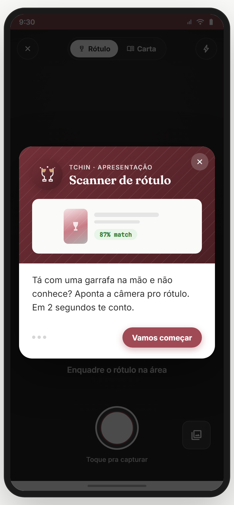 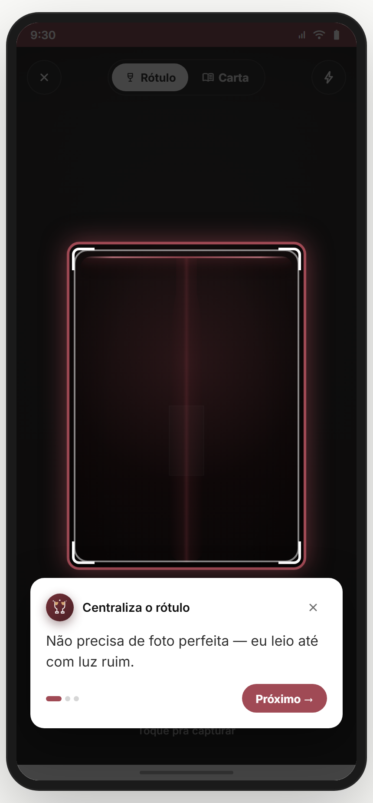 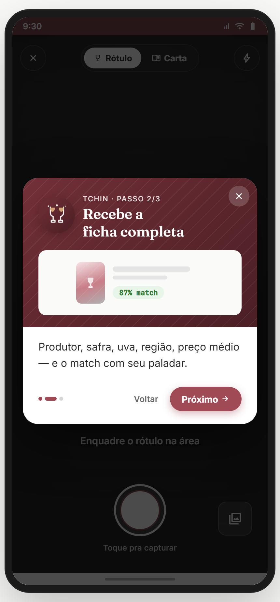 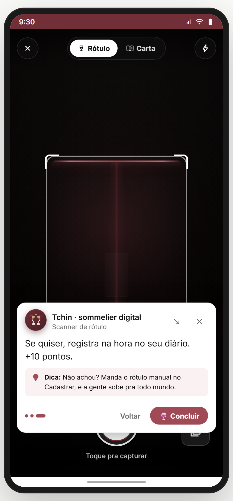

- **Intro** (variant `intro`, accent `#A04A55` burgundy): card hero **"Scanner de rótulo"** + intro body **"Tá com uma garrafa na mão e não conhece? Aponta a câmera pro rótulo. Em 2 segundos te conto."** + mockup mini de wine card "87% match" + CTA **"Vamos começar"**.
- **Step 1** (variant `spotlight`, anchor `scanner-frame`): destaca o guide rectangle do viewfinder + title **"Centraliza o rótulo"** + body **"Não precisa de foto perfeita — eu leio até com luz ruim."** + `pista: 'glow'` (auréola animada). Footer: "Voltar" · "Próximo".
- **Step 2** (variant `hero`): card grande com ilustração `TutorIllustrationBottle` + title **"Recebe a ficha completa"** + body **"Produtor, safra, uva, região, preço médio — e o match com seu paladar."**.
- **Step 3** (variant `bubble`): bubble curto + body **"Se quiser, registra na hora no seu diário. +10 pontos."** + `tip: "Não achou? Manda o rótulo manual no Cadastrar, e a gente sobe pra todo mundo."` + CTA final **"🍷 Concluir"**.

### Tutorial `modo-restaurante` (auto-trigger em `modo-restaurante`) — 4 steps

_Intro · Step 1 (bate foto) · Step 2 (leio cada linha) · Step 3 (multi-foto) · Step 4 (resultado):_

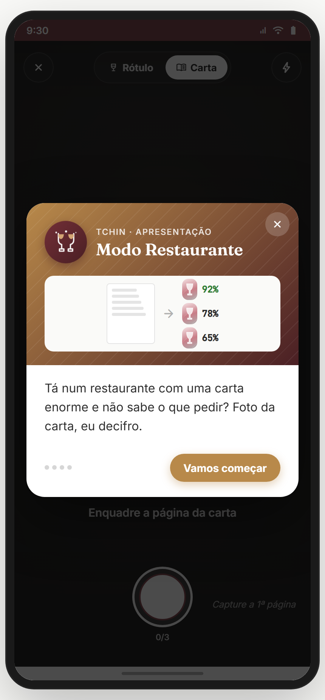 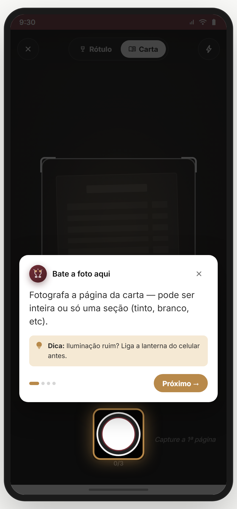 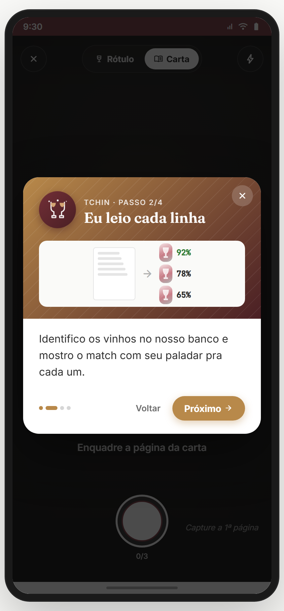 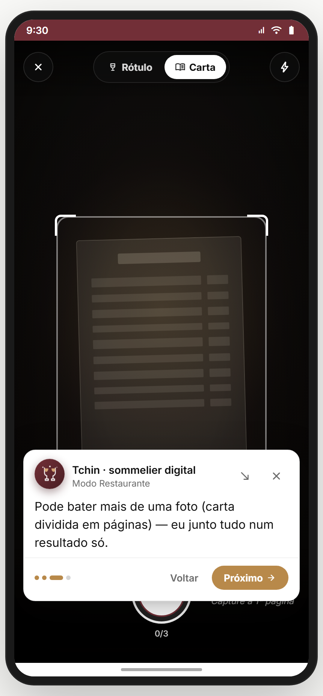 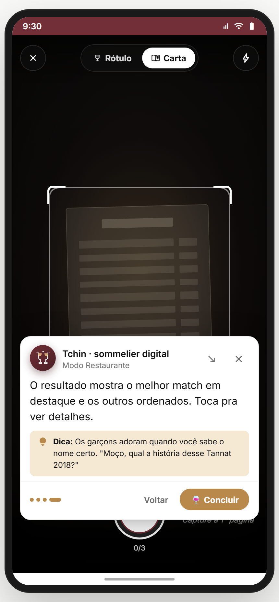

- **Intro** (accent ambar `#B8894A`, gradient ambar→burgundy): hero **"Modo Restaurante"** + intro **"Tá num restaurante com uma carta enorme e não sabe o que pedir? Foto da carta, eu decifro."** + ilustração `TutorIllustrationCarta` + mockup mini de 3 matches (92%, 78%, 65%).
- **Step 1** (variant `spotlight`, anchor `restaurante-capture`): destaca o capture button + title **"Bate a foto aqui"** + body **"Fotografa a página da carta — pode ser inteira ou só uma seção (tinto, branco, etc)."** + `tip: "Iluminação ruim? Liga a lanterna do celular antes."`.
- **Step 2** (variant `hero`): ilustração + title **"Eu leio cada linha"** + body **"Identifico os vinhos no nosso banco e mostro o match com seu paladar pra cada um."**.
- **Step 3** (variant `bubble`): **"Pode bater mais de uma foto (carta dividida em páginas) — eu junto tudo num resultado só."**
- **Step 4** (variant `bubble`): **"O resultado mostra o melhor match em destaque e os outros ordenados. Toca pra ver detalhes."** + tip irônico/humorado **"Os garçons adoram quando você sabe o nome certo. 'Moço, qual a história desse Tannat 2018?'"**.

**Persistência:** ao concluir (ou tocar X), o id é salvo em `tc.tutor.done` (Module 02.7 documenta o sistema). Reaparece se usuário reseta tutoriais via `tutoriais` hub.
**Analytics (recomendado):** `tutorial_start { id }`, `tutorial_step { id, step }`, `tutorial_complete { id }`, `tutorial_dismiss { id, step }`.

> **⛔ FALTA NO APP (épico pede):** **tutorial para `scanner-fallback`** — quando rola fallback várias vezes (3+), TchinDuo/Tchin oferece ajuda contextual ("Posso te ensinar a usar de outra forma?"). Backlog **TUT-FALLBACK-COACH**.
> **⛔ FALTA NO APP (épico pede):** **tutorial pra `porque-combina`** — explicar o radar 5D e como interpretar gap entre paladar usuário × vinho. Backlog **TUT-APRENDA-BEB**.

---

## 06.1 `scanner-v2` — Viewfinder canônico (20.01) ✅

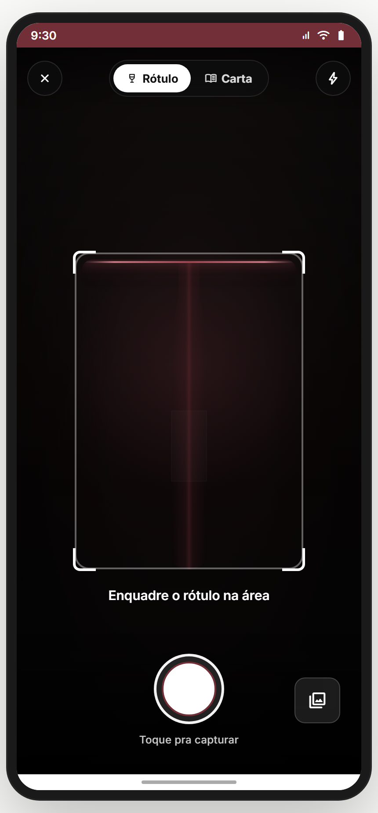

**Propósito:** capturar foto do rótulo (ou carta) e enviar pro OCR. Estado **idle** mostra viewfinder com guia visual; **processing** mostra spinner; **denied** mostra empty state. **US-12-2-04 + US-13-1-01.**
**Entradas:** "Escanear rótulo" (Descobrir hero card / Marketplace CTA / FAB do `?`). **Saídas:** sucesso → `scanner-result-v2`; falha → `scanner-fallback`; toggle "Carta" → `modo-restaurante`.

**Layout (`Scanner`):**
- Tela cheia preta (`#000` background).
- **Top bar overlay**: ícone close + toggle **"Rótulo / Carta"** (chip pill) + ícone flash (toggle on/off) + ícone help.
- **Guide rectangle**: dimensões variam por modo:
  - Rótulo (`label`): **220×300** (proporção de garrafa).
  - Carta (`menu`): **280×420** (mais alto pra cardápio).
  - Cantos brancos animados (4× 32×32, border 4px) + linha guia animada `tcScannerLine`.
  - Outline branco 3px quando "capturing".
- **Texto helper**: "Centraliza o rótulo no quadro" (rótulo) ou "Enquadre a carta toda na área" (carta).
- **Bottom controls**:
  - Botão lateral **galeria** (`photo_library`) — escolher foto existente.
  - **Capture button 80×80** (burgundy outline + círculo p700 interno + ícone `camera_alt`).
  - Botão lateral **busca** (`search`) — atalho pra `busca`.

**Estados:**
- **`idle`** — viewfinder live + cantos brancos + linha guia animada.
- **`processing`** — overlay com spinner (`tcScannerSpin` 1.4s) + texto "Identificando o vinho…"
- **`denied`** — empty state: ícone `camera_alt` n400 + "Acesso à câmera negado" + body "Pra escanear precisamos da sua câmera. Liberar nas Configurações do app." + CTA "Permitir acesso".

**Estado/persistência:** state interno (`idle`, `currentMode`, `flash`). Em produção, integração real com `getUserMedia({ facingMode: 'environment' })`.
**Analytics:** `scanner_open { mode }`, `scanner_capture { mode }`, `scanner_flash_toggle`, `scanner_mode_change { from, to }`, `scanner_gallery_pick`, `scanner_permission_denied`.

> **⚠️ DIVERGÊNCIA — câmera real desligada por padrão** (`useCamera: false`). Em produção precisa ativar + tratar permission flow real.
> **⚠️ DIVERGÊNCIA — captura simulada** (timeout 1.8s + decisão random 70/30 sucesso/falha no v1). Em produção: envia blob pro endpoint `/api/scan/label` ou `/api/scan/menu`.
> **⛔ FALTA NO APP (épico pede):** **calibração da câmera** (correção de paralaxe, perspectiva, sombra). Backlog **SCAN-CAM-CALIB**.
> **⛔ FALTA NO APP (épico pede):** **histórico recente** (últimos 5 vinhos escaneados acessíveis do header do scanner). Backlog **SCAN-HISTORY**.

**Status:** ✅ (UI canônica; backend OCR + permission flow são bloqueadores GA)

---

## 06.2 `scanner-result-v2` — Aprenda Bebendo: Rótulo identificado (20.02) ✅

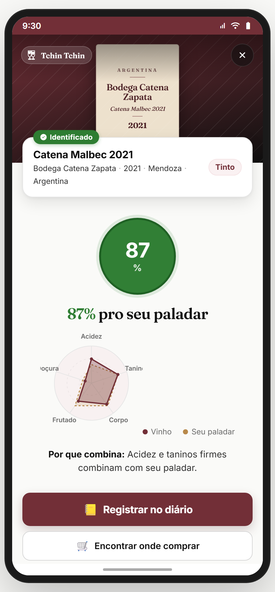

**Propósito:** mostrar o vinho identificado + **match score grande** + **radar 5D sobreposto (você × vinho)** + **explicação "Por que combina"** + 4 ações (registrar / comprar / perguntar / refazer). É o coração do "**Aprenda Bebendo**" no contexto rótulo. **US-12-2-04 + US-T3-01.**
**Entradas:** `scanner-v2` → captura ok. **Saídas:** "Registrar no diário" → `registro-rapido`; "Encontrar onde comprar" → `marketplace`; "Perguntar pra confraria" → `comunidade`; "Refazer paladar" → `quiz`; close → back.

**Layout (`ResultadoScan`):** 5 zonas verticais.

**Zone 1 — Identificação:**
- Card branco: chip verde **"✓ Identificado"** + Card de vinho horizontal (label/marca/safra/região/tipo).
- Botão close (×) no canto superior direito.
- Pill mono "Tchin Tchin" no topo esquerdo.

**Zone 2 — Match Score (grande, central):**
- **Círculo verde s700 96×96** com **"{score}%"** em branco gigante.
- Texto sub: **"{score}% pro seu paladar"** *(adaptativo: ≥80 verde, ≥60 amarelo, <60 cinza)*.
- **Radar 5D 200×200** com 2 polígonos sobrepostos:
  - **Seu paladar** (sólido p700).
  - **Perfil do vinho** (tracejado a700, dashed).
- Legenda: dois `LegendDot` (Vinho · Seu paladar).
- **"Por que combina:"** + frase curta — *"Acidez e taninos firmes combinam com seu paladar."* *(vem do param `explanation`; em produção gerado pelo backend baseado nas 5 dimensões.)*

**Zone 3 — Ações** (vertical, gap 10):
- Primária burgundy **"Registrar no diário"** (`bookmark_add`).
- Secundária **"Encontrar onde comprar"** (`shopping_bag`).
- Ghost **"Perguntar pra confraria"** (`forum`).
- Link discreto **"Não é esse — escanear de novo"**.

**Estados:**
- **Padrão (usuário tem paladar):** mostra match real.
- **Sem paladar (`!userHasPaladar`):** esconde círculo de match, mostra card **"Faça o quiz pra ver o quanto combina"** + CTA `onTakeQuiz` → `quiz`.
- **Match baixo (<60):** mantém zona 2 mas com cor n400 e tom "Tem características diferentes, mas pode te surpreender".

**Estado/persistência:** props vêm do callback `onCapture`. Match e profile são mock no protótipo.
**Analytics:** `scan_result_view { wineId, score, hasPaladar }`, `scan_result_register`, `scan_result_buy`, `scan_result_ask_confraria`, `scan_result_retake`, `scan_result_close`.

> **⚠️ DIVERGÊNCIA — radar e profile do vinho são mock** (campos `wine.profile` hard-coded). Backend precisa servir esses dados.
> **⚠️ DIVERGÊNCIA — explicação curta hard-coded.** Em produção: serviço de **NLG** (Natural Language Generation) que gera a frase com base nas dimensões diff (paladar usuário × vinho).
> **⛔ FALTA NO APP (épico pede):** **alternativas similares** ("se esse não, esses 3 também combinam"). Backlog **SCAN-RESULT-ALTS**.
> **⛔ FALTA NO APP (épico pede):** **avaliação rápida ao vivo** ("Provei agora — gostei? 👍/👎") sem precisar abrir `registro-rapido`. Backlog **SCAN-RESULT-RATE-INLINE**.

**Status:** ✅ (UI canônica; backend de score + explicação NLG pendente)

---

## 06.3 `scanner-fallback` — Não identificou (20.03) ✅

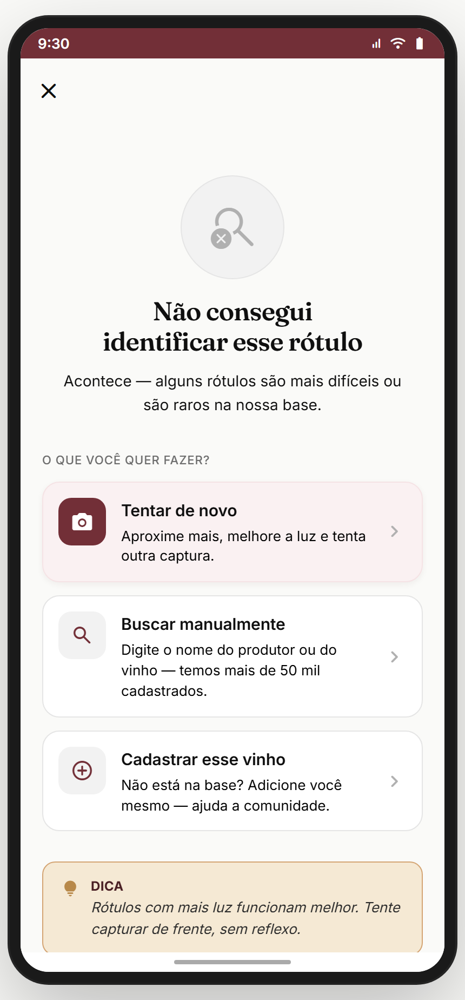

**Propósito:** scan falhou no OCR/match. Oferece **3 caminhos claros** sem culpar o usuário. **US-12-2-03.**
**Entradas:** `scanner-v2` → backend não bate o rótulo. **Saídas:** "Tentar de novo" → `scanner-v2`; "Buscar manualmente" → `busca`; "Adicionar este vinho à base" → `registro-completo`; close → back.

**Layout (`FallbackScanner`):**
- Header sem fundo (transparent) + ícone close (×).
- **Hero centralizado**: foto capturada (96×96 com overlay escuro + ícone `search_off`) OU ícone `search_off` 48 n400 num círculo n100.
- H2 **"Não conseguimos identificar"** + body **"A foto pode estar com pouca luz, o rótulo amassado, ou esse vinho ainda não está na nossa base."**
- **3 cards de ação** (verticais, gap 12):
  - **"Tentar de novo"** (ícone `refresh`, primário) — refaz a foto.
  - **"Buscar manualmente"** (ícone `search`, secundário) — abre `busca` com filtro escopado em vinhos.
  - **"Adicionar à nossa base"** (ícone `library_add`, ghost) — abre `registro-completo` pra usuário cadastrar manualmente *(ganha 50 pontos quando vira contribuição validada — backlog)*.

**Tom UX (canônico):** "errar é OK". Nunca culpar o usuário; oferecer escape claro.
**Analytics:** `scan_fallback_view`, `scan_fallback_retry`, `scan_fallback_search`, `scan_fallback_add`, `scan_fallback_close`.

> **⛔ FALTA NO APP (épico pede):** **sugestão "Você quis dizer X?"** quando o OCR pega um nome próximo a algo na base. Backlog **SCAN-FB-FUZZY**.
> **⛔ FALTA NO APP (épico pede):** **gamificação** "Você acaba de contribuir pra base!" + bônus de pontos quando o usuário adiciona via `registro-completo`. Backlog **SCAN-FB-GAMIFY**.

**Status:** ✅

---

## 06.4 `modo-restaurante` — Captura de carta (23.01) ✅

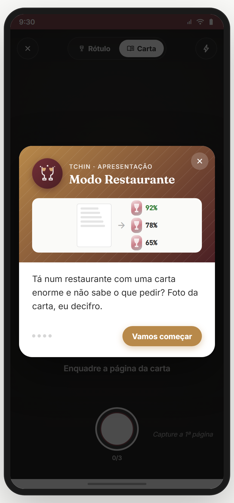

**Propósito:** capturar **até 3 fotos** de páginas de carta de restaurante. Envia tudo pro OCR + matching. **US-13-1-01.** *(Toggle "Carta" do scanner-v2 navega pra cá.)*
**Entradas:** `scanner-v2` → toggle "Carta"; deep link. **Saídas:** "Pronto, processar" → `carta-matches`; toggle "Rótulo" → volta a `scanner-v2`; close → back.

**Layout (`ModoRestaurante`):**
- Tela cheia preta (#000).
- Top bar com close + chip toggle **"Rótulo / Carta"** (já em Carta).
- **Guide retangular maior** (280×420 — proporção retrato de cardápio).
- Helper: **"Enquadre a carta toda na área"**.
- **Strip de thumbnails** abaixo do guide (depois da 1ª foto): mostra páginas capturadas (1, 2, 3 max) com animação `tcMrThumbIn`. Tap em thumb → reabre/refaz.
- **Capture button** burgundy (80dp).
- **CTA "Pronto, processar"** aparece após 1ª foto (estado `idle` com pages > 0).
- Estado **`processing`**: barra de progresso (0-100%) + texto "Lendo a carta…"

**Estados:**
- **`idle` (0 fotos):** viewfinder + helper.
- **`idle` (1-3 fotos):** + strip + CTA "Pronto, processar".
- **`idle` (3 fotos = max):** capture button **disabled** (opacity 0.4) + helper "Máximo 3 páginas".
- **`processing`:** barra progresso + spinner + após terminar callback `onProcess(pages)` → `carta-matches`.

**Estado/persistência:** `pages[]` em state. Em produção: cada foto vira blob → backend processa em paralelo + retorna lista unificada de matches.
**Analytics:** `menu_scan_open`, `menu_scan_capture { pageIndex }`, `menu_scan_remove_page { pageIndex }`, `menu_scan_process { pageCount }`, `menu_scan_back_to_label`.

> **⚠️ DIVERGÊNCIA — captura simulada** (sem `getUserMedia` real).
> **⛔ FALTA NO APP (épico pede):** **modo "lista digitada"** — se a foto não rola (luz baixa do restaurante), permite digitar a lista de vinhos manualmente. Backlog **MENU-SCAN-MANUAL**.
> **⛔ FALTA NO APP (épico pede):** **OCR em foto cruzada/inclinada** (cardápio fixo na mesa, foto em ângulo). Modelo precisa ser robusto a perspectiva. Backlog **MENU-SCAN-PERSPECTIVE**.

**Status:** ✅

---

## 06.5 `carta-matches` — Vinhos identificados na carta (23.02) ✅

_Por match (default) · Por preço · Por tipo:_

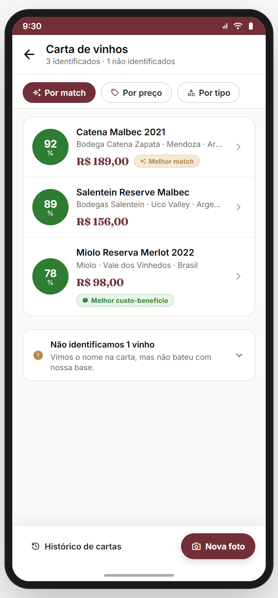 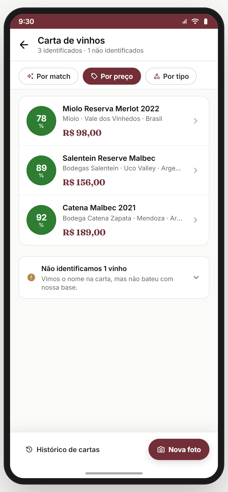 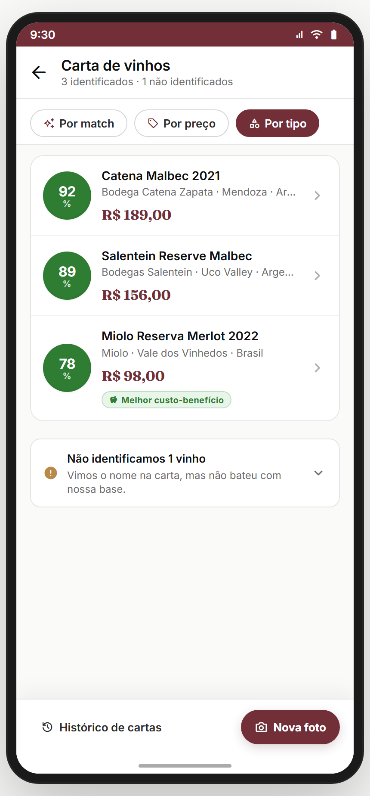

**Propósito:** resultado do OCR + matching da carta. Lista os **identificados** com score (ordenado por match) + bloco separado dos **não identificados** (texto cru lido na carta). **US-13-1-01.**
**Entradas:** `modo-restaurante` → "Pronto, processar". **Saídas:** tap em vinho → `porque-combina { wine, price }`; "Nova foto" → `modo-restaurante`; "Histórico de cartas" → backlog *(placeholder)*; back → `modo-restaurante`.

**Layout (`CartaMatches`):**
- Header: back + título **"Carta de vinhos"** + sub "{N} identificados · {M} não identificados".
- **Chips de ordenação** (horizontal, sticky):
  - **"Por match"** (✨, default — burgundy).
  - **"Por preço"** (🏷️).
  - **"Por tipo"** (🔷).
- **Lista de identificados** (cards horizontais com sombra):
  - Círculo verde grande com **score%** (verde p700 ≥80, amarelo a700 ≥60, cinza n400 <60).
  - Nome + producer · região · país (truncado com `...`).
  - **Preço da carta** (vem do OCR — não preço médio do app).
  - Badge contextual: **"Melhor match"** (highest match), **"Melhor custo-benefício"** (melhor relação match/preço).
  - Chevron à direita.
- **Não identificados** (card colapsável, padrão recolhido):
  - Ícone amber `error_outline` + **"Não identificamos {N} vinho(s)"** + sub "Vimos o nome na carta, mas não bateu com nossa base."
  - Expandir mostra a lista com `rawText` (ex.: "Tannat Reserva 2019") + CTA "Buscar manualmente" por item.
- **Bottom**: link "Histórico de cartas" + CTA primária **"Nova foto"** (`photo_camera`).

**Estado/persistência:** props `identified[]`, `unidentified[]`. Em produção: tudo vem do callback `onProcess` do modo-restaurante.
**Analytics:** `menu_matches_view { identifiedCount, unidentifiedCount }`, `menu_matches_sort_change { sort }`, `menu_matches_tap_wine { id, position }`, `menu_matches_expand_unidentified`, `menu_matches_search_manual { rawText }`, `menu_matches_new_photo`.

> **⛔ FALTA NO APP (épico pede):** **histórico de cartas** persistente (todas as cartas que o usuário já escaneou + matches) — entry point existe ("Histórico de cartas") mas é placeholder. Backlog **MENU-HISTORY**.
> **⛔ FALTA NO APP (épico pede):** **compartilhar com confraria** ("Olha o que tem na carta — alguém topa esse?"). Backlog **MENU-SHARE-CONFRARIA**.
> **⛔ FALTA NO APP (épico pede):** **memorizar restaurante** (carta vinculada a um lugar + lookup por GPS na próxima visita). Backlog **MENU-RESTAURANT-ANCHOR**.

**Status:** ✅

---

## 06.6 `porque-combina` — Aprenda Bebendo: explicação detalhada (23.03) ✅

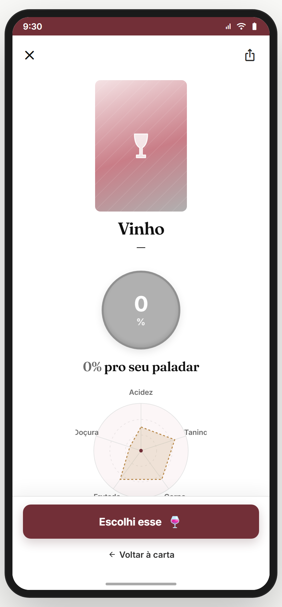

**Propósito:** explicar **por que esse vinho combina (ou não) com você** — núcleo do "**Aprenda Bebendo**". Dimensão por dimensão, com radar grande e tom didático. Bridge entre o "match score" e o aprendizado real sobre paladar. **US-T3-01.**
**Entradas:** `carta-matches` → tap num vinho identificado; `scanner-result-v2` → atalho. **Saídas:** "Escolhi esse" → `registro-rapido`; "Compartilhar" → share sheet; "Voltar pra carta" → back.

**Layout (`PorQueCombina`):**
- Header com back + título do vinho + chip de match grande à direita.
- **Wine card** com bottle placeholder + nome/producer/safra/tipo.
- **Radar 5D grande** (260×260, eixos labeled): polígono sólido p700 (você) + tracejado a700 (vinho).
- **Breakdown dimensão por dimensão** — pra cada eixo (Acidez, Tanino, Corpo, Frutado, Doçura):
  - Barra horizontal mostrando **gap**: usuário (p700) vs vinho (a700), com setas indicando o diff.
  - Microtexto **adaptativo por gap**:
    - Gap 0-15: "Bem alinhado com você."
    - Gap 16-30: "Um pouco mais [intenso/suave] do que você costuma."
    - Gap 31+: "Bem mais [intenso/suave] — pode ser uma descoberta."
- **Box "Por que combina"** (bg p50): explicação NLG longa com 2-3 frases combinando os pontos fortes e fracos.
- **Bottom CTAs**:
  - Primária **"Escolhi esse"** → `registro-rapido`.
  - Ghost **"Compartilhar"** (ícone share).
  - Ghost **"Voltar pra carta"** → back.

**Variação por experiência:**
- `evaluationCount === 0` (usuário novo, 0 vinhos no diário): mostra dica didática extra **"Primeira vez? A gente aprende junto — depois de 5 vinhos registrados, o match fica muito mais preciso."**
- `evaluationCount > 5`: tom mais conciso, sem dicas explicativas.

**Estado/persistência:** props vêm do `carta-matches`. `userProfile` e `userExperience` vêm do ctx.
**Analytics:** `aprenda_bebendo_view { wineId, gap, experienceTier }`, `aprenda_bebendo_register`, `aprenda_bebendo_share`, `aprenda_bebendo_back_to_carta`.

> **⚠️ DIVERGÊNCIA — texto NLG hard-coded** por gap. Em produção: backend NLG real considera personalidade do usuário (formal/casual), histórico, e gera variação.
> **⚠️ DIVERGÊNCIA — `userExperience.evaluationCount`** vem do `ctx.diary.length` no protótipo (não é tier real). Em produção: serviço de gamificação calcula tier baseado em XP, ratings, posts.
> **⛔ FALTA NO APP (épico pede):** **integração com Treine seu Paladar (Módulo 08)** — "Quer treinar acidez? Faça a lição de 90s." Backlog **APREND-BEB-TREINO-CTA**.
> **⛔ FALTA NO APP (épico pede):** **histórico de "Aprenda Bebendo"** ("Vinhos que você viu nessa tela e ainda não provou"). Backlog **APREND-BEB-HISTORY**.
> **⛔ FALTA NO APP (épico pede):** **alternativas inteligentes** — se o gap é muito grande, sugerir 2-3 vinhos com menos gap. Backlog **APREND-BEB-ALTS**.

**Status:** ✅

---

## Componentes transversais
- **`Scanner`** (`f20_01_Scanner.jsx`) — base reusada pelo scanner-v2 e modo-restaurante (diferindo só na prop `mode`).
- **`ProfileRadar`** (`f20_02_ResultadoScan.jsx`) — radar 5D customizado com 2 polígonos sobrepostos. Distinto do `PaladarRadar` (do Módulo 03) — pode unificar no futuro.
- **`MatchToneColor`** — função util que decide cor por tier (verde ≥80, amarelo ≥60, cinza <60). Reusada em todos os módulos com match.
- **`FauxLabel`** — placeholder ASCII-style do rótulo (`f20_02_ResultadoScan.jsx`).

## Edge cases & navegação reversa
- **Permission denied real** (Android/iOS): app cai no estado `denied` → empty state. Botão "Permitir acesso" precisa abrir Settings nativo (intent/x-callback-url). Hoje só re-toca o effect.
- **Foto muito borrada / cortada:** backend deve retornar low_confidence → mostra warning amber no result. Hoje só `confidence: 'low'` no v1.
- **OCR demora** (>3s): scanner-v2 fica em "processing" — sem feedback de "ainda tô tentando". **Backlog SCAN-LONG-PROCESS** (timeout 8s + retry / cancel).
- **3 fotos seguidas mesma página** (modo restaurante): backend deduplica? Hoje não.
- **Sair do scanner no meio** (Ctrl+W, back): `getUserMedia` track precisa ser fechada via `stream.getTracks().forEach(t => t.stop())` — implementado no v2.
- **Navegar pra `scanner-v2` sem ter paladar:** result-v2 cai na variante "Faça o quiz" — comportamento correto.

## Pendências de backend / decisões do Gabriel

### Críticas (bloqueadores GA)
- **OCR + matching reais** — endpoint `/api/scan/label` e `/api/scan/menu` com modelo treinado em rótulos brasileiros + internacionais.
- **NLG real da "Por que combina"** — geração de texto baseada nas dimensões.
- **`useCamera: true`** ativado + permission flow Android/iOS.
- **Base de vinhos populada** — sem isso, o fallback é o estado padrão.

### Importantes (próximas sprints)
- Histórico de cartas + restaurantes salvos (GPS lookup).
- Sugestão fuzzy match ("Você quis dizer X?").
- Integração `porque-combina` → Treine seu Paladar (Módulo 08).
- Modo "lista digitada" do menu quando câmera não funciona.
- Alternativas similares em result-v2 e porque-combina.

### Decisões do Gabriel
- Aposentar formalmente v1 do scanner ou manter como fallback?
- Pontuação por contribuir vinho à base — quanto? validação humana ou automática?
- Compartilhar carta com confraria — público ou só pro grupo?
- Limite de 3 páginas por carta — aumentar?

## Conexões com outros módulos
- **Módulo 03 (Meu Paladar)** — usuários sem paladar veem CTA "Faça o quiz" no result-v2 e porque-combina.
- **Módulo 04 (Marketplace/Wine)** — "Encontrar onde comprar" rota.
- **Módulo 07 (Adega/Diário)** — "Registrar no diário" rota.
- **Módulo 08 (Treine seu Paladar)** — backlog: link cruzado de porque-combina pra lição relevante.
- **Módulo 11 (Confrarias)** — "Perguntar pra confraria" rota.
