# Módulo 07 — Adega, Diário & Estante

> **Dor 3 do relatório:** "memória fragmentada do que provou". Solução: a **Adega** é o acervo pessoal do usuário, com 4 visões — **Estante** (rack visual interativo 🆕), **Diário** (timeline de registros), **Indicadores** (estatísticas) e **Paladar** (radar 5D). O **registro** tem fluxo rápido (15s) e completo. Fecha com **relatório mensal** estilo "Wrapped" + **favoritos**.
> **Fonte de verdade:** `screens-app.jsx` (AdegaScreen + EstanteTab + DiarioTab + IndicadoresTab + PaladarTab + FavoritosScreen), `screen-register.jsx` (RegisterConsumoScreen 2 passos), `f18_01_RegistroRapido.jsx`, `f18_02_RegistroCompleto.jsx`, `f18_03_ConfirmacaoRegistro.jsx`, `f17_04_RelatorioMensal.jsx`. Doc funcional: **MVP1 Épico 7** + **Sprint 11-13 Épico T2**.
> **Épicos/US:** US-DIARIO-01 (registrar consumo), US-DIARIO-02 (timeline + busca), US-ADEGA-01 (Estante visual 🆕), US-IND-01 (indicadores), US-PAL-01 (perfil paladar evolutivo), US-REL-01 (relatório mensal), US-FAV-01 (favoritos).

**Regra de negócio canônica:** registrar um vinho dá **+10 pontos** (gamificação). O paladar **evolui automaticamente a cada 5 vinhos** registrados. Indicadores **desbloqueiam com 3 registros** (gate anti-tela-vazia). A Estante 🆕 substituiu a antiga `AdegaVazia` — usuário novo já cai num rack interativo pra "colocar" vinhos. Persistência da sessão em `window.__tcCellar` (estante) e `ctx.diary` (registros).

## Mapa do fluxo
```
home/adega ─┬─ aba Estante 🆕 (rack interativo) ─ tap slot vazio → MultiSelectWines → preenche
            ├─ aba Diário (timeline + busca + stats)
            ├─ aba Indicadores (donut/timeline/uvas — gate 3 registros)
            └─ aba Paladar (radar 5D + evolução)
            │
            ├─ header: "Adicionar" → register-consumo (2 passos)
            ├─ header: library_add → MultiSelectWines (adicionar vários)
            └─ header: ♡ → favoritos

register-consumo (2/2) ─ passo1 escolher vinho (busca/scan/manual) → passo2 avaliar → home/adega
registro-rapido (~15s) ─ "Modo completo" → registro-completo → registro-confirmacao (+pontos)
relatorio-mensal (Wrapped) ─ scroll storytelling → "Compartilhar nas redes"
```

---

## 07.1 `home/adega` — Shell com 4 abas ✅

_Estante 🆕 · Diário · Indicadores · Paladar:_

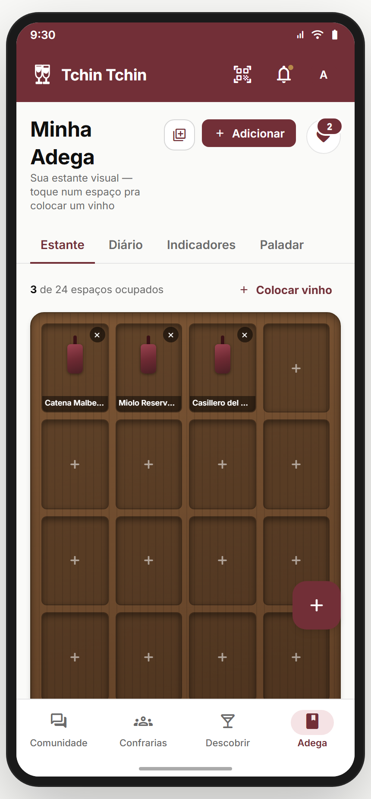 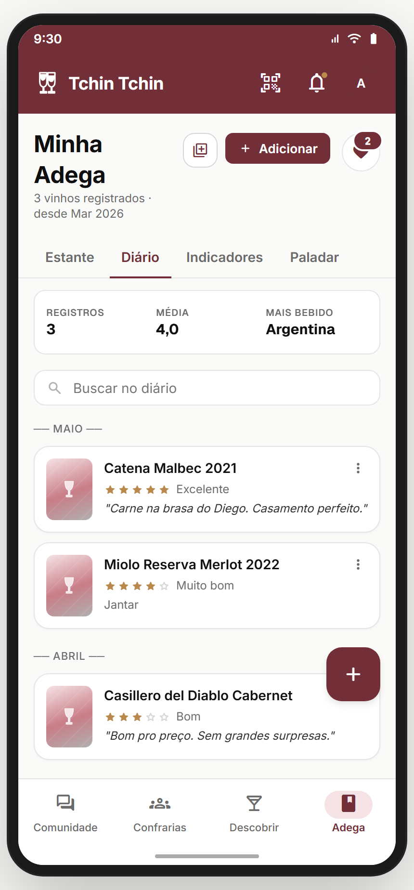 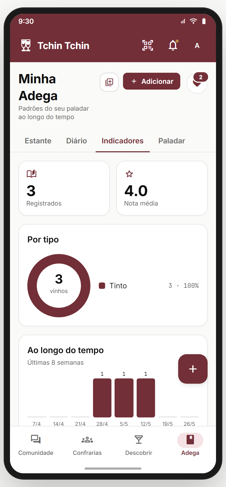 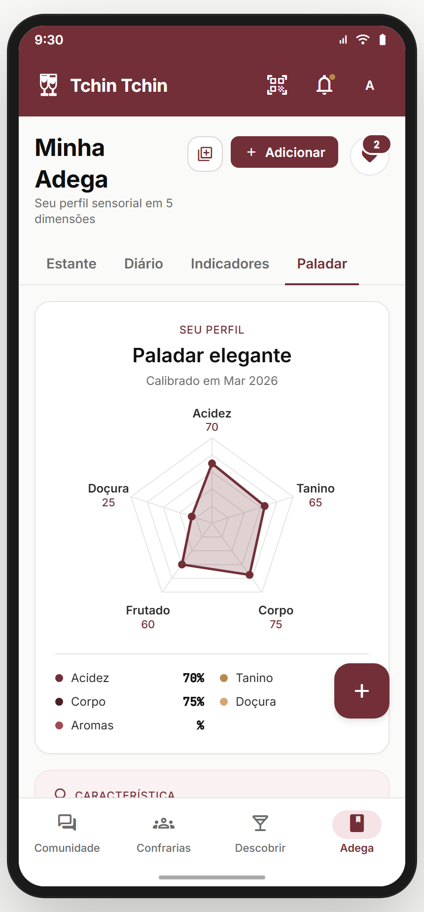

**Propósito:** acervo pessoal de vinhos com 4 visões. **Estante é a aba default** (decisão de produto Fase 3). **US-ADEGA-01.**
**Entradas:** bottom nav "Adega"; pós-registro (`registro-confirmacao` → "Continuar"). **Saídas:** `register-consumo`, `favoritos`, `wine`, `quiz` (refazer paladar), `descobrir`.

**Layout (`AdegaScreen`):**
- Header: H1 **"Minha Adega"** + subtítulo dinâmico por aba (ex.: Estante = "Sua estante visual — toque num espaço pra colocar um vinho"; Diário = "{N} vinhos registrados · desde {data}").
- Botões do topo (sempre visíveis): `library_add` (adicionar vários → MultiSelectWines), **"Adicionar"** primária (→ `register-consumo`), ♡ favoritos (com badge de contagem).
- Tab bar: **Estante · Diário · Indicadores · Paladar** (underline burgundy na ativa).
- Body renderiza o tab component.

**Analytics:** `adega_view { tab }`, `adega_tab_change { tab }`, `adega_add_click`, `adega_multiadd_click`, `adega_favorites_click`.

---

## 07.2 Aba **Estante** 🆕 — Rack visual interativo (`EstanteTab`) ✅

**Propósito:** representação **visual** da adega como um **rack de madeira** com cubículos. Cada vinho ocupa um slot; slots vazios abrem o seletor. É o destaque 🆕 da Fase 3 — substituiu a tela `AdegaVazia`. **US-ADEGA-01.**
**Entradas:** aba default da Adega. **Saídas:** tap em slot preenchido → `wine`; tap em slot vazio → `MultiSelectWines` (colocar na estante); "Colocar vinho" (topo).

**Layout:**
- Contador: **"{filled} de {N} espaços ocupados"** + link "Colocar vinho".
- **Banner de boas-vindas** (só quando `filled === 0`): "Sua adega está vazia. **Toque num espaço** da estante pra colocar seu primeiro vinho." — primeiro slot pisca (`tcBreath` animation, border dourada).
- **Rack de madeira**: grid 4 colunas, `gap 8`, fundo com gradiente marrom (`#7C5635 → #573922`) + textura de listras verticais + sombra interna (efeito de profundidade do cubículo). Mínimo 24 slots, cresce de 4 em 4.
  - **`EmptySlot`**: cubículo escuro com ícone `+` translúcido; highlight dourado no primeiro quando vazio.
  - **`FilledSlot`**: garrafa estilizada em pé (gargalo + corpo com gradiente burgundy) + label do vinho na base (fundo escuro) + botão `×` (tirar da estante) no canto.

**Interação:** tap em vazio → seletor multi-select; tap em cheio → detalhe do vinho; `×` → remove (sem confirmação). Auto-preenche da `ctx.diary` na primeira montagem.
**Estado/persistência:** `window.__tcCellar` (array de slots, persistente na sessão). **Perde no refresh** *(ver divergência)*.
**Analytics:** `cellar_view { filled, total }`, `cellar_slot_add { index }`, `cellar_slot_open { wineId }`, `cellar_slot_remove { index }`.

> **⚠️ DIVERGÊNCIA — persistência só na sessão** (`window.__tcCellar`). **Crítico:** mover pra `tc.cellar` localStorage + backend. Sem isso, a estante zera ao recarregar.
> **⚠️ DIVERGÊNCIA — estante ≠ diário.** Hoje a estante é independente do diário (você pode ter vinho na estante sem registro). Isso confunde: o que é "minha adega"? **Recomendação Gabriel:** definir se Estante = vinhos que possuo (cave física) vs Diário = vinhos que provei. São conceitos diferentes que hoje se misturam.
> **⛔ FALTA NO APP (épico pede):** **quantidade por slot** (tenho 3 garrafas do mesmo). Hoje 1 slot = 1 garrafa. Backlog **CELLAR-QTY**.
> **⛔ FALTA NO APP (épico pede):** **organização por prateleira/região/tipo** (arrastar pra reorganizar). Backlog **CELLAR-ORGANIZE**.
> **⛔ FALTA NO APP (épico pede):** **alerta de consumo ideal** ("esse vinho está no ponto / passando do ponto"). Backlog **CELLAR-DRINK-WINDOW**.

**Status:** ✅ 🆕 (UI inovadora; persistência real + conceito estante/diário pendentes)

---

## 07.3 Aba **Diário** (`DiarioTab`) ✅

**Propósito:** timeline cronológica dos vinhos registrados, com stats no topo + busca. **US-DIARIO-02.**
**Entradas:** aba Diário. **Saídas:** `register-consumo` (vazio); detalhe de registro (`more_vert`).

**Layout:**
- **Empty state** (`diary.length === 0`): ilustração taça+bookmark + H2 "Comece sua história com vinho" + body "Registre o primeiro vinho que você bebeu, com nota e contexto." + CTAs "Registrar primeiro vinho" / "Explorar Marketplace".
- **Com registros:**
  - **`DiarioStatsCard`**: 3 chips — Registros (total) · Média (nota) · Mais bebido (país top).
  - **Busca** ("Buscar no diário") — filtra por nome/producer/nota.
  - **Timeline agrupada** por data inteligente: "Hoje", "Ontem", "{dia} de {mês}" (≤14 dias), "{Mês}" (mais antigo).
  - **`DiaryEntry`** card: bottle + nome + estrelas + label de nota (Excelente/Muito bom/...) + nota (itálico, 2 linhas) ou ocasião + `more_vert`. Badge **"Pendente"** (`cloud_off`) se registro offline não-sincronizado.
- **Empty de busca**: "Nenhum registro para '{query}'".

**Analytics:** `diary_view { count }`, `diary_search { q }`, `diary_entry_open { id }`, `diary_empty_register_click`.

> **⛔ FALTA NO APP (épico pede):** **filtros no diário** (por tipo/país/nota/data). Hoje só busca textual. Backlog **DIARY-FILTERS**.
> **⛔ FALTA NO APP (épico pede):** **editar/excluir registro** (`more_vert` é placeholder). Backlog **DIARY-EDIT**.
> **⛔ FALTA NO APP (épico pede):** **exportar diário** (PDF/CSV — "minha jornada com vinho"). Backlog **DIARY-EXPORT**.
> **⛔ FALTA NO APP (épico pede):** **sincronização offline real** (badge "Pendente" existe, mas sync queue não). Backlog **DIARY-OFFLINE-SYNC**.

**Status:** ✅

---

## 07.4 Aba **Indicadores** (`IndicadoresTab`) ✅

**Propósito:** estatísticas visuais dos padrões de consumo. **Gate: 3 registros mínimos.** **US-IND-01.**
**Entradas:** aba Indicadores. **Saídas:** `register-consumo` (se gate não atingido).

**Layout:**
- **Gate (< 3 registros):** ícone `insights` + H2 "Quase lá" + "Falta(m) X vinho(s) pra desbloquear seus indicadores" + barra de progresso (X/3) + CTA "Registrar vinho".
- **Desbloqueado (≥ 3):**
  - 2 StatCards: Registrados · Nota média.
  - **Donut "Por tipo"** (`TypeDonut` SVG animado) + legenda com % por tipo (Tinto burgundy, Branco dourado, etc.).
  - **Timeline "Ao longo do tempo"** — barras das últimas 8 semanas.
  - **"Por uva"** — top 10 uvas em barras horizontais.

**Analytics:** `indicadores_view { unlocked, total }`, `indicadores_gate_register_click`.

> **⛔ FALTA NO APP (épico pede):** **insights acionáveis** ("Você só bebe tinto — que tal experimentar um branco?"). Hoje só descritivo. Backlog **IND-INSIGHTS-NLG**.
> **⛔ FALTA NO APP (épico pede):** **comparar com a comunidade** ("você bebe mais Malbec que 80% dos usuários"). Backlog **IND-COMMUNITY-BENCH**.
> **⛔ FALTA NO APP (épico pede):** **gasto/investimento** (quanto gastou em vinho no período). Backlog **IND-SPEND**.

**Status:** ✅

---

## 07.5 Aba **Paladar** (`PaladarTab`) ✅

**Propósito:** o **radar 5D** do usuário (cross-ref Módulo 03) + característica dominante + barra de evolução + CTA refazer quiz. **US-PAL-01.**
**Entradas:** aba Paladar. **Saídas:** `quiz` (refazer).

**Layout:**
- **Hero card**: overline "SEU PERFIL" + H2 "Paladar elegante" + "Calibrado em {data}" + **`PaladarRadar` 240px** + grid de 5 dimensões com % (Acidez, Tanino, Corpo, Doçura, Aromas).
- **Card "Característica"** (bg p50): "Você prefere {top} acima da média. Bons primeiros passos: vinhos com estrutura média, taninos polidos e final mineral."
- **Card "Quando seu paladar evolui"**: barra de progresso até o próximo marco (a cada 5 registros) — "Registre mais X pra atualizarmos seu perfil ({total}/{próximo})".
- **Card "Histórico do seu paladar"** (placeholder v2, opacity 0.7): "Em breve você vai poder ver como seu perfil mudou ao longo do tempo."
- CTA "Refazer quiz" → `quiz`.

> **⚠️ DIVERGÊNCIA — dimensões diferem do Módulo 03.** Aqui: Acidez/Tanino/Corpo/Doçura/**Aromas**. No quiz (Módulo 03): Acidez/Tanino/Corpo/Frutado/Doçura. **"Aromas" vs "Frutado"** desalinhados. **Recomendação:** unificar as 5 dimensões canônicas em todo o app. Gabriel + dev decidem o set final.
> **⛔ FALTA NO APP (épico pede):** **evolução real do paladar** (histórico temporal — placeholder hoje). Backlog **PAL-HISTORY**.

**Status:** ⚠️ (dimensões desalinhadas com Módulo 03)

---

## 07.6 `register-consumo` — Registrar consumo (2 passos) ✅

_Passo 1 (escolher vinho) · Passo 1 com busca:_

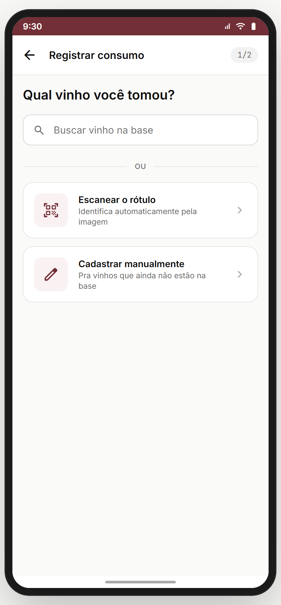 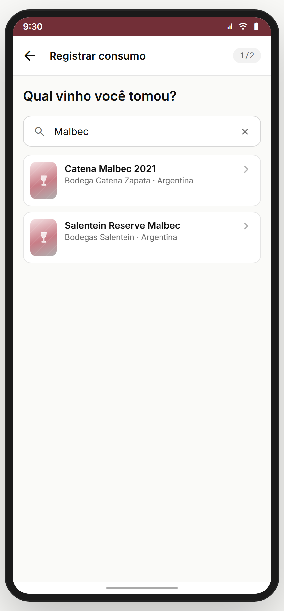

**Propósito:** fluxo principal de registro — 2 passos: escolher o vinho, depois avaliar. **US-DIARIO-01.**
**Entradas:** "Adicionar" da Adega; FAB; empty states. **Saídas:** ao salvar → `home/adega` + toast "+10 pontos!"; scanner → `scanner`.

**Layout (`RegisterConsumoScreen`):**
- Header back + "Registrar consumo" + chip "{step}/2".
- **Passo 1 (`Step1Pick`)**: H2 "Qual vinho você tomou?" + busca ("Buscar vinho na base", autofocus) → resultados ao digitar (cards) + atalhos "Escanear rótulo" e "Cadastrar manualmente" (`ManualForm` se base não tem).
- **Passo 2 (`Step2Rate`)**: avaliar o vinho escolhido (nota + nota textual + contexto).
- Ao salvar: adiciona ao `ctx.diary` no topo (com `_pending: true` se offline) + toast contextual (online: "+10 pontos! Vinho salvo no seu diário." / offline: "Salvo localmente. Sincroniza quando voltar online.").

**Analytics:** `register_start`, `register_step { n }`, `register_pick_wine { id }`, `register_scan_click`, `register_manual_click`, `register_save { rating, offline }`.

> **⚠️ DIVERGÊNCIA — 2 fluxos de registro coexistem:** `register-consumo` (2 passos) e `registro-rapido`/`registro-completo` (f18). **Recomendação:** consolidar. `registro-rapido` (~15s) parece o canônico mais novo. Ver 07.7. Gabriel decide qual aposentar.

**Status:** ✅

---

## 07.7 `registro-rapido` · `registro-completo` · `registro-confirmacao` ✅

_Registro rápido (~15s) · Registro completo · Confirmação (+pontos):_

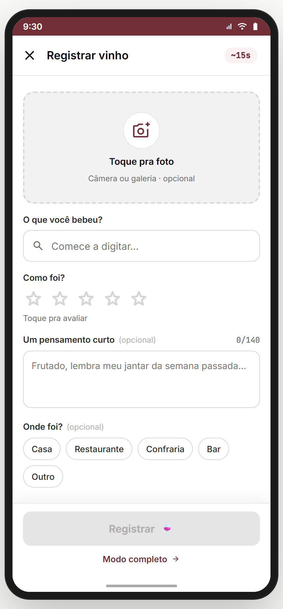 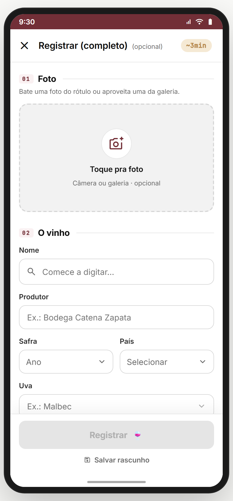 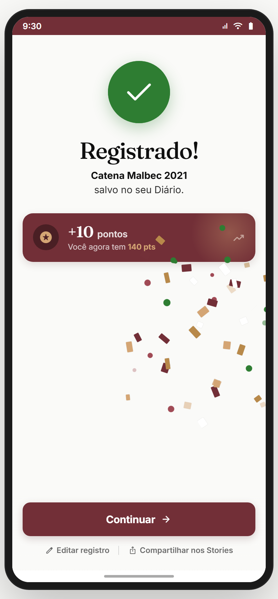

**Propósito:** fluxo de registro **otimizado** (alternativo ao `register-consumo`). Rápido = mínimo de campos em ~15s; Completo = todos os campos; Confirmação = sucesso gamificado. **US-DIARIO-01.**

**`registro-rapido` (`RegistroRapido`):**
- Header X + "Registrar vinho" + chip **"~15s"** (promessa de velocidade).
- Foto opcional ("Toque pra foto · Câmera ou galeria · opcional").
- **"O que você bebeu?"** (busca autocomplete "Comece a digitar…").
- **"Como foi?"** (5 estrelas "Toque pra avaliar").
- **"Um pensamento curto"** (textarea opcional, 0/140, placeholder "Frutado, lembra meu jantar da semana passada…").
- **"Onde foi?"** (chips: Casa · Restaurante · Confraria · Bar · Outro).
- CTA "Registrar 🍷" (disabled até ter vinho + nota) + link "Modo completo →".

**`registro-completo` (`RegistroCompleto`):** form com todos os campos (vinho, foto, nota, dimensões sensoriais, harmonização, ocasião, preço pago, local, etc.) + "Salvar rascunho".

**`registro-confirmacao` (`ConfirmacaoRegistro`):**
- Hero de sucesso + **pontos ganhos** (+10) + total acumulado.
- CTAs: "Continuar" (→ Adega), "Editar", "Compartilhar nos Stories", "Ver mais / Aprender".

**Analytics:** `quick_register_view`, `quick_register_submit { rating, hasPhoto, hasNote, occasion }`, `quick_register_to_complete`, `complete_register_submit`, `complete_register_draft`, `register_confirmation_view { points }`, `register_share_stories`.

> **⚠️ DIVERGÊNCIA — sobreposição com `register-consumo`** (ver 07.6). Decidir o canônico.
> **⛔ FALTA NO APP (épico pede):** **rascunhos reais** ("Salvar rascunho" é toast placeholder). Backlog **REGISTER-DRAFTS**.
> **⛔ FALTA NO APP (épico pede):** **compartilhar nos Stories** real (gerar imagem + abrir share sheet). Hoje toast. Backlog **REGISTER-SHARE-STORIES**.

**Status:** ✅

---

## 07.8 `relatorio-mensal` — "Wrapped" do vinho (`RelatorioMensal`) ✅

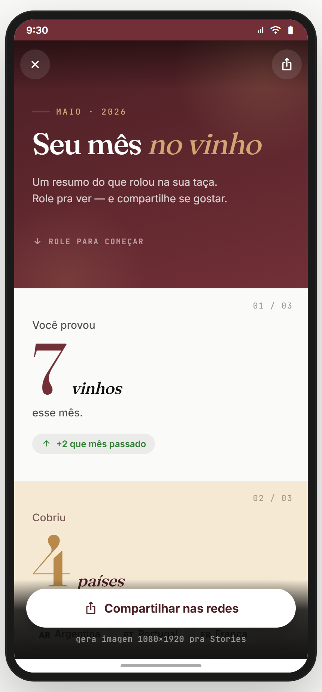

**Propósito:** resumo mensal estilo **Spotify Wrapped** — storytelling com scroll, números do mês, compartilhável. Gancho de retenção + viralização. **US-REL-01.**
**Entradas:** Adega/Indicadores (entry point) ou push nudge mensal. **Saídas:** "Compartilhar nas redes" → gera imagem 1080×1920 (Stories); X → back.

**Layout (`RelatorioMensal`):**
- Hero editorial: "MAIO · 2026" + título Fraunces itálico **"Seu mês no vinho"** + "Um resumo do que rolou na sua taça. Role pra ver — e compartilhe se gostar." + "↓ ROLE PARA COMEÇAR".
- **Cards de storytelling** (scroll, numerados 01/03, 02/03...):
  - "Você provou **7 vinhos** esse mês" (+2 vs mês passado).
  - "Cobriu **4 países**" (mapa/bandeiras).
  - (demais: uva favorita, melhor nota, gasto, streak, etc.)
- **Sticky bottom**: CTA "Compartilhar nas redes" + nota "gera imagem 1080×1920 pra Stories".

**Analytics:** `monthly_report_view { month }`, `monthly_report_scroll_depth`, `monthly_report_share`.

> **⛔ FALTA NO APP (épico pede):** **geração real da imagem** (canvas → PNG 1080×1920). Hoje toast "Imagem gerada!". Backlog **REPORT-IMAGE-GEN**.
> **⛔ FALTA NO APP (épico pede):** **dados reais do mês** (hoje mock fixo). Backlog **REPORT-REAL-DATA**.
> **⛔ FALTA NO APP (épico pede):** **comparação ano/retrospectiva anual** ("seu 2026 no vinho"). Backlog **REPORT-YEARLY**.

**Status:** ✅ (UI/storytelling completos; geração de imagem + dados reais pendentes)

---

## 07.9 `favoritos` (`FavoritosScreen`) ✅

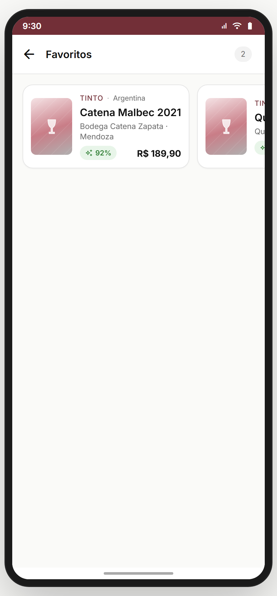

**Propósito:** lista de vinhos favoritados (♡). Distinto da wishlist (Módulo 04) e do diário. **US-FAV-01.**
**Entradas:** ícone ♡ do header da Adega. **Saídas:** tap → `wine`; back.

**Layout (`FavoritosScreen`):** header back + "Favoritos" + lista de cards de vinhos favoritados (de `ctx.favorites`). Empty state quando vazio.

> **⚠️ DIVERGÊNCIA — 3 conceitos de "guardar" sobrepostos:** Favoritos (Adega), Wishlist/lista-desejos (Módulo 04), Estante (Adega). Confuso pro usuário. **Recomendação Gabriel:** unificar ou diferenciar claramente (Favoritos = gostei / Wishlist = quero comprar / Estante = tenho/provei).

**Status:** ✅

---

## Componentes transversais
- **`MultiSelectWinesModal`** — reusado em Estante (colocar na estante), Adega header (adicionar vários), e Marketplace (Módulo 04).
- **`PaladarRadar`** — radar 5D (cross Módulo 03/04/06).
- **`BottlePlaceholder`** — placeholder de garrafa.
- **`StatChip` / `StatCard`** — cards de estatística reusados.
- **`TypeDonut`** — donut SVG animado por tipo de vinho.

## Edge cases & navegação reversa
- **Refresh zera Estante** (`window.__tcCellar` é só sessão). **Crítico.**
- **Estante e Diário independentes** — vinho na estante não vira registro no diário e vice-versa. Conceitualmente confuso.
- **Indicadores gate (3 registros)** — bom anti-tela-vazia, mas usuário pode não entender por que está bloqueado. Copy ajuda.
- **Registro offline** — badge "Pendente" aparece mas não há fila de sync real.
- **2 fluxos de registro** (`register-consumo` vs `registro-rapido/completo`) — risco de inconsistência de dados.

## Pendências de backend / decisões do Gabriel

### Críticas (bloqueadores GA)
- **Persistência real** de Estante (`tc.cellar` + backend), Diário, Favoritos.
- **Consolidar fluxos de registro** (escolher o canônico).
- **Unificar 5 dimensões do paladar** (Aromas vs Frutado).
- **Sync offline** real (fila + retry).

### Importantes
- Editar/excluir registro do diário.
- Filtros no diário (tipo/país/nota/data).
- Geração real da imagem do relatório mensal.
- Insights acionáveis nos indicadores (NLG).
- Rascunhos reais no registro completo.

### Decisões do Gabriel
- **Conceito Estante vs Diário vs Favoritos vs Wishlist** — 4 jeitos de "guardar" vinho. Definir taxonomia clara.
- Estante: quantidade por slot? organização por prateleira?
- Relatório: mensal + anual (retrospectiva)?
- Pontuação: +10 por registro — manter? escalar com qualidade do registro (foto+nota = mais)?

## Conexões com outros módulos
- **Módulo 03 (Paladar)** — aba Paladar reusa o radar; "Refazer quiz" → quiz.
- **Módulo 04 (Marketplace)** — MultiSelectWines compartilhado; Favoritos vs Wishlist a desambiguar.
- **Módulo 06 (Scanner)** — "Registrar no diário" do scanner-result → registro.
- **Módulo 19 (Jornada & Desafios)** — pontos do registro alimentam gamificação.
