# Módulo 08 — Treine seu Paladar (Duolingo do vinho) 🆕

> Feature **gamificada de educação** — o "Duolingo do vinho". Lições de ~2 min/dia que ensinam vinho **sem decoreba e sem frescura** (anti-elitismo da marca). Reconstruída com referência direta a 43 telas do Duolingo + pesquisa de mecânicas (Octalysis, loss aversion, sunk cost, variable reward). Ataca a **dor #1 do relatório** (decisão de compra) por outro ângulo: confiança via conhecimento.
> **Fonte de verdade:** `screens-treino-paladar.jsx` (arquivo único, ~1130 linhas — store, onboarding, trilha, lição, conclusão, liga, aprender). Doc funcional: **Sprint 11-13 Épico T3** + **MVP2 Épicos 8/9/10**.
> **Épicos/US:** US-T3-02 (trilha de lições), US-T3-03 (gamificação: streak/XP/gems/hearts), US-T3-04 (liga semanal), US-T3-05 (onboarding do mascote), US-T3-06 (Aprenda bebendo — merge com scanner).

**⚠️ Constraint de produto (registrado pelo usuário):** o onboarding aqui é da **FEATURE** (mascote Tchin), **NÃO** o onboarding do app inteiro. Não repetir a pergunta de nível (já vem do Módulo 02 via `window.__tcUserLevel`).

**Regra de negócio canônica:** persistência em `localStorage` (`tc.treino.v3`). Mecânicas: **streak** 🔥 (ofensiva diária, loss aversion), **vidas** ❤️ (5 max, regen 20min, erra = perde 1), **cristais** 💎 (moeda, ganha por lição/baú, gasta em congelamento de streak — 200), **meta diária** (anel, leve/regular/sério/intenso = 20/40/60/100 XP), **liga semanal** (leaderboard com promoção/rebaixamento). Conta nova reseta `tc.treino.v3` (onboarding reaparece — ver Módulo 01/02).

## Mapa do fluxo
```
treino-paladar (home/trilha) ─┬─ [conta nova] → TreinoOnboarding (8 passos, mascote) → trilha
                              ├─ "Tutorial" (re-abrir onboarding)
                              ├─ HUD: streak/vidas/cristais/meta → bottom sheets
                              ├─ "Aprenda bebendo": Escanear → scanner (Módulo 06) | Escolher tema → treino-aprender
                              ├─ Liga Tinto → treino-liga
                              ├─ nó da trilha (atual) → treino-licao { lessonId }
                              └─ baú de unidade → +30 cristais

treino-licao ─ concept (vídeo-aula placeholder) → exercícios (6 tipos) → application → TreinoCompleta
                    cada exercício: feedback instantâneo + "Entenda melhor" (expansível)
                    TreinoCompleta: XP/acerto/tempo + cristais + baú variável + badges + streak

treino-aprender ─ busca/chips de tópico → mapeia pra lição relevante → treino-licao
```

---

## 08.1 `treino-paladar` — Home / Trilha ✅ 🆕

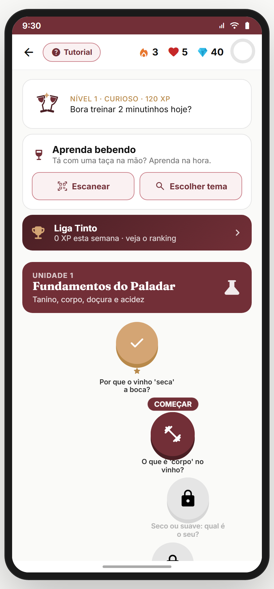

**Propósito:** hub da feature — HUD de gamificação no topo, banner de nível, atalho "Aprenda bebendo", entrada da Liga, e a **trilha** (path) de lições em unidades. **US-T3-02/03.**
**Entradas:** intent `treino_paladar` (Módulo 02); bottom nav/atalho; pós-lição ("Continuar na trilha"). **Saídas:** `treino-licao`, `treino-liga`, `treino-aprender`, `scanner`.

**Layout (`TreinoPaladarHome`):**
- **HUD topbar**: back + chip **"Tutorial"** (reabre onboarding) + `HudStat` 🔥 streak + ❤️ vidas + 💎 cristais + anel de meta diária (`GoalRing`). Cada um abre bottom sheet (`TreinoSheet`) explicativo.
- **Banner de nível**: mascote `TchinDuo` + "NÍVEL {n} · {título} · {xp} XP" + status da meta diária ("Bora treinar 2 minutinhos hoje?" / "Faltam X XP" / "Meta batida! 🎉").
- **Card "Aprenda bebendo"**: "Tá com uma taça na mão? Aprenda na hora." + 2 botões: **Escanear** (→ `scanner`) e **Escolher tema** (→ `treino-aprender`). *(É o merge com Módulo 06.)*
- **Card Liga** (gradiente burgundy): "Liga Tinto · {weekXp} XP esta semana · veja o ranking" → `treino-liga`.
- **TRILHA** (3 unidades):
  - U1 **Fundamentos do Paladar** (Tanino, corpo, doçura, acidez) — burgundy.
  - U2 **Uvas que você vai amar** (as uvas que abrem 70% das cartas) — marrom.
  - U3 **Comprar sem errar** (rótulo e preço com confiança) — verde.
  - Cada unidade: header colorido + nós da trilha (`PathNode`) em **zigue-zague** (offset horizontal alternado) com animação stagger. Estados do nó: **done** (✓ dourado), **current** ("COMEÇAR" pulsante), **locked** (cadeado).
  - **Baú de bônus** (`ChestNode`) ao fim de cada unidade → +30 cristais ao concluir a unidade.
- **Prova social**: "{N} pessoas treinaram o paladar hoje" (número dinâmico por dia).
- **"SUAS CONQUISTAS"**: grid 3-col de 6 badges (earned vs locked): Primeira gota, Pegando o ritmo, Semana cheia, Explorador de uvas, Sem erro, Sem medo de errar.
- Link discreto "Reiniciar progresso (demo)".

**Estado/persistência:** `tc.treino.v3` (store completo — ver `defaultTreino()`). Vidas regeneram com base em timestamp. Meta/semana resetam por dia/semana.
**Analytics:** `treino_home_viewed { streak, xp }`, `treino_lesson_cta { lesson_id }`, `treino_chest_claim { unit }`.

> **⚠️ DIVERGÊNCIA — tudo em localStorage** (`tc.treino.v3`). Backend precisa: progresso, streak, XP, cristais, badges sincronizados (anti-fraude de streak/XP do lado servidor).
> **⛔ FALTA NO APP (épico pede):** **notificação de streak em risco** ("Sua ofensiva de 7 dias acaba em 3h!"). Push do Módulo 18. Backlog **TREINO-STREAK-PUSH**.
> **⛔ FALTA NO APP (épico pede):** **loja de cristais** (gastar em power-ups além do congelamento: dobro de XP, vida extra, etc.). Backlog **TREINO-GEM-SHOP**.
> **⛔ FALTA NO APP (épico pede):** **conteúdo além de 3 unidades** (hoje "fechou a trilha" rápido). Roadmap de conteúdo. Backlog **TREINO-CONTENT-EXPANSION**.

**Status:** ✅ 🆕

---

## 08.2 `TreinoOnboarding` — Onboarding do mascote (8 passos) ✅ 🆕

_Intro · "duas perguntinhas" · objetivo · meta diária · afirmação · meta de ofensiva · cristais · final:_

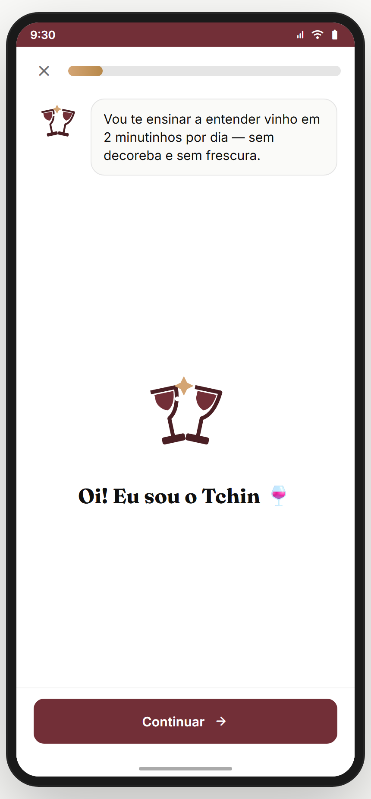 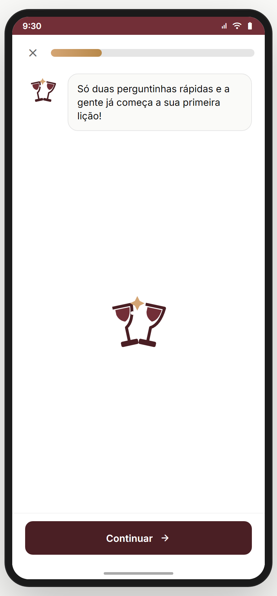 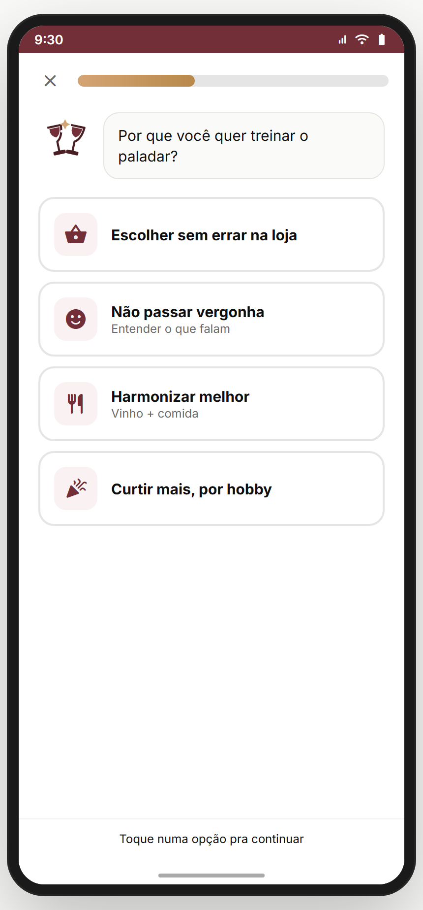 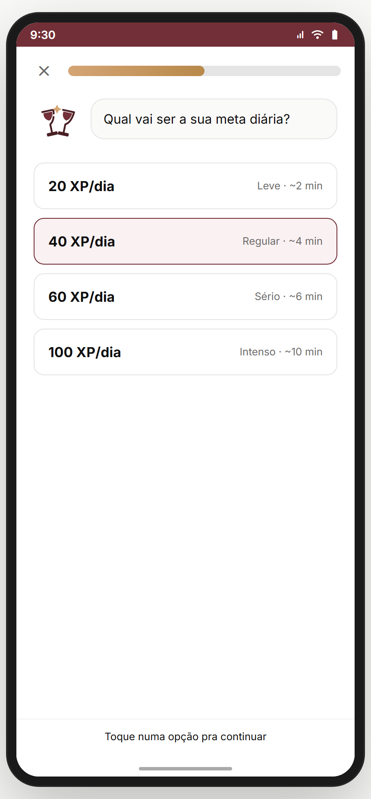 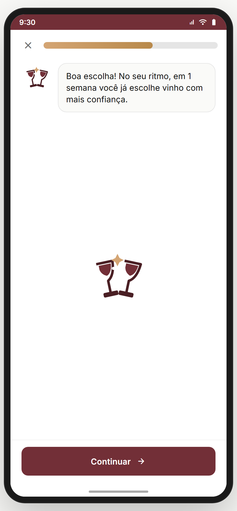 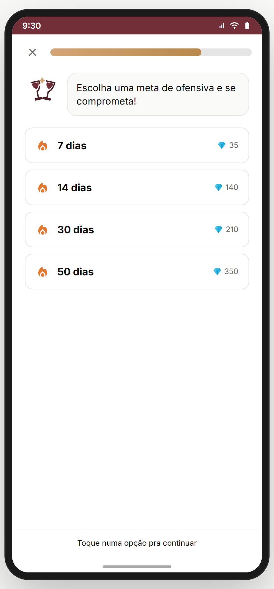 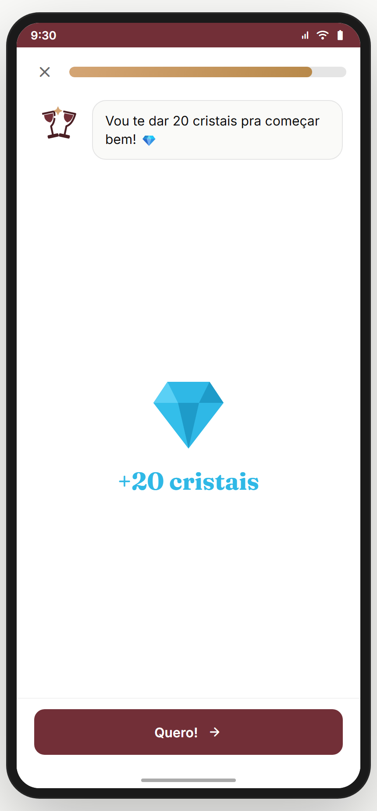 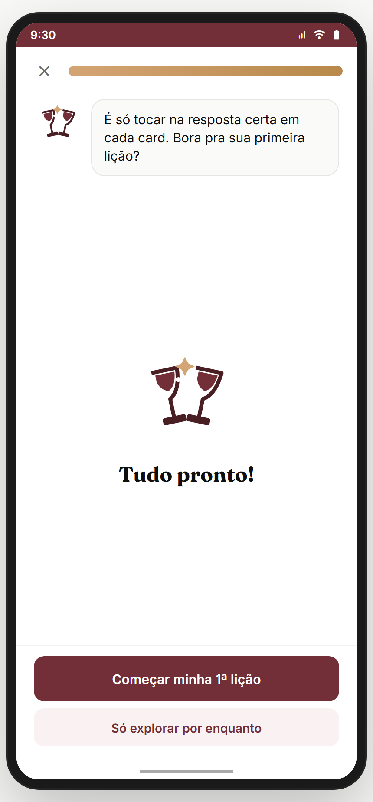

**Propósito:** onboarding **conversacional** da feature, conduzido pelo mascote TchinDuo. Coleta objetivo + meta + ofensiva, dá 20 cristais de boas-vindas, e leva pra 1ª lição. **US-T3-05.**
**Entradas:** primeira visita a `treino-paladar` (`!s.onboarded`); chip "Tutorial". **Saídas:** `treino-licao` (1ª lição) ou explorar trilha.

**Os 8 passos (`ONB`):**
1. **intro** — TchinDuo grande + "Oi! Eu sou o Tchin 🍷" + "Vou te ensinar a entender vinho em 2 minutinhos por dia — sem decoreba e sem frescura."
2. **say** — "Só duas perguntinhas rápidas e a gente já começa a sua primeira lição!"
3. **choose objetivo** — "Por que você quer treinar o paladar?" → 4 opções (Escolher sem errar na loja / Não passar vergonha / Harmonizar melhor / Curtir mais, por hobby). Auto-avança ao tocar.
4. **goal** — "Qual vai ser a sua meta diária?" → Leve (20 XP/~2min) / Regular (40/~4min) / Sério (60/~6min) / Intenso (100/~10min).
5. **say** — "Boa escolha! No seu ritmo, em 1 semana você já escolhe vinho com mais confiança."
6. **streakGoal** — "Escolha uma meta de ofensiva e se comprometa!" → 7/14/30/50 dias (com recompensa em cristais). *(Commitment device.)*
7. **gems** — Gem gigante + "+20 cristais" + "Vou te dar 20 cristais pra começar bem! 💎"
8. **final** — "Tudo pronto!" + CTA "Começar minha 1ª lição" (+ ghost "Só explorar por enquanto").

**Layout:** overlay full-screen; topo com **X (pular)** + barra de progresso; mascote + balão de fala (animação `tcPopIn`); corpo varia por `kind`; CTA fixo embaixo.
**Estado:** ao concluir, grava `onboarded:true`, `objetivo`, `goal`, `streakGoal`, `level` (de `__tcUserLevel`), +20 gems.
**Analytics:** `treino_intro_start { lesson_id }`.

> **⚠️ DIVERGÊNCIA — nível NÃO é perguntado aqui** (constraint do usuário): reusa `window.__tcUserLevel` do onboarding do app (Módulo 02). ✅ correto.
> **⛔ FALTA NO APP (épico pede):** **personalização da trilha por objetivo** — se escolheu "harmonizar", priorizar unidade de harmonização. Hoje objetivo é coletado mas não altera a trilha. Backlog **TREINO-PATH-BY-GOAL**.

**Status:** ✅ 🆕

---

## 08.3 `treino-licao` — Player de lição ✅ 🆕

_Conceito (vídeo-aula) · exercício (múltipla escolha) · feedback + "Entenda melhor":_

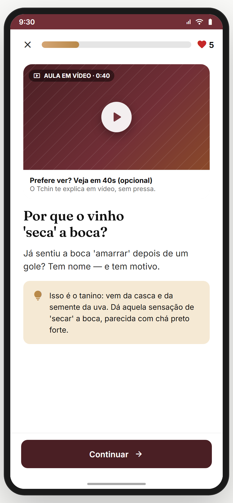 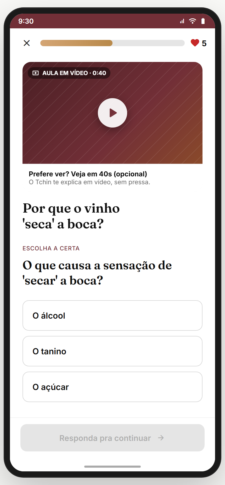 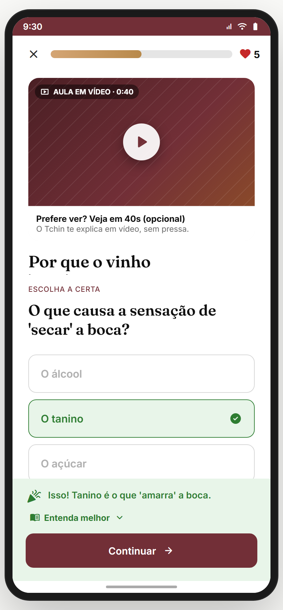

**Propósito:** player de uma lição — começa com **conceito** (hook + explicação + vídeo-aula placeholder), passa por **exercícios** (6 tipos), termina com **aplicação prática** ("na sua próxima compra"). Feedback instantâneo + "Entenda melhor". **US-T3-02.**
**Entradas:** nó da trilha; "Começar 1ª lição" do onboarding; `treino-aprender`. **Saídas:** ao concluir → `TreinoCompleta`; X → back.

**Layout (`TreinoLicaoScreen`):**
- Topbar: X + barra de progresso (por step) + contador de ❤️ vidas.
- **Step `concept`**: `VideoAula` (placeholder "AULA EM VÍDEO · 0:40", "Prefere ver? Veja em 40s (opcional)") + título Fraunces + hook + card de conceito (bg ambar, ícone lâmpada).
- **Step `exercise`** — 6 tipos via `ExerciseView`:
  - **`mc`** (múltipla escolha) — "ESCOLHA A CERTA" + opções; correta fica verde, errada fica marrom + shake.
  - **`tf`** (verdadeiro/falso) — 2 botões grandes (👍/👎).
  - **`match`** (associar pares) — 2 colunas, toca esquerda + direita.
  - **`fill`** (completar frase) — frase com lacuna + chips de palavras.
  - **`bank`** (montar frase) — banco de palavras → monta a resposta.
  - **`type`** (digitar) — input livre + "Verificar" (normaliza acentos).
- **Step `application`**: ícone + "NA SUA PRÓXIMA COMPRA" + dica prática personalizada pelo paladar (`{perfil}`).
- **`FeedbackCta`** (rodapé): após responder, mostra feedback (verde acerto / marrom erro) + **"Entenda melhor"** (expansível, auto-abre quando erra) + botão "Continuar"/"Concluir lição".

**Mecânica de vidas:** errar → −1 ❤️ + registra mistake. Acabar vidas não bloqueia no protótipo (segue), mas conta pra precisão.
**Analytics:** `treino_lesson_started { lesson_id }`, `treino_quiz_answered { lesson_id, correct }`.

> **⚠️ DIVERGÊNCIA — vídeo-aula é placeholder** ("AULA EM VÍDEO · 0:40" não toca nada). **Conteúdo pendente:** produzir micro-vídeos de 40s por lição. Backlog **TREINO-VIDEO-CONTENT**.
> **⚠️ DIVERGÊNCIA — conteúdo hard-coded** (`LESSONS` no arquivo). Backend/CMS precisa servir lições (versionável, A/B testável). Backlog **TREINO-CMS**.
> **⛔ FALTA NO APP (épico pede):** **áudio/pronúncia** (como falar "Gewürztraminer"). Backlog **TREINO-AUDIO**.
> **⛔ FALTA NO APP (épico pede):** **fim de vidas real** (esperar regen ou gastar cristais pra continuar). Hoje segue sem bloquear. Backlog **TREINO-HEARTS-GATE**.

**Status:** ✅ 🆕

---

## 08.4 `TreinoCompleta` — Conclusão da lição ✅ 🆕

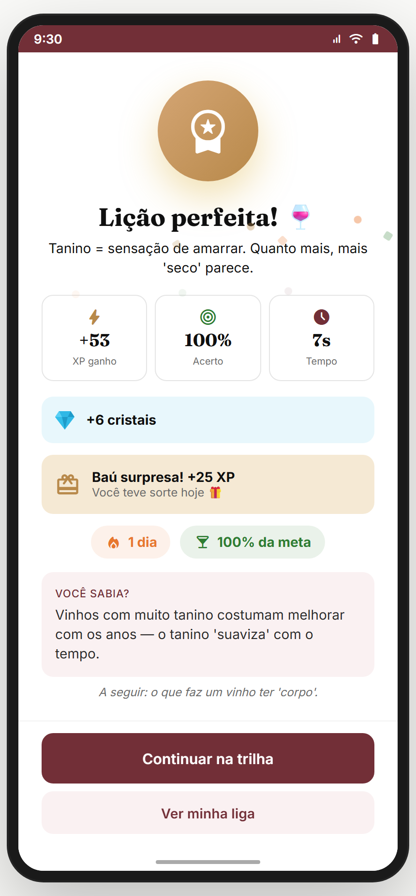

**Propósito:** recompensa pós-lição — reforço positivo + números + **recompensa variável** (baú surpresa) + badges + streak. Núcleo do loop de dopamina. **US-T3-03.**
**Entradas:** fim do `treino-licao`. **Saídas:** "Continuar na trilha" → `treino-paladar`; "Ver minha liga" → `treino-liga`.

**Layout (`TreinoCompleta`):**
- Confetti + medalha (dourada se perfeito, verde se ok) + "Lição perfeita! 🍷" ou "Mandou bem!" + recap.
- **3 StatCards**: XP ganho (CountUp) · Acerto (%) · Tempo (s).
- **+cristais** (card azul).
- **Baú surpresa** (recompensa variável, ~18% chance: +15 ou +25 XP) — "Você teve sorte hoje 🎁".
- **Novos badges** (se desbloqueou).
- **Pills**: streak ("X dias") + "% da meta".
- **"VOCÊ SABIA?"** (curiosidade) + teaser da próxima lição.
- CTAs: "Continuar na trilha" / "Ver minha liga".

**Cálculo de XP (canônico):** `(primeira vez? 20 : 8) + acertos×5 + (perfeito? 10) + bônus`. Cristais: `(primeira vez? 5 : 1) + (perfeito? 5)`.
**Analytics:** `treino_lesson_completed { lesson_id, xp, streak, perfect }`.

> **⛔ FALTA NO APP (épico pede):** **compartilhar conquista** (streak/badge nos Stories). Backlog **TREINO-SHARE-ACHIEVEMENT**.

**Status:** ✅ 🆕

---

## 08.5 `treino-liga` — Liga semanal ✅ 🆕

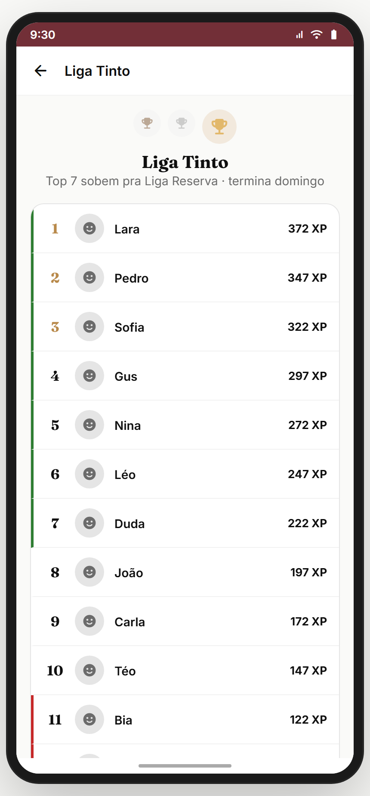

**Propósito:** leaderboard semanal (Liga Tinto) com competição social — promoção/rebaixamento. Drive de competição (Octalysis). **US-T3-04.**
**Entradas:** card Liga da home; "Ver minha liga" da conclusão. **Saídas:** "Registrar agora"/treinar → `treino-licao`; back.

**Layout (`TreinoLigaScreen`):** ranking com bots (`LIGA_BOTS`: Marina, Rafael, Bia, Téo…) + o usuário, ordenado por XP da semana. Zonas de promoção (topo) e rebaixamento (base). Tempo restante da semana.

> **⚠️ DIVERGÊNCIA — liga 100% mock** (bots fixos). Backend precisa: matchmaking real de ligas (grupos de ~30), promoção/rebaixamento semanal, anti-cheat.
> **⛔ FALTA NO APP (épico pede):** **divisões nomeadas** (Bronze→Prata→Ouro→Diamante = aqui seria Frisante→Tinto→Reserva→Gran Reserva). Backlog **TREINO-LEAGUE-TIERS**.
> **⛔ FALTA NO APP (épico pede):** **liga entre amigos/confraria** (competir com seu grupo). Conexão com Módulo 11. Backlog **TREINO-LEAGUE-SOCIAL**.

**Status:** ✅ 🆕 (UI ok; matchmaking real pendente)

---

## 08.6 `treino-aprender` — Aprenda bebendo: escolher tema ✅ 🆕

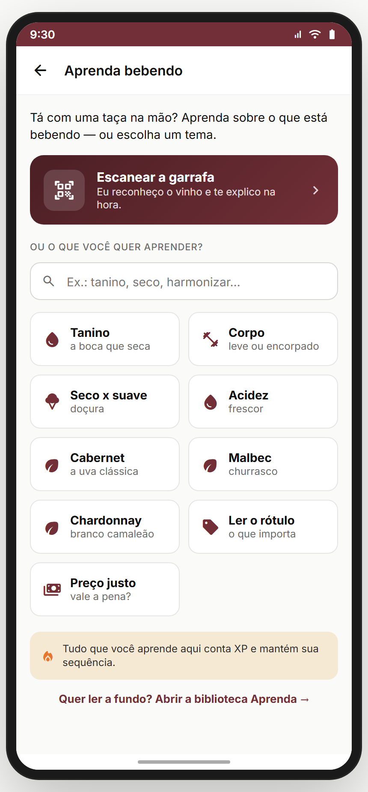

**Propósito:** porta de entrada **contextual** — usuário com taça na mão escolhe um tema/tópico e cai numa lição relevante. É o **merge** entre "Aprenda Bebendo" (Módulo 06) e a trilha. **US-T3-06.**
**Entradas:** card "Aprenda bebendo" → "Escolher tema"; scanner-result → aprender mais. **Saídas:** chip de tópico → `treino-licao` (mapeado via `APRENDER_TOPICS`).

**Layout (`TreinoAprenderScreen`):** busca/chips de tópicos (uvas, conceitos, regiões) → cada um mapeia pra uma lição da trilha. Permite aprender "fora de ordem" (pulando o gate da trilha) quando o contexto pede.

> **⚠️ DIVERGÊNCIA — tópicos mapeiam pra lições existentes** (`APRENDER_TOPICS`). Conteúdo limitado às 3 unidades. Cresce com o CMS (08.3).
> **⛔ FALTA NO APP (épico pede):** **busca livre** ("o que é Gran Reserva?") com resposta gerada, não só chips pré-definidos. Backlog **APRENDER-FREE-SEARCH**.
> **⛔ FALTA NO APP (épico pede):** **integração direta scanner → aprender** — escanear um Malbec leva pra lição de Malbec. Hoje os 2 caminhos existem mas não se cruzam. Backlog **APRENDER-SCAN-LINK**.

**Status:** ✅ 🆕

---

## Componentes transversais
- **`TchinDuo`** — mascote (taças brindando com brilho). Aparece no onboarding, banner de nível, sheets.
- **`HudStat` / `GoalRing` / `Gem`** — HUD de gamificação reusado.
- **`PathNode` / `ChestNode`** — nós da trilha.
- **`TreinoSheet`** — bottom sheets explicativos (streak/vidas/cristais/meta).
- **`ExMC/ExTF/ExMatch/ExFill/ExBank/ExType`** — 6 tipos de exercício.
- **`CountUp` / `Confetti` / `Pill` / `StatCard`** — micro-animações de recompensa.

## Edge cases & navegação reversa
- **`BACK_SKIP`** inclui telas de onboarding transientes — voltar não cai no onboarding da feature.
- **Conta nova** zera `tc.treino.v3` (feito no cadastro — Módulo 01) → onboarding reaparece. Comportamento esperado e validado.
- **Refresh no meio de lição** — perde o progresso da lição (state local). Aceitável (lição é curta).
- **Vidas zeradas** — protótipo não bloqueia; produção deve gate (esperar regen / gastar cristais).
- **Streak quebrado** — `computeStreakOnFinish` checa ontem/hoje. Congelamento (freeze) protege 1 dia.

## Pendências de backend / decisões do PO

### Críticas (bloqueadores GA)
- **Sync server-side** de progresso/XP/streak/cristais (anti-fraude).
- **CMS de lições** (hoje hard-coded em `LESSONS`).
- **Matchmaking real de ligas** + promoção/rebaixamento.
- **Conteúdo de vídeo** (micro-aulas 40s) — ou remover o placeholder.

### Importantes
- Notificação de streak em risco (push, Módulo 18).
- Fim de vidas real (gate).
- Personalização da trilha por objetivo.
- Loja de cristais (power-ups).
- Expansão de conteúdo (>3 unidades).

### Decisões do PO
- Vidas: gate real ou só cosmético?
- Liga: divisões nomeadas (Frisante→Gran Reserva)? liga entre amigos?
- Cristais: o que dá pra comprar além de congelamento?
- Vídeo-aula: produzir conteúdo ou cortar a feature?

## Conexões com outros módulos
- **Módulo 02 (Onboarding)** — intent `treino_paladar` entra aqui direto; reusa `__tcUserLevel`.
- **Módulo 03 (Paladar)** — aplicação prática usa `perfilLabel()` do paladar.
- **Módulo 06 (Scanner)** — "Aprenda bebendo" liga os dois; backlog de link scanner→lição.
- **Módulo 11 (Confrarias)** — backlog: liga entre membros da confraria.
- **Módulo 18 (Notificações)** — streak/meta nudges.
- **Módulo 19 (Jornada & Desafios)** — XP/badges podem alimentar a jornada global.
