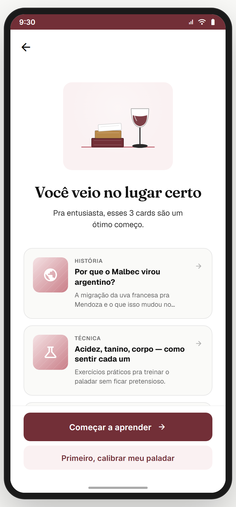
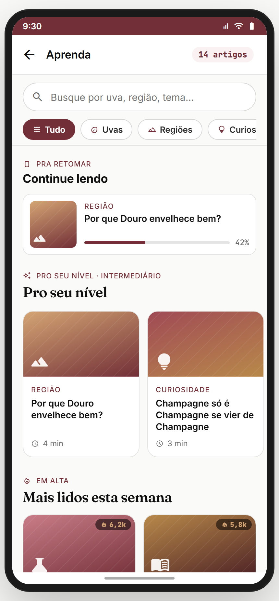
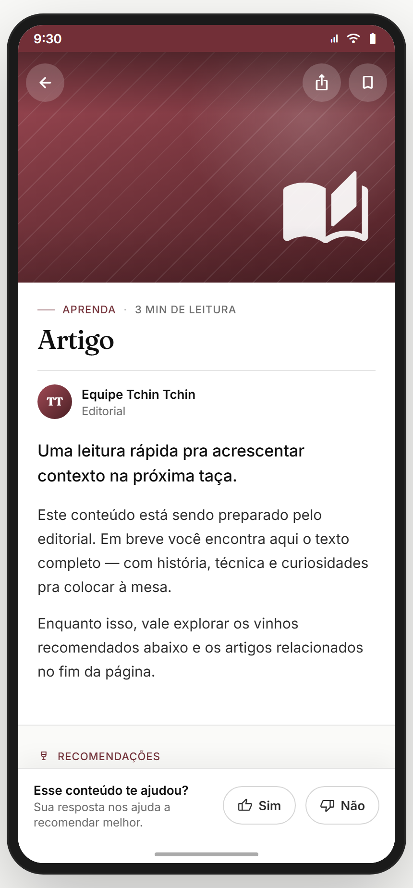

# Módulo 09 — Aprenda (hub educacional)

> **Dor 2 do relatório:** "gap educacional". Solução: conteúdo curado por **nível**, no formato de **artigos/cards** rápidos (não gamificado — esse é o Módulo 08). Atua como destino do intent `learn` (Módulo 02) e como hub de leitura on-demand. Tom anti-elitista da marca ("sem ficar pretensioso").
> **Fonte de verdade:** `screens-rota-b.jsx` (`VoceVeioNoLugarCertoScreen` — rota 04.B), `f19_03_SecaoAprenda.jsx` (`SecaoAprenda` — catálogo), `f19_04_DetalheCard.jsx` (`DetalheCard` — artigo). Doc funcional: **MVP2 Épico 10**.
> **Épicos/US:** US-APR-01 (hub por nível), US-APR-02 (catálogo + busca + categorias), US-APR-03 (artigo/leitura com progresso), US-APR-04 (destino do intent learn).

**Regra de negócio canônica:** conteúdo filtrado pelo **nível** declarado no onboarding (`__tcUserLevel`: iniciante/intermediário/avançado). `aprender` é a **landing** (preview de 3 cards) que vem do intent `learn`; `aprenda` é o **catálogo navegável**; `aprenda-detalhe` é o **leitor de artigo**. Leitura tem **progresso** (% lido, "Continue lendo").

---

## 🆕 § 9.0 Decisões fechadas (Gabriel, junho/2026)
- **9.1 Botão "Começar a aprender" → vai pra `/aprenda`** (hub educacional dedicado). NÃO vai pro feed.
- **9.2 UNIFICAR "Aprenda" (M09) + "Aprenda Bebendo" (M06) num só hub.** O hub fica em `/aprenda` e tem 2 modos:
  - **Modo "Teoria"** (era M09): cards/artigos editoriais por nível.
  - **Modo "Na hora"** (era M06): ativado quando vem do scanner — explicação "Por que combina" sobre o rótulo/vinho específico.
  - O usuário não vê 2 features separadas; vê um hub único onde o conteúdo "na hora" aparece como dica/preview dentro do mesmo lugar.
  - **Implementação:** M06 deixa de existir como módulo separado — vira **sub-feature do M09**. Cross-ref atualizada nos demais docs.

## Mapa do fluxo
```
[intent learn (Módulo 02)] → aprender (preview 3 cards por nível)
                               ├─ "Começar a aprender" → aprenda (catálogo) OU comunidade?feedFilter=educacao
                               └─ "Primeiro, calibrar meu paladar" → quiz (Módulo 03)

aprenda (catálogo) ─┬─ busca + categorias (Tudo/Uvas/Regiões/Curiosidades…)
                    ├─ "Continue lendo" (artigos com progresso)
                    ├─ "Pro seu nível" / "Mais lidos" / essenciais
                    └─ tap card → aprenda-detalhe { article }

aprenda-detalhe ─ artigo + vinhos relacionados → wine | outros artigos → aprenda-detalhe | compartilhar
```

---

## 09.1 `aprender` — "Você veio no lugar certo" (04.B) ✅



**Propósito:** landing do intent `learn` (Módulo 02). Mostra **3 cards de preview** filtrados pelo nível + 2 CTAs. Os cards são **read-only** (preview, não TOC). **US-APR-04.**
**Entradas:** `tela-intencao` → intent `learn` (com `level`). **Saídas:** "Começar a aprender" → `aprenda` (ou `comunidade?feedFilter=educacao&firstTime`); "Primeiro, calibrar meu paladar" → `quiz`.

**Layout (`VoceVeioNoLugarCertoScreen`):**
- Top bar back (sem ação à direita).
- Hero ilustração (`BooksAndGlassIllustration` — livros + taça).
- H1 Fraunces 28 **"Você veio no lugar certo"** + sub "Pra {nível}, esses 3 cards são um ótimo começo." *(nível: iniciante / entusiasta / expert)*.
- **3 cards de preview** (variam por nível — `LEARNING_CARDS`):
  - **Iniciante:** "Como ler um rótulo em 30s" · "Tinto, branco, rosé: a diferença que importa" · "Os 5 erros de iniciante".
  - **Intermediário:** "Por que o Malbec virou argentino?" · "Acidez, tanino, corpo — como sentir" · "Harmonização: regras que valem a pena".
  - **Avançado:** "Terroir além do marketing" · "Vinhos naturais x convencionais" · "Investir em vinho: vale a pena?".
- CTAs: primária **"Começar a aprender"** + ghost **"Primeiro, calibrar meu paladar"**.

**Estado:** `userLevel` de `__tcUserLevel`/ctx (fallback iniciante).
**Analytics:** `rota_b_to_feed { level }`, `rota_b_to_paladar { from_entry }`.

> **⚠️ DIVERGÊNCIA — cards são read-only aqui** (preview). Ao tocar não abrem detalhe — só os CTAs roteiam. **Recomendação:** permitir tap no card → `aprenda-detalhe` (usuário espera que abram). Decisão de Gabriel/UX.
> **⚠️ DIVERGÊNCIA — "Começar a aprender"** pode ir pra `aprenda` OU `comunidade?feedFilter=educacao` (o doc original previa feed com viés #educacao por 14 dias). Hoje o protótipo roteia pra `aprenda`. Confirmar destino canônico.

**Status:** ✅

---

## 09.2 `aprenda` — Catálogo educacional (`SecaoAprenda`) ✅



**Propósito:** hub navegável de conteúdo — busca, categorias, "Continue lendo", "Pro seu nível", "Mais lidos", essenciais. **US-APR-02.**
**Entradas:** `aprender` → "Começar a aprender"; entry point direto. **Saídas:** tap card → `aprenda-detalhe { article }`; back.

**Layout (`SecaoAprenda`):**
- Top bar: back + "Aprenda" + contador "{N} artigos".
- **Busca** ("Busque por uva, região, tema…").
- **Chips de categoria**: Tudo · Uvas · Regiões · Curiosidades (+ outras do catálogo).
- Seções (quando sem filtro):
  - **"PRA RETOMAR · Continue lendo"** — artigos com `progress` entre 0 e 1 (barra de % lido).
  - **"PRO SEU NÍVEL · {nível}"** — cards filtrados pelo nível (grid 2-col com tag/título/tempo de leitura).
  - **"EM ALTA · Mais lidos esta semana"** — ordenado por popularidade (com contador de leituras).
  - **Essenciais** — artigos marcados `essential`.
- Com filtro/busca: lista filtrada de resultados.

**Estado:** `query`, `category` locais; catálogo `APRENDA_CATALOG` (mock).
**Analytics:** `aprenda_view { level }`, `aprenda_search { q }`, `aprenda_category { category }`, `aprenda_open_article { id }`.

> **⚠️ DIVERGÊNCIA — catálogo hard-coded** (`APRENDA_CATALOG`). Backend/CMS precisa servir artigos (versionável, editorial). Backlog **APRENDA-CMS**.
> **⚠️ DIVERGÊNCIA — progresso de leitura** é mock (`a.progress`). Precisa persistir leitura real por usuário. Backlog **APRENDA-PROGRESS**.
> **⛔ FALTA NO APP (épico pede):** **salvar/favoritar artigo** pra ler depois. Backlog **APRENDA-BOOKMARK**.

**Status:** ✅

---

## 09.3 `aprenda-detalhe` — Leitor de artigo (`DetalheCard`) ✅



**Propósito:** leitura do artigo — conteúdo editorial + **vinhos relacionados** (→ marketplace) + **artigos relacionados** + compartilhar. **US-APR-03.**
**Entradas:** `aprenda` → tap card; `aprenda-detalhe` → artigo relacionado. **Saídas:** vinho relacionado → `wine`; outro artigo → `aprenda-detalhe`; compartilhar → toast; back.

**Layout (`DetalheCard`):** hero do artigo (imagem/cor + tag + título Fraunces + tempo de leitura) + corpo editorial + bloco de vinhos relacionados (cards → `wine`) + artigos relacionados + botão compartilhar.

> **⚠️ DIVERGÊNCIA — conteúdo do artigo é mock/placeholder.** Editorial real pendente (CMS).
> **⛔ FALTA NO APP (épico pede):** **marcar como lido / atualizar progresso** ao rolar. Backlog **APRENDA-MARK-READ**.
> **⛔ FALTA NO APP (épico pede):** **integração com Treino (Módulo 08)** — "Quer praticar isso? Faça a lição." Backlog **APRENDA-TREINO-LINK**.

**Status:** ✅

---

## Relação com o Módulo 08 (Treine seu Paladar)
**Dois pilares educacionais distintos:**
| | Módulo 08 — Treino | Módulo 09 — Aprenda |
|---|---|---|
| Formato | Gamificado (lições, XP, streak) | Editorial (artigos, leitura) |
| Ritmo | Diário, ~2 min | On-demand, quando der |
| Entrada | intent `treino_paladar` | intent `learn` |
| Tom | Joguinho | Revista/blog |

> **⚠️ DIVERGÊNCIA — sobreposição conceitual.** "Aprenda bebendo" (Módulo 08) e "Aprenda" (Módulo 09) têm nomes parecidos e ambos ensinam. **Recomendação Gabriel:** clarificar a diferença na UI (Treino = praticar / Aprenda = ler) ou unificar entradas. Hoje pode confundir.

## Pendências de backend / decisões do Gabriel
### Críticas
- **CMS de artigos** (hoje `APRENDA_CATALOG` + `LEARNING_CARDS` hard-coded).
- **Progresso de leitura** real por usuário.
### Importantes
- Salvar/favoritar artigo; marcar como lido ao rolar.
- Cards de `aprender` abrirem detalhe (não só CTA).
- Integração Aprenda ↔ Treino (Módulo 08).
### Decisões do Gabriel
- Destino de "Começar a aprender": `aprenda` vs `comunidade?feedFilter=educacao`?
- Diferenciar/unificar "Aprenda" vs "Aprenda bebendo" (08)?

## Conexões com outros módulos
- **Módulo 02 (Onboarding)** — intent `learn` entra em `aprender`; reusa `__tcUserLevel`.
- **Módulo 03 (Paladar)** — "calibrar paladar" → quiz.
- **Módulo 04 (Marketplace)** — vinhos relacionados → wine.
- **Módulo 08 (Treino)** — pilar educacional irmão; backlog de link.
- **Módulo 13 (Comunidade)** — feed com viés #educacao.
