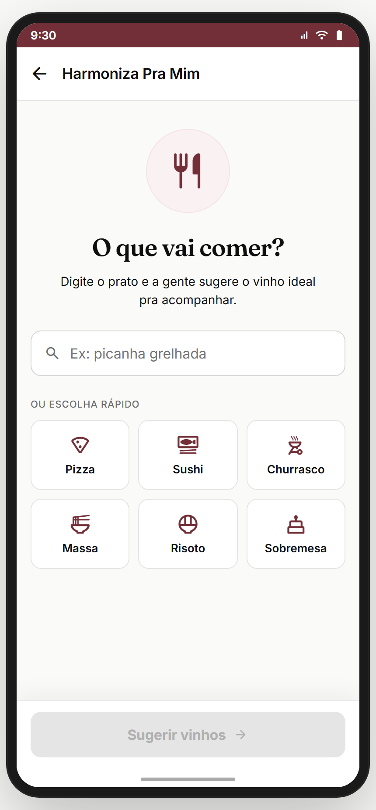
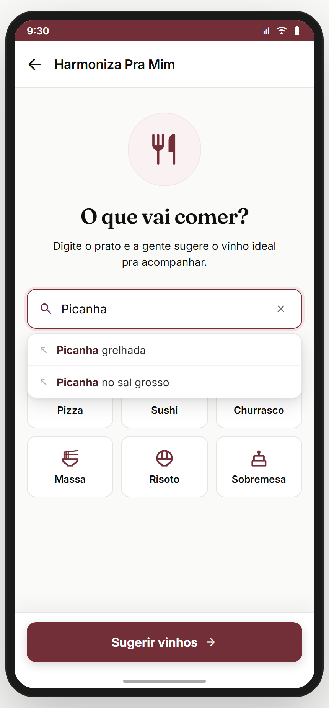
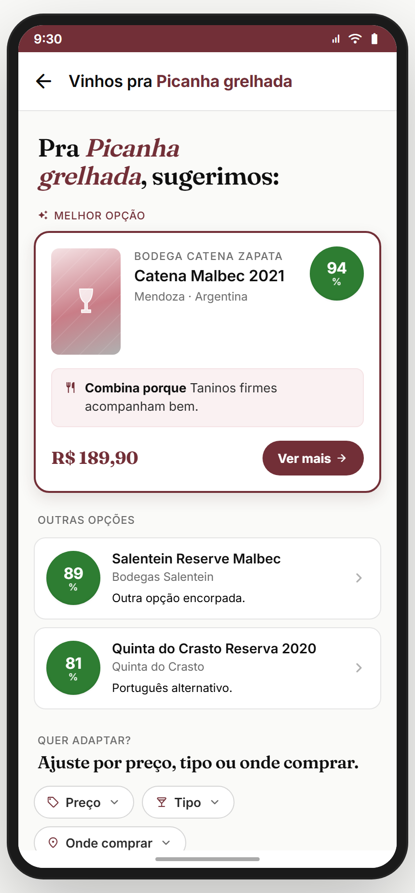

# Módulo 10 — Harmoniza

> **Dor 5 do relatório:** "harmonização inacessível". Solução: **"Harmoniza Pra Mim"** — o usuário digita um prato e recebe os 3 melhores vinhos com **match** + **por quê combina** + filtros (preço/tipo/onde comprar). Tom anti-elitista: harmonização sem regras decoradas.
> **Fonte de verdade:** `f23_04_HarmonizaPrato.jsx` (`HarmonizaPrato` — entrada), `f23_05_HarmonizaResultados.jsx` (`HarmonizaResultados` — sugestões). Doc funcional: **Sprint 11-13 Épico T4**.
> **Épicos/US:** US-13-4-01 (digitar prato → sugestões), US-13-4-02 (resultado com match + razão), US-13-4-03 (filtros adaptáveis), US-13-4-04 (reversa: vinho → pratos — backlog).

**Regra de negócio canônica:** entrada **prato → vinhos** (direção principal). O usuário digita (com autocomplete) ou toca num chip rápido. O resultado mostra **1 melhor opção em destaque** + **outras opções** ordenadas por match, cada uma com **razão da harmonização**. Filtros "Quer adaptar?" (preço/tipo/onde comprar) refinam sem refazer a busca.

## Mapa do fluxo
```
[entry: Descobrir / menu / scanner-result] → harmoniza (digita prato)
   ├─ chips rápidos (Pizza/Sushi/Churrasco/Massa/Risoto/Sobremesa)
   ├─ autocomplete (filtra enquanto digita)
   └─ "Harmonizar" → harmoniza-resultados { prato }
                       ├─ melhor opção (destaque) → wine
                       ├─ outras opções → wine
                       └─ filtros: preço / tipo / onde comprar (refina inline)
```

---

## 10.1 `harmoniza` — Digitar o prato (23.04) ✅

_Default (chips rápidos) · autocomplete enquanto digita:_

 

**Propósito:** ponto de entrada do "Harmoniza Pra Mim". Usuário informa o prato por digitação (com autocomplete) ou chip rápido. **US-13-4-01.**
**Entradas:** entry point do Descobrir/menu; scanner-result. **Saídas:** "Harmonizar" → `harmoniza-resultados { prato }`; back.

**Layout (`HarmonizaPrato`):**
- Top bar back.
- Título + input ("Ex: picanha grelhada", autofocus).
- **Autocomplete** (até 5 sugestões filtradas de `HARMONIZA_AUTOCOMPLETE` ~36 pratos) enquanto digita.
- **Chips rápidos** (`HARMONIZA_QUICK`): Pizza 🍕 · Sushi 🍣 · Churrasco 🔥 · Massa 🍜 · Risoto 🍚 · Sobremesa 🍰.
- CTA "Harmonizar" (disabled se input vazio).

**Estado:** `value`, `focused` locais. `canSubmit = value.trim().length > 0`.
**Analytics:** `harmoniza_open`, `harmoniza_quick_pick { label }`, `harmoniza_submit { prato }`, `harmoniza_autocomplete_pick { suggestion }`.

> **⚠️ DIVERGÊNCIA — autocomplete hard-coded** (~36 pratos em `HARMONIZA_AUTOCOMPLETE`). Backend precisa de base de pratos + matching real. Backlog **HARMONIZA-DISH-DB**.
> **⛔ FALTA NO APP (épico pede):** **foto do prato** (tira foto da comida → identifica → harmoniza). Conexão com scanner. Backlog **HARMONIZA-PHOTO**.

**Status:** ✅

---

## 10.2 `harmoniza-resultados` — Sugestões (23.05) ✅



**Propósito:** resultado da harmonização — melhor vinho em destaque + alternativas + razão de cada match + filtros adaptáveis. **US-13-4-02/03.**
**Entradas:** `harmoniza` → "Harmonizar" com `{ prato }`. **Saídas:** "Ver mais" / tap card → `wine`; filtros refinam inline; back.

**Layout (`HarmonizaResultados`):**
- Top bar back + título **"Vinhos pra _{prato}_"** (prato em burgundy itálico).
- Heading editorial: "Pra **{prato}**, sugerimos:".
- **MELHOR OPÇÃO** (card destacado, border burgundy): badge de match (círculo verde "94%") + nome/producer/região + **"Combina porque {razão}"** (ex.: "Taninos firmes acompanham bem.") + preço + CTA "Ver mais" → `wine`.
- **OUTRAS OPÇÕES** (lista): cada vinho com círculo de match (89%, 81%) + nome + razão curta + chevron → `wine`.
- **"QUER ADAPTAR?"** — 3 filtros dropdown inline: **Preço** · **Tipo** · **Onde comprar** (refinam sem refazer busca).

**Estado:** `filters {price, type, source}`, `openFilter` locais. `prato`/`best`/`others` vêm dos params.
**Analytics:** `harmoniza_results_view { prato, bestScore }`, `harmoniza_result_tap_wine { id, position }`, `harmoniza_filter_change { key, value }`.

> **🐛 BUG CORRIGIDO (capture-mode):** o `shotParams` do dev-mode passava `prato` como objeto `{nome:'Picanha'}`, mas a tela espera **string** (no fluxo real `onSubmit` passa string). Corrigido para `'Picanha grelhada'`. *(Era só no helper de captura `?screen=`; o fluxo real do app sempre passou string.)*
> **⚠️ DIVERGÊNCIA — matching é mock** (best/others fixos via params). Backend precisa do motor real: prato → perfil sensorial ideal → ranquear vinhos por proximidade ao paladar do usuário + adequação ao prato.
> **⚠️ DIVERGÊNCIA — razão da harmonização hard-coded** ("Taninos firmes acompanham bem."). Precisa NLG (igual "Por que combina" do Módulo 06).
> **⛔ FALTA NO APP (épico pede):** **harmonização reversa** (tenho esse vinho — com o que combina?). Existe como conceito (`CalibracaoCincoVinhos`/componentes f23) mas sem rota dedicada. Backlog **HARMONIZA-REVERSA**.
> **⛔ FALTA NO APP (épico pede):** **considerar o paladar do usuário** no ranking (não só o prato). Hoje match é genérico. Backlog **HARMONIZA-PALADAR-AWARE**.

**Status:** ✅ (UI completa; motor de matching + NLG + reversa pendentes)

---

## Reversa / Calibração (componentes f23_*, sem rota dedicada)
O índice menciona "reversa/calibração". No protótipo:
- **`CalibracaoCincoVinhos`** (rota `calibracao`, dev-only) — fluxo de calibrar paladar provando 5 vinhos de estilos diferentes. Tangencia Harmoniza mas é mais do Paladar (Módulo 03).
- **Reversa** (vinho → pratos) — **não tem rota/tela** no protótipo. Só conceito nos épicos. Ver backlog **HARMONIZA-REVERSA**.

## Pendências de backend / decisões do Gabriel
### Críticas
- **Motor de matching real** (prato → perfil → ranking de vinhos), considerando o paladar do usuário.
- **Base de pratos** (autocomplete real) + NLG da razão.
### Importantes
- Harmonização reversa (vinho → pratos).
- Foto do prato → identifica → harmoniza.
- Filtros realmente refinando o ranking (hoje cosméticos sobre mock).
### Decisões do Gabriel
- Priorizar prato→vinho (atual) ou também vinho→prato no MVP?
- Considerar contexto (ocasião, estação, orçamento) no matching?

## Conexões com outros módulos
- **Módulo 03 (Paladar)** — ranking deveria ponderar o paladar do usuário.
- **Módulo 04 (Marketplace)** — "Ver mais" / cards → `wine`.
- **Módulo 06 (Scanner/Aprenda Bebendo)** — razão de harmonização compartilha padrão NLG; foto do prato conecta com scanner.
