# Módulo 11 — Confrarias

> **O coração do "stay for the network".** Confraria = grupo de pessoas que abrem garrafas juntas. É o maior módulo do app: descoberta + criação (wizard 6 passos) + detalhe (4 abas) + gestão (admin) + onboarding pós-entrada (3 passos) + tutorial conversacional.
> **Fonte de verdade:** `screens-app.jsx` (`ConfrariasScreen` home), `screens-confraria.jsx` (`ConfrariaDetalheScreen` + 4 abas), `screens-wizard-confraria*.jsx` (wizard P1–P6), `screens-confraria-full.jsx` (config/convidar/sair/transferir/regras), `screens-jornada-extras.jsx` (welcome/apresentar/tour), `screens-tutor.jsx` (tutorial `confraria-usar`). Doc funcional: **MVP2 Épicos 1-7** + **Filtros das Confrarias**.
> **Épicos/US:** US-CONF-01 (descobrir/buscar/filtrar), US-CONF-02 (criar — wizard), US-CONF-03 (detalhe 4 abas), US-CONF-04 (gestão admin), US-CONF-05 (onboarding pós-entrada), US-CONF-06 (convites), US-CONF-07 (papéis/privacidade), US-CONF-08 (transferir/sair/arquivar).

**Regra de negócio canônica:** confraria tem **privacidade** (Aberta / Por aprovação / Fechada) e **papéis** (admin vs membro). Criar = wizard de 6 passos (nome → template → personalizar → localização → revisar → 1º evento). Entrar dispara **onboarding** (welcome → apresentar → tour). Admin tem zona de gestão (editar, convidar, regras, transferir, arquivar, excluir). Localização é opcional (auto-skip se Online).

## Mapa do fluxo
```
home/confrarias ─┬─ aba Confrarias (busca + filtros · sub: Recomendadas/Suas)
                 │     ├─ "Criar confraria" → wizard-confraria-1…6
                 │     └─ tap card → confraria-detalhe
                 └─ aba Eventos (sub: Minhas/Inscritos)  [Módulo 12]

wizard-confraria: 1 nome → 2 template → 3 personalizar → 4 localização → 5 revisar → 6 "1º encontro"
                  (P4 auto-skip se Online; P5 cria async; P6 → criar evento OU ver confraria)

[entrar numa confraria] → confraria-welcome → confraria-apresentar → confraria-tour-rapido → confraria-detalhe
                          (+ tutorial conversacional 'confraria-usar' por cima do detalhe na 1ª visita)

confraria-detalhe (4 abas: Eventos · Publicações · Membros · Adega)
   └─ menu ⋯ (admin): config · convidar · regras · transferir · sair
```

---

## 11.1 `home/confrarias` — Descoberta (`ConfrariasScreen`) ✅

_Aba Confrarias · aba Eventos:_

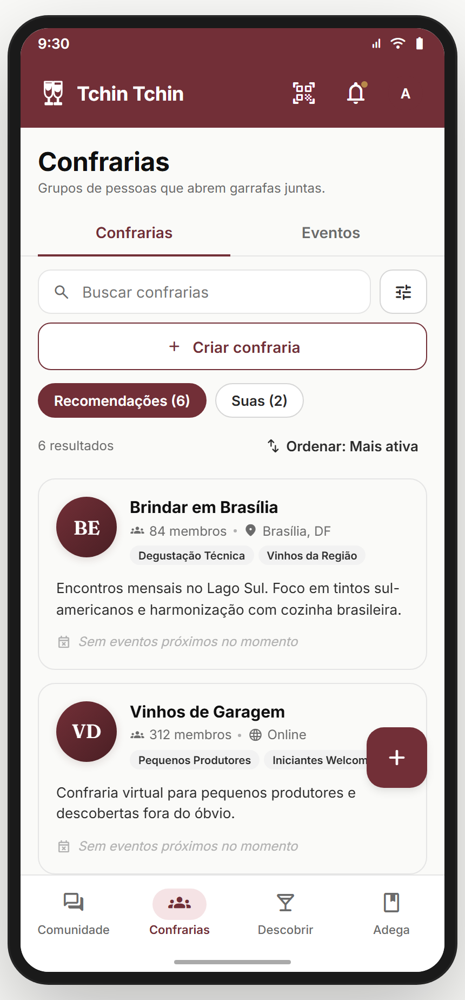 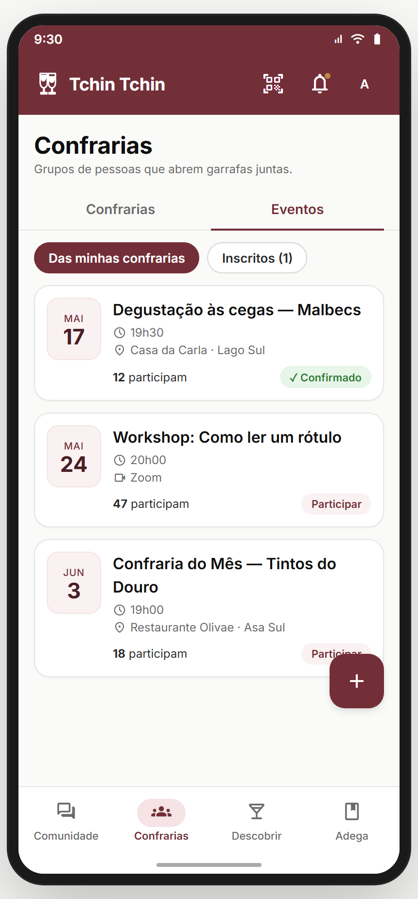

**Propósito:** hub de confrarias — explorar recomendadas, ver as suas, buscar/filtrar, criar. **US-CONF-01.**
**Entradas:** bottom nav "Confrarias". **Saídas:** "Criar confraria" → `wizard-confraria-1`; tap card → `confraria-detalhe`.

**Layout:**
- Header "Confrarias — Grupos de pessoas que abrem garrafas juntas".
- **2 main tabs:** Confrarias | Eventos *(Eventos detalhado no Módulo 12)*.
- **Tab Confrarias:** busca + filtros (atividade/modalidade/estilo, com badge de contagem) + 2 sub-tabs **Recomendadas** | **Suas** + ordenação (mais ativa / mais membros / mais recente).
- CTA "Criar confraria".
- Empty state quando "Suas" está vazia.

**Analytics:** `confrarias_view { tab }`, `confraria_search { q }`, `confraria_filter { key }`, `confraria_create_click`, `confraria_open { id }`.

> **⚠️ DIVERGÊNCIA — confrarias mock** (`MOCK_CONFRARIAS`). Backend: descoberta real por proximidade (GPS) + estilo + atividade.
> **⛔ FALTA NO APP (épico "Filtros das Confrarias"):** filtros avançados completos (distância, dia da semana, faixa de preço dos encontros, vagas abertas). Backlog **CONF-FILTERS-ADV**.

**Status:** ✅

---

## 11.2 `confraria-detalhe` — Detalhe (4 abas) ✅

_Eventos · Publicações · Membros · Adega:_

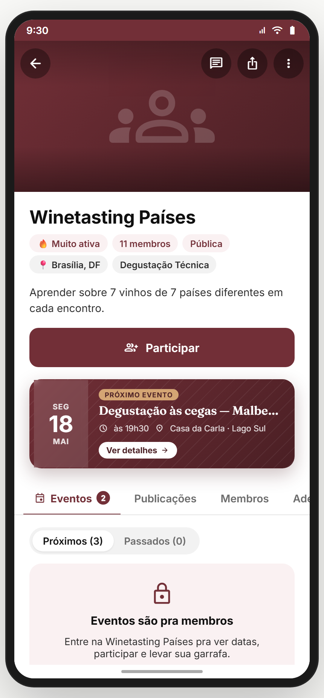 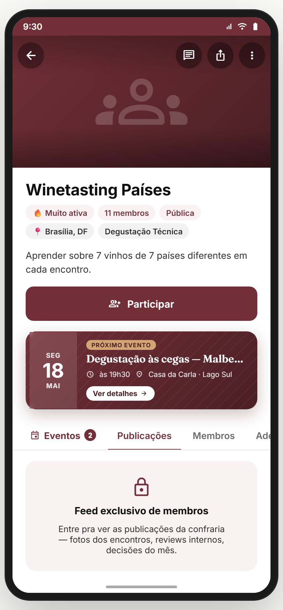 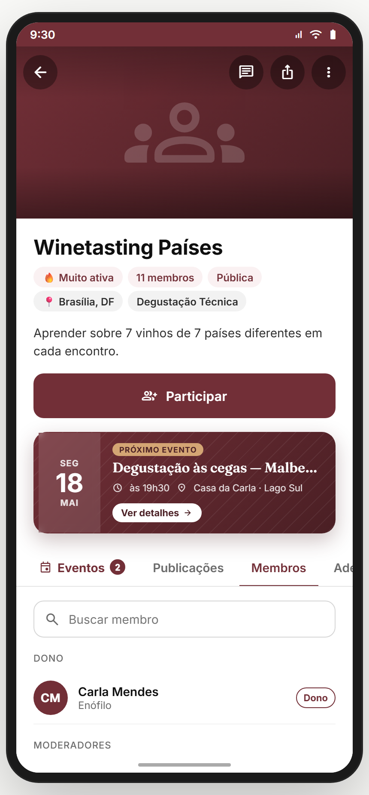 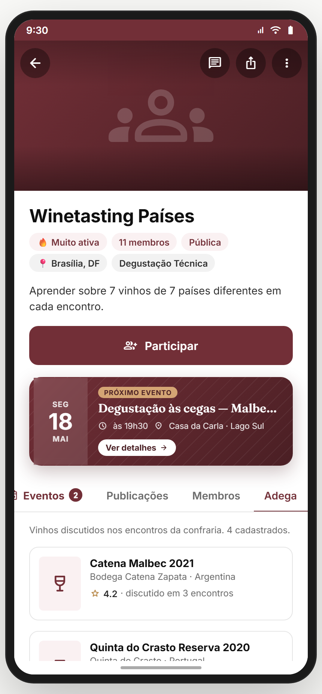

**Propósito:** tela central da confraria. Header (capa + nome + atividade + N membros + privacidade + cidade) + 4 abas + menu de ações. **US-CONF-03.**
**Entradas:** card da home; fim do onboarding; pós-criação. **Saídas:** "Participar" (entrar); abas; menu ⋯ → gestão; evento → `event-detalhe`.

**Layout (`ConfrariaDetalheScreen`):**
- Header: capa + nome (ex.: "Winetasting Países") + chips "Muito ativa · 11 membros · Pública" + cidade + estilo + **"Participar"** (ou "Entrar"/"Sair" conforme estado).
- **4 abas:**
  - **Eventos** — próximos (N) / passados (N); card de próximo evento em destaque ("Degustação às cegas") + "Ver detalhes" → `event-detalhe`. Membros-only: "Eventos são pra membros · Entre... pra ver datas".
  - **Publicações** — mural/feed da confraria (posts, fotos, papo).
  - **Membros** — lista de membros com avatar/nível/papel.
  - **Adega** — vinhos coletivos da confraria.
- **Menu ⋯** (admin): config · convidar · regras · transferir · sair.

**Estados:** admin vs membro vs não-membro; just-created (checklist); empty por aba (gated por membership).
**Analytics:** `confraria_detail_view { id, isMember, isAdmin }`, `confraria_tab { tab }`, `confraria_join { id }`, `confraria_menu_action { action }`.

> **⚠️ DIVERGÊNCIA — conteúdo das abas é mock.** Backend: feed real, RSVP real, membros reais.
> **⛔ FALTA NO APP (épico pede):** **moderação** (admin remove post/membro, reportar). Backlog **CONF-MODERATION**.

**Status:** ✅

---

## 11.3 Wizard de criação (6 passos) ✅

_P1 nome · P2 template · P3 personalizar · P4 localização · P5 revisar · P6 1º encontro:_

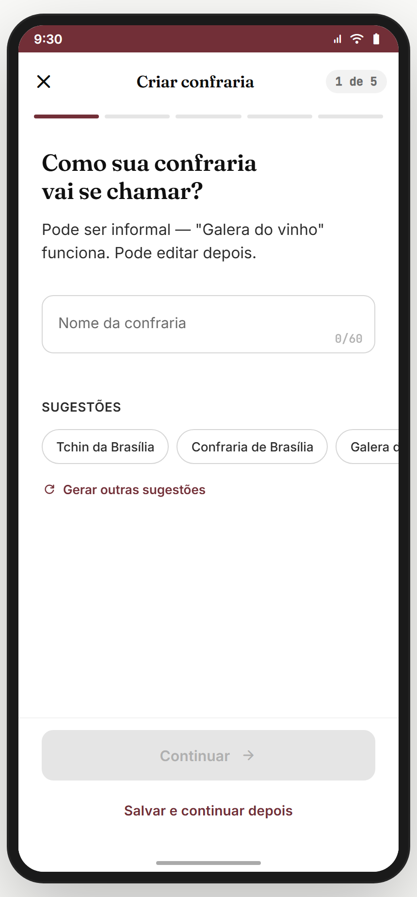 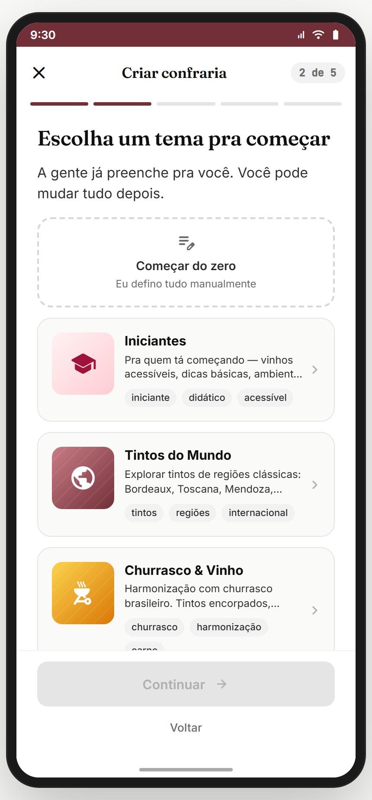 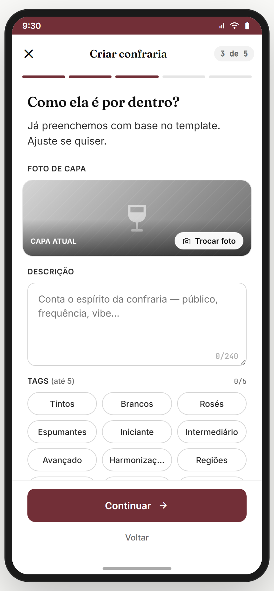 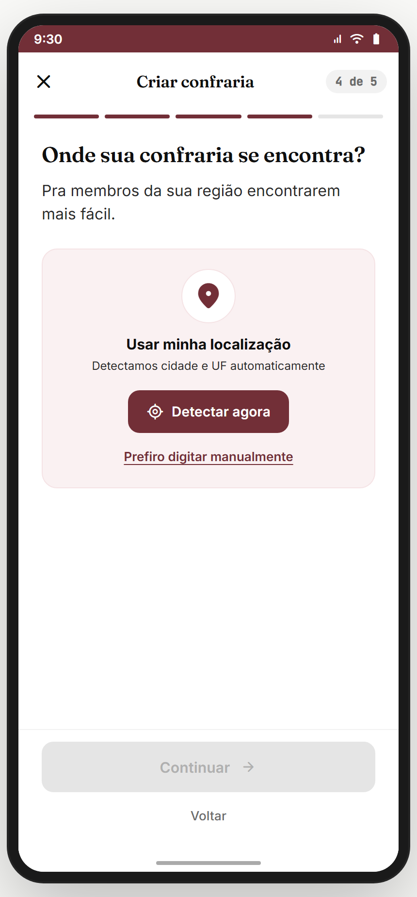 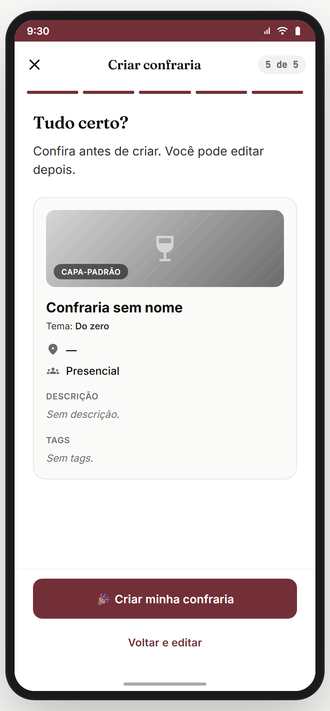 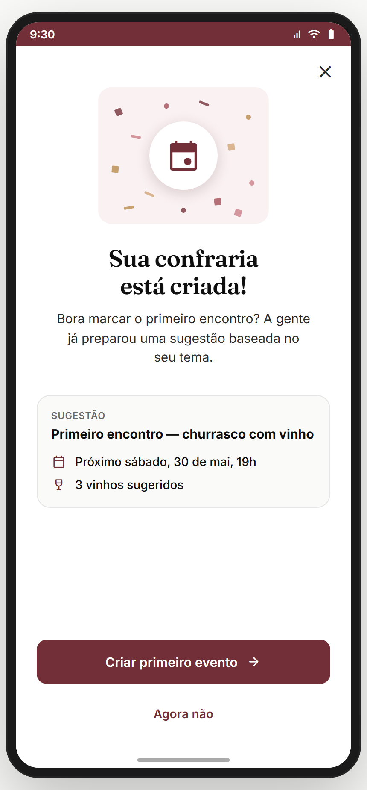

**Propósito:** criar confraria em 6 passos guiados, com templates e sugestões. **US-CONF-02.**
**Entradas:** "Criar confraria" (home); intent `gps_primer_then_wizard` (Módulo 02). **Saídas:** P6 → `event-wizard` ou `confraria-detalhe`.

| Passo | Tela | Coleta | Destaques |
|---|---|---|---|
| **P1** | `WizardCriarConfrariaP1` | Nome (3-60 chars) | 4 sugestões por cidade + "Gerar outras"; salvar rascunho (`tc.wizard.confraria.draft`); modal ao cancelar com texto |
| **P2** | `WizardCriarConfrariaP2` | Template | 5 curados (Iniciantes/Tintos do Mundo/Churrasco & Vinho/Wine & Netflix/Girls Wine Night) + "Do zero" |
| **P3** | `WizardCriarConfrariaP3` | Descrição (240) + tags (≤5) + tipo encontro (Presencial/Online/Ambos) + regras opcionais (400) | pré-preenchido pelo template |
| **P4** | `WizardCriarConfrariaP4` | Localização (GPS ou manual cidade/UF) | **auto-skip se Online**; estados invite/prompting/granted/manual |
| **P5** | `WizardCriarConfrariaP5` | Revisar (resumo) | criação **async** ("🎉 Vamos lá!"), loading + erro |
| **P6** | `BoraMarcarPrimeiroEncontroScreen` | — | celebração (confetti) + sugestão de 1º evento → `event-wizard` ou "Agora não" |

**Persistência:** rascunho em `tc.wizard.confraria.draft` (P1).
**Analytics:** `brotherhood_template_selected`, `brotherhood_p3_completed`, `gps_requested_in_wizard`, `gps_response_in_wizard`, `brotherhood_create_submitted/created/failed`, `first_event_cta_shown/clicked/skipped`.

> **⚠️ DIVERGÊNCIA — criação é mock async** (resolve `{brotherhoodId}` fake). Backend: criar confraria real + retornar id.
> **⛔ FALTA NO APP (épico pede):** **upload de capa real** (P3 usa gradiente do template; "Trocar capa" é placeholder). Backlog **CONF-COVER-UPLOAD**.

**Status:** ✅

---

## 11.4 Gestão (admin) ✅

_Config · Convidar · Sair · Transferir · Regras:_

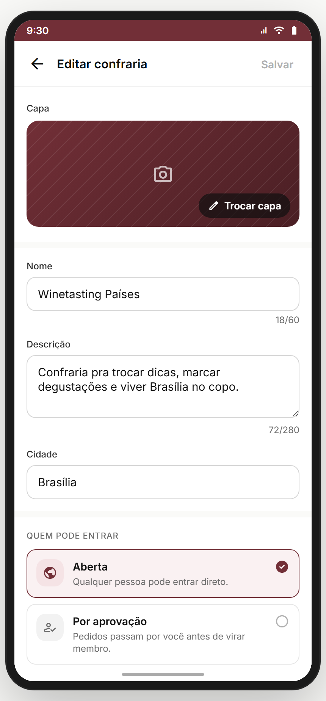 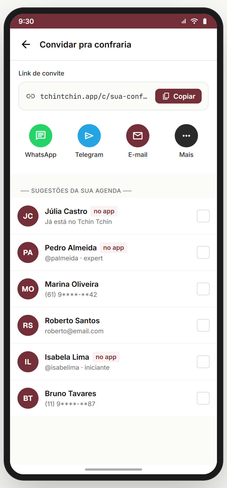 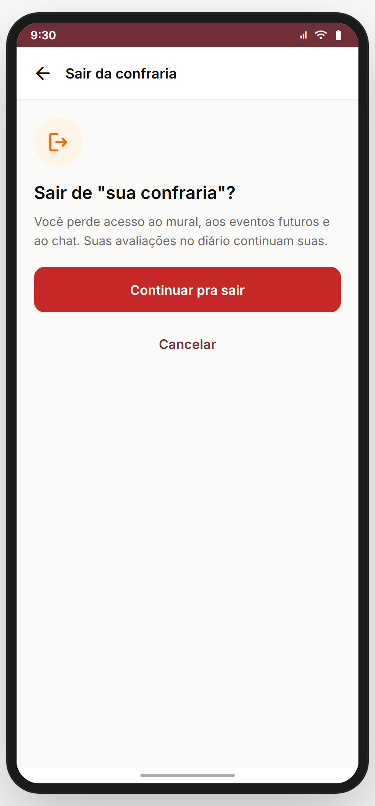 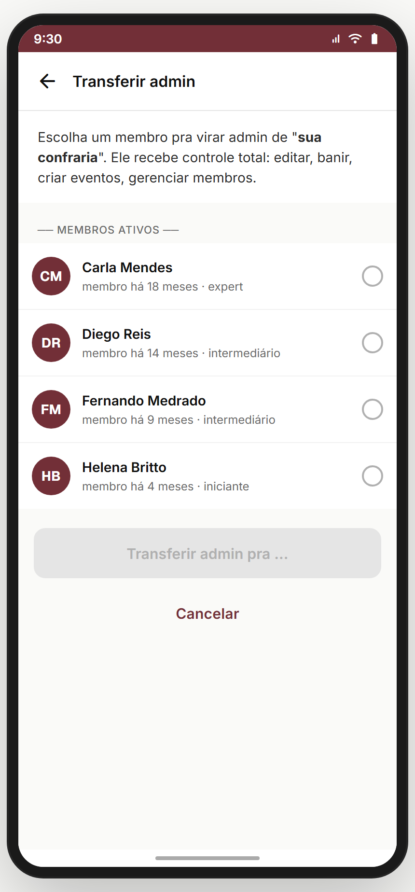 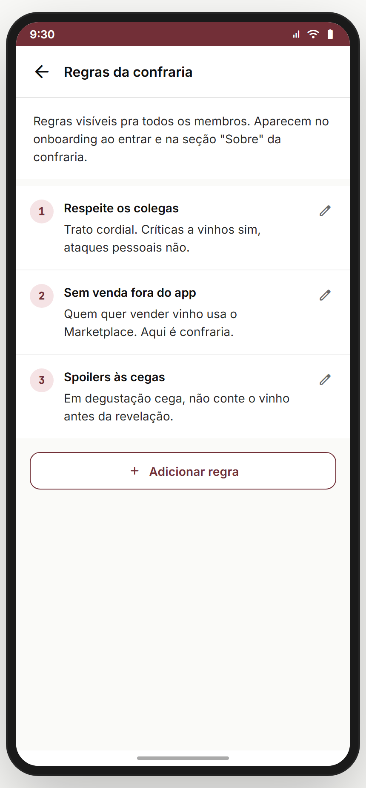

**Propósito:** telas de gestão acessadas pelo menu ⋯ do detalhe. **US-CONF-04/06/07/08.**

- **`confraria-config`** (admin) — editar capa/nome/descrição/cidade + **privacidade** (Aberta/Por aprovação/Fechada) + recursos (aprovar posts antes / chat coletivo) + **Zona Admin** (transferir / arquivar / excluir com 2FA). "Salvar" disabled se não-dirty.
- **`confraria-convidar`** — link de convite (copiar) + 4 share buttons (WhatsApp/Telegram/E-mail/Mais) + **sugestões da agenda** (6 contatos com checkbox) + "Enviar N convites".
- **`confraria-sair`** — 2 passos: confirmação (com aviso especial se admin → "Transfira admin antes") → motivo (5 opções) → "Sair definitivamente" → `confrarias`.
- **`confraria-transferir`** — lista de membros ativos (radio) → "Transferir admin pra {nome}".
- **`confraria-regras`** (admin) — editar regras visíveis (3 defaults: Respeito / Sem venda / Spoilers); aparecem no onboarding e no "Sobre".

**Analytics:** `confraria_config_save`, `confraria_invite_send { count }`, `confraria_invite_copy_link`, `confraria_leave { reason }`, `confraria_transfer_admin { to }`, `confraria_rules_edit`.

> **🐛 BUG — badge "no app" invertido** em `confraria-convidar`: contatos que "Já estão no Tchin Tchin" mostram badge **"no app"** (deveria ser o contrário — quem NÃO tem app). Lógica do badge invertida. **Corrigir.**
> **⚠️ DIVERGÊNCIA — sugestões da agenda mock.** Real: integrar com contatos do device (permissão) + cruzar com base de usuários.
> **⛔ FALTA NO APP (épico pede):** **fila de aprovação** (privacidade "Por aprovação" precisa de tela pra admin aceitar/recusar pedidos). Backlog **CONF-APPROVAL-QUEUE**.
> **⛔ FALTA NO APP (épico pede):** **arquivar/excluir reais** + 2FA. Hoje UI sem backend. Backlog **CONF-ARCHIVE-DELETE**.

**Status:** ⚠️ (UI completa; bug do badge + backend de gestão pendentes)

---

## 11.5 Onboarding pós-entrada + tutorial ✅

_Welcome · Apresentar · Tour (3 slides):_

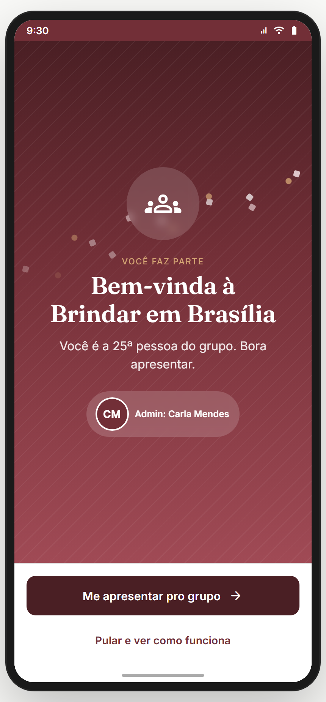 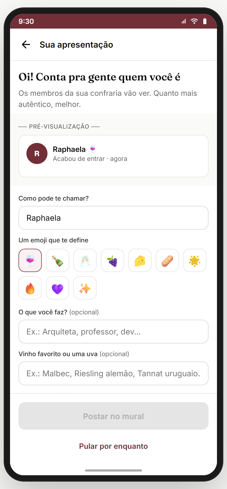 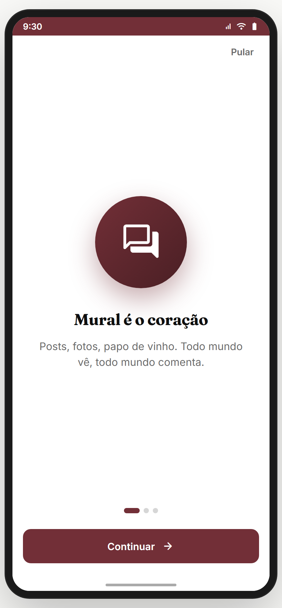 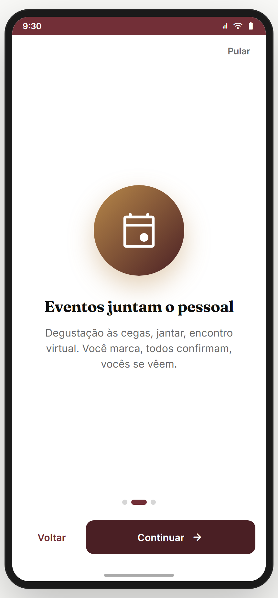 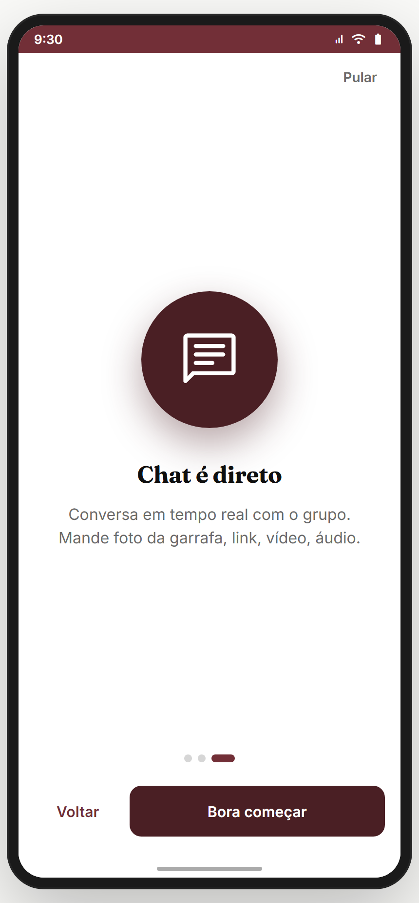

**Propósito:** acolher o novo membro — celebrar entrada, apresentar-se ao grupo, e ensinar como a confraria funciona. **US-CONF-05.**
**Entradas:** ao entrar numa confraria. **Saídas:** encadeado welcome → apresentar → tour → `confraria-detalhe`.

- **`confraria-welcome`** — gradiente + confetti + "VOCÊ FAZ PARTE · Bem-vinda à {nome}" + "Você é a Nª pessoa do grupo. Bora apresentar." + admin card. CTAs: "Me apresentar pro grupo" / "Pular e ver como funciona".
- **`confraria-apresentar`** — form de apresentação (nome + emoji [10 opções] + profissão + vinho favorito + história 240 chars) com **pré-visualização** do post + "Postar no mural" / "Pular por enquanto".
- **`confraria-tour-rapido`** — 3 slides: **Mural é o coração** · **Eventos juntam o pessoal** · **Chat é direto**. Skip → detalhe; último → "Bora começar" → detalhe.

**Tutorial conversacional `confraria-usar`** (TchinTutor, auto-trigger no detalhe na 1ª visita) — 3 steps:

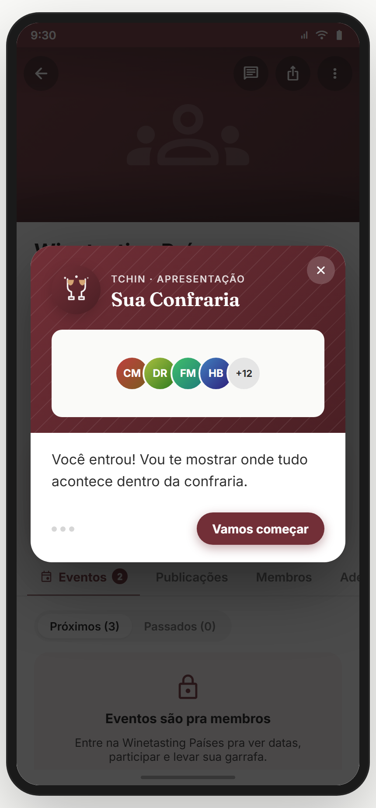 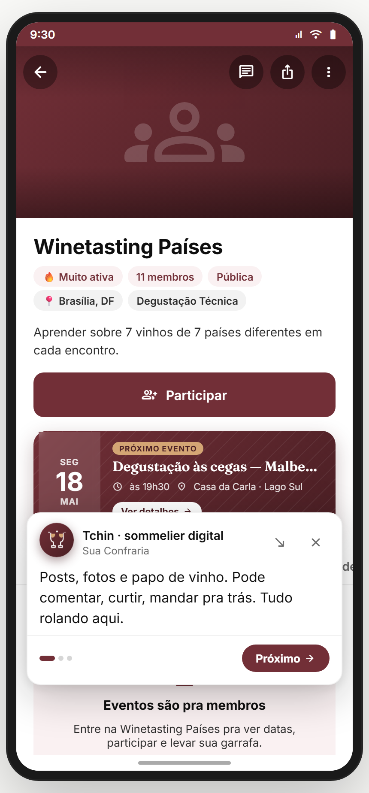 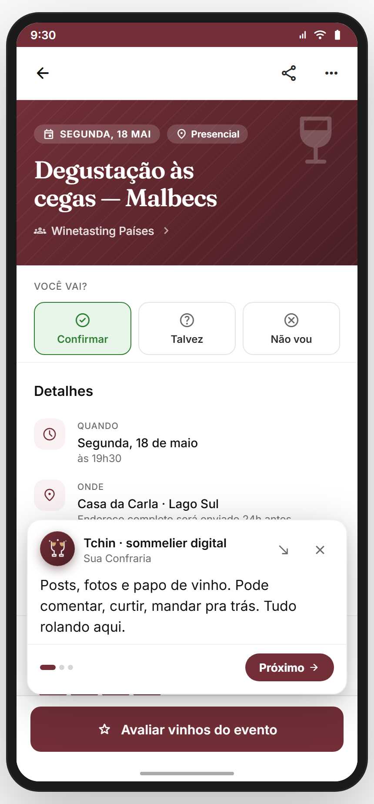 

- Intro "Sua Confraria · Você entrou! Vou te mostrar onde tudo acontece." → Mural é o coração → Encontros marcados → (chat/membros).

> **⚠️ DIVERGÊNCIA — DOIS onboardings sobrepostos:** o fluxo welcome→apresentar→tour **E** o tutorial conversacional `confraria-usar` ambos rodam na entrada. Redundante. **Recomendação PO:** escolher um (provavelmente o welcome→apresentar→tour, que é mais rico; o tutorial vira opcional via menu).
> **⚠️ DIVERGÊNCIA — `confraria-apresentar` posta mock** (toast, não cria post real no mural). Backend pendente.
> **⚠️ Nota BACK_SKIP:** `confraria-welcome`, `confraria-apresentar`, `confraria-tour-rapido` estão no BACK_SKIP (Módulo 02) pra não cair no onboarding ao voltar — corrige o loop que existia.

**Status:** ✅ (com redundância de onboarding a resolver)

---

## Edge cases & navegação reversa
- **BACK_SKIP** cobre as 3 telas de onboarding da confraria — voltar não reabre o loop.
- **Wizard cancelar** com texto digitado → modal de confirmação (não perde sem avisar).
- **Sair sendo admin** → bloqueia até transferir admin.
- **Privacidade "Por aprovação"** → falta a fila de aprovação (entrar não é instantâneo).
- **Refresh no wizard** → P1 tem rascunho (`tc.wizard.confraria.draft`); P2–P6 perdem.

## Pendências de backend / decisões do PO
### Críticas (bloqueadores GA)
- **CRUD real de confraria** (criar/editar/arquivar/excluir) + papéis + privacidade.
- **Feed/mural, RSVP, membros, adega coletiva** reais (hoje mock).
- **Fila de aprovação** (privacidade por aprovação).
- **Fix bug** do badge "no app" invertido (convidar).
### Importantes
- Upload de capa real.
- Moderação (remover post/membro, reportar).
- Convites: integração com contatos do device.
- Filtros avançados (distância/dia/preço/vagas).
### Decisões do PO
- **Unificar os 2 onboardings** (welcome→apresentar→tour vs tutorial confraria-usar).
- Confraria paga? (mensalidade/rachão de eventos → Módulo 12 financeiro).
- Limite de membros? confraria privada vs pública nas buscas?

## Conexões com outros módulos
- **Módulo 02 (Onboarding)** — intent `gps_primer_then_wizard` entra no wizard; BACK_SKIP.
- **Módulo 12 (Eventos)** — wizard P6 → criar evento; aba Eventos do detalhe; financeiro/rachão.
- **Módulo 13 (Comunidade)** — mural/publicações da confraria.
- **Módulo 16 (Indicação/Convites)** — convidar reusa padrão de share/link.
- **Módulo 17 (Chat)** — "Chat é direto" do tour → chat da confraria.
- **Módulo 08 (Treino)** — backlog: liga entre membros da confraria.
