# Módulo 12 — Eventos

> O **momento** da confraria: encontro pra abrir garrafas juntos. Criar (wizard 5 passos) → divulgar → RSVP → gerenciar presença + **pagamentos/rachão (LACI)** → pós-evento (avaliar vinhos + ata). É o que transforma grupo em comunidade ativa.
> **Fonte de verdade:** `screens-event-wizard-p1…p5.jsx` (wizard), `screens-event-detalhe.jsx` (`EventDetalheScreen`), `screens-organizador.jsx` (`EventoEditarScreen` + `EventoPresencaScreen` + `EventoPosAvaliarScreen` + `EventoPosAtaScreen`), `screens-resumo-pos-evento.jsx` (card de resumo). Doc funcional: **MVP2 Épico 2** + **MVP2 Épico 3 (Financeiro/Rachão)** + **Sprint 11-13 Épico T5**.
> **Épicos/US:** US-EV-01 (criar — wizard), US-EV-02 (detalhe + RSVP), US-EV-03 (editar), US-EV-04 (presença/check-in), US-EV-05 (pagamentos/rachão — LACI/Celcoin), US-EV-06 (pós: avaliar vinhos), US-EV-07 (pós: ata), US-EV-08 (resumo pós-evento no feed).

**Regra de negócio canônica:** evento é criado por admin da confraria (wizard 5 passos). Pode ser **gratuito** ou **valor fixo por pessoa**. RSVP: Confirmar / Talvez / Não vou. **Quem confirma vê o endereço completo 24h antes.** Pagamento via **LACI** (reconhecido automático) ou pago pela conta ou marcado manualmente pelo admin. Pós-evento: avaliar vinhos (vai pro diário + média da confraria) + publicar ata (foto + destaques).

## Mapa do fluxo
```
[confraria P6 / aba Eventos / "Criar evento"] → event-wizard 1→2→3→4→5 → confraria-detalhe (justCreated)
   1 nome+tipo+capa · 2 data/hora/local · 3 vinhos (auto por paladar/manual/scanner) · 4 capacidade+pagamento+RSVP+lembretes · 5 revisar+publicar

event-detalhe ─┬─ RSVP (Confirmar/Talvez/Não vou)
               ├─ menu organizador: editar · gerenciar (presença/pagamentos) · ata · convidar · cancelar
               ├─ menu membro: chat · calendário · direções · compartilhar · silenciar · denunciar
               └─ [pós-evento] "Avaliar vinhos" → evento-pos-avaliar → evento-pos-ata

evento-presenca (admin): aba Presença (check-in) | aba Pagamentos (LACI/conta/manual, arrecadado/meta, cobrar, exportar CSV)
```

---

## 12.1 Wizard de criar evento (5 passos) ✅

_P1 nome/tipo · P2 quando/onde · P3 vinhos · P4 capacidade/pagamento · P5 revisar:_

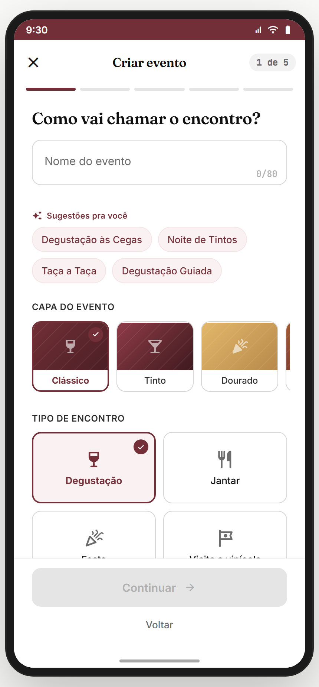 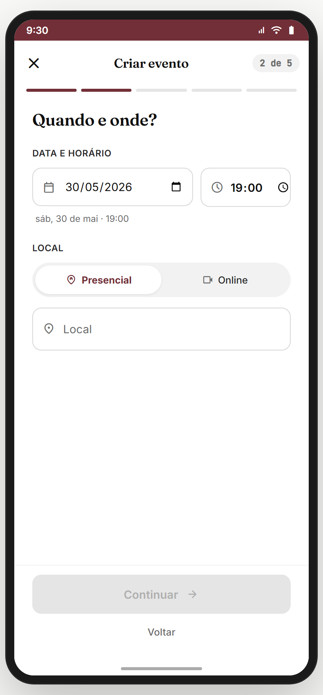 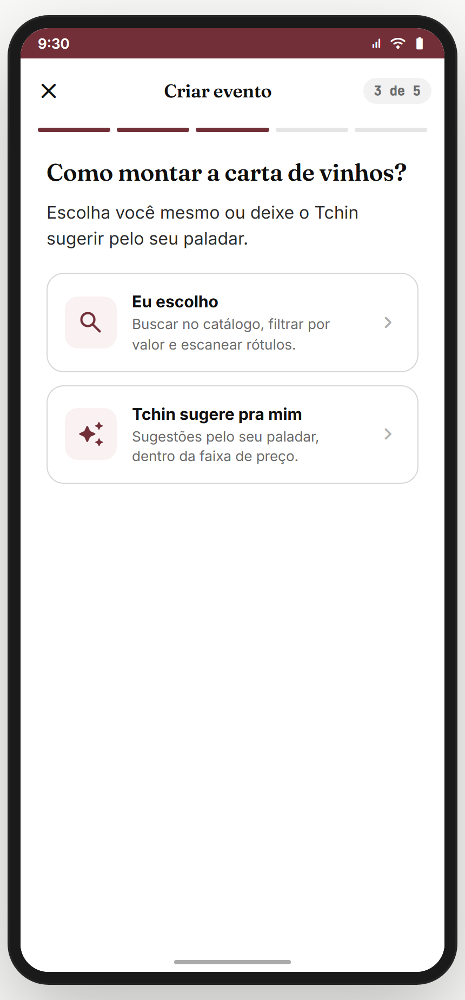 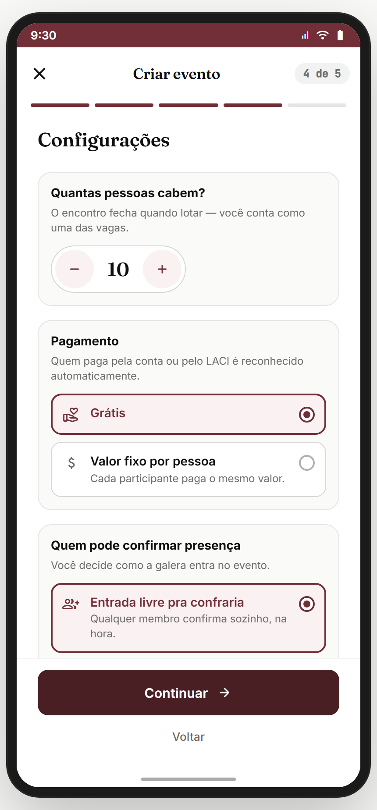 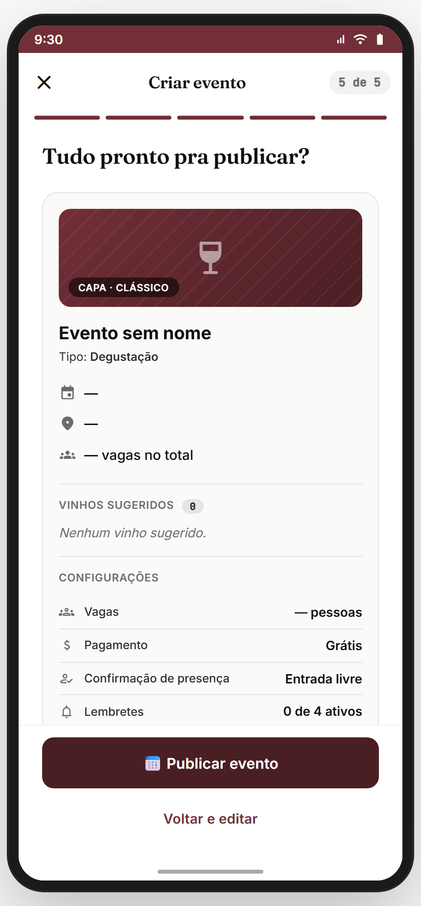

**Propósito:** criar evento em 5 passos guiados. **US-EV-01.**
**Entradas:** confraria P6 ("Criar primeiro evento"); aba Eventos; detalhe → "Agendar próximo". **Saídas:** P5 publica → `confraria-detalhe { justCreated }`.

| Passo | Coleta | Destaques |
|---|---|---|
| **P1** | Nome (3-80) + tipo (degustação/jantar/festa/visita/outro) + capa | sugestões de nome; rascunho `tc.wizard.event.draft` |
| **P2** | Data + hora + modo (Presencial/Online) + endereço/link | default próximo sábado 19h; nota de privacidade do endereço |
| **P3** | Vinhos (manual / **sugestão auto por paladar** / scanner) | faixas de preço (budget/mid/premium); toggle "membros podem sugerir"; quiz inline se sem paladar |
| **P4** | Capacidade (2-50) + **pagamento (grátis / valor fixo por pessoa)** + RSVP (livre/aprovação) + lembretes (push 3d/1d/dia + email .ics) | CurrencyInput se pago |
| **P5** | Revisar + **Publicar** (async) | resumo completo; loading + erro |

**Persistência:** rascunho por passo em `tc.wizard.event.draft`.
**Analytics:** `publish_event_attempt`, `publish_event_success`, `brotherhood_event_p{n}`.

> **⚠️ DIVERGÊNCIA — vinhos não conectados ao custo.** P3 (vinhos) e P4 (pagamento) são independentes — o valor por pessoa é manual, não calculado a partir dos vinhos escolhidos. **Recomendação:** sugerir valor com base no custo dos vinhos ÷ capacidade. Backlog **EV-COST-FROM-WINES**.
> **⛔ FALTA NO APP (épico pede):** **upload de capa real** (placeholder gradiente). Backlog **EV-COVER-UPLOAD**.

**Status:** ✅

---

## 12.2 `event-detalhe` — Detalhe + RSVP ✅

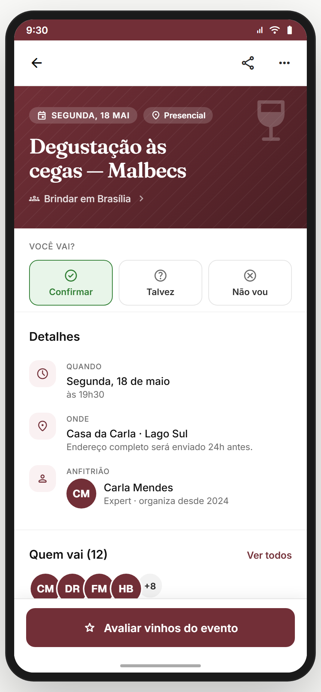

**Propósito:** página do evento — info + RSVP + quem vai + vinhos + organizador + ações. **US-EV-02.**
**Entradas:** card de evento (confraria/home); pós-criação. **Saídas:** RSVP; menu → editar/presença/ata/chat; "Avaliar vinhos" (pós) → `evento-pos-avaliar`.

**Layout (`EventDetalheScreen`):**
- Hero (gradiente por tipo) + pills: data ("SEGUNDA, 18 MAI") · modalidade ("Presencial").
- Título ("Degustação às cegas — Malbecs") + confraria.
- **"VOCÊ VAI?"** — RSVP: **Confirmar** / Talvez / Não vou.
- **Detalhes**: Quando · Onde ("Endereço completo será enviado 24h antes." se não-confirmado) · Anfitrião.
- **Quem vai (N)** — stack de avatares + "Ver todos".
- Vinhos sugeridos + descrição + lembretes.
- CTA "Avaliar vinhos do evento" (pós-evento).

**Estados:** antes vs depois (isPast); organizador vs membro (menus diferentes); gratuito vs pago.
**Menu organizador:** Editar · Ver RSVPs/pagamentos · Convidar · Chat · Cancelar (pré); Avaliar · Publicar ata · Lista final · Agendar próximo (pós).
**Menu membro:** Chat · Calendário · Direções · Compartilhar · Silenciar · Denunciar.
**Analytics:** `event_detail_view { id, isPast, isOrganizer }`, `event_rsvp { status }`, `event_menu_action { action }`.

> **⚠️ DIVERGÊNCIA — regra "endereço 24h antes"** é copy, não enforced (mock mostra endereço). Backend precisa gate real.
> **⛔ FALTA NO APP (épico pede):** **adicionar ao calendário (.ics)** real + **direções** (deep link mapas). Hoje placeholders.

**Status:** ✅

---

## 12.3 `evento-editar` — Editar evento ✅

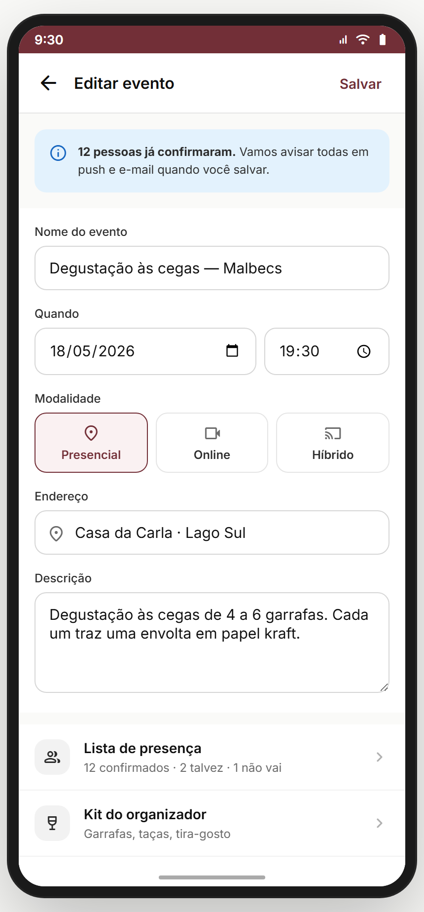

**Propósito:** organizador edita dados do evento criado. **US-EV-03.**
**Entradas:** menu do detalhe → "Editar". **Saídas:** salvar → back.
**Layout (`EventoEditarScreen`):** form com os campos do wizard (nome/data/local/capacidade/pagamento) editáveis + salvar.

> **⚠️ DIVERGÊNCIA — editar não notifica participantes.** Mudar data/local de evento com gente confirmada deveria disparar push. Backlog **EV-EDIT-NOTIFY**.

**Status:** ✅

---

## 12.4 `evento-presenca` — Presença + Pagamentos/Rachão (LACI) ✅

_Aba Presença (check-in) · aba Pagamentos (LACI/conta/manual):_

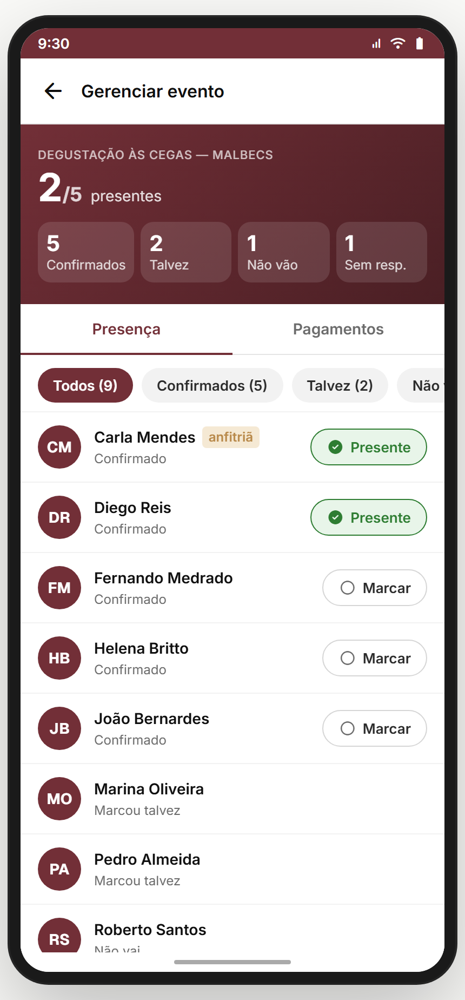 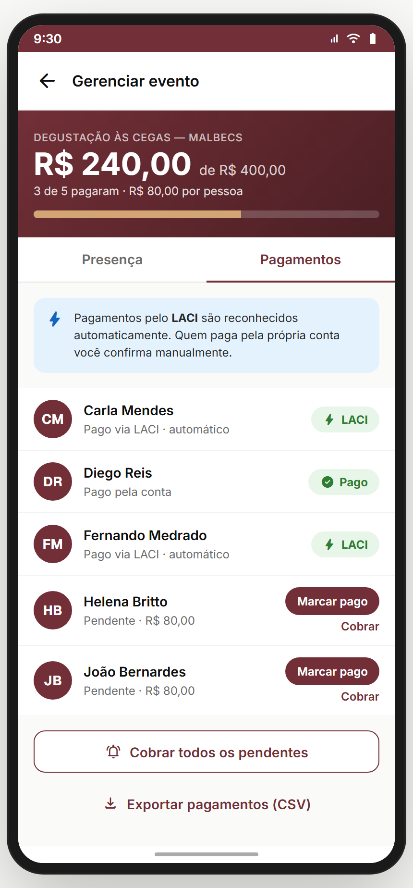

**Propósito:** painel do organizador pra gerenciar quem vem e quem pagou. **É aqui que vive o financeiro/rachão.** **US-EV-04/05.**
**Entradas:** menu do detalhe → "Gerenciar evento" / "Ver RSVPs/pagamentos". **Saídas:** back.

**Layout (`EventoPresencaScreen`)** — 2 abas:
- **Presença**: hero com "{checados}/{confirmados} presentes" + grid de stats (Confirmados/Talvez/Não vão/Sem resp.) + filtros + lista com check-in manual.
- **Pagamentos** (se evento pago): hero com **"R$ {arrecadado} de R$ {meta}"** + "{X} de {Y} pagaram · R$ {valor} por pessoa" + barra de progresso. Lista de confirmados com status de pagamento:
  - **LACI** (badge verde "LACI" — reconhecido automático).
  - **Pago** (badge "Pago" — pela conta).
  - **Pendente** → botões "Marcar pago" / "Cobrar".
  - Banner: "Pagamentos pelo **LACI** são reconhecidos automaticamente. Quem paga pela própria conta você confirma manualmente."
  - CTAs: **"Cobrar todos os pendentes"** + **"Exportar pagamentos (CSV)"**.

**Helpers:** `eventFixedAmount(ev)`, `fmtBRL()`. `payMethod`: 'laci' | 'conta' | null.
**Analytics:** `event_checkin { name }`, `event_payment_mark { name }`, `event_payment_charge_all`, `event_payment_export_csv`.

> **✅ NOTA — financeiro mais maduro que o esperado:** ao contrário do que parecia, o rachão **existe** com LACI (reconhecimento automático de pagamento), cobrança de pendentes e exportação CSV. É **valor fixo por pessoa** (não split dinâmico de despesas variáveis).
> **⚠️ DIVERGÊNCIA — LACI é mock.** Integração real (LACI/Celcoin) pendente: webhook de confirmação de Pix → marca pago automático. Backlog **EV-LACI-REAL** (bloqueador GA do financeiro).
> **⛔ FALTA NO APP (épico pede):** **split dinâmico** (rateio de despesas reais lançadas pós-evento: "gastei R$ 400 em vinho + R$ 100 em queijo, divide entre os 6 presentes"). Hoje só valor fixo pré-definido. Backlog **EV-SPLIT-DYNAMIC**.
> **⛔ FALTA NO APP (épico pede):** **check-in via QR code** (o épico menciona QR; hoje é check-in manual por lista). Backlog **EV-QR-CHECKIN**.
> **⛔ FALTA NO APP (épico pede):** **reembolso/cancelamento** (quem pagou e o evento cancela). Backlog **EV-REFUND**.

**Status:** ⚠️ (UI completa incl. financeiro; LACI real + split dinâmico + QR pendentes)

---

## 12.5 Pós-evento: `evento-pos-avaliar` + `evento-pos-ata` ✅

_Avaliar vinhos · Ata do encontro:_

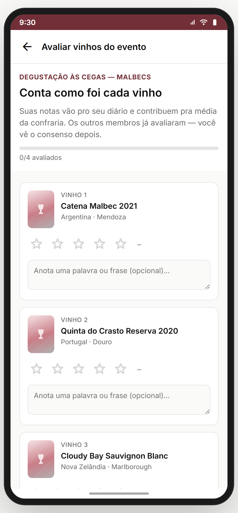 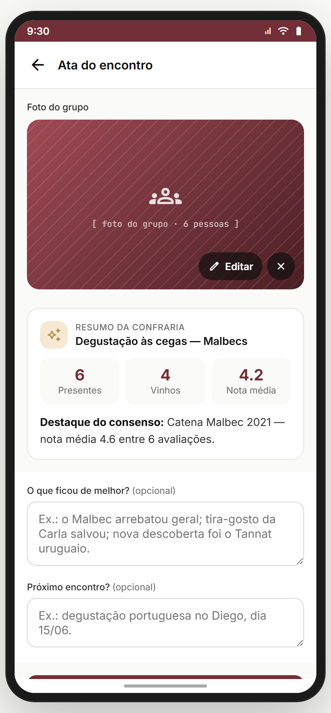

**Propósito:** fechar o ciclo do evento — registrar os vinhos provados + publicar memória/ata no mural. **US-EV-06/07.**

**`evento-pos-avaliar` (`EventoPosAvaliarScreen`):**
- Hero com progresso "{done}/{total} avaliados" + copy "Suas notas vão pro seu diário e contribuem pra média da confraria."
- Card por vinho: bottle + nome + país/região + **5 estrelas** + textarea ("Anota uma palavra ou frase").
- CTA "Salvar N e continuar" / "Continuar pra ata" → `evento-pos-ata { ratings, notes }`.

**`evento-pos-ata` (`EventoPosAtaScreen`):**
- **Foto do grupo** (collage placeholder + Editar/remover).
- Campos: destaque do encontro + próximo passo.
- Publica ata no mural da confraria.

**Card de resumo pós-evento** (`screens-resumo-pos-evento.jsx`, gerado 24h depois, publicado no feed):
- Variante **enxuta** (<3 registros): empático ("Quem foi já sente saudade 🍷").
- Variante **rich** (≥3): grid de stats (check-ins/vinhos/fotos) + vinho top + grid de fotos. Compartilhável nos Stories.

**Analytics:** `event_rate_wine { wineId, rating }`, `event_rate_complete { count }`, `event_ata_publish`, `post_event_summary_show { variant }`, `post_event_summary_share`.

> **⚠️ DIVERGÊNCIA — avaliação dos vinhos → diário** deveria criar registros reais no Módulo 07. Hoje mock. Backlog **EV-RATE-TO-DIARY**.
> **⛔ FALTA NO APP (épico pede):** **fotos reais** (upload) na ata + no resumo. Placeholders hoje.
> **⛔ FALTA NO APP (épico pede):** **consenso da confraria** (média das notas de todos os membros pra cada vinho do evento). Copy menciona ("você vê o consenso depois") mas não há tela. Backlog **EV-CONSENSUS**.

**Status:** ✅

---

## Edge cases & navegação reversa
- **Refresh no wizard** → rascunho em `tc.wizard.event.draft` (recupera). 
- **RSVP "Confirmar"** deveria liberar endereço — hoje sempre visível (gate não-enforced).
- **Evento pago + cancelamento** → sem fluxo de reembolso.
- **Editar evento confirmado** → sem notificação aos participantes.
- **Tutorial `evento-usar`** (TchinTutor) existe (3 steps: RSVP / quem vai / chat) e dispara no detalhe — documentado no Módulo 11/06 (sistema de tutoriais).

## Pendências de backend / decisões do PO
### Críticas (bloqueadores GA)
- **CRUD real de evento** + RSVP + capacidade + lista de presença.
- **LACI/Celcoin real** (webhook Pix → pagamento automático) — bloqueador do financeiro.
- **Gate de endereço 24h** (enforced server-side).
- **Avaliação → diário** real (Módulo 07).
### Importantes
- Split dinâmico de despesas (rachão real além do valor fixo).
- QR code de check-in.
- Reembolso/cancelamento.
- Upload de capa + fotos da ata.
- Notificar participantes em edição.
- Consenso da confraria (média das notas).
### Decisões do PO
- Rachão: valor fixo (atual) é suficiente no MVP, ou precisa split dinâmico já?
- Taxa da plataforma sobre pagamentos? (modelo de receita)
- Endereço sempre 24h antes, ou configurável pelo organizador?

## Conexões com outros módulos
- **Módulo 11 (Confrarias)** — evento nasce da confraria (wizard P6); aba Eventos do detalhe.
- **Módulo 03/07 (Paladar/Diário)** — P3 sugere vinhos por paladar; avaliação → diário.
- **Módulo 13 (Comunidade)** — ata + resumo publicados no mural.
- **Módulo 17 (Chat)** — chat do evento.
- **Módulo 18 (Notificações)** — lembretes (3d/1d/dia), cobrança de pagamento.
- **Financeiro (transversal, LACI/Celcoin)** — vive aqui (aba Pagamentos).
