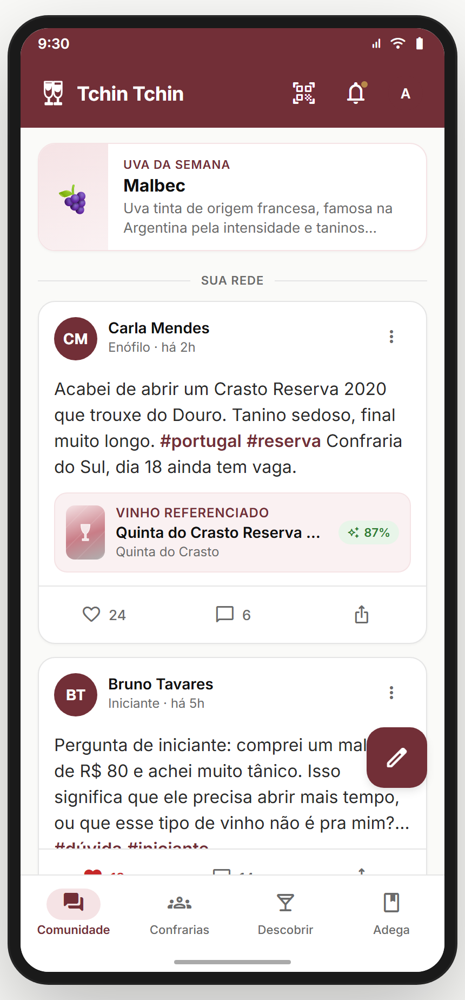
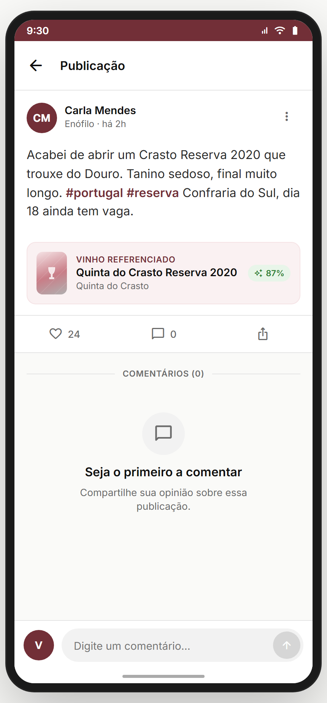
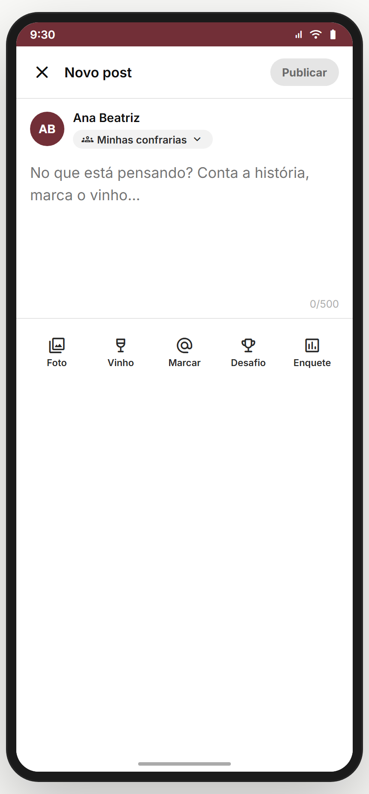
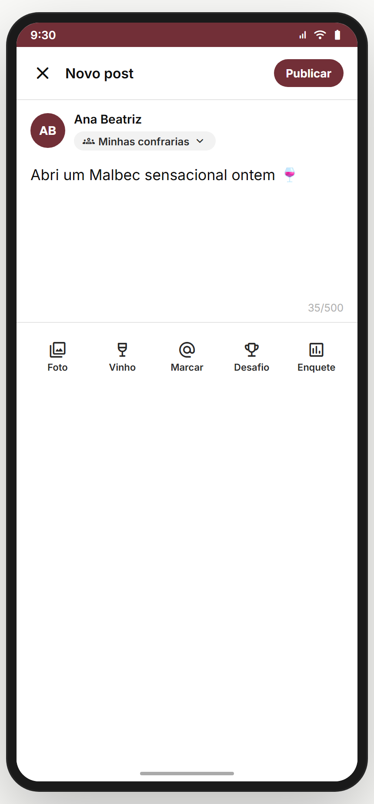
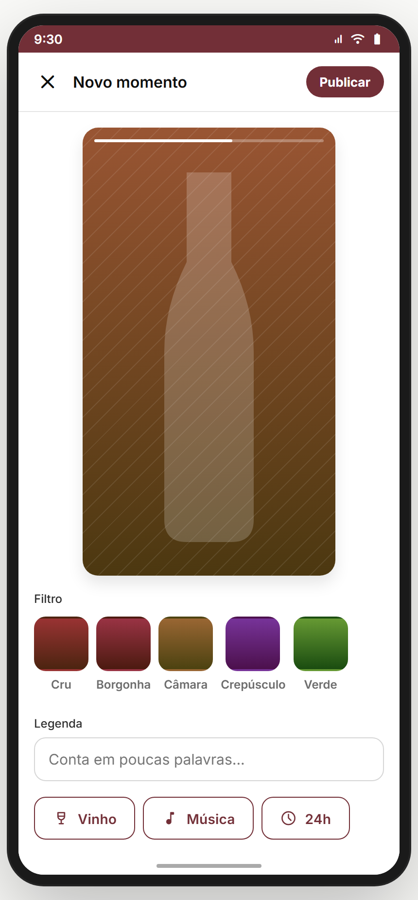
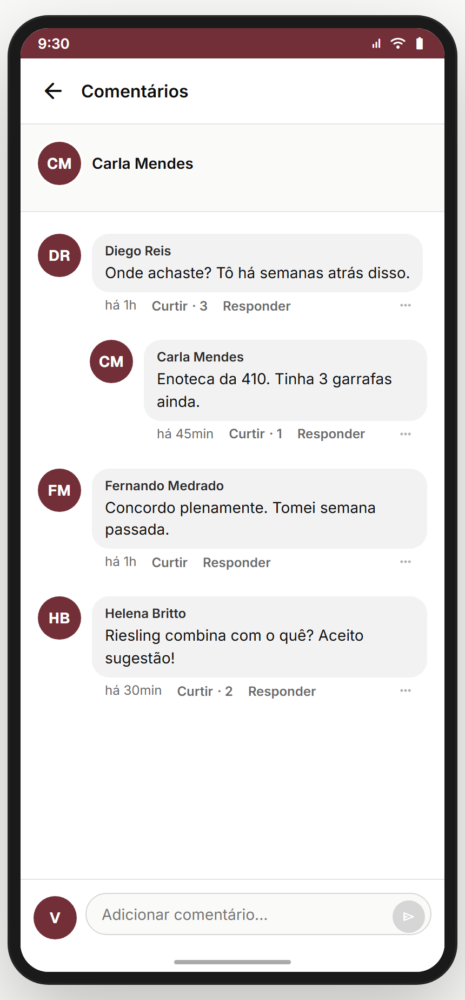

# Módulo 13 — Comunidade & Feed

> O **feed social** do app — onde a rede acontece fora das confrarias. Posts com vinho referenciado, hashtags, curtidas/comentários, blocos editoriais (Uva da Semana), e ganchos de crescimento (sugestão de confrarias, banner de indicação) entremeados no feed.
> **Fonte de verdade:** `screens-app.jsx` (`ComunidadeScreen` feed + `PostDetailScreen` + `PostCard`), `screens-criar-post.jsx` (`CriarPostScreen` + `CriarMomentoScreen` + `ComentariosScreen`). Doc funcional: **MVP1 Épico 2** + **MVP2 Épico 15**.
> **Épicos/US:** US-COM-01 (feed personalizado), US-COM-02 (criar post), US-COM-03 (momento/story), US-COM-04 (post detalhe + vinho referenciado), US-COM-05 (comentários), US-COM-06 (curtir/compartilhar), US-COM-07 (blocos editoriais + crescimento no feed).

**Regra de negócio canônica:** o feed entremeia **posts da rede** com **blocos não-orgânicos**: sugestão de confrarias (a cada 3 posts) e banner de indicação (após 2 posts). Post pode **referenciar um vinho** (mostra match do leitor). Audiência do post: Todo mundo / Minhas confrarias / Só você. Quem vem via `skip_to_feed` (Módulo 02) cai aqui com viés #educacao por 14 dias *(filtro downstream)*.

## Mapa do fluxo
```
home/comunidade (feed) ─┬─ Uva da Semana (editorial topo)
                        ├─ posts (PostCard) → post-detail
                        ├─ [a cada 3 posts] sugestão de confrarias → confraria-detalhe
                        ├─ [após 2 posts] banner indicação → indicacao-landing
                        └─ FAB criar → criar-post | criar-momento

post-detail ─ post completo + vinho referenciado → wine · comentários inline · curtir/compartilhar
criar-post ─ texto (500) + foto + vinho + audiência → publica
criar-momento ─ story/momento efêmero
comentarios ─ thread de comentários de um post
```

---

## 13.1 `home/comunidade` — Feed (`ComunidadeScreen`) ✅



**Propósito:** feed social com posts + blocos editoriais + ganchos de crescimento. **US-COM-01/07.**
**Entradas:** bottom nav "Comunidade"; intent `skip_to_feed`. **Saídas:** `post-detail`, `confraria-detalhe`, `indicacao-landing`, `criar-post`/`criar-momento` (FAB).

**Layout (`ComunidadeScreen`):**
- **Topo editorial — "Uva da semana"** (card com emoji + nome + descrição curta).
- Divisor **"SUA REDE"**.
- **Feed entremeado** (`feedItems`):
  - **`post`** (`PostCard`) — autor + nível + tempo + texto (com #hashtags) + vinho referenciado (opcional, com match) + curtir/comentar/compartilhar → tap → `post-detail`.
  - **`suggestion`** (a cada 3 posts) — carrossel horizontal "Confrarias que você pode gostar" → `confraria-detalhe`.
  - **`referral`** (após 2 posts) — banner gradiente "Convida um amigo, vocês dois ganham R$ 30" → `indicacao-landing`.

**Estado:** `posts` (de `MOCK_POSTS`), `toggleLike` local. Variação **FeedFirstTime** (Módulo 02) para quem vem do onboarding.
**Analytics:** `feed_view`, `feed_post_open { id }`, `feed_like { id }`, `feed_suggestion_tap { confrariaId }`, `feed_referral_tap`.

> **⚠️ DIVERGÊNCIA — feed mock + ordenação fixa.** Backend: feed real com ranking (seguindo + relevância + recência), paginação, pull-to-refresh.
> **⚠️ DIVERGÊNCIA — viés #educacao (14 dias)** mencionado no Módulo 02/09 não está implementado como filtro real.
> **⛔ FALTA NO APP (épico pede):** **Momentos/Stories** na barra do topo do feed (criar-momento existe mas sem a régua de stories no feed). Backlog **COM-STORIES-RAIL**.
> **⛔ FALTA NO APP (épico pede):** **filtros do feed** (Seguindo / Confrarias / Experts / #tag). Backlog **COM-FEED-FILTERS**.

**Status:** ✅

---

## 13.2 `post-detail` — Publicação (`PostDetailScreen`) ✅



**Propósito:** post completo + vinho referenciado + comentários inline + ações. **US-COM-04/05.**
**Entradas:** tap em post no feed. **Saídas:** vinho referenciado → `wine`; perfil do autor → `perfil-outro`; back.

**Layout (`PostDetailScreen`):**
- Header "Publicação" + back.
- Autor (avatar + nome + nível "Enófilo" + "há 2h") + menu ⋯.
- Texto com **#hashtags** destacadas (burgundy).
- **Card "VINHO REFERENCIADO"** — bottle + nome + producer + **match do leitor** (ex.: "87%") → `wine`.
- Barra de ações: ♡ curtidas (24) · 💬 comentários (0) · compartilhar.
- **Comentários inline**: empty state "Seja o primeiro a comentar" + input fixo embaixo ("Digite um comentário…" + enviar).

**Estado:** post dos params; like/comentários locais.
**Analytics:** `post_view { id }`, `post_like`, `post_comment_submit`, `post_wine_tap { wineId }`, `post_share`, `post_author_tap`.

> **⚠️ DIVERGÊNCIA — comentar é mock** (não persiste). Backend pendente.
> **⛔ FALTA NO APP (épico pede):** **denunciar/moderar post** (menu ⋯ existe mas ações não implementadas). Backlog **COM-MODERATION**.

**Status:** ✅

---

## 13.3 `criar-post` — Novo post (`CriarPostScreen`) ✅

_Vazio · com texto:_

 

**Propósito:** compor post — texto + foto + vinho + audiência. **US-COM-02.**
**Entradas:** FAB do feed. **Saídas:** publicar → toast + back.

**Layout (`CriarPostScreen`):**
- Header "Novo post" + botão **Publicar** (disabled até ter conteúdo).
- Autor + **seletor de audiência** (chip → bottom sheet): **Todo mundo** / **Minhas confrarias** / **Só você**.
- Composer (textarea autofocus, "No que está pensando? Conta a história, marca o vinho…", máx **500** com contador).
- Anexos: **foto** (preview gradiente) + **vinho** (seletor → mostra match).
- `canPost = texto || foto || vinho`.

**Analytics:** `post_compose_open`, `post_audience_change { audience }`, `post_attach_photo`, `post_attach_wine { id }`, `post_publish { audience, hasPhoto, hasWine }`.

> **⚠️ DIVERGÊNCIA — publicar é mock** (toast). Backend + upload de foto reais pendentes.
> **⛔ FALTA NO APP (épico pede):** **menção a pessoas (@)** e **autocomplete de hashtag**. Backlog **COM-MENTIONS-TAGS**.

**Status:** ✅

---

## 13.4 `criar-momento` — Momento/Story (`CriarMomentoScreen`) ✅



**Propósito:** criar um **momento** (story efêmero) — formato mais visual/rápido que o post. **US-COM-03.**
**Entradas:** FAB do feed (opção Momento). **Saídas:** publicar → back.
**Layout (`CriarMomentoScreen`):** captura/foto em foco + overlay de texto/stickers + publicar.

> **⚠️ DIVERGÊNCIA — momentos não aparecem no feed** (sem régua de stories — ver 13.1). Feature meio órfã hoje. **Recomendação Gabriel:** integrar régua de stories no topo do feed ou cortar a feature.
> **⛔ FALTA NO APP (épico pede):** **expiração 24h** + visualizações ("quem viu"). Backlog **COM-MOMENTS-EPHEMERAL**.

**Status:** ⚠️ (existe mas desconectada do feed)

---

## 13.5 `comentarios` — Thread de comentários (`ComentariosScreen`) ✅



**Propósito:** thread dedicada de comentários de um post (tela cheia, vs inline do post-detail). **US-COM-05.**
**Entradas:** post-detail → "ver todos os comentários". **Saídas:** back.
**Layout (`ComentariosScreen`):** lista de comentários (avatar + autor + texto + curtir + responder) + input fixo.

> **⚠️ DIVERGÊNCIA — duplicação com post-detail** (que já tem comentários inline). **Recomendação:** consolidar — ou o post-detail rola todos os comentários, ou tem "ver todos" → esta tela. Decidir.
> **⛔ FALTA NO APP (épico pede):** **respostas aninhadas** (reply a comentário) + curtir comentário. Backlog **COM-NESTED-REPLIES**.

**Status:** ✅

---

## Edge cases & navegação reversa
- **Feed sem rede** (usuário novo sem seguir ninguém) → deveria ter empty/onboarding de "siga experts/confrarias". Hoje mostra mock sempre.
- **Post longo / com muitas hashtags** → truncamento no card (2 linhas), completo no detalhe.
- **Momento** desconectado do feed (não há régua).
- **Comentar offline** → sem fila de sync.

## Pendências de backend / decisões do Gabriel
### Críticas (bloqueadores GA)
- **Feed real** (ranking, paginação, pull-to-refresh) + posts/comentários persistentes.
- **Upload de foto** real (post + momento).
- **Moderação** (denunciar/remover/bloquear).
### Importantes
- Régua de Stories no feed (conectar momentos).
- Filtros do feed (Seguindo/Confrarias/Experts/#tag).
- Menções (@) + autocomplete de hashtag.
- Respostas aninhadas + curtir comentário.
- Viés #educacao (14 dias) real.
### Decisões do Gabriel
- Consolidar `comentarios` (tela cheia) vs comentários inline do `post-detail`?
- Manter Momentos/Stories ou cortar?
- Audiência default do post (hoje "Minhas confrarias")?

## Conexões com outros módulos
- **Módulo 02 (Onboarding)** — `skip_to_feed` cai aqui; FeedFirstTime.
- **Módulo 04 (Marketplace)** — vinho referenciado → wine.
- **Módulo 11 (Confrarias)** — sugestões no feed; mural da confraria reusa PostCard.
- **Módulo 12 (Eventos)** — ata/resumo publicados no feed.
- **Módulo 14 (Perfil)** — autor → perfil-outro.
- **Módulo 16 (Indicação)** — banner de referral no feed.
