# Módulo 14 — Perfil & Social

> Identidade do usuário no app + grafo social (seguir/seguidores) + comparação de paladar entre pessoas. Reúne perfil próprio (edição) e de terceiros (`perfil-outro`), listas sociais, atividade pública, vinhos provados, sugestões de quem seguir, e a galeria de badges.
> **Fonte de verdade:** `screens-app.jsx` (`PerfilOutroScreen`), `screens-editar-perfil.jsx` (editar + foto/paladar/privacidade), `screens-perfil-publico.jsx` (seguidores/seguindo/atividade/vinhos/sugestões/comparar), `screens-badges-galeria.jsx`. *(O perfil próprio "self" é o bottom sheet `profileOpen` do app shell.)* Doc funcional: **MVP1 + MVP2**.
> **Épicos/US:** US-PERF-01 (perfil de terceiro), US-PERF-02 (editar perfil), US-PERF-03 (seguir/seguidores), US-PERF-04 (atividade pública), US-PERF-05 (vinhos provados públicos), US-PERF-06 (sugestões de quem seguir), US-PERF-07 (comparar paladar), US-PERF-08 (badges), US-PERF-09 (privacidade granular), US-PERF-10 (bloquear).

**Regra de negócio canônica:** seguir é **assimétrico em perfil público** (sem aprovação, estilo Twitter) e **bilateral com aprovação em perfil privado**. Privacidade granular controla quem vê diário / confrarias / paladar. Comparar paladar gera um **% de match** entre 2 pessoas (distância vetorial nas 5 dimensões). Bloquear corta seguir + ver posts + comentar.

---

## 🆕 § 14.0 Decisões fechadas (Gabriel, junho/2026)
- **14.1 Seguir — DEPENDE DA PRIVACIDADE:**
  - **Perfil público** (default): assimétrico, segue sem aprovação.
  - **Perfil privado**: bilateral, exige aprovação do dono. Aparece um "Solicitar pra seguir" pra quem ainda não foi aceito.
- **14.2 @handle — editável com cooldown de 30 dias.** Sem limite de vezes (só o cooldown). Handles reservados (`admin`, `tchin`, `sommelier`, `expert`, `tchin-oficial`) não disponíveis pra user.
- **14.3 Perfil próprio — VIRA ROTA DEDICADA `perfil-eu`** (não mais sheet/drawer). Acessível pela bottom nav (avatar) e por links profundos. Tem todas as seções de edição inline (foto, bio, paladar, privacidade) — não precisa abrir telas separadas pra cada.

## Mapa do fluxo
```
[avatar header / autor de post] → perfil-outro ─┬─ Seguir / Mensagem
                                                ├─ tabs: Publicações / Vinhos / etc
                                                ├─ seguidores → perfil-seguidores
                                                ├─ comparar paladar → perfil-comparar-paladar
                                                └─ ⋯ bloquear/denunciar

[perfil próprio (sheet)] → editar-perfil ─┬─ editar-perfil-foto (nome/@/bio/foto)
                                          ├─ editar-perfil-paladar (recalibrar)
                                          ├─ editar-perfil-privacidade (quem vê o quê)
                                          └─ config-conta
                          → badges-galeria · perfil-seguindo · perfil-sugestoes
```

---

## 14.1 `perfil-outro` — Perfil de terceiro (`PerfilOutroScreen`) ✅

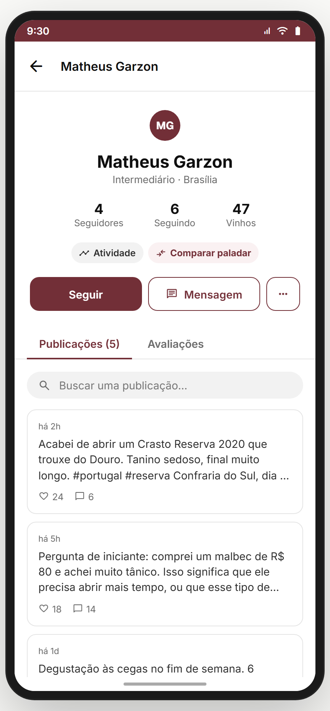

**Propósito:** ver perfil de outra pessoa — seguir, mensagem, ver publicações/vinhos, comparar paladar, bloquear/denunciar. **US-PERF-01/03/10.**
**Entradas:** autor de post; membro de confraria; sugestões. **Saídas:** `perfil-seguidores`, `perfil-comparar-paladar`, `chat-conversa`, `wine`, `post-detail`.

**Layout:** header com nome + **skeleton de loading** (700ms) + avatar 96 + nível ("Enófilo"/"Intermediário"/"Iniciante") + localização + contadores (seguidores/seguindo) + CTAs **Seguir** (toggle) / **Mensagem** + tabs (Publicações / Vinhos) + busca nos posts + menu ⋯ (bloquear/denunciar).
**Estados:** loading (skeleton), normal, **following toggle**, **blocked** (empty state "Você bloqueou este usuário" + Desbloquear).
**Analytics:** `profile_view { userId }`, `profile_follow { userId }`, `profile_message`, `profile_block`, `profile_compare_paladar`.

> **⚠️ DIVERGÊNCIA — tudo mock** (user dos params, posts de MOCK_POSTS). Backend: perfis reais, grafo social, contadores.
> **⛔ FALTA NO APP (épico pede):** **denunciar usuário** (taxonomia existe em `DENUNCIA_TAXONOMIA` mas sem tela). Backlog **PERF-REPORT**.

**Status:** ✅

---

## 14.2 Edição de perfil ✅

_Editar (hub) · Foto/nome/bio · Paladar · Privacidade:_

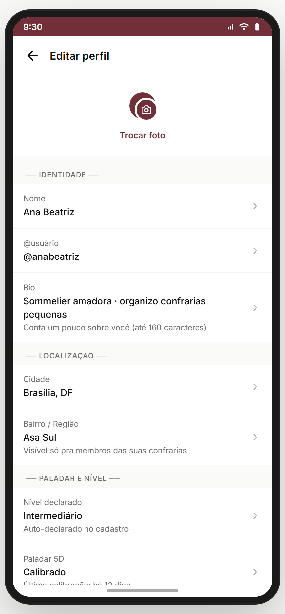 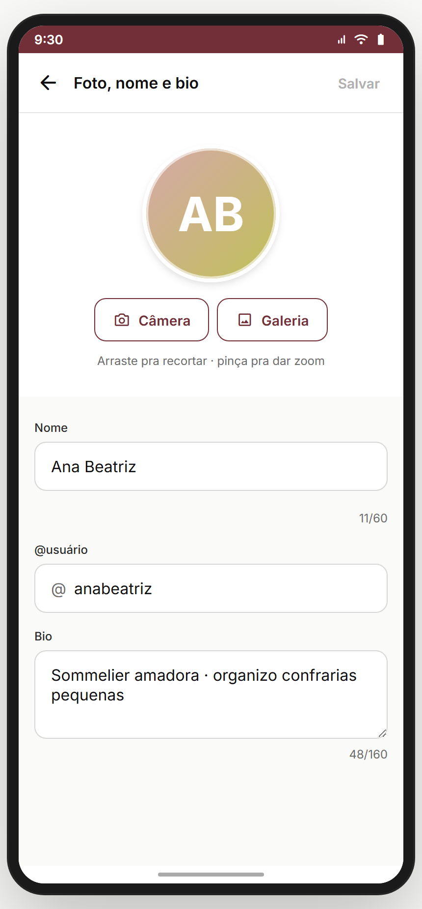 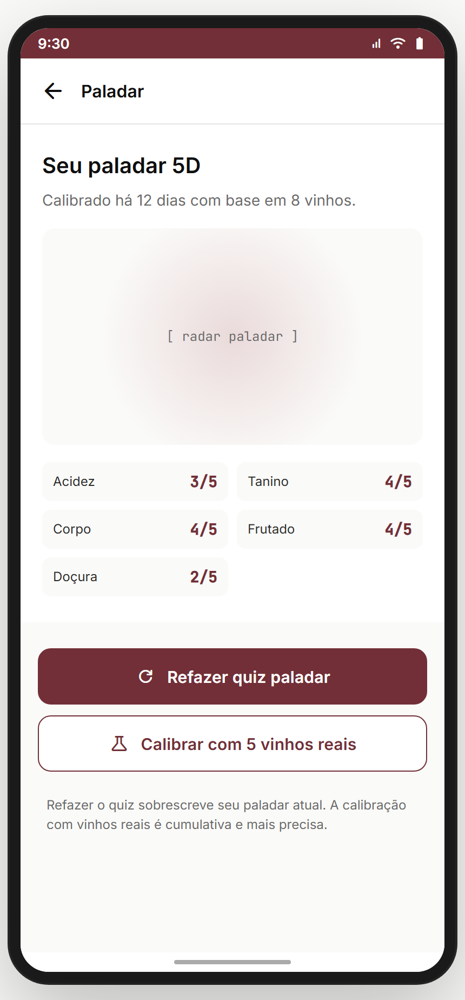 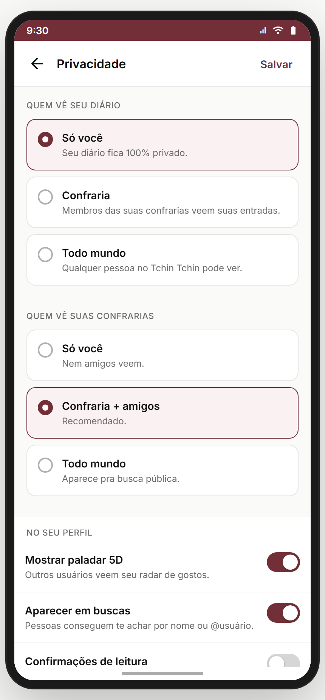

**Propósito:** editar identidade, localização, paladar e privacidade. **US-PERF-02/09.**
**Entradas:** perfil próprio (sheet) → "Editar perfil". **Saídas:** sub-telas + `config-conta`.

- **`editar-perfil`** (hub): avatar + "Trocar foto" + seções **Identidade** (Nome/@usuário/Bio) · **Localização** (Cidade/Bairro) · **Paladar e nível** (Nível declarado / Paladar 5D "Calibrado/Não calibrado") · **Privacidade** (atalhos) + "Configurações de conta".
- **`editar-perfil-foto`** — editar nome + @handle + bio (160) + foto (hue picker mock). `dirty` controla salvar.
- **`editar-perfil-paladar`** — recalibrar paladar (→ quiz / ajustes).
- **`editar-perfil-privacidade`** — quem vê diário / confrarias / mostrar paladar no perfil.

> **⚠️ DIVERGÊNCIA — vários campos abrem `editar-perfil-foto`** (Nome/@/Bio todos vão pra mesma tela) e alguns são placeholder ("Em breve: editar cidade"). Backend: edição real + upload de foto.
> **⚠️ DIVERGÊNCIA — @usuário derivado do nome** (sem unicidade real). Backend precisa validar handle único.

**Status:** ⚠️ (UI completa; edição/upload reais pendentes)

---

## 14.3 Listas sociais ✅

_Seguidores · Seguindo · Sugestões:_

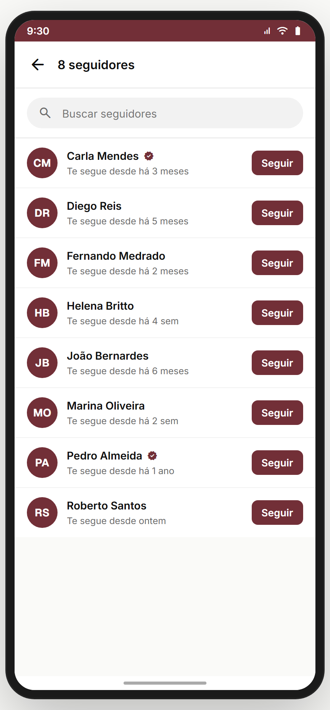 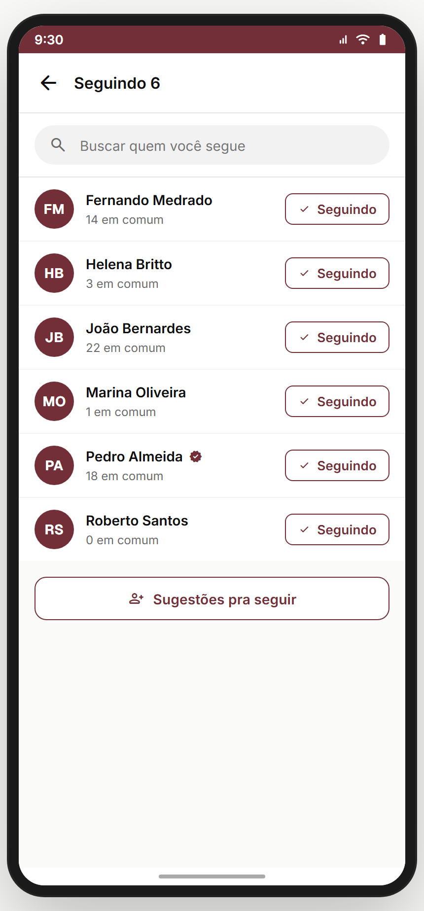 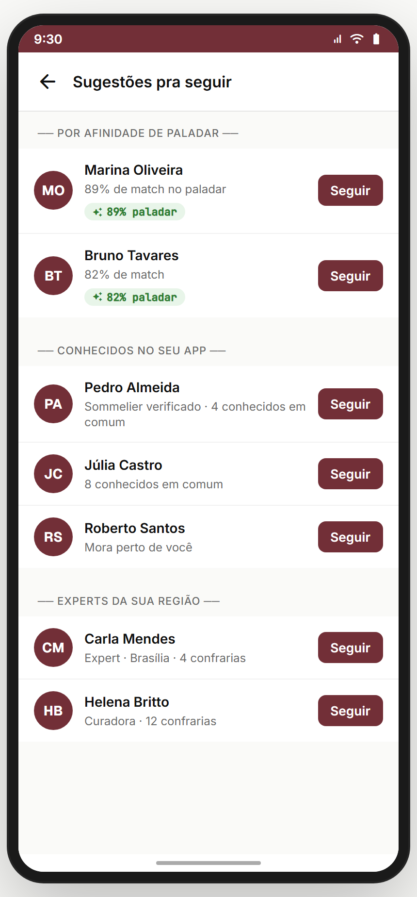

**Propósito:** grafo social — quem segue, quem é seguido, e sugestões de quem seguir. **US-PERF-03/06.**
- **`perfil-seguidores`** — lista de seguidores (avatar + nome + nível + seguir de volta).
- **`perfil-seguindo`** — lista de quem o usuário segue (+ deixar de seguir).
- **`perfil-sugestoes`** — "quem seguir" (experts, membros de confraria, paladar parecido) com motivo da sugestão.

> **⚠️ DIVERGÊNCIA — listas mock.** Backend: grafo social real + algoritmo de sugestão.
> **⛔ FALTA NO APP (épico pede):** **busca dentro das listas** (listas grandes). Backlog **PERF-LIST-SEARCH**.

**Status:** ✅

---

## 14.4 Atividade & vinhos públicos ✅

_Atividade pública · Vinhos provados:_

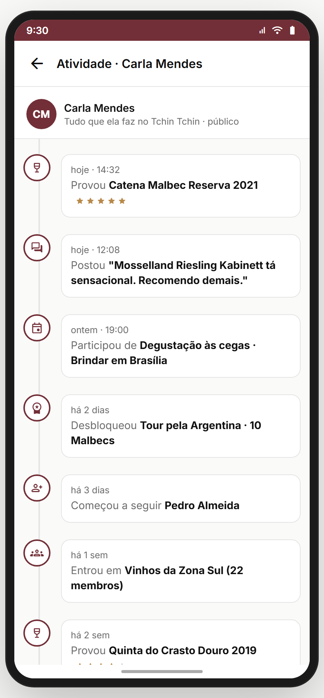 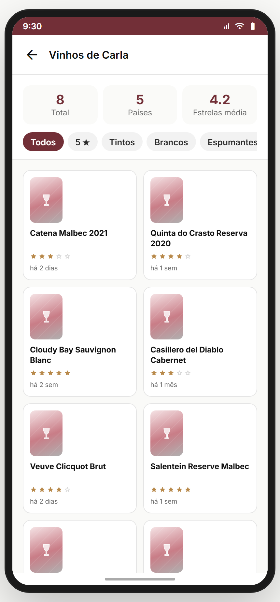

**Propósito:** o que do usuário é público — feed de atividade + vinhos provados (sujeito à privacidade do diário). **US-PERF-04/05.**
- **`perfil-atividade-publica`** — timeline pública (posts, registros públicos, conquistas, eventos).
- **`perfil-vinhos-provados`** — grade/lista de vinhos que a pessoa provou e tornou público.

> **⚠️ DIVERGÊNCIA — não respeita privacidade real** (mock sempre mostra). Backend: gate por `editar-perfil-privacidade` ("Quem vê seu diário").

**Status:** ✅

---

## 14.5 `perfil-comparar-paladar` — Comparar paladar ✅

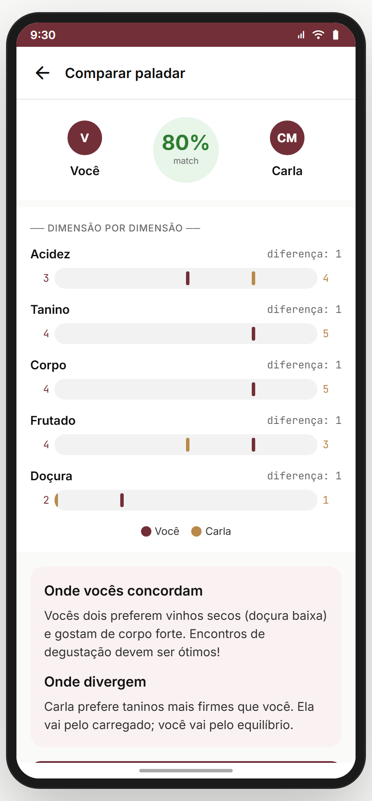

**Propósito:** comparar o paladar do usuário com o de outra pessoa — **% de match** + dimensão por dimensão. **US-PERF-07.**
**Entradas:** perfil-outro → "Comparar paladar". **Saídas:** back.
**Layout (`PerfilCompararPaladarScreen`):** 2 avatares (Você + outro) com **círculo de match central** (cor por faixa: ≥75 verde, ≥50 ambar, <50 cinza) + breakdown por dimensão (Acidez/Tanino/Corpo/Frutado/Doçura) com barras comparativas.
**Cálculo:** `100 - média(|meu - dele| × 100/5)` nas 5 dimensões.

> **⚠️ DIVERGÊNCIA — paladar do outro é mock** (`dele` hard-coded). Backend: paladar real de ambos.
> **⚠️ DIVERGÊNCIA — 5 dimensões = Acidez/Tanino/Corpo/Frutado/Doçura** (alinha com Módulo 03, mas Módulo 07 usa "Aromas"). Reforça a necessidade de unificar (ver Módulo 07).

**Status:** ✅

---

## 14.6 `badges-galeria` — Galeria de conquistas ✅

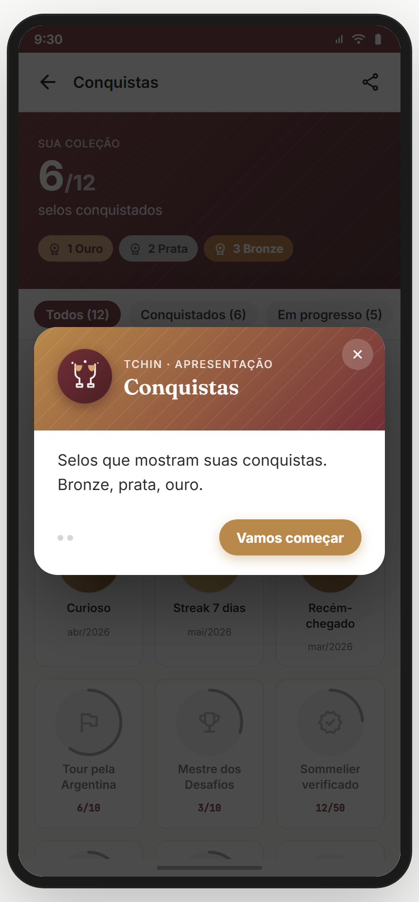

**Propósito:** vitrine de todas as conquistas/badges (ganhas e bloqueadas com condição). **US-PERF-08.**
**Entradas:** perfil → badges. **Saídas:** back.
**Layout (`BadgesGaleriaScreen`):** grid de badges (earned coloridas / locked com cadeado + condição). Possivelmente agrupadas por categoria.

> **⚠️ DIVERGÊNCIA — badges fragmentadas:** existem badges do Treino (Módulo 08), badges aqui, e jornada (Módulo 19). **Recomendação Gabriel:** sistema de conquistas unificado. Backlog **BADGES-UNIFY**.

**Status:** ✅

---

## Edge cases & navegação reversa
- **Perfil próprio** não tem rota dedicada — é bottom sheet (`profileOpen`) do shell. Editar abre as telas deste módulo.
- **Bloquear** → estado bloqueado no perfil-outro + (backend) corta interações.
- **Privacidade** não enforced no protótipo (atividade/vinhos sempre visíveis).
- **Loading skeleton** no perfil-outro (700ms) — boa prática, manter.

## Pendências de backend / decisões do Gabriel
### Críticas (bloqueadores GA)
- **Grafo social real** (seguir/seguidores/sugestões) + contadores.
- **Edição real** (nome/@único/bio) + **upload de foto**.
- **Privacidade enforced** (gate de diário/confrarias/paladar).
- **Bloquear/denunciar** reais.
### Importantes
- Busca nas listas sociais.
- Unificar sistema de badges (Treino + perfil + jornada).
- Unificar 5 dimensões do paladar (Frutado vs Aromas).
### Decisões do Gabriel
- Seguir assimétrico (atual) ou pedir aprovação (perfil privado)?
- @handle: editável quantas vezes? reservado?
- Perfil próprio: virar rota dedicada (`perfil-eu`) em vez de só sheet?

## Conexões com outros módulos
- **Módulo 03 (Paladar)** — comparar reusa as 5D; editar-perfil-paladar → quiz.
- **Módulo 07 (Adega)** — vinhos provados vêm do diário (privacidade).
- **Módulo 08/19 (Treino/Jornada)** — badges a unificar.
- **Módulo 13 (Comunidade)** — autor de post → perfil-outro.
- **Módulo 17 (Chat)** — "Mensagem" → chat-conversa.
- **Módulo 20 (Config)** — editar-perfil → config-conta + privacidade.
