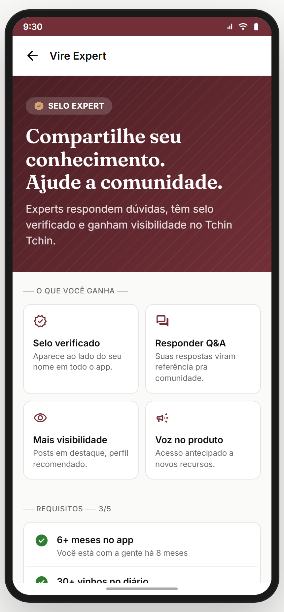
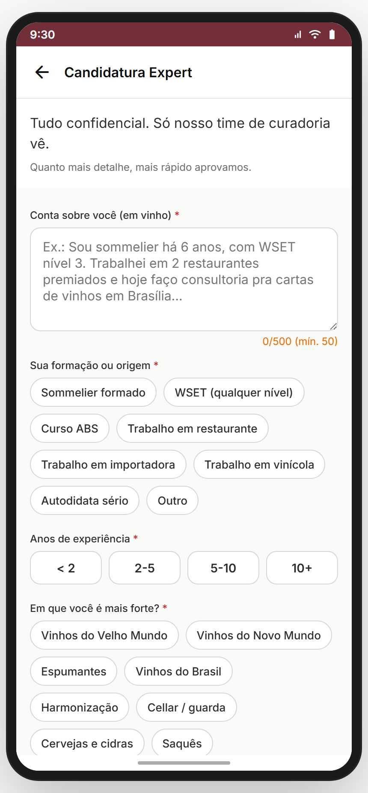
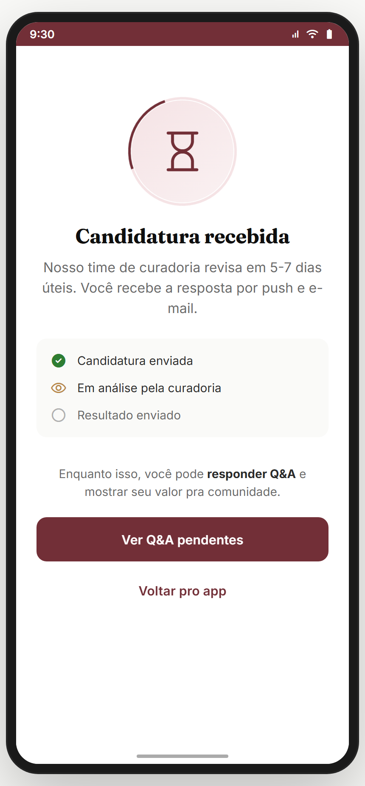
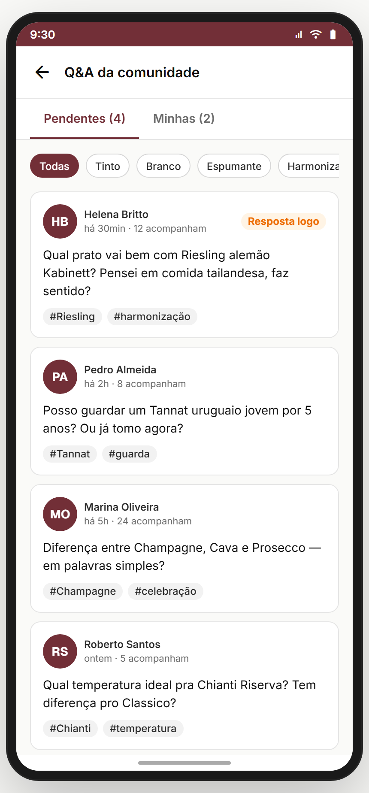
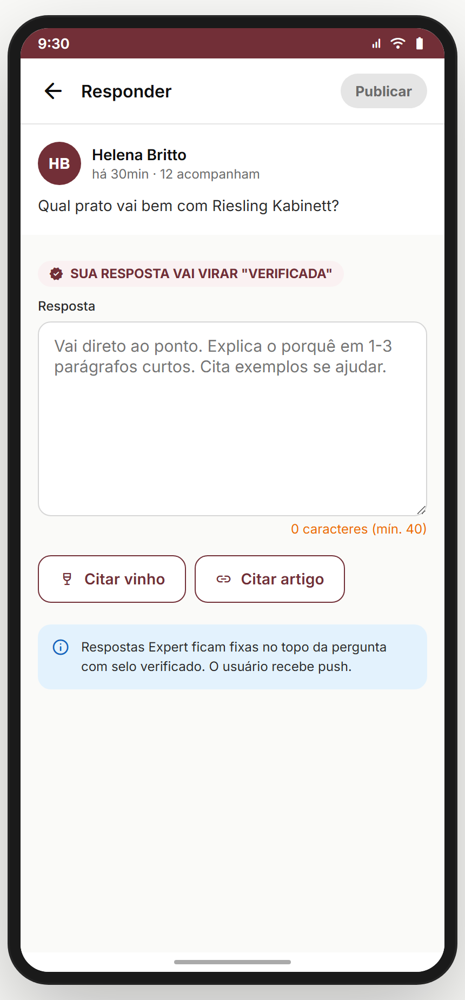
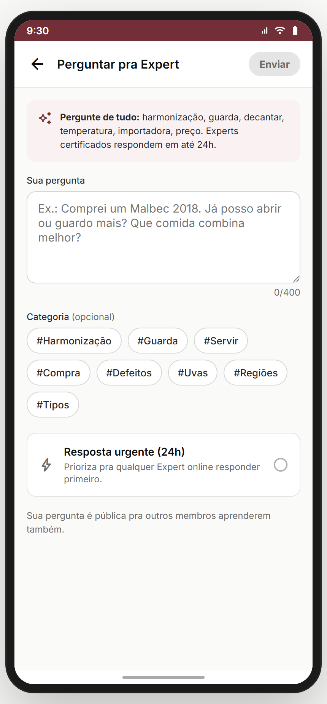

# Módulo 15 — Expert (Sommelier / Q&A)

> Programa de **especialistas verificados** — usuários com formação/experiência viram Expert (selo verificado), respondem dúvidas da comunidade (Q&A) e ganham visibilidade. Quem não é expert pode **perguntar pra um expert**. Reforça confiança e combate desinformação (anti-dor #4: desconfiança em recomendações).
> **Fonte de verdade:** `screens-expert.jsx` (todas as 6 telas: `ExpertVirarScreen`, `ExpertAplicarScreen`, `ExpertPendenteScreen`, `ExpertQAScreen`, `ExpertResponderScreen`, `PerguntarExpertScreen`). Doc funcional: **MVP1 Épico 2 (badge expert)**.
> **Épicos/US:** US-EXP-01 (virar expert — landing/requisitos), US-EXP-02 (candidatura), US-EXP-03 (status pendente), US-EXP-04 (Q&A inbox do expert), US-EXP-05 (responder pergunta), US-EXP-06 (perguntar pra expert).

**Regra de negócio canônica:** virar expert exige **requisitos** (6+ meses, 30+ vinhos no diário, paladar calibrado, 20+ Q&A respondidos, formação) — mas pode candidatar mesmo sem cumprir todos ("candidatar mesmo assim"). Candidatura passa por **curadoria humana** (5-7 dias úteis). Expert tem selo, responde Q&A, segue **Código de Conduta** (fato, sem promo sem disclosure, sem trash-talk).

## Mapa do fluxo
```
[perfil / config] → expert-virar (requisitos N/5 + benefícios)
                      └─ "Candidatar-me" → expert-aplicar (form) → expert-pendente (em análise)
                                                                    └─ [aprovado] vira expert → expert-q-a

expert-q-a (inbox de perguntas) → expert-responder { pergunta } → publica resposta

[qualquer usuário, ex.: comparar-vinhos] → perguntar-expert (faz pergunta) → fila de Q&A dos experts
```

---

## 15.1 `expert-virar` — Landing "Vire Expert" (`ExpertVirarScreen`) ✅



**Propósito:** convencer + qualificar — mostra benefícios e checklist de requisitos. **US-EXP-01.**
**Entradas:** perfil/config → "Virar Expert". **Saídas:** "Candidatar-me" → `expert-aplicar`.

**Layout:** hero burgundy com chip **"SELO EXPERT"** + headline "Compartilhe seu conhecimento. Ajude a comunidade." + **benefícios** (grid 2×2: Selo verificado / Responder Q&A / Mais visibilidade / Voz no produto) + **requisitos** (checklist N/5: 6+ meses ✓ / 30+ vinhos ✓ / paladar calibrado ✓ / 20+ Q&A ✗ / formação ✗) + CTA "Candidatar-me" (ou "Candidatar-me mesmo assim" se incompleto) + nota "Análise em 5-7 dias úteis".

**Analytics:** `expert_landing_view { reqsMet }`, `expert_apply_start`.

> **⚠️ DIVERGÊNCIA — requisitos mock** (valores hard-coded "8 meses/47 entradas"). Backend: checar requisitos reais do usuário.

**Status:** ✅

---

## 15.2 `expert-aplicar` — Candidatura (`ExpertAplicarScreen`) ✅



**Propósito:** formulário de candidatura. **US-EXP-02.**
**Entradas:** `expert-virar`. **Saídas:** "Enviar candidatura" → `expert-pendente`.

**Layout:** campos — **Bio em vinho** (textarea, mín 50, máx 500) · **Formação/origem** (chips: Sommelier / WSET / ABS / restaurante / importadora / vinícola / autodidata / outro) · **Anos de experiência** (<2 / 2-5 / 5-10 / 10+) · **Especialidade** (chips: Velho Mundo / Novo Mundo / Espumantes / Brasil / Harmonização / Cellar / Cervejas / Saquês) · **Links** (opcional) · **aceite do Código de Conduta**. Validação: bio>50 + formação + anos + especialidade + aceite.

**Analytics:** `expert_apply_submit { background, years, specs }`.

> **⚠️ DIVERGÊNCIA — candidatura mock** (vai direto pra pendente). Backend: submissão real + fila de curadoria.

**Status:** ✅

---

## 15.3 `expert-pendente` — Status em análise (`ExpertPendenteScreen`) ✅



**Propósito:** confirmar envio + comunicar prazo + manter o usuário engajado durante a espera. **US-EXP-03.**
**Entradas:** `expert-aplicar` → enviar. **Saídas:** voltar ao app.
**Layout:** estado "em análise" (ícone + "Candidatura enviada" + prazo 5-7 dias + o que acontece a seguir). Possível CTA "continuar usando o app".

> **⛔ FALTA NO APP (épico pede):** **notificação de aprovação/recusa** (push quando a curadoria decide). Backlog **EXP-DECISION-PUSH**.

**Status:** ✅

---

## 15.4 `expert-q-a` — Inbox de Q&A do expert (`ExpertQAScreen`) ✅



**Propósito:** lista de perguntas pendentes para o expert responder. **US-EXP-04.**
**Entradas:** expert logado → Q&A. **Saídas:** tap pergunta → `expert-responder { pergunta }`.
**Layout:** lista de perguntas (autor + pergunta + tempo + contexto/vinho) com filtros (pendentes / respondidas) + contador.

> **⚠️ DIVERGÊNCIA — perguntas mock.** Backend: fila real de Q&A roteada por especialidade do expert.
> **⛔ FALTA NO APP (épico pede):** **roteamento por especialidade** (pergunta sobre espumante → experts de espumante). Backlog **EXP-QA-ROUTING**.

**Status:** ✅

---

## 15.5 `expert-responder` — Responder pergunta (`ExpertResponderScreen`) ✅



**Propósito:** compor resposta a uma pergunta. **US-EXP-05.**
**Entradas:** `expert-q-a` → tap. **Saídas:** publicar → volta pro Q&A.
**Layout:** pergunta original em destaque + composer de resposta + (possível) referenciar vinho + publicar.

> **⛔ FALTA NO APP (épico pede):** **reputação do expert** (likes/úteis nas respostas → ranking). Backlog **EXP-REPUTATION**.

**Status:** ✅

---

## 15.6 `perguntar-expert` — Fazer pergunta (`PerguntarExpertScreen`) ✅



**Propósito:** qualquer usuário faz uma pergunta que vai pra fila dos experts. **US-EXP-06.**
**Entradas:** `comparar-vinhos` ("Perguntar pra um expert"); detalhe de vinho; perfil de expert. **Saídas:** enviar → confirmação.
**Layout:** composer da pergunta + contexto opcional (vinho/tema) + escolher expert ou "qualquer expert" + enviar.

> **⚠️ DIVERGÊNCIA — pergunta mock** (não entra em fila real).
> **⛔ FALTA NO APP (épico pede):** **notificar quando responderem** (push + thread). Backlog **EXP-ANSWER-NOTIFY**.

**Status:** ✅

---

## Edge cases & navegação reversa
- **Já é expert** → `expert-virar` deveria mostrar estado "Você já é Expert" (hoje sempre mostra landing).
- **Candidatura recusada** → sem tela de recusa + reaplicação (cooldown?).
- **Pergunta sem expert disponível** na especialidade → fallback.

## Pendências de backend / decisões do PO
### Críticas (bloqueadores GA)
- **Fila de curadoria** real (submissão → aprovação/recusa) + selo no perfil.
- **Q&A real** (roteamento por especialidade, publicar resposta, thread).
- **Checagem de requisitos** real.
### Importantes
- Notificações (aprovação/recusa, nova pergunta, resposta recebida).
- Reputação do expert (úteis/likes → ranking).
- Tela "você já é expert" + gestão do status.
### Decisões do PO
- Expert é gratuito ou tem contrapartida (comissão/destaque pago)?
- Q&A público (todos veem) ou privado (1:1)?
- Cooldown de reaplicação após recusa?

## Conexões com outros módulos
- **Módulo 14 (Perfil)** — selo expert aparece no perfil; nível "Enófilo".
- **Módulo 04 (Marketplace)** — "Perguntar pra expert" do comparar-vinhos.
- **Módulo 13 (Comunidade)** — respostas de expert viram referência no feed.
- **Módulo 18 (Notificações)** — decisão de candidatura, nova pergunta, resposta.
