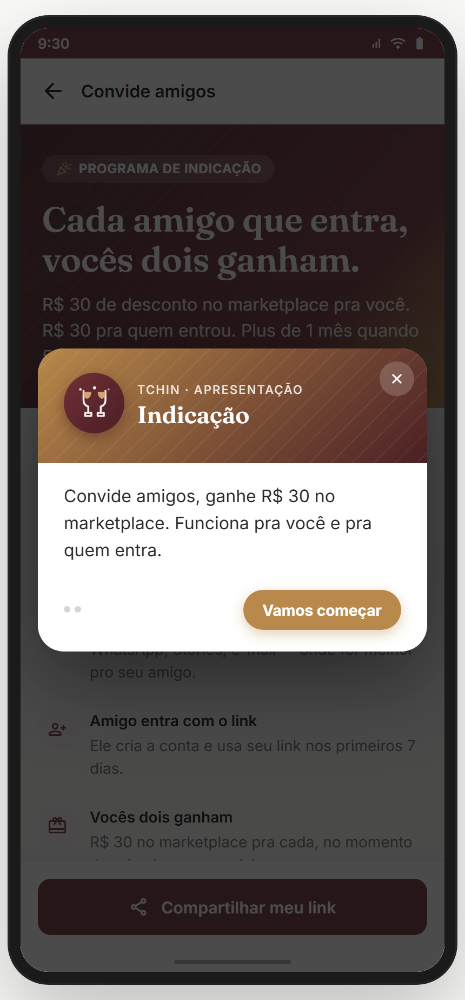
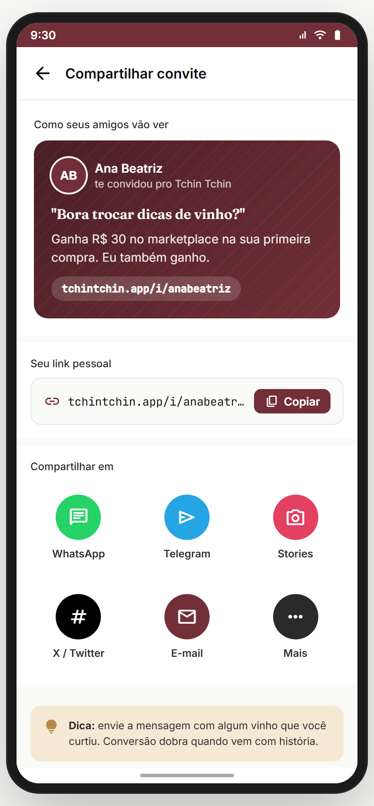
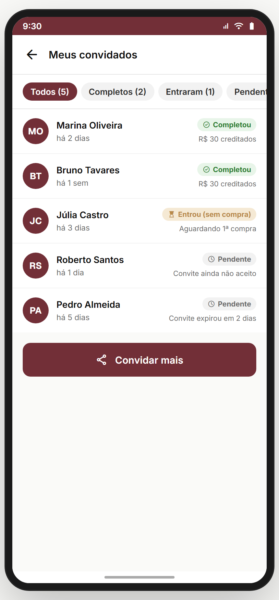
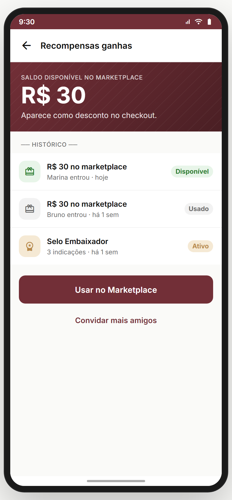
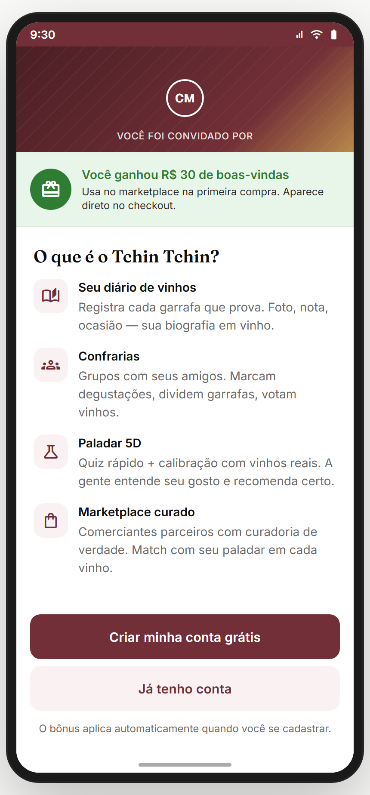

# Módulo 16 — Indicação & Convites

> Programa de **referral de mão dupla**: cada amigo que entra rende R$ 30 no marketplace pros dois + desbloqueios escalonados (selo, pontos bônus, kit). Motor de crescimento orgânico. Inclui a tela do **convidado** (quem chega via link).
> **Fonte de verdade:** `screens-indicacao.jsx` (todas as 5: `IndicacaoLandingScreen`, `IndicacaoCompartilharScreen`, `IndicacaoMeusConvitesScreen`, `IndicacaoRecompensasScreen`, `ConviteRecebidoScreen`). Doc funcional: **Filtros das Confrarias (Convites US-C)**.
> **Épicos/US:** US-IND-01 (landing/hub), US-IND-02 (compartilhar link/canais), US-IND-03 (meus convites + status), US-IND-04 (recompensas/desbloqueios), US-IND-05 (convite recebido — onboarding do convidado).

**Regra de negócio canônica:** referral **bilateral** — R$ 30 pra quem indica + R$ 30 pra quem entra, **no CADASTRO do convidado** (sem precisar de 1ª compra). Janela: convidado usa o link nos **primeiros 7 dias**. Desbloqueios escalonados por nº de amigos: 1 (R$ 30) · 3 (selo Embaixador) · 5 (500 pontos bônus) · 10 (kit Tchin) · 25 (R$ 250). **Teto: 25 indicações por usuário** (depois disso, indicações continuam mas sem bônus). *(Não existe "Plus"/assinatura — Gabriel decidiu.)*

---

## 🆕 § 16.0 Decisões fechadas (Gabriel, junho/2026)
- **16.1 Bônus libera no CADASTRO do convidado** (não na 1ª compra). Mais rápido pro user ver retorno + menos abandono. **Risco de farming** mitigado por: validação de e-mail real + telefone (não coletamos) → **fluxo anti-farming**: confirmar e-mail + dispositivo único (mesmo device = não conta).
- **16.2 Teto de indicações: 25 por user.** Depois disso, pode continuar convidando, mas sem bônus. Quem chega a 25 vira **"Top Embaixador"** com badge especial. Anti-fraude: revisão manual pra quem chegar perto do teto rápido demais.

## Mapa do fluxo
```
[feed banner / perfil / menu] → indicacao-landing (hub: stats + como funciona + desbloqueios)
                                  ├─ "Compartilhar meu link" → indicacao-compartilhar (link + canais)
                                  ├─ "Meus convites" → indicacao-meus-convites (status de cada)
                                  └─ "Recompensas" → indicacao-recompensas (bônus ganhos)

[amigo abre o link] → convite-recebido (quem te convidou + bônus + criar conta)
```

---

## 16.1 `indicacao-landing` — Hub "Convide amigos" (`IndicacaoLandingScreen`) ✅



**Propósito:** hub do programa — stats + como funciona + desbloqueios + CTA compartilhar. **US-IND-01.**
**Entradas:** banner de referral no feed (Módulo 13); perfil/menu. **Saídas:** "Compartilhar meu link" → `indicacao-compartilhar`.

**Layout:** hero gradiente "Cada amigo que entra, vocês dois ganham" + "R$ 30 pra você, R$ 30 pra quem entrou. 500 pontos bônus quando 5 amigos aceitam." + **stats** (Convidados / Entraram / Pontos) + **Como funciona** (3 passos: compartilha → amigo entra → vocês dois ganham) + **Desbloqueios** escalonados (1/3/5/10/25 amigos, done vs locked) + sticky CTA "Compartilhar meu link".

**Analytics:** `referral_hub_view { invited, completed }`, `referral_share_start`.

> **⚠️ DIVERGÊNCIA — stats mock** (3 convidados/2 entraram/100 pts hard-coded). Backend: contagem real.
> **⚠️ DIVERGÊNCIA — valores (R$ 30 / desbloqueios)** hard-coded no front. Devem vir de config server-side (campanha ajustável).

**Status:** ✅

---

## 16.2 `indicacao-compartilhar` — Link + canais (`IndicacaoCompartilharScreen`) ✅



**Propósito:** compartilhar o link de convite em vários canais. **US-IND-02.**
**Entradas:** landing → "Compartilhar". **Saídas:** share nativo; copiar link; back.
**Layout:** link de convite (copiar) + botões de canal (WhatsApp / Stories / Telegram / E-mail / Mais) + preview da mensagem.

> **⚠️ DIVERGÊNCIA — link mock + share simulado.** Backend: gerar link único rastreável por usuário (deep link com `?ref=`).

**Status:** ✅

---

## 16.3 `indicacao-meus-convites` — Status dos convites (`IndicacaoMeusConvitesScreen`) ✅



**Propósito:** acompanhar quem foi convidado e o status. **US-IND-03.**
**Entradas:** landing → "Meus convites". **Saídas:** back.
**Layout:** lista de convidados com status (enviado / entrou / primeira compra feita = bônus liberado) + avatar + tempo + valor do bônus.

> **⚠️ DIVERGÊNCIA — lista mock.** Backend: status real do funil (convidado → cadastrado → 1ª compra).

**Status:** ✅

---

## 16.4 `indicacao-recompensas` — Recompensas/desbloqueios (`IndicacaoRecompensasScreen`) ✅



**Propósito:** ver bônus já ganhos e o que falta desbloquear. **US-IND-04.**
**Entradas:** landing → "Recompensas". **Saídas:** usar crédito → `marketplace`; back.
**Layout:** créditos acumulados + histórico de bônus + barra de progresso pros próximos desbloqueios (selo/pontos/kit).

> **⚠️ DIVERGÊNCIA — recompensas mock.** Backend: carteira de créditos real + aplicar no checkout (Módulo 05).
> **⛔ FALTA NO APP (épico pede):** **aplicar crédito no checkout** (Módulo 05 não consome esses créditos). Backlog **IND-CREDIT-CHECKOUT**.

**Status:** ✅

---

## 16.5 `convite-recebido` — Tela do convidado (`ConviteRecebidoScreen`) ✅



**Propósito:** acolher quem chega via link — mostra quem convidou + bônus + CTA criar conta. **US-IND-05.**
**Entradas:** abrir deep link `?ref=`. **Saídas:** "Criar conta" → `cadastro` (com ref atrelado).
**Layout:** "Quem te convidou" (avatar + nome) + "Você ganha R$ 30 na primeira compra" + CTA criar conta + login pra quem já tem.

> **⚠️ DIVERGÊNCIA — ref não persiste no cadastro.** Backend: atrelar `ref` à conta criada (atribuição do bônus). Bloqueador da feature.
> **⛔ FALTA NO APP (épico pede):** **deep link real** (`tchintchin.app/c/...` → abre app/store com ref). Backlog **IND-DEEPLINK**.

**Status:** ⚠️ (UI ok; atribuição de ref pendente)

---

## Edge cases & navegação reversa
- **Auto-indicação / fraude** — sem proteção (mesmo device/CPF). Backend precisa anti-fraude.
- **Convidado já tem conta** → não deveria gerar bônus (regra de "novo usuário").
- **Janela de 7 dias** — não enforced.
- **Crédito expira?** — não definido.

## Pendências de backend / decisões do Gabriel
### Críticas (bloqueadores GA)
- **Link único rastreável** + deep link + atribuição de `ref` no cadastro.
- **Carteira de créditos** real + consumo no checkout (Módulo 05).
- **Anti-fraude** (mesmo device/CPF, auto-indicação).
- **Funil real** (convidado→cadastrado→1ª compra→bônus liberado).
### Importantes
- Config server-side dos valores (campanha ajustável).
- Janela de 7 dias enforced + expiração de crédito.
- Notificação "seu amigo entrou / bônus liberado".
### Decisões do Gabriel
- Valores (R$ 30/30) e desbloqueios definitivos?
- Bônus na 1ª compra do convidado ou no cadastro?
- Teto de indicações por usuário?

## Conexões com outros módulos
- **Módulo 01 (Cadastro)** — convite-recebido → cadastro com ref.
- **Módulo 05 (Checkout)** — créditos aplicados na compra (pendente).
- **Módulo 11 (Confrarias)** — `confraria-convidar` reusa padrão de link/share.
- **Módulo 13 (Comunidade)** — banner de referral no feed.
- **Módulo 18 (Notificações)** — "amigo entrou / bônus liberado".
- **Módulo 19 (Jornada)** — selo "Embaixador" (desbloqueio).
