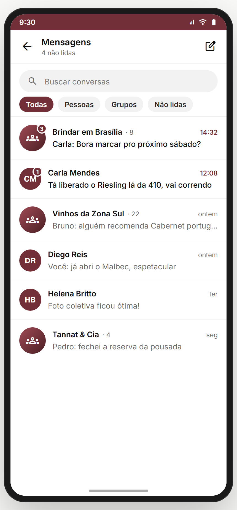
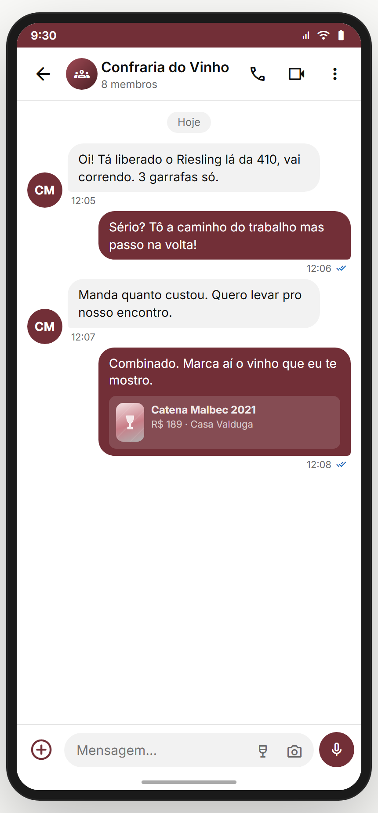

# Módulo 17 — Chat / DMs

> Mensagens diretas (1:1) e de grupo (confraria/evento). Lista de conversas com busca/filtros + tela de conversa em tempo real. Suporta o "Chat é direto" prometido no onboarding da confraria (Módulo 11).
> **Fonte de verdade:** `screens-chat.jsx` (`ChatListaScreen`, `ChatConversaScreen` + `MOCK_CHATS`/`MOCK_MESSAGES`). Doc funcional: **MVP2 Épico 13**.
> **Épicos/US:** US-CHAT-01 (lista de conversas + busca/filtros), US-CHAT-02 (conversa: enviar/receber mensagens), US-CHAT-03 (chat de grupo: confraria/evento).

**Regra de negócio canônica:** 2 tipos de conversa — **DM** (1:1, avatar da pessoa) e **grupo** (confraria/evento, ícone de grupo + nº membros). Não-lidas com badge. Chat de grupo nasce de uma confraria/evento. **Quem pode mandar DM é configurável pelo próprio usuário** (ver § 17.0).

---

## 🆕 § 17.0 Decisões fechadas (Gabriel, junho/2026)

### 17.0.1 DM — configurável pelo user (Privacidade > Chat)
Cada usuário escolhe quem pode mandar DM pra ele (em `config-privacidade`):
- ☑️ **Qualquer um** (aberto — default pra usuário público)
- ☑️ **Quem eu sigo**
- ☑️ **Mesma confraria** (qualquer confraria que ambos participam)
- ☑️ **Misto** (combina as opções acima — ex.: "quem eu sigo OU mesma confraria")
- ☑️ **Ninguém** (DM desligado — só responde quem ele iniciou)

UI: lista de checkboxes com toggle de "Misto"; quem tentar mandar e estiver fora vê: "Esse usuário só aceita DMs de pessoas que segue."

### 17.0.2 Histórico do chat de grupo — visível pra quem entra depois
**Sim, visível pra quem entra depois.** Quem entra na confraria/evento vê todo o histórico do chat (transparência da memória do grupo). Se admin quiser limitar, pode arquivar/limpar mensagens antigas (ação destrutiva, com confirmação).

## Mapa do fluxo
```
[perfil "Mensagem" / confraria / evento] → chat-lista (Todas/Pessoas/Grupos/Não lidas)
                                              └─ tap conversa → chat-conversa (thread + composer)
```

---

## 17.1 `chat-lista` — Lista de conversas (`ChatListaScreen`) ✅



**Propósito:** inbox de mensagens — busca, filtros, badge de não-lidas. **US-CHAT-01.**
**Entradas:** menu/ícone de mensagens; "Mensagem" do perfil. **Saídas:** tap conversa → `chat-conversa { chat }`; nova conversa (placeholder).

**Layout (`ChatListaScreen`):** header "Mensagens" + subtítulo ("{N} não lidas" / "Tudo em dia") + ícone nova conversa + **busca** ("Buscar conversas") + **tabs** (Todas / Pessoas / Grupos / Não lidas) + lista de conversas:
- **DM**: avatar(level) + nome + última msg + horário.
- **Grupo**: ícone `groups` (gradiente) + nome + "· {N membros}" + última msg.
- Badge de não-lidas (contagem) sobre o avatar.
- Empty state: "Nenhuma conversa encontrada".

**Analytics:** `chat_list_view { unread }`, `chat_search`, `chat_filter { tab }`, `chat_open { id, type }`.

> **⚠️ DIVERGÊNCIA — conversas mock** (`MOCK_CHATS`). Backend: lista real + realtime.
> **⛔ FALTA NO APP (épico pede):** **nova conversa** (placeholder "Em breve"). Backlog **CHAT-NEW**.

**Status:** ✅

---

## 17.2 `chat-conversa` — Conversa (`ChatConversaScreen`) ✅



**Propósito:** thread de mensagens + composer. **US-CHAT-02/03.**
**Entradas:** `chat-lista` → tap; "Chat" de confraria/evento; "Mensagem" do perfil. **Saídas:** back; perfil do interlocutor.

**Layout (`ChatConversaScreen`):** header (avatar/ícone + nome + status/membros) + thread de bolhas (enviadas vs recebidas) + composer (input + anexo + enviar). Mensagens de `MOCK_MESSAGES`.

**Analytics:** `chat_conversation_view { id }`, `chat_message_send`, `chat_attach`.

> **⚠️ DIVERGÊNCIA — mensagens mock + envio local** (não persiste, sem realtime). Backend: WebSocket/Firestore + entrega/leitura.
> **⛔ FALTA NO APP (épico pede):** **indicadores de entregue/lido**, **digitando…**, **anexos reais** (foto/vinho), **reações**. Backlog **CHAT-REALTIME-FEATURES**.

**Status:** ✅

---

## Edge cases & navegação reversa
- **Chat de grupo** vinculado a confraria/evento — sair do grupo deveria refletir aqui.
- **Bloquear** (Módulo 14) deveria sumir a DM.
- **Offline** — sem fila de envio.

## Pendências de backend / decisões do Gabriel
### Críticas (bloqueadores GA)
- **Mensageria real** (WebSocket/Firestore) — enviar/receber/persistir + realtime.
- **Entregue/lido** + push de nova mensagem (Módulo 18).
### Importantes
- Nova conversa (iniciar DM).
- Anexos (foto/vinho), reações, "digitando…".
- Moderação/bloqueio refletido no chat.
### Decisões do Gabriel
- DM aberto pra qualquer um ou só pra quem você segue / mesma confraria?
- Chat de grupo: histórico visível pra quem entra depois?

## Conexões com outros módulos
- **Módulo 11 (Confrarias)** — "Chat é direto"; chat de grupo da confraria.
- **Módulo 12 (Eventos)** — chat do evento.
- **Módulo 14 (Perfil)** — "Mensagem" → chat-conversa; bloquear.
- **Módulo 18 (Notificações)** — push de nova mensagem.
