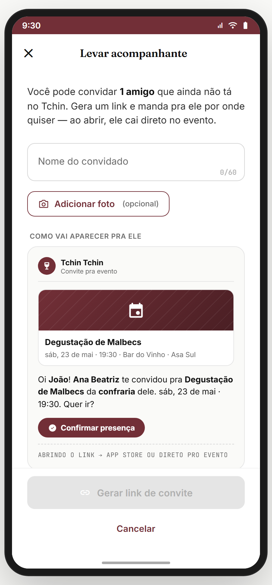
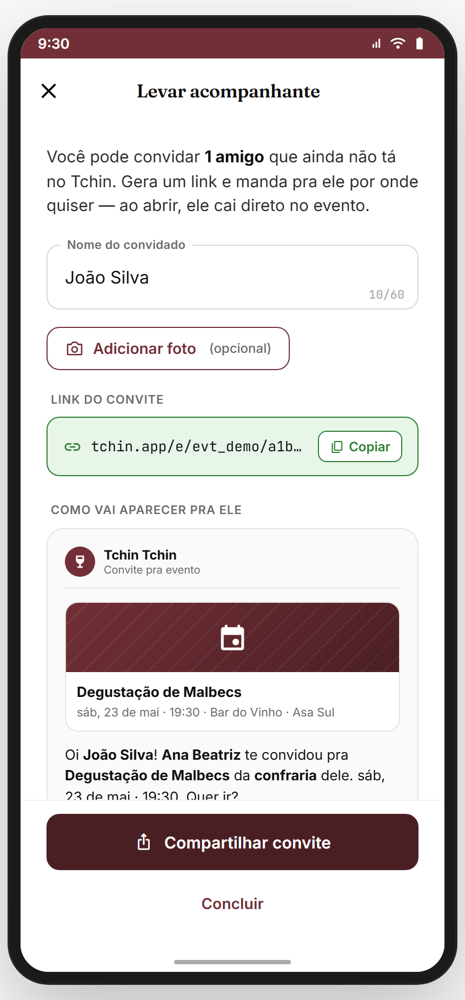

# Módulo 18 — Notificações & Engajamento

> O **motor de retenção** do app: catálogo completo de notificações (push / in-app / e-mail), permissão (primer/negado/canais/preview), nudges de re-engajamento e plus-one. Define **o que** dispara, **quando**, **por qual canal**, **com qual texto** e **pra onde leva**.
> **Fonte de verdade:** `screens-notificacoes.jsx` (`Notificacoes`, `NOTIF_TYPES`, `DEFAULT_NOTIFICATIONS`, `routeForNotif`), `screens-jornada-extras.jsx` (`PushPrimerScreen`/`PushNegadoScreen`/`PushCanaisScreen`/`PushPreviewScreen`), `screens-nudges.jsx` (NudgeD1/D3/D7/D14), `screens-plus-one.jsx` (`PlusOneScreen`). Doc funcional: **MVP1 + Sprint 11-13**.
> **Épicos/US:** US-NOTIF-01 (central in-app), US-NOTIF-02 (push primer/permissão), US-NOTIF-03 (canais), US-NOTIF-04 (nudges temporais), US-NOTIF-05 (plus-one), 🆕 US-NOTIF-06 (catálogo + regras de entrega).

---

## 🎯 Modelo & regras de negócio (como tudo funciona)

> **✅ GABRIEL PEDIU — montar tudo:** lista, regras, templates, canais, timing e destino de **todas** as notificações. Esta seção é a regra canônica; o catálogo (mais abaixo) é a fonte da verdade dos textos.

### Canais de entrega (onde aparece)
- **🔔 Push (SO)** — bandeja/lockscreen. Só com permissão concedida + canal ligado + fora do quiet hours + dentro do cap.
- **📥 In-app** — central de notificações (sino no header, com badge de não-lidas). **Toda** notificação relevante entra aqui, mesmo sem push.
- **✉️ E-mail** — só transacional, crítico e resumos (nunca social/curtida).
- **⚡ In-app realtime** — toast/banner quando o evento acontece com o app aberto (ex.: mensagem nova).

### Prioridade (define quem fura quiet hours / cap)
1. **Crítico** (sempre entrega, ignora quiet hours e cap): segurança, pagamento de evento, status de pedido, evento começando.
2. **Transacional** (alta): convites, respostas, menções, DMs, +1.
3. **Engajamento** (sujeito a cap + quiet hours): social, desafios, ranking, badges, wishlist.
4. **Marketing/editorial** (opt-in, cap rígido): curadoria, promoções, reativação.

### Regras de disparo
- **Permissão:** sempre via **primer** antes do prompt nativo do SO (best practice — igual GPS no M02). Nunca prompt frio.
- **Canais padrão (✅ Gabriel decidiu — TUDO opt-out):** **push, in-app e e-mail vêm LIGADOS por padrão** (todos os canais ON); o usuário desliga o que não quiser. **Exceção:** **Conta & segurança é sempre ativo** (não desligável). Marketing por e-mail sempre traz link de descadastro e transacional/crítico é enviado independente das preferências (compliance).
- **Quiet hours:** **22h–8h** sem push (exceto crítico). Configurável em `config-notif`.
- **Frequency cap (anti-spam):** máx **~4 push/dia** não-críticos + **1 marketing/dia**. Crítico não conta. *(Calibrável.)*
- **Agrupamento (batching):** curtidas/seguidores agrupam numa janela (~1h) → "{nome} e mais {n} curtiram"; atividade de confraria agrupa por confraria.
- **Dedup/coalescing:** não repete a mesma notif; eventos do mesmo objeto se fundem.
- **Estado:** lido/não-lido por item + "marcar todas como lidas". Deep link obrigatório (`routeForNotif`).

---

## 📋 Catálogo completo de notificações (todas)
> Legenda de canal: 🔔 push · 📥 in-app · ✉️ e-mail. `{var}` = variável do template.

### Confrarias · canal `confraria`
| Evento (key) | Quando dispara | Canais | Texto (template) | Destino |
|---|---|---|---|---|
| `invite_brotherhood` | alguém te convida | 🔔📥✉️ | "{nome} te convidou pra {confraria}" | `confraria-detalhe` |
| `join_request` *(admin)* | pedem pra entrar (confraria por aprovação) | 🔔📥 | "{nome} pediu pra entrar na {confraria}" | `confraria-config › membros` |
| `request_approved` | seu pedido foi aceito | 🔔📥 | "Seu pedido pra entrar em {confraria} foi aceito 🎉" | `confraria-detalhe` |
| `new_member` *(admin)* | novo membro entrou | 📥 | "{nome} entrou na {confraria}" | `confraria-detalhe` |
| `brotherhood_activity` | novo post no mural | 📥 (🔔 se citado) | "{nome} postou em {confraria}" | `confraria-detalhe` |
| `role_changed` | virou admin / transferência | 🔔📥 | "Você agora é admin da {confraria}" | `confraria-detalhe` |

### Eventos · canal `eventos`
| Evento | Quando | Canais | Texto | Destino |
|---|---|---|---|---|
| `event_invite` | convidado pro evento | 🔔📥✉️ | "{nome} te convidou pro {evento}" | `event-detalhe` |
| `event_new_in_brotherhood` | novo evento na sua confraria | 🔔📥 | "Novo evento na {confraria}: {evento}" | `event-detalhe` |
| `event_tomorrow` *(D-1)* | 1 dia antes | 🔔📥 | "{evento} é amanhã às {hora} 🍷" | `event-detalhe` |
| `event_soon` *(1h)* | 1 hora antes | 🔔📥 ⚑crítico | "{evento} começa em 1 hora ⏰" | `event-detalhe` |
| `event_changed` | mudou data/local/vinhos | 🔔📥✉️ | "O {evento} mudou: {campo}" | `event-detalhe` |
| `event_canceled` | cancelado | 🔔📥✉️ | "O {evento} foi cancelado" | `event-detalhe` |
| `plus_one_joined` | seu +1 se cadastrou | 🔔📥 | "Seu convidado {nome} se cadastrou! 🎉" | `event-detalhe` |
| `event_payment_due` | evento pago, confirmar | 🔔📥✉️ ⚑crítico | "Confirme o pagamento do {evento} até {prazo}" | `evento-presenca › pagamentos` |
| 🆕 `payment_confirmed_laci` | webhook LACI confirmou PIX | 🔔📥 ⚑crítico | "✓ Pagamento de {evento} confirmado. Vaga garantida!" | `event-detalhe` |
| 🆕 `payment_confirmed_manual` | admin marcou pago | 🔔📥 ⚑crítico | "✓ {admin} confirmou seu pagamento de {evento}" | `event-detalhe` |
| 🆕 `payment_expired` | PIX LACI expirou ou prazo manual venceu | 🔔📥 | "⚠️ Seu pagamento de {evento} expirou. Pagar de novo?" | `event-detalhe` (estado expirado) |
| 🆕 `payment_pending_reminder` | D-3 e 6h antes se ainda não pagou | 🔔📥 | "💰 Seu pagamento de {evento} ainda tá pendente — sua vaga pode liberar" | `event-detalhe` |
| 🆕 `rsvp_canceled_refund` | cancelou >24h, reembolso integral | 📥✉️ | "Reembolso de R$ {x} processado · {evento}" | `event-detalhe` |
| 🆕 `rsvp_canceled_pts` | cancelou 24h-2h, crédito em pontos | 📥 | "💎 R$ {x} viraram {pts} pontos Tchin no seu saldo" | `pontos` |
| 🆕 `waitlist_promoted` | foi promovido da fila | 🔔📥 ⚑crítico | "🎉 Vaga liberou em {evento} — confirma em 6h" | `event-detalhe` |
| 🆕 `waitlist_lost_window` | perdeu prazo de 6h | 🔔📥 | "Voltou pra lista de espera — não pagou no prazo" | `event-detalhe` |
| `event_post_rate` | pós-evento, avaliar vinhos | 🔔📥 | "Avalie os vinhos do {evento}" | `evento-pos-avaliar` |
| `event_post_ata` | ata pronta | 📥 | "A ata do {evento} está pronta" | `evento-pos-ata` |

### Chat & DMs (M17) · canal `chat`
| Evento | Quando | Canais | Texto | Destino |
|---|---|---|---|---|
| `chat_message` | DM recebida | 🔔📥⚡ | "{nome} te mandou uma mensagem" | `chat-conversa` |
| `chat_mention` | citado no chat coletivo | 🔔📥 | "{nome} te mencionou no chat da {confraria}" | `chat-conversa` |

### Social (M13/M14) · canal `social`
| Evento | Quando | Canais | Texto | Destino |
|---|---|---|---|---|
| `like` *(agrupada)* | curtiram seu post | 📥 (🔔 em lote) | "{nome} e mais {n} curtiram seu post" | `post-detail` |
| `comment` | comentaram seu post | 🔔📥 | "{nome} comentou: \"{trecho}\"" | `comentarios` |
| `comment_reply` | responderam seu comentário | 🔔📥 | "{nome} respondeu seu comentário" | `comentarios` |
| `follow` | novo seguidor | 🔔📥 | "{nome} começou a te seguir" | `perfil-outro` |
| `mention_post` | citado num post | 🔔📥 | "{nome} te mencionou num post" | `post-detail` |

### Expert (M15) · canal `social`/`confraria`
| Evento | Quando | Canais | Texto | Destino |
|---|---|---|---|---|
| `expert_replied` | expert respondeu sua pergunta | 🔔📥✉️ | "Sommelier {nome} respondeu sua pergunta" | `expert-q-a` |
| `expert_question_new` *(p/ experts)* | nova pergunta pra responder | 🔔📥 | "Nova pergunta pra você responder" | `expert-responder` |
| `expert_application` | resultado da candidatura | 🔔📥✉️ | "Sua candidatura a Expert foi {aprovada/recusada}" | `expert-pendente` |

### Gamificação, Pontos & Desafios (M19/M08) · canais `desafios`/`ranking`/`pontos`
| Evento | Quando | Canais | Texto | Destino |
|---|---|---|---|---|
| `challenge_open` | desafio abre (segunda) | 🔔📥 | "Desafio da semana abriu: {título}" | `desafio-detalhe` |
| `challenge_ending` *(D-1)* | falta 1 dia | 🔔📥 | "Falta 1 dia pro desafio {título}" | `desafio-detalhe` |
| `challenge_done` | cumpriu o desafio | 🔔📥 | "Desafio cumprido! +50 pts 🏆" | `pontos` / `jornada-celebrar` |
| `badge_unlocked` | desbloqueou badge | 🔔📥 | "Você desbloqueou {badge}!" | `badges-galeria` |
| `milestone_done` | completou marco da jornada | 📥 | "Marco completo: {marco} (+{pts})" | `jornada` |
| `ranking_up`/`ranking_down` | mudou de posição | 🔔📥 | "Você subiu pro {n}º no ranking da {confraria}" | `ranking` |
| `points_expiring` | pontos vão expirar | 🔔📥✉️ | "{n} pontos expiram em {data} — resgata?" | `pontos` |
| `streak_risk` *(M08)* | sequência em risco hoje | 🔔📥 | "Sua sequência de {n} dias acaba hoje! 🔥" | `treino-paladar` |
| `daily_goal` *(M08)* | meta diária do treino | 🔔 | "Bora treinar 2 minutinhos hoje?" | `treino-paladar` |
| `levelup` *(M08)* | subiu de nível | 📥 | "Você subiu pro nível {n}!" | `jornada-celebrar` |

### Marketplace & Compras (M04/M05) · canais `wishlist`/`pedidos`
| Evento | Quando | Canais | Texto | Destino |
|---|---|---|---|---|
| `wishlist_price_drop` | vinho da wishlist baixou | 🔔📥✉️ | "{vinho} da sua wishlist baixou pra R$ {preço}" | `wine` |
| `back_in_stock` | voltou ao estoque | 🔔📥 | "{vinho} voltou ao estoque" | `wine` |
| `order_confirmed` | pedido confirmado | 🔔📥✉️ ⚑crítico | "Pedido confirmado! Chega até {data}" | `pedido-confirmado` |
| `order_shipped` | saiu pra entrega | 🔔📥✉️ ⚑crítico | "Seu pedido saiu pra entrega 📦" | `pedido-confirmado` (tracking) |
| `order_delivered` | entregue | 🔔📥 | "Seu pedido chegou — que tal avaliar?" | `wine` (avaliar) |
| `cart_abandoned` *(nudge)* | carrinho parado | 🔔📥 | "Esqueceu algo no carrinho?" | `carrinho` |
| `redeem_confirmed` | resgate de pontos OK | 📥 | "Resgate confirmado: {recompensa}" | `pontos` |

### Indicação (M16) · canal `editorial`/`social`
| Evento | Quando | Canais | Texto | Destino |
|---|---|---|---|---|
| `referral_joined` | amigo entrou pelo link | 📥 | "{nome} entrou pelo seu convite" | `indicacao-meus-convites` |
| `referral_reward` | bônus liberado (1ª compra do amigo) | 🔔📥✉️ | "Você ganhou R$ 30! {nome} fez a 1ª compra" | `indicacao-recompensas` |
| `referral_unlock` | desbloqueio escalonado | 🔔📥 | "Você desbloqueou {recompensa} ({n} amigos)" | `indicacao-recompensas` |

### Editorial & Retenção · canais `nudges`/`marketing`
| Evento | Quando | Canais | Texto | Destino |
|---|---|---|---|---|
| `nudge_create_event` D+1/3/7/14 | criou confraria sem evento | 🔔📥 | urgência crescente (ver 18.3) | `event-wizard-1` |
| `monthly_summary` | resumo do mês pronto | 🔔📥✉️ | "Seu {mês} no vinho está pronto 📊" | `relatorio-mensal` |
| `weekly_curation` | curadoria da semana | 🔔📥 | "Vinho da semana + harmonização pro fim de semana" | `aprenda` / `descobrir` |
| `reactivation` | inativo 14d+ | 🔔✉️ | "Faz tempo… tem evento novo na sua região 👀" | `home` |
| `diary_reminder` | não registra há X dias | 🔔 | "Provou algo bom? Registra no diário (+10 pts)" | `registro-rapido` |

### Conta & Segurança (M20/M21) · canal `seguranca` *(sempre ativo)*
| Evento | Quando | Canais | Texto | Destino |
|---|---|---|---|---|
| `security_login` | novo acesso | 🔔📥✉️ ⚑crítico | "Novo acesso na sua conta: {dispositivo}" | `config-conta` |
| `password_changed` | senha alterada | 🔔✉️ ⚑crítico | "Sua senha foi alterada" | `config-conta` |
| `account_reactivated` | reativou a conta | 📥 | "Bem-vindo de volta! Sua conta está ativa" | `home` |
| `re_auth` *(raro)* | re-login (ver M21) | 🔔✉️ | (motivo no `erro-sessao`) | `login` |

---

## Mapa do fluxo
```
[sino/header] → notificacoes (Todas / Não lidas) → tap → routeForNotif(tipo) → rota destino
[1º momento que precisa push] → push-primer ─┬─ permitir → push-canais (toggles por canal)
                                              └─ negar  → push-negado (fallback + reativar)
                                              push-preview = exemplo do que chega
[criou confraria sem evento] → nudge-d1 → d3 → d7 → d14 (cron por estado) → event-wizard-1 | comunidade
[evento] → plus-one (convite por link)
```

---

## 18.1 `notificacoes` — Central in-app (`Notificacoes`) ✅


**Propósito:** inbox de **todas** as notificações in-app (amostra representativa do catálogo acima, incl. exemplo **agrupado** "{nome} e mais N curtiram"). **US-NOTIF-01.**
**Entradas:** sino no header. **Saídas:** tap → `routeForNotif` (deep link por tipo); ⋯ → "marcar todas como lidas"; back → home.
**Layout:** SubHeader + ⋯ + tabs **Todas / Não lidas** (com contador) + linha por notif (avatar/ícone por tipo + badge-overlay de categoria + texto com ênfase + tempo relativo + bolinha de não-lida). `NOTIF_TYPES` mapeia cada tipo → avatar/ícone/cor/destino.
**Analytics:** `notifications_view { unread }`, `notification_tap { type }`, `notifications_mark_all_read`.

> **⚠️ DIVERGÊNCIA — feed mock** (`DEFAULT_NOTIFICATIONS`). Backend: feed real + realtime + paginação + **agrupamento** server-side.

**Status:** ✅

---

## 18.2 Push — primer / negado / canais / preview ✅

   

**Propósito:** pedir permissão do jeito certo + gestão **granular por canal**. **US-NOTIF-02/03.**
- **`push-primer`** — vende o valor ANTES do prompt nativo ("eventos da sua confraria · mensagens · desafio da semana · wishlist baixou") + "Permitir" / "Mais tarde".
- **`push-negado`** — fallback gentil ("Sem problema — dá pra ativar depois em Configurações") + 3 passos pra reativar no SO.
- **`push-canais`** — toggles por canal alinhados ao catálogo: **Confrarias** (atividade/eventos/chat) · **Gamificação e pontos** (desafios/ranking/pontos) · **Marketplace e compras** (wishlist/pedidos) · **Social** · **Editorial** (dicas/promoções) · **Conta e segurança** (*"Sempre ativo"*, não desligável). Master switch no topo.
- **`push-preview`** — mockup de como a notif chega no SO (dispara um teste).

**Analytics:** `push_primer_shown`, `push_primer_response { granted }`, `push_channel_toggle { channel, on }`.

> **⚠️ DIVERGÊNCIA — push simulado.** Backend: FCM/APNs real + permission nativo + persistência dos canais.

**Status:** ✅

---

## 18.3 Nudges de re-engajamento (D+1/3/7/14) ✅

   

**Propósito:** trazer de volta o admin que **criou confraria mas não marcou evento** — urgência crescente. **US-NOTIF-04.**
**Gatilho:** cron por estado (confraria criada há N dias **sem evento**). Cada nudge passa `fromNudge: 'dN'` pro wizard (atribuição). Gate: se já criou evento, **não dispara**.

| Nudge | Quando | Tom | Texto (push) |
|---|---|---|---|
| **D+1** | 1 dia | leve | "Bora marcar o 1º encontro da {confraria}? 🍷" |
| **D+3** | 3 dias | concreto | "Que tal esses vinhos pro 1º evento da {confraria}?" |
| **D+7** | 7 dias | social proof | "Confrarias sem evento esfriam. Marca o 1º?" |
| **D+14** | 14 dias | última chamada | "A {confraria} tá quietinha… reacende com um encontro?" |

**Saídas:** "Criar evento" → `event-wizard-1 { fromNudge }`; "Depois" → `comunidade`.

> **✅ GABRIEL DECIDIU (criado) — cadência D+1/3/7/14 definitiva** + **anti-spam:** cap de **1 nudge/dia** por usuário, soma no teto global de **~4 push/dia** (não-críticos), respeita quiet hours 22h–8h e **para assim que o usuário cria o evento**. *(Janela/teto calibráveis.)*
> **⛔ FALTA NO APP (já no catálogo, falta o cron):** `streak_risk` (M08), `cart_abandoned` (M05), `wishlist_price_drop`/`back_in_stock` (M04), `reactivation`, `diary_reminder`. Backlog **NUDGE-TRIGGERS**.

**Status:** ✅

---

## 18.4 `plus-one` — Trazer acompanhante (`PlusOneScreen`) ✅

 

**Propósito:** convidar acompanhante (+1) por **link compartilhável** — sem coletar telefone. **US-NOTIF-05.**
**Fluxo:** nome do convidado (+ foto opcional) → "Gerar link de convite" → link (`tchin.app/e/<id>/<token>`) com Copiar + Compartilhar → convidado abre e cai no evento.

> **✅ GABRIEL DECIDIU — convite por LINK, sem telefone** (ver M20/M12). Gera o `plus_one_joined` quando o convidado se cadastra.

**Status:** ✅

---

## Edge cases & navegação reversa
- **`BACK_SKIP`** inclui `nudge-d1/d3/d7/d14` — voltar não cai no nudge.
- **Push negado no SO** → `push-negado` + instrução de Configurações.
- **Nudge após já criar evento** → gate de estado impede o disparo.
- **Quiet hours / cap atingido** → push segura; in-app continua entrando no feed.
- **Crítico** (segurança/pagamento/pedido/evento começando) → fura quiet hours e cap.

## Pendências de backend / decisões do Gabriel
### Críticas (bloqueadores GA)
- **FCM/APNs real** + permission nativo + token por dispositivo.
- **Motor de entrega:** roteador por prioridade + quiet hours + frequency cap + agrupamento/dedup.
- **Agendador (cron por estado)** dos nudges e disparos temporais (D-1 evento, desafio segunda, pontos expirando).
- **Feed real** + realtime + paginação.
### Importantes
- Persistência dos canais (`config-notif` + `push-canais` unificados).
- E-mail transacional (templates de order/resumo/segurança).
### ✅ Decisões do Gabriel (fechadas)
- **Catálogo completo** acima é a fonte da verdade (textos/canais/destinos).
- **Canais padrão = TUDO opt-out:** **push, in-app e e-mail ligados por padrão**; usuário desliga o que quiser. Exceção: Conta & segurança sempre ativo. (Marketing por e-mail com unsubscribe; transacional/crítico sempre enviado.)
- **Cadência nudges D+1/3/7/14 (criada)** + anti-spam: cap 1 nudge/dia, teto global ~4 push/dia, para ao criar evento.
- **Quiet hours 22h–8h** + cap ~4 push/dia (calibrável).

## Conexões com outros módulos (origem das notificações)
| Módulo | Notificações que origina |
|---|---|
| **M01 Auth** | dispara `account_reactivated` no retorno (notifs de conta detalhadas em M20/M21) |
| **M02 Onboarding** | push-primer (espelha o GPS primer); nudges entram no `BACK_SKIP` |
| **M03 Paladar** | sem notif própria — calibrar paladar vira marco (notif via M19) |
| **M04 Marketplace** | `wishlist_price_drop`, `back_in_stock` |
| **M05 Carrinho/Checkout** | `order_confirmed/shipped/delivered`, `cart_abandoned` |
| **M06 Scanner** | sem notif própria — escanear vira marco (notif via M19) |
| **M07 Adega/Diário** | `diary_reminder` (lembra de registrar, +10 pts); registrar dispara `challenge_done` (via M19) |
| **M08 Treino** | `streak_risk`, `daily_goal`, `levelup` |
| **M09 Aprenda** | `weekly_curation` (curadoria da semana / harmonização) |
| **M10 Harmoniza** | sem notif própria (feature pontual) |
| **M11 Confrarias** | `invite_brotherhood`, `join_request`, `request_approved`, `new_member`, `brotherhood_activity`, `role_changed` |
| **M12 Eventos** | `event_invite/new_in_brotherhood/tomorrow/soon/changed/canceled`, `plus_one_joined`, `event_payment_due`, `event_post_rate/ata`; nudges levam ao wizard |
| **M13 Comunidade** | `like` (agrupada), `comment`, `comment_reply`, `mention_post` |
| **M14 Perfil** | `follow` |
| **M15 Expert** | `expert_replied`, `expert_question_new`, `expert_application` |
| **M16 Indicação** | `referral_joined/reward/unlock` |
| **M17 Chat** | `chat_message`, `chat_mention` |
| **M19 Jornada/Pontos** | `challenge_open/ending/done`, `badge_unlocked`, `milestone_done`, `ranking_up/down`, `points_expiring`, `redeem_confirmed` |
| **M20/M21 Conta** | `security_login`, `password_changed`, `account_reactivated`, `re_auth` |
| **Editorial/Retenção** *(transversal)* | `monthly_summary`, `weekly_curation`, `reactivation`, `diary_reminder` (curadoria + win-back) |
