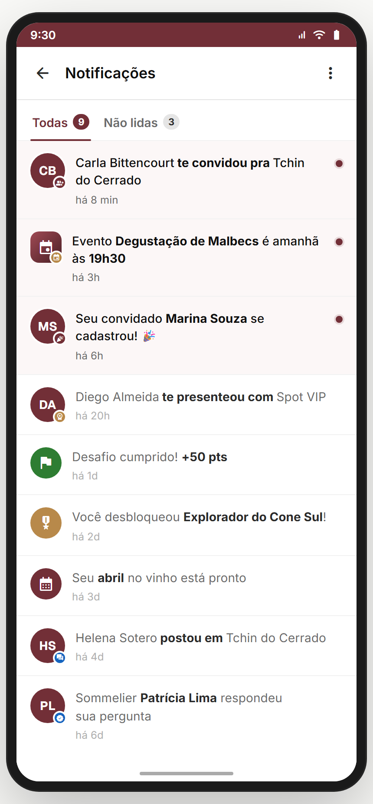
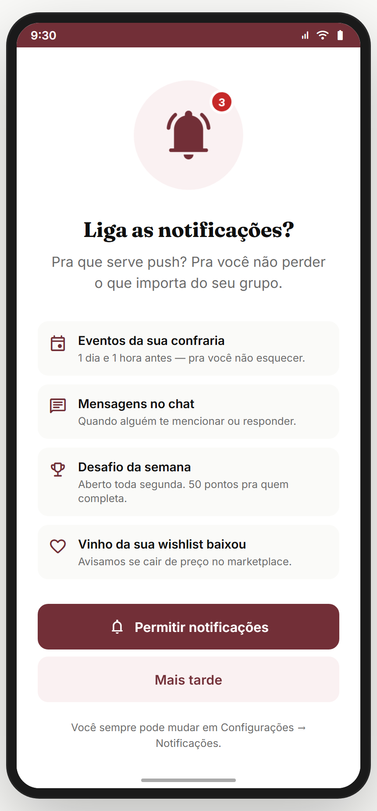
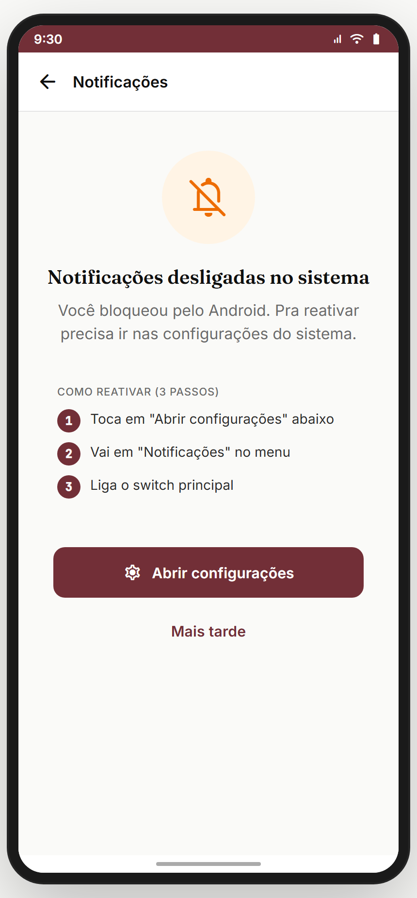
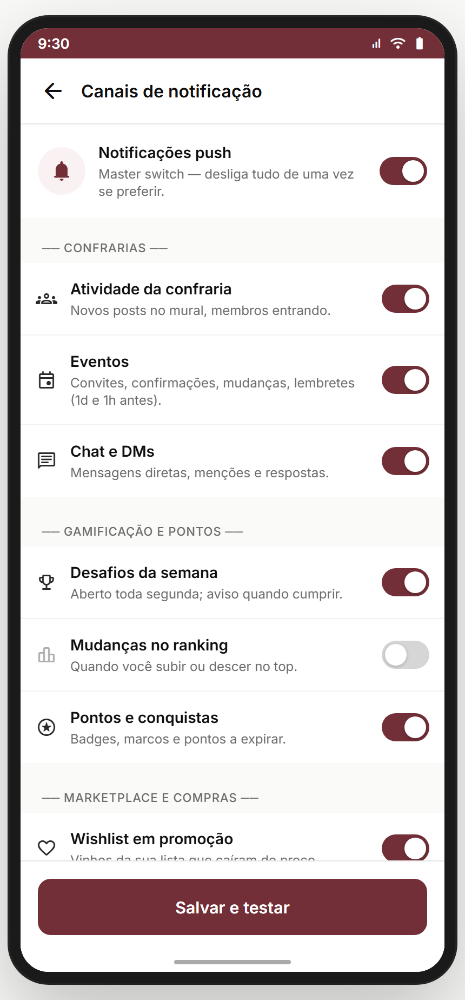
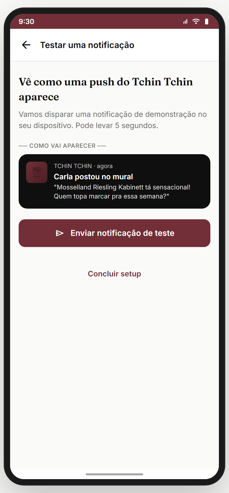
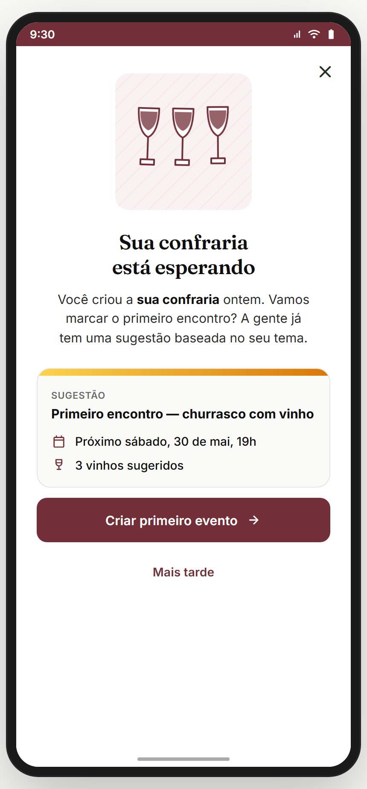
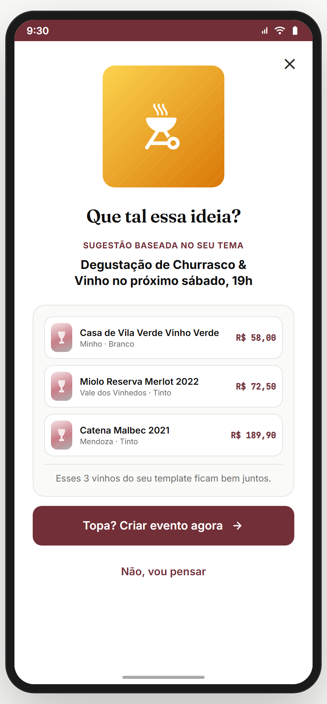
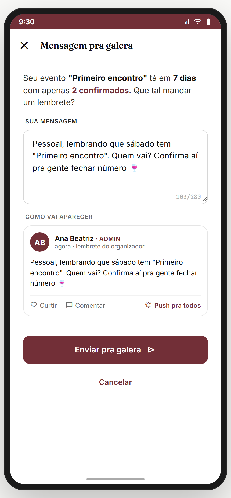
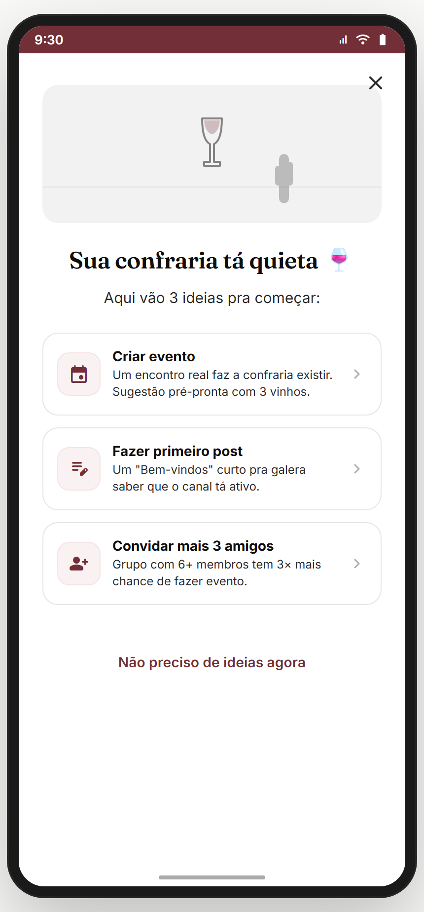
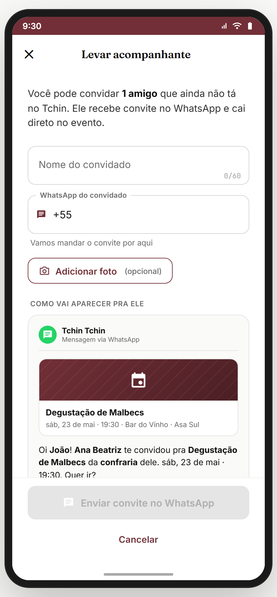

# Módulo 18 — Notificações & Engajamento

> Central de notificações + permissão de push (primer/negado/canais/preview) + **nudges de re-engajamento** temporais (D+1/3/7/14) + **plus-one** (trazer acompanhante). Motor de retenção: traz o usuário de volta com loss aversion + lembretes contextuais.
> **Fonte de verdade:** `screens-notificacoes.jsx` (`Notificacoes`), `screens-jornada-extras.jsx` (`PushPrimerScreen` + push variants), `screens-nudges.jsx` (NudgeD1/D3/D7/D14), `screens-plus-one.jsx` (`PlusOneScreen`). Doc funcional: **MVP1 + Sprint 11-13**.
> **Épicos/US:** US-NOTIF-01 (central de notificações), US-NOTIF-02 (push primer/permissão), US-NOTIF-03 (canais de push), US-NOTIF-04 (nudges temporais), US-NOTIF-05 (plus-one).

**Regra de negócio canônica:** push pede permissão via **primer** (best practice — nunca prompt frio, igual GPS no Módulo 02). Nudges são **disparados por tempo + estado** (ex.: criou confraria mas não marcou evento → D+1, D+3, D+7, D+14 com urgência crescente). Cada nudge é uma deep-screen acionada por push.

## Mapa do fluxo
```
[sino/header] → notificacoes (lista: Todas / Não lidas) → tap → rota da notif

[1º momento que precisa de push] → push-primer ─┬─ permitir → push-canais (granular)
                                                 └─ negar → push-negado (fallback)
                                                 push-preview = exemplo do que chega

[push de re-engajamento] → nudge-d1 / d3 / d7 / d14 → event-wizard-1 (criar evento) | comunidade (depois)
[convite c/ acompanhante] → plus-one
```

---

## 18.1 `notificacoes` — Central (`Notificacoes`) ✅



**Propósito:** inbox de notificações in-app — curtidas, comentários, eventos, convites, conquistas. **US-NOTIF-01.**
**Entradas:** ícone sino no header. **Saídas:** tap notif → rota correspondente (`routeForNotif`); back → home.
**Layout:** SubHeader "Notificações" + menu ⋯ (marcar todas como lidas) + tabs **Todas / Não lidas** (com contador) + lista de notificações (ícone por tipo + texto + tempo + estado lido/não-lido).

**Analytics:** `notifications_view { unread }`, `notification_tap { type }`, `notifications_mark_all_read`.

> **⚠️ DIVERGÊNCIA — notificações mock** (`DEFAULT_NOTIFICATIONS`). Backend: feed de notificações real + realtime + paginação.
> **⛔ FALTA NO APP (épico pede):** **agrupamento** ("Carla e +3 curtiram") + configurar tipos. Backlog **NOTIF-GROUPING**.

**Status:** ✅

---

## 18.2 Push — primer / negado / canais / preview ✅

_Primer · Negado · Canais · Preview:_

   

**Propósito:** pedir permissão de push do jeito certo (primer antes do prompt nativo) + gestão granular de canais. **US-NOTIF-02/03.**

- **`push-primer`** — explica o valor ANTES do prompt nativo ("Ative pra saber quando rolar evento na sua confraria…") + CTA "Ativar" / "Agora não". *(Mesmo padrão do GPS primer, Módulo 02.)*
- **`push-negado`** — fallback gentil quando nega ("Sem problema — você pode ativar depois em Configurações") + como reativar.
- **`push-canais`** — toggles granulares por canal (eventos / confrarias / curtidas / comentários / nudges / marketing).
- **`push-preview`** — exemplo visual de como a notificação chega (mockup da notificação no sistema).

**Analytics:** `push_primer_shown`, `push_primer_response { granted }`, `push_channel_toggle { channel, on }`.

> **⚠️ DIVERGÊNCIA — push simulado.** Backend: integração FCM/APNs real + permission flow nativo.

**Status:** ✅

---

## 18.3 Nudges de re-engajamento (D+1/3/7/14) ✅

_D+1 · D+3 · D+7 · D+14:_

   

**Propósito:** trazer de volta o admin que criou confraria mas **não marcou evento** — urgência crescente ao longo dos dias. **US-NOTIF-04.**
**Entradas:** push temporal (D+1, D+3, D+7, D+14 após criar confraria sem evento). **Saídas:** "Criar evento" → `event-wizard-1 { fromNudge }`; "Depois" → `comunidade`.

| Nudge | Tom | Conteúdo |
|---|---|---|
| **D+1** | leve | "Bora marcar o primeiro encontro da {confraria}?" + template sugerido |
| **D+3** | + concreto | + vinhos sugeridos pro evento |
| **D+7** | social proof / urgência | "Confrarias sem evento esvaziam" + dados |
| **D+14** | última chamada | risco de a confraria "esfriar" |

**Estado:** lê `window.__tcCurrentBrotherhood` (nome/template). Cada nudge passa `fromNudge: 'dN'` pro wizard (atribuição).
**Analytics:** `nudge_shown { day }`, `nudge_create_event { day }`, `nudge_later { day }`.

> **⚠️ DIVERGÊNCIA — nudges são telas (deep screens), disparo é mock.** Backend: agendador de push server-side (cron por estado do usuário) + a notificação que abre a tela.
> **⛔ FALTA NO APP (épico pede):** outros gatilhos de nudge (streak do Treino em risco — Módulo 08; carrinho abandonado — Módulo 05; vinho da wishlist baixou — Módulo 04). Backlog **NUDGE-TRIGGERS**.

**Status:** ✅

---

## 18.4 `plus-one` — Trazer acompanhante (`PlusOneScreen`) ✅



**Propósito:** convidar acompanhante para um evento (+1). **US-NOTIF-05.**
**Entradas:** evento/convite → "Levar acompanhante". **Saídas:** confirmar → volta ao evento.
**Layout (`PlusOneScreen`):** quem você quer levar (contato/convidado externo) + dados do +1 + confirmar.

> **⚠️ DIVERGÊNCIA — plus-one mock.** Backend: contar +1 na capacidade do evento; cobrança do +1 se evento pago (Módulo 12).
> **⛔ FALTA NO APP:** integração com capacidade/pagamento do evento.

**Status:** ✅

---

## Edge cases & navegação reversa
- **`BACK_SKIP`** inclui `nudge-d1/d3/d7/d14` — voltar não cai no nudge.
- **Push negado no SO** → push-negado + instrução de Configurações.
- **Nudge depois de já ter criado evento** → não deveria disparar (gate de estado).

## Pendências de backend / decisões do Gabriel
### Críticas (bloqueadores GA)
- **FCM/APNs real** + permission flow nativo.
- **Agendador de nudges** server-side (cron por estado do usuário).
- **Feed de notificações** real + realtime.
### Importantes
- Agrupamento de notificações + canais configuráveis.
- Outros gatilhos de nudge (streak/carrinho/wishlist).
- Plus-one integrado a capacidade/pagamento do evento.
### Decisões do Gabriel
- Cadência dos nudges (D+1/3/7/14 definitiva?) + cap de frequência (anti-spam).
- Quais canais on por padrão (opt-in vs opt-out)?

## Conexões com outros módulos
- **Módulo 02 (Onboarding)** — push-primer espelha GPS primer; nudges no BACK_SKIP.
- **Módulo 11/12 (Confrarias/Eventos)** — nudges levam ao event-wizard; plus-one no evento.
- **Módulo 04/05/08** — gatilhos futuros de nudge (wishlist/carrinho/streak).
- **Módulo 13/17 (Comunidade/Chat)** — notificações de curtida/comentário/mensagem.
