# Módulo 19 — Jornada, Pontos & Desafios

> Gamificação **global** do app: a **economia de Pontos** (moeda única), a **jornada de marcos** (onboarding-to-engaged), as **celebrações** de conquista, os **desafios semanais** e a **loja de resgate** (crédito, vinhos, experiências). É o motor que liga registrar vinho, treinar paladar, ir a eventos e indicar amigos a uma recompensa concreta.
> **Fonte de verdade:** `screens-jornada-extras.jsx` (`JornadaScreen`, `JornadaCelebrarScreen`, `PontosScreen`, `POINTS_ECONOMY`), `f22_02_DetalheDesafio.jsx` (`DetalheDesafio`, `CHALLENGE_TEMPLATES`, `CHALLENGE_STATE`). *(`badges` = `badges-galeria`, documentado no Módulo 14.)* Doc funcional: **MVP2 Épico 7/9**.
> **Épicos/US:** US-JOR-01 (jornada de marcos + pontos), US-JOR-02 (celebração de conquista), US-JOR-03 (desafio detalhe + ranking), US-JOR-04 🆕 (carteira + resgate de pontos).

**Regra de negócio canônica:** existe **uma única moeda — Pontos Tchin** — ganha em todo o app e **resgatável** por crédito no marketplace, vinhos do catálogo resgatável (a Tchin absorve o custo) e experiências futuras (enoturismo/locais). A **jornada** é o checklist de marcos que ensina a ganhar pontos; os **desafios semanais** são metas temporais recorrentes; a **celebração** dá reforço positivo a cada conquista.

---

## 💰 Economia de Pontos (regra de negócio — `POINTS_ECONOMY`)

> **✅ GABRIEL DECIDIU — pontos servem pra resgatar.** Pontos viram **crédito no marketplace**, **vinhos** (catálogo resgatável, custo absorvido pela Tchin) e, no futuro, **experiências** (degustação em locais parceiros, enoturismo). Logica criada com **limites** anti-abuso. **As taxas/limites abaixo são calibráveis pelo Gabriel com dados reais.**

### Moeda única (unificação)
- **Pontos Tchin** = a ÚNICA moeda resgatável. Tudo que dá recompensa converte em Pontos.
- O **XP do Treino (M08)** deixa de competir com "pontos": XP passa a ser **só o placar da Liga** (gameplay competitivo semanal), **não-resgatável**. Mas cada conquista do Treino **credita Pontos** (ver tabela). → resolve a antiga divergência "pontos fragmentados".

### Como GANHA (tabela `earn` — único lugar onde se ganha)
| Ação | Pontos | Limite | Módulo origem |
|---|---|---|---|
| Registrar vinho no diário | **+10** | até **3×/dia** (anti-farming) | M07 Adega |
| Concluir lição no Treino | **+15** | — | M08 Treino |
| Bater a meta diária do Treino | **+20** | 1×/dia | M08 Treino |
| Cumprir o desafio da semana | **+50** | 1×/semana | M11/M19 |
| Avaliar um vinho que registrou | **+5** | por vinho | M04/M07 |
| Amigo convidado vira ativo | **+50** (1º) · **+30** extras | até **5/mês** | M16 Indicação |
| Subir de nível no Treino | **+50** | por nível | M08 Treino |

### Marcos da jornada (one-time — ver 19.1)
Cadastro **50** · Calibrar paladar **50** · 1º vinho **30** · Entrar em confraria **40** · 1º evento **30** · Escanear rótulo **20** · Perguntar pra Expert **20** · Convidar 1 amigo **50** · Conquistar 5 badges **100**. **Soma dos marcos = 390 pts.**

### Como RESGATA (loja — ver 19.4) + limites
- **Taxa de conversão:** `10 pontos = R$1` (`brlPerPoint = 0,10`).
- **Crédito no marketplace:** resgate mínimo **300 pts (R$30)**; crédito cobre **no máx 30% do valor do pedido** (resto em dinheiro); crédito vale **6 meses**.
- **Vinhos resgatáveis (grátis):** catálogo curado de **vinhos de entrada (≤ R$70)**; custo **800 pts** por vinho; limite **1 vinho a cada 30 dias**; **a Tchin absorve o custo do vinho** (frete por conta de quem resgata). 🆕
- **Experiências (futuro):** degustação em loja parceira (~1.500 pts), visita a vinícola/enoturismo (~5.000 pts) → hoje **"Em breve"**.
- **Expiração:** pontos expiram após **12 meses de inatividade**.

---

## Mapa do fluxo
```
[perfil/menu] → jornada (marcos + % + próxima etapa) → tap etapa → rota da ação (registro/scanner/evento…)
[hero da jornada / menu] → pontos (carteira + Resgatar | Como ganhar | Extrato)
[completar QUALQUER conquista] → jornada-celebrar { kind } (confete + recompensa + próximo)
[confraria / push de segunda] → desafio-detalhe { state } (critério + prazo + sugestões + registrar) → registro-rapido | ranking
[resgatar na loja] → toast/aplicação → (crédito no checkout M05 | vinho no carrinho M05)
```

---

## 19.1 `jornada` — Jornada de marcos (`JornadaScreen`) ✅


**Propósito:** checklist gamificado dos marcos do app + pontos de marco + próximo passo + **entrada pra carteira de pontos**. **US-JOR-01.**
**Entradas:** perfil/menu ("Minha jornada"). **Saídas:** tap marco ativo → rota da ação; **"Resgatar meus pontos" → `pontos`**; back.

**Layout (`JornadaScreen`):** hero gradiente "SUA JORNADA NO TCHIN TCHIN" + "{completos}/{total} etapas" + barra de progresso (% + **"X pts em marcos"**) + 🆕 **botão "Resgatar meus pontos" → `pontos`** + **etapa ativa destacada** ("PRÓXIMA") + linha do tempo de marcos.
**Marcos (9):** Criar conta (50) ✓ · Calibrar paladar (50) ✓ · 1º vinho (30) ✓ · Entrar em confraria (40) ✓ · **Confirmar 1º evento (30) ← ativa** · Escanear rótulo (20) · Perguntar pra Expert (20) · Convidar 1 amigo (50) · Conquistar 5 badges (100).

**Analytics:** `journey_view { completed, total, points }`, `journey_step_tap { id }`, `journey_redeem_tap`.

> **✅ CONFIRMADO (Gabriel pediu):** as 9 etapas e seus pontos estão corretos e batem com a tabela de marcos acima. **O que faltava (resolvido agora):** (1) link pra resgatar os pontos → adicionado; (2) o "pontos ganhos" do hero virou **"pts em marcos"** pra não confundir com o saldo total da carteira (que inclui registros/desafios).
> **⚠️ DIVERGÊNCIA — estado mock:** marcos hard-coded. Backend: estado real de cada marco por usuário + saldo real de Pontos.

**Status:** ✅

---

## 19.2 `jornada-celebrar` — Celebração polimórfica (`JornadaCelebrarScreen`) ✅

_Uma só tela cobre **todas** as conquistas, via `params.kind`. Variações: marco · desafio · nível · sequência · resgate._

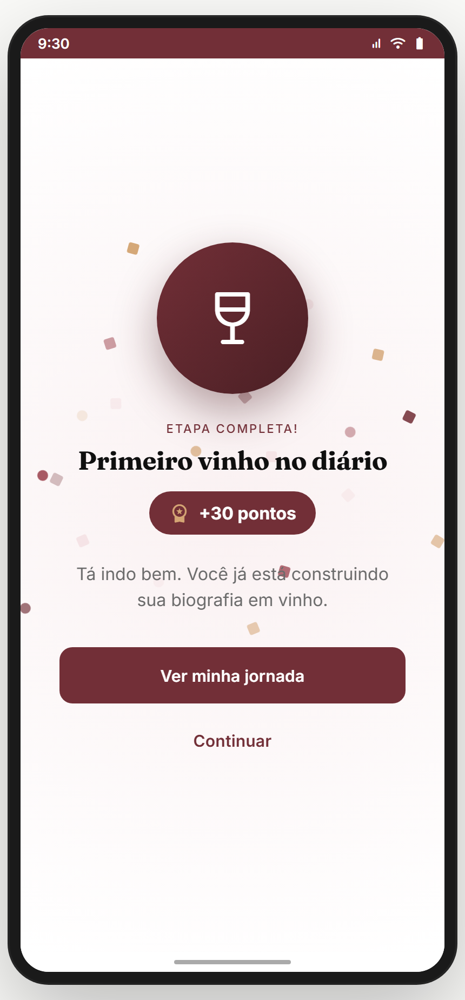 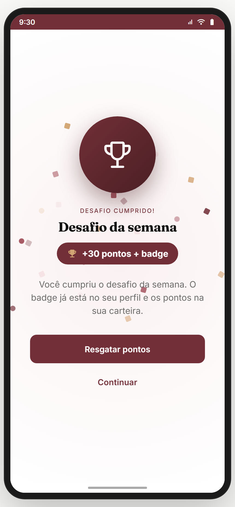 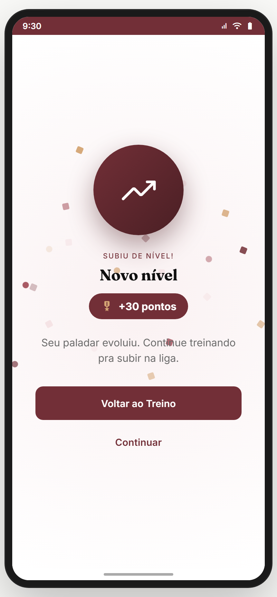 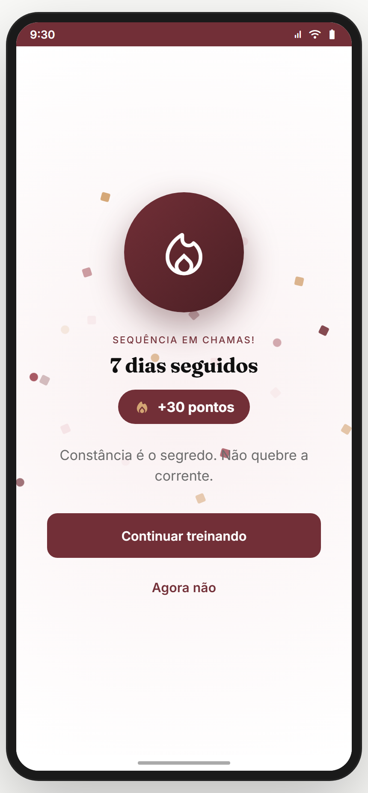 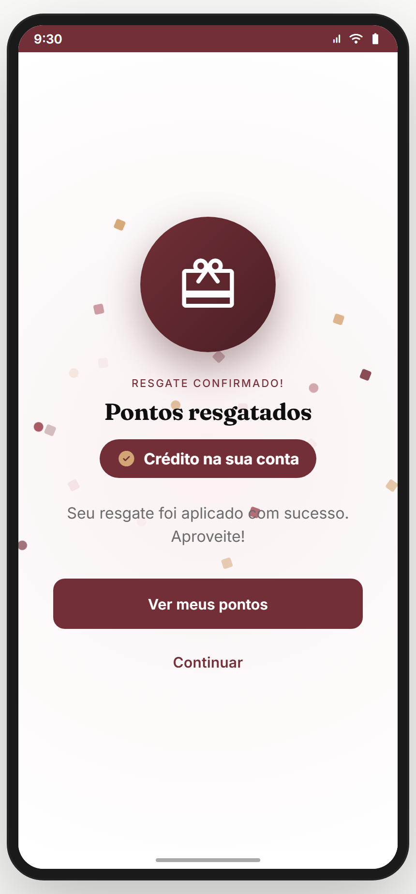

**Propósito:** reforço positivo (confete + ícone + recompensa + próximo passo) a cada conquista. **US-JOR-02.**

**Variações (`CELEBRATION[kind]`) — todas as telas de sucesso + regra por tela:**

| `kind` | Quando dispara | Eyebrow | Recompensa exibida | CTA primária |
|---|---|---|---|---|
| `milestone` *(default)* | completou um marco da jornada | "ETAPA COMPLETA!" | `+{pts} pontos` | Ver minha jornada |
| `challenge` | cumpriu o desafio da semana | "DESAFIO CUMPRIDO!" | `+50 pontos + badge` | Resgatar pontos → `pontos` |
| `levelup` | subiu de nível no Treino | "SUBIU DE NÍVEL!" | `+50 pontos` | Voltar ao Treino |
| `streak` | bateu marco de sequência (ex.: 7 dias) | "SEQUÊNCIA EM CHAMAS!" | `+{pts} pontos` | Continuar treinando |
| `redeem` | confirmou um resgate na loja | "RESGATE CONFIRMADO!" | texto do resgate (ex.: "Crédito na sua conta") | Ver meus pontos → `pontos` |

**Regra comum:** ícone num círculo burgundy + confete + pill de recompensa (anim. `tcPopIn`) + corpo motivacional + 2 CTAs (primária varia por kind, secundária "Continuar"/"Agora não"). Param: `kind` + `data` (`{ label/title, pts, icon, level, days, reward }`).
**Analytics:** `celebration_shown { kind }`, `celebration_cta { kind, action }`.

> **⚠️ DIVERGÊNCIA — disparo mock.** Backend: emitir o evento certo (com `kind` + `data`) ao detectar a conclusão real.

**Status:** ✅

---

## 19.3 `desafio-detalhe` — Desafio semanal (`DetalheDesafio`) ✅

_Estados: **ativo** (em andamento) · **cumprido** · **encerrado**._

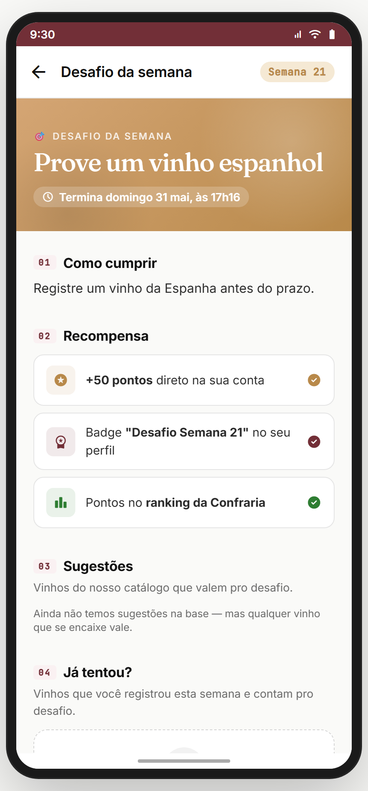 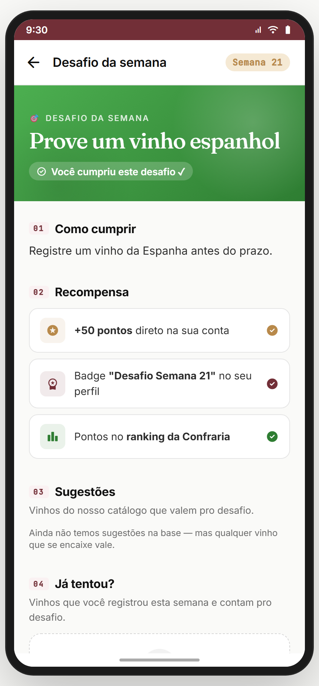 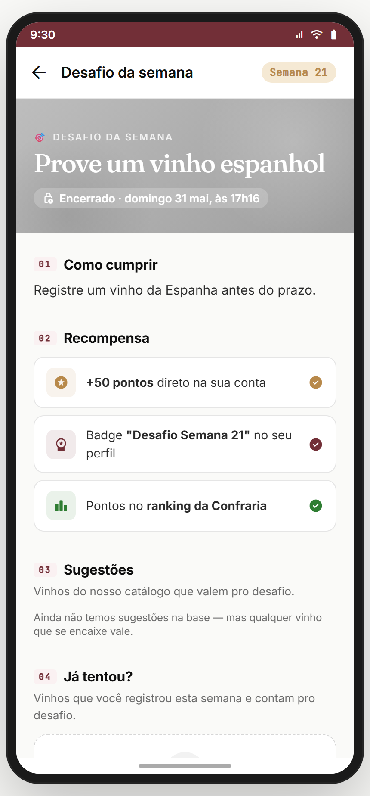

**Propósito:** detalhe de um desafio temporal com critério, prazo, recompensa, sugestões do catálogo e prova ("já tentou?"). **US-JOR-03.**
**Entradas:** confraria; card de desafio; push de segunda. **Saídas:** "Registrar agora" → `registro-rapido`; vinho → `wine`; ranking → ranking da confraria; back.

### Templates de desafio (`CHALLENGE_TEMPLATES`) — todos os tipos
O sistema **gera 1 desafio por semana** a partir de um template (rotação automática). Cada template tem ícone, padrão de título e **critério de validação automática** (campo do vinho registrado que precisa bater).

| Template | Título (padrão) | Critério / validação | Exemplos |
|---|---|---|---|
| `pais` | "Prove um vinho da {país}" | `country` == país | Espanha, Itália, Portugal, Chile, França |
| `uva` | "Descubra a uva {uva}" | uva no rótulo/ficha | Tempranillo, Syrah, Riesling, Tannat, Nebbiolo |
| `tipo` | "Semana do {tipo}" | `type` == tipo | Espumante, Branco, Rosé, Laranja |
| `preco` | "Achado da semana: até R$ {x}" | `price` ≤ x | 50, 70, 90 |
| `regiao` | "Explore {região}" | `region` == região | Douro, Mendoza, Toscana, Vale dos Vinhedos |
| `harmonizacao` | "Harmonize com {prato}" | registro com nota de harmonização | queijos, massa, churrasco, chocolate |
| `cegas` | "Degustação às cegas" | registro marcado "às cegas" | — |
| `nacional` | "Orgulho nacional" | `country` == Brasil (pequeno produtor) | Brasil |

### Regras de negócio dos desafios
- **Cadência:** 1 desafio/semana, abre **toda segunda**, fecha domingo 23h59 (`endsAt`). Push de abertura (M18).
- **Validação automática:** ao registrar um vinho que **bate o critério** dentro do prazo → desafio passa a **cumprido**. Sem ação manual de "marcar".
- **Recompensa (ao cumprir):** **+50 pontos** + **badge "Desafio Semana {N}"** (vai pro perfil, M14) + **pontos contam no ranking da confraria** (se o usuário participa de alguma — senão, item fica `muted`).
- **Escopo:** o **sistema cria o desafio global** da semana (rotação de templates); **confrarias podem ter o seu próprio** desafio/ranking interno (decisão de produto — backlog de criação por admin).
- **Estados (`CHALLENGE_STATE`):**
  - **`active`** — hero âmbar + chip "Termina {data}" + CTA "Registrar agora".
  - **`done`** — hero verde + chip "Você cumpriu este desafio ✓" + recompensa marcada concluída.
  - **`expired`** — hero cinza + chip "Encerrado · {data}" + resultado (sem CTA de registro).

**Seções da tela:** Hero (estado) → **01 Como cumprir** (critério) → **02 Recompensa** (50 pts + badge + ranking) → **03 Sugestões** (vinhos do catálogo que valem) → **04 Já tentou?** (vinhos que você registrou e contam, ou empty-state com CTA).
**Estado/props:** `challenge`, `state`, `inConfraria`, `registered[]`.
**Analytics:** `challenge_view { week, template, state }`, `challenge_register`, `challenge_completed`, `challenge_ranking_view`.

> **⚠️ DIVERGÊNCIA — desafio mock.** Backend: gerador semanal de templates + validação automática (bateu o critério? → cumpriu) + ranking real + histórico de desafios.

**Status:** ✅

---

## 19.4 🆕 `pontos` — Carteira + Loja de resgate (`PontosScreen`) ✅

_Abas: **Resgatar** · **Como ganhar** · **Extrato**._

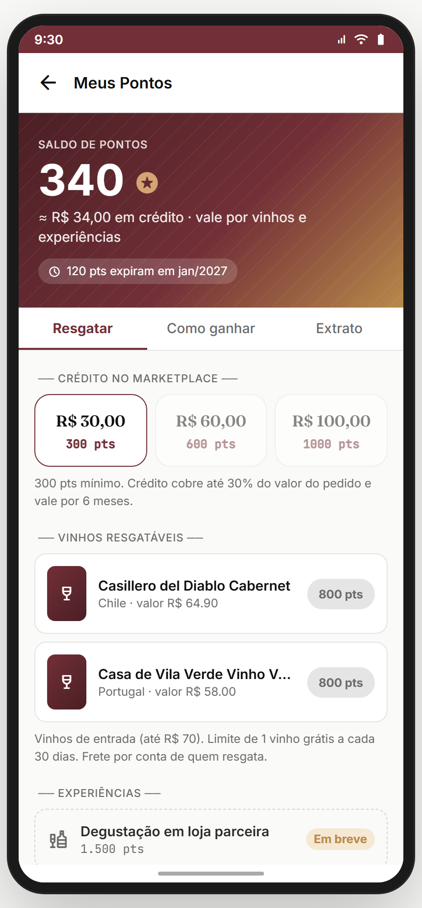 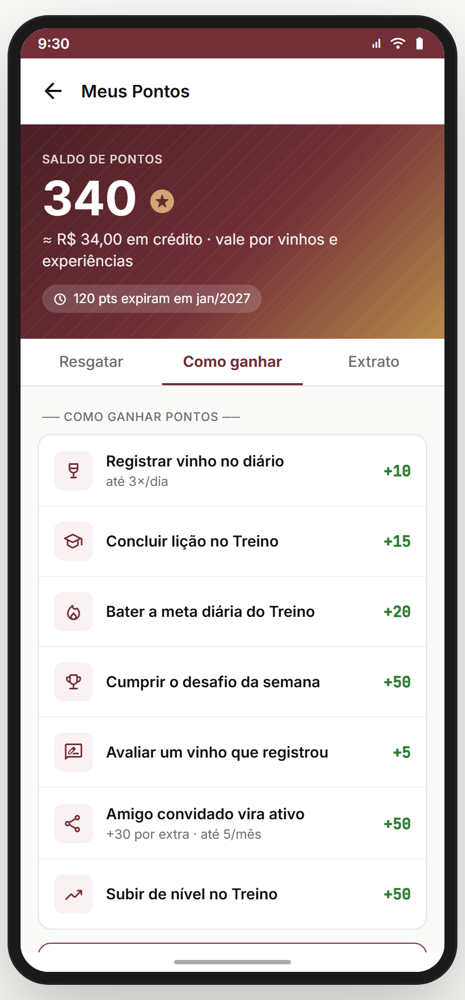 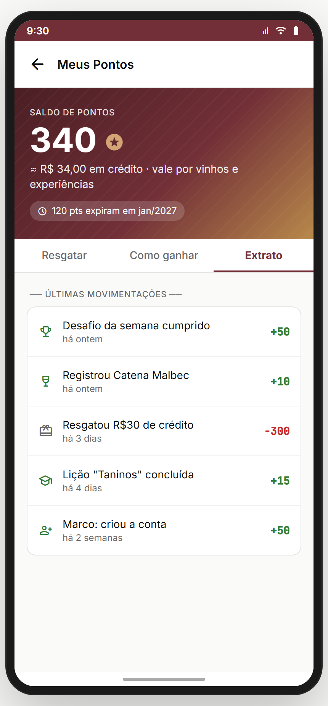

**Propósito:** carteira de Pontos + loja de resgate (a "lógica de resgate" pedida pelo Gabriel). **US-JOR-04.**
**Entradas:** `jornada` ("Resgatar meus pontos"); menu/perfil ("Meus pontos"); celebração `challenge`/`redeem`. **Saídas:** resgate de crédito/vinho → toast/aplicação (crédito no checkout M05; vinho no carrinho M05); "Ver minha jornada" → `jornada`.

**Layout (`PontosScreen`):**
- **Hero/carteira:** saldo grande + `≈ R$ X em crédito` + chip "X pts expiram em {mês}".
- **Aba Resgatar:**
  - **Crédito no marketplace:** 3 faixas (R$30 = 300 pts · R$60 = 600 · R$100 = 1.000), desabilitadas se saldo insuficiente + nota "mínimo 300 pts · cobre até 30% do pedido · vale 6 meses".
  - **Vinhos resgatáveis:** lista de vinhos de entrada (≤ R$70) a **800 pts** cada + nota "1 vinho grátis a cada 30 dias · frete por conta de quem resgata".
  - **Experiências:** degustação (1.500 pts) e enoturismo (5.000 pts) com selo **"Em breve"**.
- **Aba Como ganhar:** tabela `earn` (ação → pontos) + CTA "Ver minha jornada".
- **Aba Extrato:** últimas movimentações (entradas verdes `+`, resgates vermelhos `−`).

**Analytics:** `points_wallet_view { balance }`, `points_redeem { type, cost }`, `points_earn_view`, `points_statement_view`.

> **✅ GABRIEL DECIDIU — vinhos grátis por conta da Tchin.** O catálogo resgatável usa vinhos de entrada (≤ R$70) e **a Tchin arca com o custo** desses vinhos no fim. Limites: 800 pts/vinho, 1 a cada 30 dias.
> **⚠️ DIVERGÊNCIA — resgate mock.** Backend: saldo real + carteira transacional (idempotente), aplicação do crédito no checkout (M05), reserva de estoque do vinho resgatável, antifraude (cap diário, expiração).

**Status:** ✅ (UI/UX completos; transações e antifraude pendentes no backend)

---

## Edge cases & navegação reversa
- **Marco já completo** ao tocar → não re-executa (idempotente).
- **Desafio expirado** → estado `expired` (hero cinza, sem CTA de registro).
- **Saldo insuficiente** → opção de resgate desabilitada + toast "Pontos insuficientes".
- **Crédito > 30% do pedido** → o checkout (M05) limita o abatimento a 30%.
- **Vinho grátis dentro da janela de 30 dias** → bloqueado até liberar.

## Pendências de backend / decisões do Gabriel
### Críticas (bloqueadores GA)
- **Carteira transacional real** (saldo, extrato, idempotência) + **estado real dos marcos** + disparo das celebrações.
- **Gerador de desafios** (rotação de templates) + **validação automática** + ranking real + histórico.
- **Aplicação do resgate:** crédito abatido no checkout (M05, ≤30%) + vinho resgatável vira item de carrinho com estoque reservado.
- **Antifraude:** cap diário de registro (3×), expiração (12m), limite de vinho grátis (1/30d) — tudo server-side.
### Importantes
- Badges unificados (M14 + M08 + desafios).
- Confraria cria desafio próprio (além do global do sistema).

> **✅ GABRIEL DECIDIU (fechado):** moeda única (Pontos) com XP do Treino virando só placar de Liga; pontos resgatáveis em crédito/vinhos/experiências com limites; vinhos grátis custeados pela Tchin.

## Conexões com outros módulos (todos os módulos que conectam + efeitos)
| Módulo | Conexão | Efeito em Pontos / Jornada |
|---|---|---|
| **M01 Auth** | criar conta | marco **+50** |
| **M02 Onboarding** | concluir onboarding/roteamento | habilita a jornada |
| **M03 Paladar** | calibrar paladar (quiz) | marco **+50** |
| **M04 Marketplace** | avaliar vinho; wishlist | **+5** por avaliação; destino do resgate (crédito/vinho) |
| **M05 Carrinho/Checkout** | aplicar resgate | crédito abate **≤30%** do pedido; vinho resgatável entra no carrinho |
| **M06 Scanner** | escanear rótulo | marco **+20**; registrar via scanner = **+10** |
| **M07 Adega/Diário** | registrar vinho | **+10** (cap 3/dia); 1º vinho = marco **+30**; alimenta desafios |
| **M08 Treino** | lição/meta/nível | **+15** lição · **+20** meta diária · **+50** subir nível; XP = só placar da Liga |
| **M11 Confrarias** | desafio semanal + ranking | pontos do desafio contam no **ranking da confraria** |
| **M12 Eventos** | confirmar 1º evento | marco **+30** |
| **M14 Perfil** | badges (`badges-galeria`) | marco "5 badges" **+100**; badge de desafio aparece aqui |
| **M15 Expert** | perguntar pra Expert | marco **+20** |
| **M16 Indicação** | amigo vira ativo | **+50** (1º, é marco) · **+30** por extra (até 5/mês) |
| **M18 Notificações** | push de engajamento | "desafio aberto" (segunda), "subiu no ranking", nudges |
