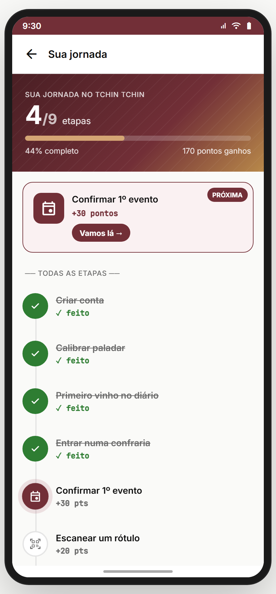
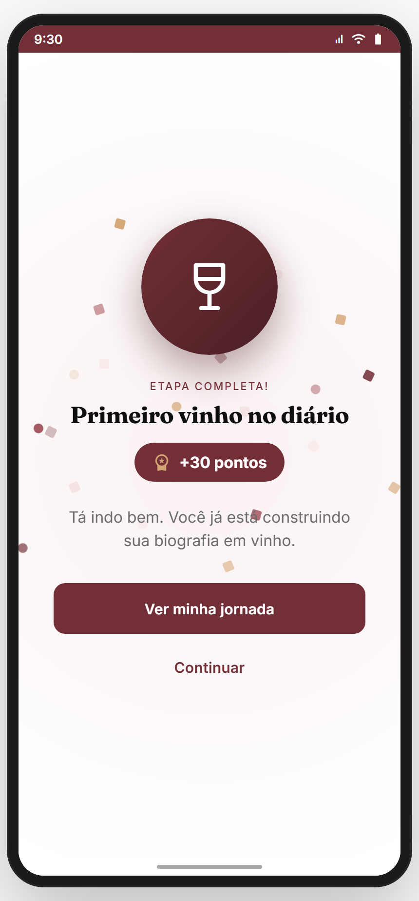
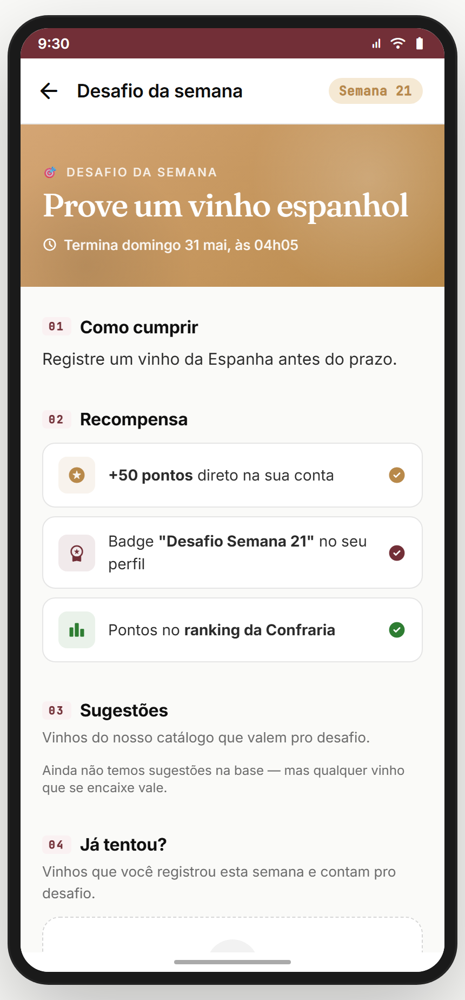

# Módulo 19 — Jornada & Desafios

> Gamificação **global** (não só do Treino): jornada de marcos do app (criar conta → calibrar paladar → 1º vinho → confraria → evento…), celebração ao completar, e desafios semanais (geralmente nas confrarias). Conecta com badges (Módulo 14) e pontos (transversal).
> **Fonte de verdade:** `screens-jornada-extras.jsx` (`JornadaScreen`, `JornadaCelebrarScreen`), `f22_02_DetalheDesafio.jsx` (`DetalheDesafio`). *(O `badges` do índice = `badges-galeria`, documentado no Módulo 14.)* Doc funcional: **MVP2 Épico 7/9**.
> **Épicos/US:** US-JOR-01 (jornada de marcos + pontos), US-JOR-02 (celebração de conquista), US-JOR-03 (desafio detalhe + ranking).

**Regra de negócio canônica:** jornada = checklist de **marcos onboarding-to-engaged**, cada um vale pontos; mostra progresso % + próximo passo destacado. Desafio = meta temporal (ex.: "prove um vinho espanhol esta semana"), geralmente atrelado a uma confraria, com ranking de quem cumpriu.

## Mapa do fluxo
```
[perfil/menu] → jornada (marcos + % + próxima etapa) → tap etapa → rota da ação (registro/scanner/evento…)
[completar marco] → jornada-celebrar (confete + pontos + próximo)
[confraria/desafio semanal] → desafio-detalhe (critério + prazo + registrar) → registro-rapido | ranking
```

---

## 19.1 `jornada` — Jornada de marcos (`JornadaScreen`) ✅



**Propósito:** checklist gamificado dos marcos do app + pontos + próximo passo. **US-JOR-01.**
**Entradas:** perfil/menu. **Saídas:** tap marco pendente → rota da ação (`registro-rapido`, `scanner`, `event-detalhe`, `indicacao-landing`, etc.); back.

**Layout (`JornadaScreen`):** hero gradiente "SUA JORNADA NO TCHIN TCHIN" + "{completos}/{total} etapas" + barra de progresso (% + pontos ganhos) + **etapa ativa destacada** ("PRÓXIMA") + lista de marcos:
- Criar conta (50) ✓ · Calibrar paladar (50) ✓ · 1º vinho no diário (30) ✓ · Entrar numa confraria (40) ✓ · **Confirmar 1º evento (30) ← ativa** · Escanear rótulo (20) · Perguntar pra Expert (20) · Convidar 1 amigo (50) · Conquistar 5 badges (100).

**Analytics:** `journey_view { completed, total, points }`, `journey_step_tap { id }`.

> **⚠️ DIVERGÊNCIA — marcos mock** (estado hard-coded). Backend: estado real de cada marco por usuário + pontos.
> **⚠️ DIVERGÊNCIA — pontos fragmentados:** jornada (pontos de marco) + Treino (XP — M08) + indicação (pontos — M16). **Recomendação PO:** moeda/pontuação unificada. Backlog **POINTS-UNIFY**.

**Status:** ✅

---

## 19.2 `jornada-celebrar` — Celebração (`JornadaCelebrarScreen`) ✅



**Propósito:** reforço positivo ao completar um marco — confete + pontos + próximo passo. **US-JOR-02.**
**Entradas:** ao completar um marco. **Saídas:** "Próximo passo" → rota; "Continuar" → jornada/home.
**Layout:** confete + ícone do marco + "Você completou: {marco}!" + +pontos + sugestão do próximo + CTAs.

> **⚠️ DIVERGÊNCIA — celebração mock.** Backend: disparar de verdade ao detectar conclusão do marco.

**Status:** ✅

---

## 19.3 `desafio-detalhe` — Desafio semanal (`DetalheDesafio`) ✅



**Propósito:** detalhe de um desafio temporal (ex.: "Prove um vinho espanhol") com critério, prazo e ação. **US-JOR-03.**
**Entradas:** confraria; card de desafio. **Saídas:** "Registrar" → `registro-rapido`; vinho → `wine`; ranking → ranking da confraria; back.
**Layout (`DetalheDesafio`):** título do desafio + semana + countdown (prazo) + critério ("Registre um vinho da Espanha antes do prazo") + país/tema + quem já registrou + CTA "Registrar daqui".

**Estado:** `challenge` (params), `inConfraria`, `registered[]`.
**Analytics:** `challenge_view { week, country }`, `challenge_register`, `challenge_ranking_view`.

> **⚠️ DIVERGÊNCIA — desafio mock.** Backend: desafios reais (criados por admin/sistema) + validação automática (registrou vinho do país? → cumpriu) + ranking real.
> **⛔ FALTA NO APP (épico pede):** **recompensa do desafio** (pontos/badge ao cumprir) + **histórico de desafios**. Backlog **CHALLENGE-REWARD**.

**Status:** ✅

---

## Edge cases & navegação reversa
- **Marco já completo** ao tocar → não re-executa (idempotente).
- **Desafio expirado** → estado "encerrado" + resultado.
- **Pontos** não têm carteira unificada (espalhados por features).

## Pendências de backend / decisões do PO
### Críticas (bloqueadores GA)
- **Estado real dos marcos** por usuário + disparo da celebração.
- **Desafios reais** (criação + validação automática + ranking).
- **Pontuação unificada** (jornada + Treino XP + indicação).
### Importantes
- Recompensa do desafio (pontos/badge) + histórico.
- Badges unificados (M14 + M08 + aqui).
### Decisões do PO
- Pontos servem pra quê? (resgatar em crédito/marketplace? só status?)
- Desafios: sistema cria globalmente, ou cada confraria cria os seus?

## Conexões com outros módulos
- **Módulo 07 (Adega)** — registrar vinho cumpre marcos/desafios.
- **Módulo 08 (Treino)** — XP vs pontos da jornada (unificar).
- **Módulo 11 (Confrarias)** — desafios semanais da confraria + ranking.
- **Módulo 14 (Perfil)** — badges (`badges-galeria`); marco "5 badges".
- **Módulo 16 (Indicação)** — marco "convidar amigo".
