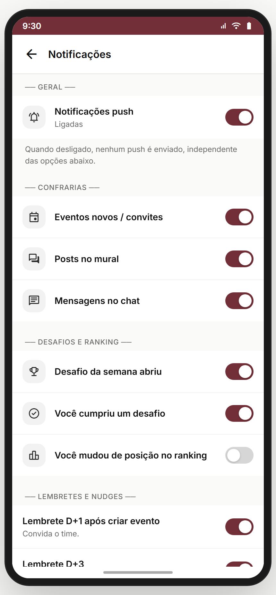
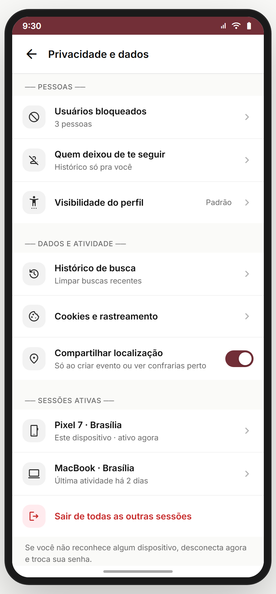
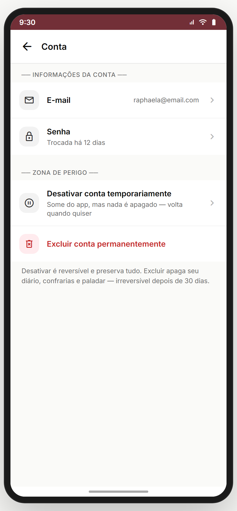
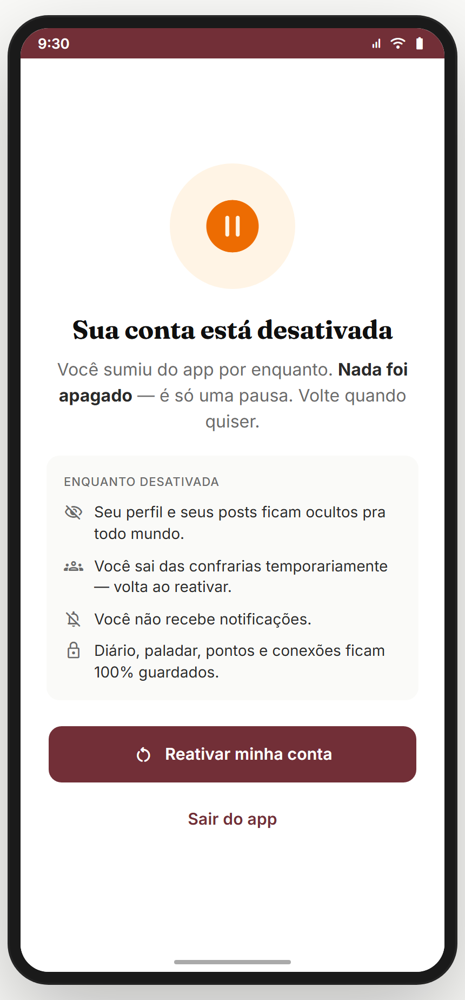
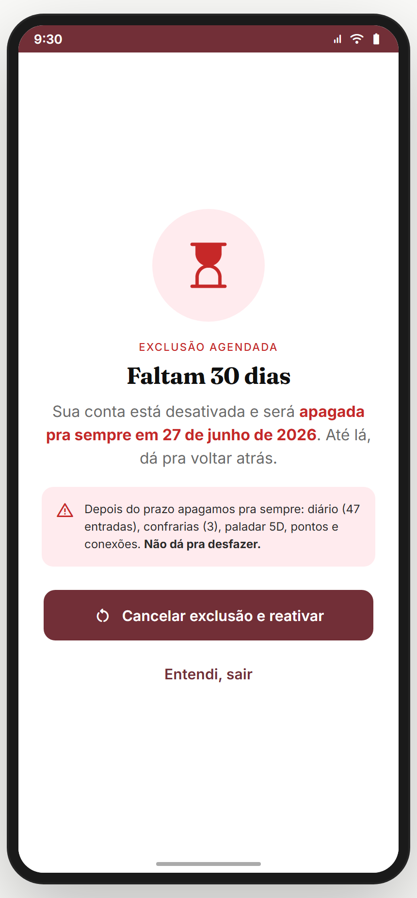
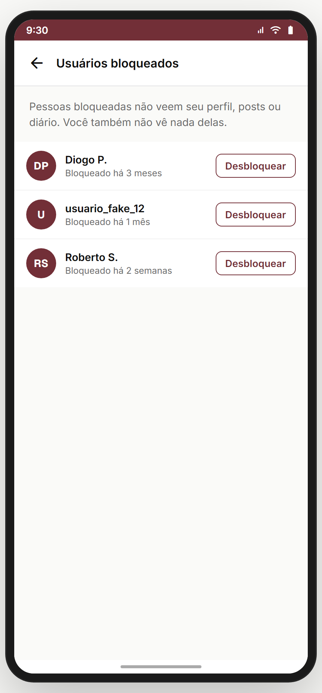
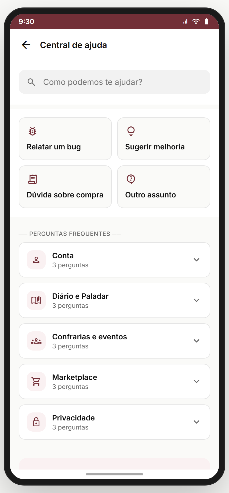
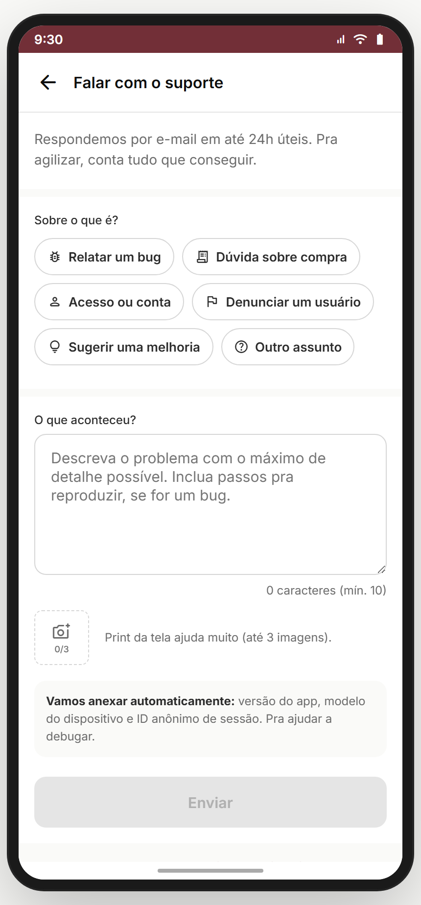

# Módulo 20 — Config & Suporte

> Configurações da conta (notificações, privacidade, dados da conta, bloqueados) + suporte (FAQ + contato). Inclui zona de perigo (desativar/excluir conta com fluxo de 2 passos).
> **Fonte de verdade:** `screens-config-detalhe.jsx` (`ConfigNotifScreen`, `ConfigPrivacidadeScreen`, `ConfigContaScreen`, `BloqueadosScreen`), `screens-suporte.jsx` (`SuporteFaqScreen`, `SuporteContatoScreen`). Doc funcional: **MVP1**.
> **Épicos/US:** US-CFG-01 (config notificações), US-CFG-02 (privacidade), US-CFG-03 (conta + zona de perigo), US-CFG-04 (bloqueados), US-SUP-01 (FAQ), US-SUP-02 (contato).

**Regra de negócio canônica:** excluir conta tem **fluxo de 2 passos** + janela de 30 dias pra reverter; oferece desativação temporária como alternativa (preserva dados). Privacidade granular (diário/confrarias/paladar).

> **✅ GABRIEL DECIDIU — sem telefone, sem 2FA.** O app **não coleta número de telefone** (cadastro é só nome + e-mail; auth é SSO Apple/Google + e-mail/senha) e **não tem verificação em duas etapas (2FA)**. Removidos de `config-conta`, do texto de privacidade e de qualquer outro fluxo.

## Mapa do fluxo
```
[perfil/editar → "Configurações"] → config (hub) ─┬─ config-notif (canais push/email)
                                                   ├─ config-privacidade (quem vê o quê)
                                                   ├─ config-conta (email/senha/zona de perigo)
                                                   │     ├─ Desativar  → conta-desativada (reversível, nada apaga)
                                                   │     └─ Excluir → modal 2 passos → conta-excluida (soft-delete 30d → cancela e reativa)
                                                   ├─ config-bloqueados (lista de bloqueados)
                                                   └─ suporte → suporte-faq | suporte-contato
```

---

## 20.1 `config-notif` — Notificações (`ConfigNotifScreen`) ✅



**Propósito:** controlar canais e tipos de notificação (push/email). **US-CFG-01.**
**Layout:** grupos de toggles por categoria (eventos, confrarias, curtidas/comentários, nudges, marketing) × canal (push / email). *(Complementa o `push-canais` do Módulo 18.)*

> **⚠️ DIVERGÊNCIA — toggles mock.** Backend: persistir preferências + respeitar no envio.

**Status:** ✅

---

## 20.2 `config-privacidade` — Privacidade (`ConfigPrivacidadeScreen`) ✅



**Propósito:** quem vê seu diário / confrarias / paladar / atividade. **US-CFG-02.**
**Layout:** opções por item (Só você / Amigos / Confrarias / Todo mundo). *(Mesma base de `editar-perfil-privacidade`, Módulo 14.)*

> **⚠️ DIVERGÊNCIA — privacidade não-enforced** (ver Módulo 14). Backend precisa aplicar os gates.

**Status:** ✅

---

## 20.3 `config-conta` — Conta + Zona de perigo (`ConfigContaScreen`) ✅



**Propósito:** dados da conta + desativar/excluir. **US-CFG-03.**
**Entradas:** editar-perfil → "Configurações de conta". **Saídas:** trocar email/senha; **Desativar → `conta-desativada`**; **Excluir → modal 2 passos → `conta-excluida`**.
**Layout (`ConfigContaScreen`):**
- **Informações da conta:** E-mail · Senha ("trocada há 12 dias"). **Sem Telefone e sem 2FA** (não fazem parte do produto — Gabriel decidiu).
- **Zona de perigo** *(hint deixa a diferença clara: "Desativar é reversível e preserva tudo. Excluir apaga seu diário, confrarias e paladar — irreversível depois de 30 dias.")*: **Desativar temporariamente** → `conta-desativada` · **Excluir permanentemente** (danger) → `ConfirmDeleteModal` (2 passos: aviso + digitar "EXCLUIR") → `conta-excluida`.

> **🆕 ✅ GABRIEL DECIDIU — não existe "Tchin Tchin Plus".** Não há modelo de monetização/assinatura no produto. O grupo "Assinatura" foi **removido** de `config-conta` (e qualquer menção a Plus como assinatura saiu dos docs/protótipo).

**Analytics:** `account_view`, `account_change_email/password`, `account_deactivate`, `account_delete_confirm`.

> **⚠️ DIVERGÊNCIA — ações mock** (reativar/cancelar são nav+toast). Backend: estado real da conta + soft-delete de 30 dias.
> **⛔ FALTA NO APP (épico pede):** **exportar meus dados** (LGPD — direito de portabilidade). Backlog **CFG-DATA-EXPORT**.

**Status:** ✅

---

## 20.3.1 🆕 `conta-desativada` — Conta desativada, visão do usuário (`ContaDesativadaScreen`) ✅



**Propósito:** mostrar o **estado reversível** da conta logo após desativar (e ao retornar). Desativar = "pausa": some do app, **nada é apagado**.
**Entradas:** `config-conta` → "Desativar conta temporariamente"; **login de uma conta desativada** (M01) cai aqui. **Saídas:** "Reativar minha conta" → `home` + toast "Conta reativada"; "Sair do app" → `welcome`.
**Fluxo da desativação (regra de negócio):**
1. Usuário desativa → conta entra em estado `deactivated`.
2. **Enquanto desativada:** perfil e posts **ocultos** pra todos · usuário **sai das confrarias** temporariamente (volta ao reativar) · **não recebe notificações** · **todos os dados ficam preservados** (diário, paladar, pontos, conexões).
3. **Reativar** (a qualquer momento, sem prazo): basta tocar em "Reativar" ou simplesmente **fazer login de novo** → conta volta a `active`, perfil reaparece, confrarias voltam.

**Layout:** ícone `pause_circle` (âmbar) + "Sua conta está desativada" + "Nada foi apagado — é só uma pausa" + card "ENQUANTO DESATIVADA" (4 itens) + CTAs "Reativar minha conta" / "Sair do app".

**Status:** ✅ (UI completa; estado real no backend)

---

## 20.3.2 🆕 `conta-excluida` — Exclusão agendada, visão do usuário (`ContaExcluidaScreen`) ✅



**Propósito:** mostrar o **soft-delete de 30 dias** — a conta foi marcada pra exclusão mas ainda dá pra voltar atrás.
**Entradas:** `config-conta` → "Excluir conta permanentemente" → `ConfirmDeleteModal` (2 passos) → aqui; **login dentro da janela de 30 dias** cai aqui. **Saídas:** "Cancelar exclusão e reativar" → `home` + toast; "Entendi, sair" → `welcome`.
**Fluxo da exclusão (regra de negócio):**
1. Usuário confirma exclusão (digita "EXCLUIR") → conta entra em estado `pending_deletion` + fica **desativada** (oculta) e um **contador de 30 dias** começa.
2. **Dentro dos 30 dias:** dá pra **cancelar e reativar** a qualquer momento (tela mostra a data-limite, ex.: "apagada pra sempre em 27 de junho de 2026"). Logar de novo nesse período cai nesta tela.
3. **Depois de 30 dias:** exclusão **permanente e irreversível** — apagamos diário, confrarias, paladar 5D, pontos e conexões. A conta deixa de existir.

**Layout:** ícone `hourglass_top` (vermelho) + "EXCLUSÃO AGENDADA · Faltam 30 dias" + data-limite destacada + box de aviso (o que será apagado · "não dá pra desfazer") + CTAs "Cancelar exclusão e reativar" / "Entendi, sair".

> **📌 Diferença comunicada (Gabriel pediu):** **Desativar** = pausa reversível, dados intactos, sem prazo. **Excluir** = soft-delete com **prazo de 30 dias** pra voltar atrás; depois disso, apaga tudo pra sempre.

**Status:** ✅ (UI completa; agendador de exclusão + purge no backend)

---

## 20.4 `config-bloqueados` — Bloqueados (`BloqueadosScreen`) ✅



**Propósito:** lista de usuários bloqueados + desbloquear. **US-CFG-04.**
**Layout:** lista (avatar + nome + "Desbloquear") ou empty state.

> **⚠️ DIVERGÊNCIA — lista mock + bloqueio não-enforced** (ver Módulo 14). Backend: bloqueio real corta interações.

**Status:** ✅

---

## 20.5 `suporte-faq` + `suporte-contato` ✅

_FAQ · Contato:_

 

**Propósito:** autoatendimento (FAQ) + canal de contato. **US-SUP-01/02.**
- **`suporte-faq`** — perguntas frequentes agrupadas por tema (conta, compras, confrarias, paladar…), accordion expansível + busca.
- **`suporte-contato`** — formulário de contato (assunto + mensagem) ou canais (e-mail/WhatsApp/chat).

> **⚠️ DIVERGÊNCIA — FAQ/contato mock.** Backend: CMS de FAQ + ticket real (Zendesk/Intercom).
> **⛔ FALTA NO APP (épico pede):** **chat de suporte ao vivo** + status do ticket. Backlog **SUP-LIVECHAT**.

**Status:** ✅

---

## Edge cases & navegação reversa
- **Excluir conta** → modal 2 passos (aviso + digitar "EXCLUIR") → `conta-excluida` (30 dias pra reverter — anti-arrependimento).
- **Desativar** → `conta-desativada` (reversível a qualquer momento, sem prazo).
- **Login de conta desativada / em janela de exclusão** → cai em `conta-desativada` / `conta-excluida` com CTA de reativar.
- **Privacidade/bloqueio** não-enforced no protótipo.
- **Trocar email/senha** → telas separadas (`config-trocar-email`, `recuperar-redefinir`). Sem troca de telefone (não coletamos).

## Pendências de backend / decisões do Gabriel
### Críticas (bloqueadores GA)
- **Persistência de preferências** (notif/privacidade) + enforcement.
- **Conta real** (trocar email/senha, soft-delete 30 dias). **Sem telefone e sem 2FA.**
- **Bloqueio enforced** (corta interações).
### Importantes
- Exportar dados (LGPD).
- FAQ via CMS + tickets de suporte reais.
- Chat de suporte ao vivo.
### ✅ Decisões do Gabriel (fechadas)
- **Não existe "Tchin Tchin Plus" / assinatura** — sem modelo de monetização no produto; grupo removido.
- **Desativar vs excluir** — diferença comunicada na UI + telas dedicadas (`conta-desativada` reversível · `conta-excluida` soft-delete 30 dias), ver 20.3.1 / 20.3.2.

## Conexões com outros módulos
- **Módulo 01 (Auth)** — trocar senha → `recuperar-redefinir`; excluir → `welcome`.
- **Módulo 14 (Perfil)** — privacidade/bloqueio compartilham base.
- **Módulo 18 (Notificações)** — config-notif complementa push-canais.
