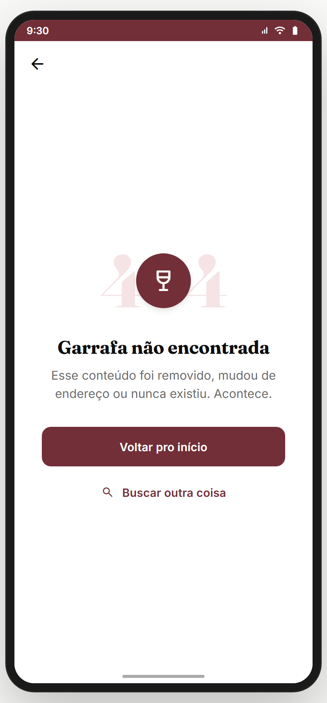
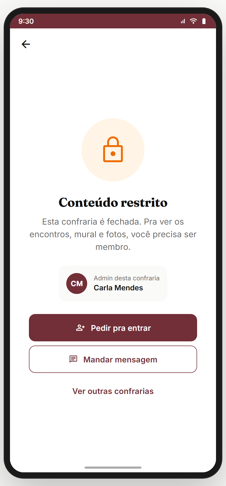
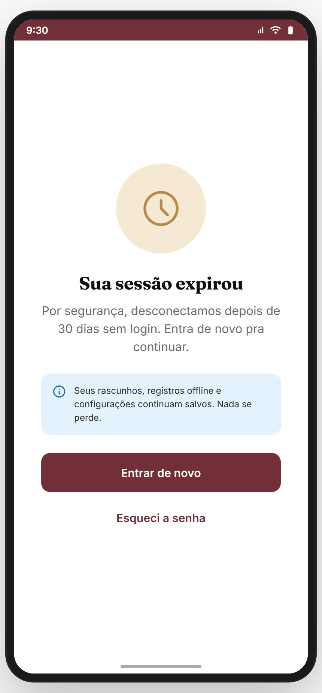
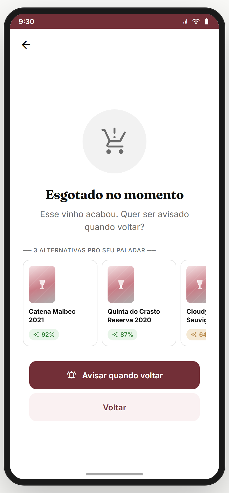
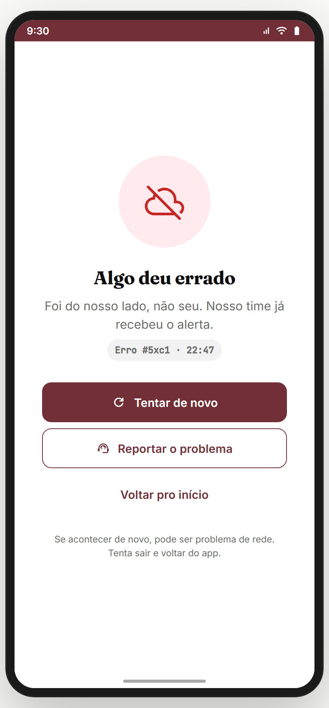

# Módulo 21 — Estados de sistema

> Telas de erro e feedback transversais — 404, sem permissão, sessão expirada, vinho indisponível, erro de servidor + o **toast** (feedback efêmero usado por todo o app). Cada erro tem **tom de marca** (sem jargão técnico) e CTAs de saída claros.
> **Fonte de verdade:** `screens-edge-cases.jsx` (`Erro404Screen`, `ErroPermissaoScreen`, `ErroSessaoScreen`, `VinhoIndisponivelScreen`, `ErroServidorScreen`) + componente `toast` (transversal, disparado via `go('toast', {...})`). Doc funcional: **transversal**.
> **Épicos/US:** US-SYS-01 (404), US-SYS-02 (permissão), US-SYS-03 (sessão), US-SYS-04 (vinho indisponível), US-SYS-05 (erro servidor), US-SYS-06 (toast).

**Regra de negócio canônica:** erro **nunca culpa o usuário** nem mostra stack/código cru — usa linguagem de marca ("Garrafa não encontrada" em vez de "404 Not Found") + sempre oferece **saída** (voltar/buscar/reentrar). Toast é feedback efêmero (success/info/warning/error), 3s auto-dismiss.

## Mapa do fluxo
```
[rota inválida] → erro-404 → home | busca
[confraria fechada] → erro-permissao → pedir entrar | mensagem admin | outras confrarias
[30d sem login] → erro-sessao → login | recuperar senha
[vinho fora] → vinho-indisponivel → similares | voltar
[500] → erro-servidor → tentar de novo | home
[qualquer ação] → toast (success/info/warning/error, 3s)
```

---

## 21.1 `erro-404` — Conteúdo não encontrado (`Erro404Screen`) ✅



**Propósito:** rota/conteúdo inexistente. **US-SYS-01.**
**Layout:** "404" gigante com taça sobreposta + **"Garrafa não encontrada"** + "Esse conteúdo foi removido, mudou de endereço ou nunca existiu. Acontece." + CTAs "Voltar pro início" / "Buscar outra coisa".

**Status:** ✅

---

## 21.2 `erro-permissao` — Conteúdo restrito (`ErroPermissaoScreen`) ✅



**Propósito:** sem permissão (ex.: confraria fechada). **US-SYS-02.**
**Layout:** ícone cadeado + **"Conteúdo restrito"** + "Esta confraria é fechada..." + card do admin + CTAs "Pedir pra entrar" / "Mandar mensagem" / "Ver outras confrarias".

> **⚠️ Bom padrão:** transforma o erro em **caminho de conversão** (pedir entrada / falar com admin) em vez de beco sem saída.

**Status:** ✅

---

## 21.3 `erro-sessao` — Sessão expirada (`ErroSessaoScreen`) ✅



**Propósito:** re-autenticação após 30 dias sem login. **US-SYS-03.**
**Layout:** ícone relógio + **"Sua sessão expirou"** + "Por segurança, desconectamos depois de 30 dias..." + box tranquilizador ("Seus rascunhos, registros offline e configurações continuam salvos. Nada se perde.") + CTAs "Entrar de novo" / "Esqueci a senha".

**Status:** ✅

---

## 21.4 `vinho-indisponivel` — Vinho fora do ar (`VinhoIndisponivelScreen`) ✅



**Propósito:** vinho removido/esgotado. **US-SYS-04.**
**Layout:** estado vazio + **vinhos similares** (recomendações pra não perder o usuário) + voltar.

> **⚠️ Bom padrão:** oferece **alternativas** (similares) em vez de só "não disponível".

**Status:** ✅

---

## 21.5 `erro-servidor` — Erro 500 (`ErroServidorScreen`) ✅



**Propósito:** falha do lado do servidor. **US-SYS-05.**
**Layout:** ícone + **"Algo deu errado do nosso lado"** (assume a culpa, não do usuário) + CTAs "Tentar de novo" / "Voltar pro início".

**Status:** ✅

---

## 21.6 `toast` — Feedback efêmero (transversal) ✅

**Propósito:** confirmação/aviso rápido após ações. Usado por **todo o app** via `go('toast', { kind, message })`.
**Variantes:** `success` (verde), `info` (azul), `warning` (âmbar), `error` (vermelho). Auto-dismiss ~3s, top-anchored.
**Exemplos no app:** "Post publicado!", "+10 pontos! Vinho salvo no seu diário.", "Cupom inválido.", "Pedido enviado pra admin."

> *(Não tem rota própria — é overlay. Visível embutido em dezenas de capturas de outros módulos, ex.: `carrinho-cupom-ok`.)*

**Status:** ✅ (transversal)

---

## Padrões de UX de erro (canônicos — pro time replicar)
1. **Linguagem de marca, não técnica** ("Garrafa não encontrada" > "404").
2. **Nunca culpar o usuário** (servidor assume: "do nosso lado").
3. **Sempre oferecer saída** (≥1 CTA de navegação).
4. **Transformar em conversão quando possível** (permissão → pedir entrar; vinho fora → similares).
5. **Tranquilizar sobre dados** (sessão expirada → "nada se perde").
6. **Ilustração consistente** (`EdgeIcon` 120px círculo colorido por tom).

## Pendências de backend / decisões do PO
### Importantes
- **Roteamento real de erros** (404/403/500 do backend → estas telas).
- **Retry com backoff** no erro-servidor + telemetria de erro.
- **Refresh token** real (sessão) em vez de só 30d hard-coded.
- **Offline global** (sem internet) — falta uma tela/banner dedicado de "sem conexão". Backlog **SYS-OFFLINE**.
### Decisões do PO
- Página de status/incidentes pública?
- Toast: fila quando múltiplos disparam junto?

## Conexões com outros módulos
- **Todos** — toast é transversal; erros podem aparecer em qualquer fluxo.
- **Módulo 01 (Auth)** — erro-sessao → login/recuperar.
- **Módulo 04 (Marketplace)** — vinho-indisponivel → similares.
- **Módulo 11 (Confrarias)** — erro-permissao (confraria fechada) → pedir entrar.
